# 索引

## 概述

索引（index）是帮助 MySQL <span style="color:#F075AE">高效获取数据</span>的<span style="color:#F075AE">数据结构</span>（<span style="color:#F075AE">有序</span>）。在数据之外，数据库系统还维护着满足特定查找算法的数据结构，这些数据结构以某种方式引用（指向）数据，这样就可以在这些数据结构上实现高级查找算法，这种数据结构就是索引。


> [!tip]
>
> 上述二叉树索引结构仅为一个示意图，并非真实的索引结构。

|                              优势                               |                                                  劣势                                                  |
| :-------------------------------------------------------------: | :----------------------------------------------------------------------------------------------------: |
|            提高数据检索的效率，降低数据库的 I/O 成本            |                                          索引列也需要占用空间                                          |
| 通过索引列对数据表进行排序，降低数据排序的成本，降低 CPU 的消耗 | 索引大大提高了查询效率，同时却也降低更新表的速度，如对表进行 `INSERT`、`UPDATE`、`DELETE` 时，效率降低 |

## 结构

### 介绍

MySQL 的索引是在存储引擎层实现的，不同的存储引擎有不同的结构，主要包含以下几种：

|                    索引结构                    |                                                                        描述                                                                        |
| :--------------------------------------------: | :------------------------------------------------------------------------------------------------------------------------------------------------: |
| <span style="color:#B153D7">B+Tree 索引</span> |                                    <span style="color:#B153D7">最常见的索引，大部分引擎都支持 B+ 树索引</span>                                     |
|                   Hash 索引                    | 底层数据结构是用哈希表实现的，只有<span style="color:#F63049">精准匹配</span>索引列的查询才有效，不支持<span style="color:#F63049">范围查询</span> |
|               R-tree（空间索引）               |                                  空间索引是 MyISAM 引擎的一个特殊索引类型，主要用于地理空间数据类型，通常使用较少                                  |
|             Full-text（全文索引）              |                                        是一种通过建立倒排索引，快速匹配文档的方式；类似于 Lucene、Solr、ES                                         |

|    索引     |      InnoDB      | MyISAM | Memory |
| :---------: | :--------------: | :----: | :----: |
| B+Tree 索引 |       支持       |  支持  |  支持  |
|  Hash 索引  |      不支持      | 不支持 |  支持  |
| R-tree 索引 |      不支持      |  支持  | 不支持 |
|  Full-text  | 5.6 版本之后支持 |  支持  | 不支持 |

> [!tip]
>
> 无特别说明，索引均为 B+ 树结构组织。

### B-Tree

**二叉树**：


**缺点**：顺序插入时易退化为单链表，查询性能大幅下降；大数据量场景下树的层级过深，检索效率显著降低。

**红黑树**：大数据量情况下，层级较深，检索速度慢。

---

B-Tree，<span style="color:#FA5C5C">多路</span>平衡查找树。

以最大度数（max-degree）为 5 的 5 阶 B-Tree 为例（每个节点最多存储 4 个 key、5 个指针）：


> [!tip]
>
> 树的度数指的是每一个节点的子节点个数。

插入 100、65、169、368、900、556、780、35、215、1200、234、888、158、90、1000、88、120、268、250 数据为例。

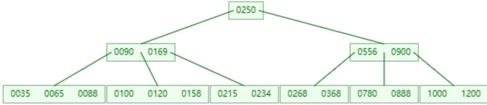

---


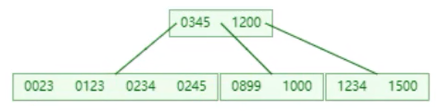

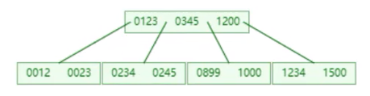


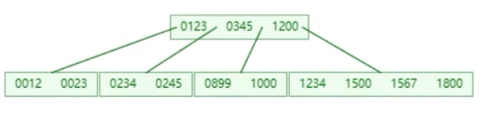

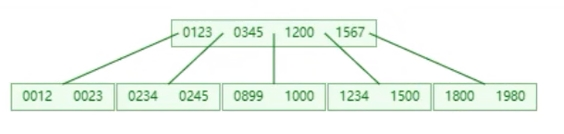

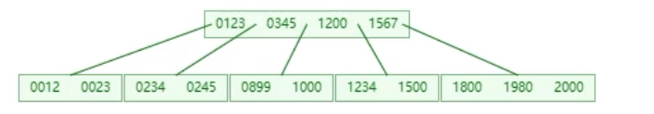


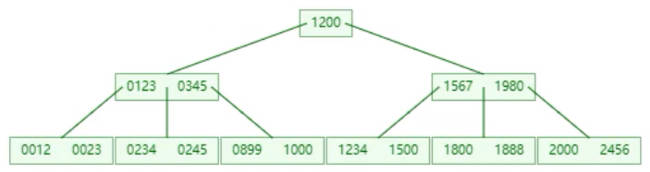

### B+Tree

以最大度数（max-degree）为 4 的 4 阶 B+Tree 为例：

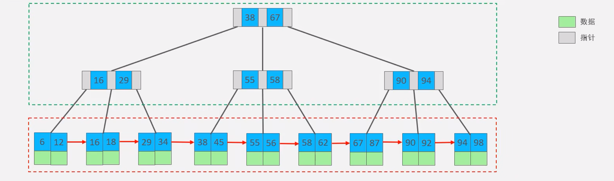

插入 100、65、169、368、900、556、78、35、215、1200、888、158、90、1000、88、120、268、250 数据为例。

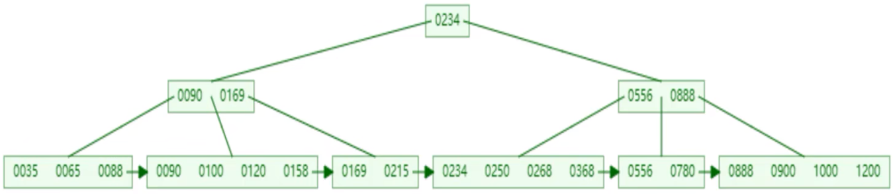

---


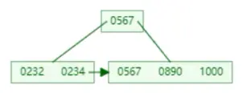

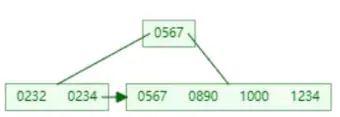

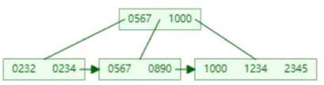

相对于 B-Tree：

1. 所有数据都会出现在**叶子节点**。
2. 叶子节点形成一个**单向链表**。

---

MySQL 索引数据结构对经典的 B+Tree 进行了优化。在原 B+Tree 的基础上，增加一个指向相邻叶子节点的链表指针，形成了带有顺序指针的 B+Tree，提高区间访问的性能。

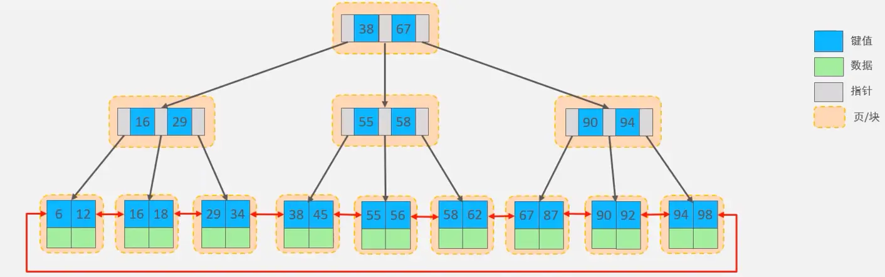

### Hash

哈希索引就是采用了一定的 Hash 算法，将键值换算成新的 Hash 值，映射到对应的槽位上，然后存储在 Hash 表中。

若两个（或多个）键值，映射到一个相同的槽位上，它们就产生了 Hash 冲突（也称为 Hash 碰撞），可以通过链表来解决。


**Hash 索引特点**：

1. Hash 索引仅可用于对等比较（`=`、`IN`），不支持范围查询（`BETWEEN`、`<`、`>`……）。
2. 无法利用索引完成排序操作。
3. 查询效率高，通常仅需一次检索即可，效率通常高于 B+Tree 索引。

在 MySQL 中，支持 Hash 索引的是 Memory 引擎，而 InnoDB 中具有自适应 Hash 功能，Hash 索引是存储引擎根据 B+Tree 索引在指定条件下自动构建的。

---

**为什么 InnoDB 存储引擎选择 B+Tree 索引结构？**

- 相对于二叉树，层级更少，搜索效率高。
- 对于 B-Tree，无论是叶子节点还是非叶子节点，都会保存数据，这样导致一页中存储的键值减少，指针跟着减少，要同样保存大量数据，只能增加树的高度，导致性能降低。
- 相对于 Hash 索引，B+Tree 支持范围匹配及排序操作。

## 分类

|                    分类                     |                        含义                        |           特点           |   关键字   |
| :-----------------------------------------: | :------------------------------------------------: | :----------------------: | :--------: |
| <span style="color:#FF6500">主键索引</span> |              针对于表中主键创建的索引              | 默认自动创建，只能有一个 | `PRIMARY`  |
| <span style="color:#FF6500">唯一索引</span> |          避免同一个表中某数据列中的值重复          |        可以有多个        |  `UNIQUE`  |
| <span style="color:#FF6500">常规索引</span> |                  快速定位特定数据                  |        可以有多个        |            |
| <span style="color:#FF6500">全文索引</span> | 全文索引查找的是文本中的关键词，而非比较索引中的值 |        可以有多个        | `FULLTEXT` |

在 InnoDB 存储引擎中，根据索引的存储形式，又可以分为以下两种：

|                              分类                              |                            含义                            |         特点         |
| :------------------------------------------------------------: | :--------------------------------------------------------: | :------------------: |
| <span style="color:#FF0060">聚集索引</span>（Clustered Index） | 将数据存储与索引放到了一起，索引结构的叶子节点保存了行数据 | 必须有，而且只有一个 |
| <span style="color:#FF0060">二级索引</span>（Secondary Index） | 将数据与索引分开存储，索引结构的叶子节点关联的是对应的主键 |     可以存在多个     |

**聚集索引选取原则**：

- 若存在主键，主键索引即聚集索引。
- 若不存在主键，将使用第一个唯一（`UNIQUE`）索引作为聚集索引。
- 若表无主键，也没有合适的唯一索引，则 InnoDB 会自动生成一个 `rowid` 作为隐藏的聚集索引。

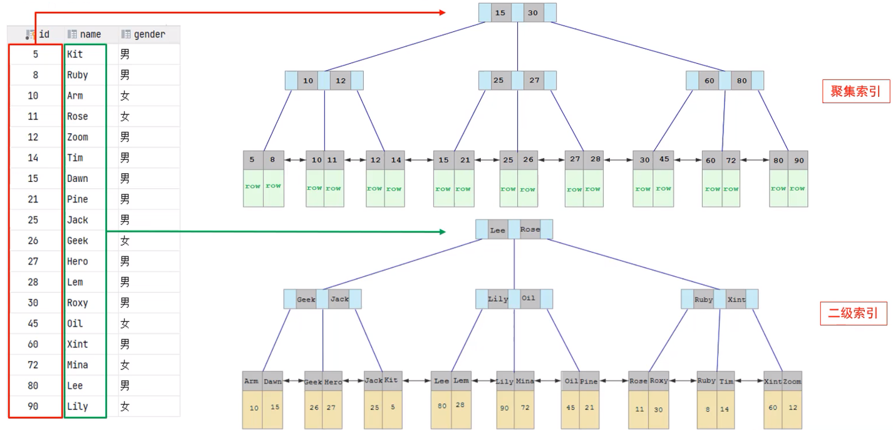

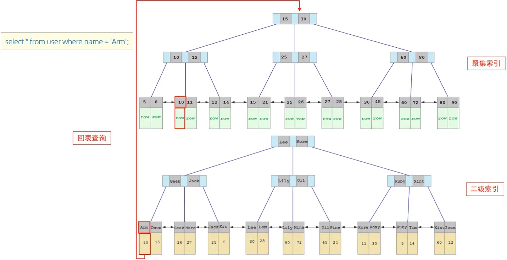

---

1. **以下 SQL 语句，哪个执行效率高，为什么？**

   ```mariadb
   SELECT * FROM user WHERE id = 10;

   SELECT * FROM user WHERE name = 'Arm';
   ```

   > [!note]
   >
   > `id` 为主键，`name` 字段已创建索引。

   第一条 SQL 执行效率更高。
   - `id` 是主键，主键默认是聚簇索引，数据按主键物理存储，查询时可直接定位到数据行，无需额外回表。
   - `name` 是普通索引，查询时需要先通过普通查询找到对应的主键值，再去主键索引中获取完整数据（回表操作），多了一次 I/O 开销，效率低于主键查询。

2. **InnoDB 主键索引的 B+Tree 多高呢？**

   **假设**：单条数据大小为 1KB，InnoDB 数据页可存储 16 条该规格的数据；InnoDB 索引指针占用 6 字节，`BIGINT` 类型主键占用 8 字节。
   - **高度为 2**：$8 n + 6 (n + 1) = 16 \times 1024$，算出 n 约为 1170；$1171 \times 16 = 18736$。
   - **高度为 3**：$1171 \times 1171 \times 16 = 21939856$。

## 语法

### 创建语法

```mariadb
CREATE [UNIQUE | FULLTEXT] INDEX index_name ON table_name (index_col_name, ...);
```

**建表时添加索引的基本结构**：

```mariadb
CREATE TABLE 表名 (
  -- 先定义字段
  字段名1 数据类型 [约束],
  字段名2 数据类型 [约束],
  -- 再定义索引（放在字段定义之后）
  索引类型 索引名 (字段名),
  -- 多个索引依次定义
  另一索引类型 另一索引名 (字段名1, 字段名2) -- 联合索引
);
```

> [!tip]
>
> 普通索引、唯一索引中 `INDEX` 和 `KEY` 完全等价；主键索引需用 `PRIMARY KEY`（`KEY` 不可单独使用）；全文索引优先用 `FULLTEXT INDEX`，`FULLTEXT KEY` 虽合法但极少使用。

**按照下列需求，完成索引的创建**：

1. `name` 字段为姓名字段，该字段的值可能会重复，为该字段创建索引。

   ```mariadb
   CREATE INDEX idx_user_name ON user (name);
   ```

   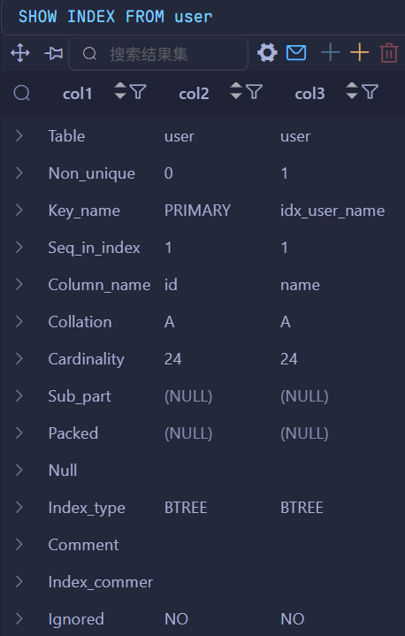

2. `phone` 手机号字段的值，是非空且唯一的，为该字段创建唯一索引。

   ```mariadb
   CREATE UNIQUE INDEX uniq_user_phone ON user (phone);
   ```

   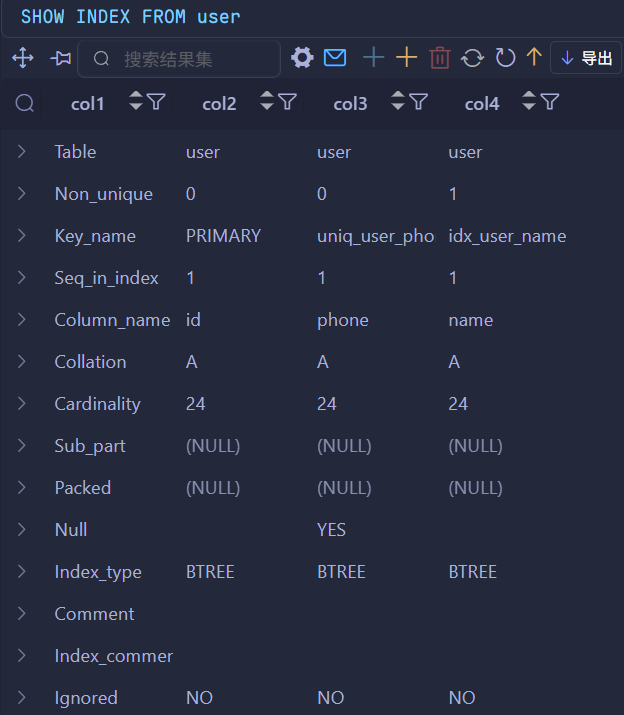

3. 为 `profession`、`age`、`status` 创建联合索引。

   ```mariadb
   CREATE INDEX idx_user_profession_age_status ON user (profession, age, status);
   ```

   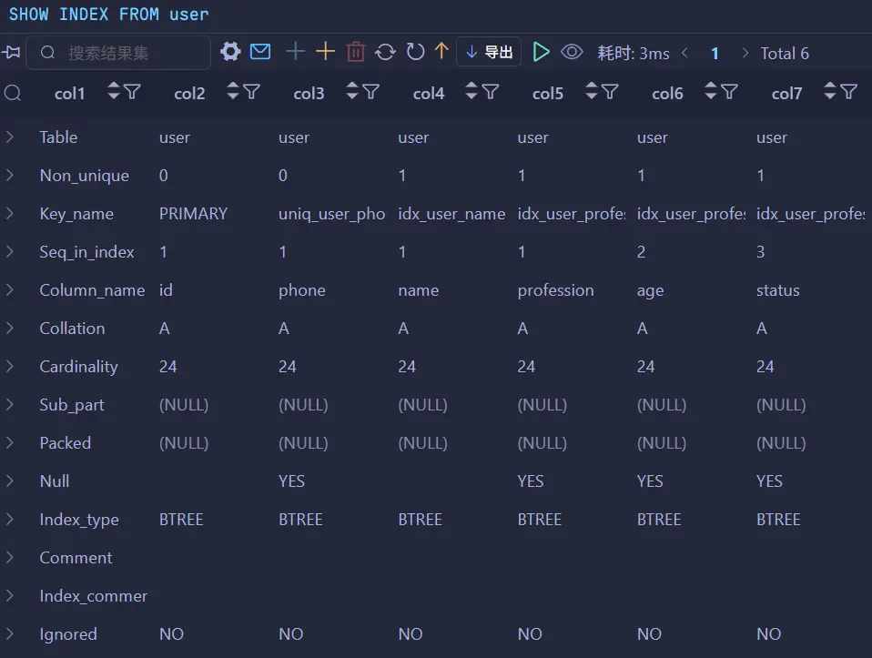

4. 为 `email` 建立合适的索引来提升查询效率。

   ```mysql
   CREATE INDEX idx_user_email ON user (email);
   ```

   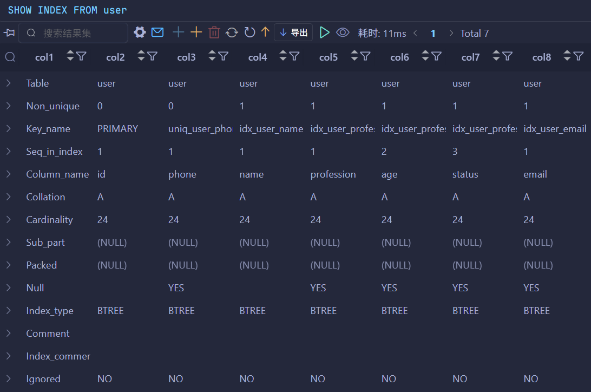

### 查看索引

```mariadb
SHOW INDEX FROM table_name;
```

```mariadb
SHOW INDEX FROM user;
```


```mariadb
SHOW INDEX FROM user\G
```

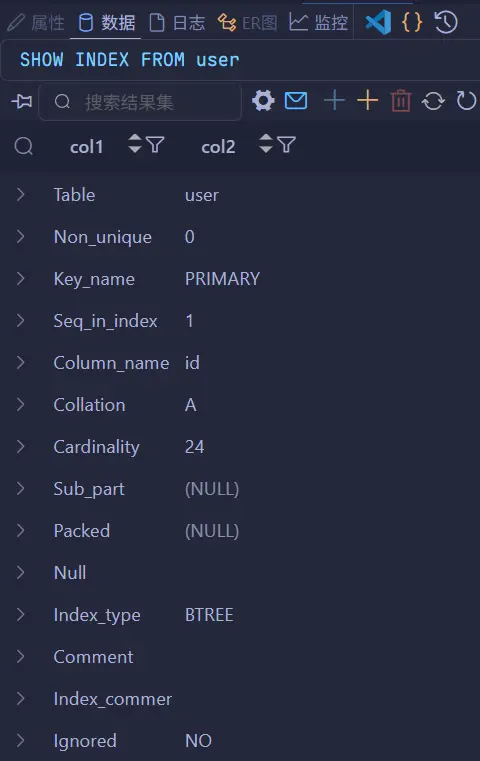

> [!tip]
>
> 在 MySQL 命令行客户端中，末尾用 `\G` 替代分号（`;`）可以把查询结果以“竖向”格式输出——每一列单独占一行，便于查看列多或字段值很长的记录。

### 删除索引

```mariadb
DROP INDEX index_name ON table_name;
```

```mariadb
DROP INDEX idx_user_email ON user;
```


## SQL 性能分析

### SQL 执行频率

MySQL 客户端连接成功后，通过 `SHOW [SESSION | GLOBAL] STATUS` 命令可以提供服务器状态信息。通过如下指令，可以查看当前数据库的 `INSERT`、`UPDATE`、`DELETE`、`SELECT` 的访问频次：

```mariadb
SHOW GLOBAL STATUS LIKE 'Com_______';
```

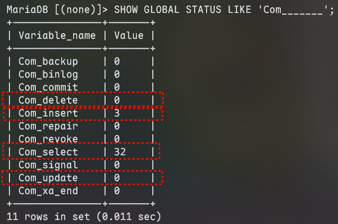

执行一次查询操作后：

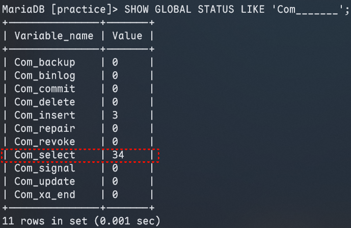

发现 `Com_select` 的值加 1。

> [!tip]
>
> `Com` 是 **Command** 的缩写，`Com_xxx` 是 MySQL/MariaDB 内置的**命令执行次数计数器**，用来统计各类 SQL 命令在当前会话（SESSION）或全局（GLOBAL）范围内的执行次数。

### 慢查询日志

慢查询日志用于记录所有执行耗时超过指定阈值（参数 `long_query_time`，单位为秒，默认 10 秒）的 SQL 语句。

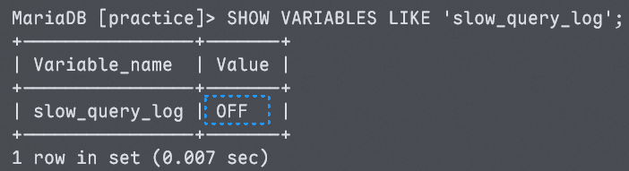

MySQL 的慢查询日志默认未开启，需在 MySQL 配置文件（Linux 系统常见路径为 `/etc/my.cnf`，不同系统路径可能略有差异）中配置如下信息：

```ini
# 开启 MySQL 慢日志查询开关
slow_query_log = 1
# 设置慢日志的时间为 2 秒，SQL 语句执行时间超过 2 秒，就会视为慢查询，记录慢查询日志
long_query_time = 2
```

> [!tip]
>
> 现代 Linux 发行版通常不再将所有配置集中写入单一的 `/etc/my.cnf`，而是采用了**模块化**的目录设计（如 `/etc/my.cnf.d/`）。
>
> 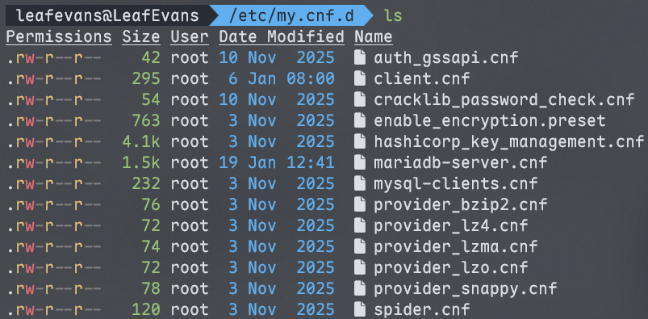
>
> 因此，我们需要编辑该目录下的特定文件来应用配置：MariaDB 请修改 `mariadb-server.cnf`，而 MySQL 通常修改 `mysqld.cnf`。

配置完毕后，通过以下指令重启 MySQL 服务器进行测试，查看慢日志文件中记录的信息 `/var/lib/mysql/localhost-slow.log`：

```bash
sudo systemctl restart mariadb
```

> [!note]
>
> 若为 MySQL：
>
> ```bash
> # 部分系统下服务名为 mysqld
> sudo systemctl restart mysql
> ```

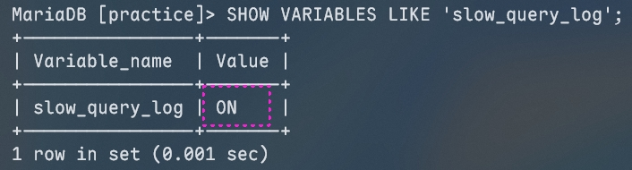

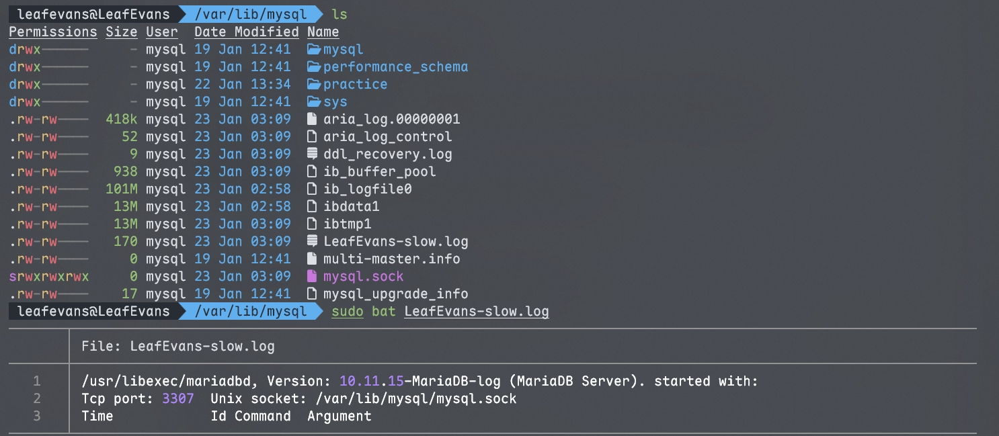

> [!note]
>
> 若未显示指定文件名，默认命名规则为：`[主机名]-show.log`。

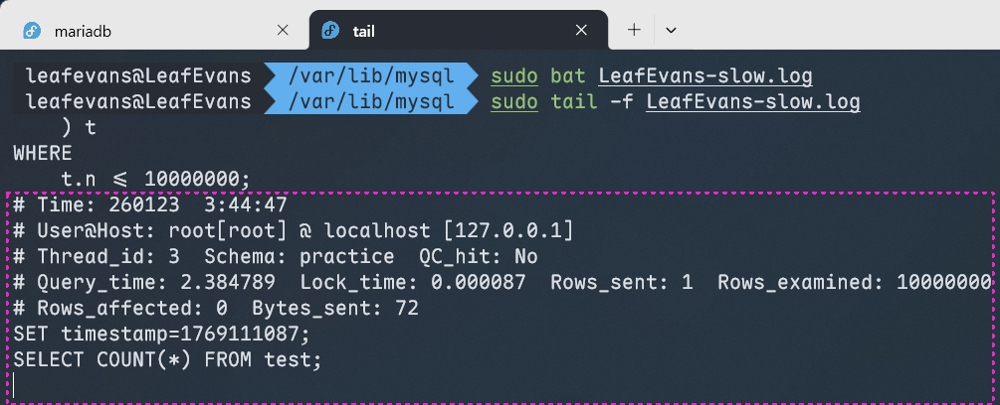

### Profile 详细

`SHOW PROFILE` 命令可以在进行 SQL 优化时，帮助我们精确分析语句执行的时间消耗分布。使用前，可通过 `have_profiling` 参数验证当前 MySQL 是否支持该功能：

```mariadb
SELECT @@have_profiling;
-- SHOW VARIABLES LIKE 'have_profiling';
```

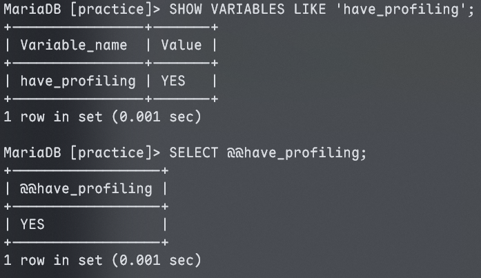

Profiling 默认是关闭的，可以通过 `SET` 语句在 **Session** 或 **Global** 级别进行开启。

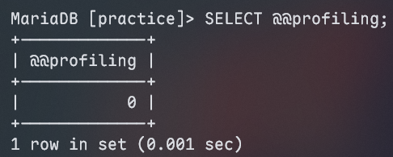

```mariadb
SET @@[SESSION | GLOBAL].profiling = 1;
SET [SESSION | GLOBAL] profiling = 1;
```

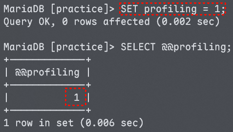

> [!note]
>
> `SELECT` 系统变量时**必须**加 `@@` 以避免与字段名混淆。

执行一系列的业务 SWL 操作，然后通过如下指令查看指令的执行耗时：d

```mariadb
# 查看每一条 SQL 的耗时基本情况
SHOW profiles;

# 查看指定 query_id 的 SQL 语句各个阶段的耗时情况
SHOW PROFILE FOR QUERY query_id;

# 查看指定 query_id 的 SQL 语句 CPU 的使用情况
SHOW PROFILE CPU FOR QUERY query_id;
```

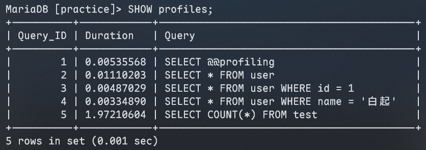

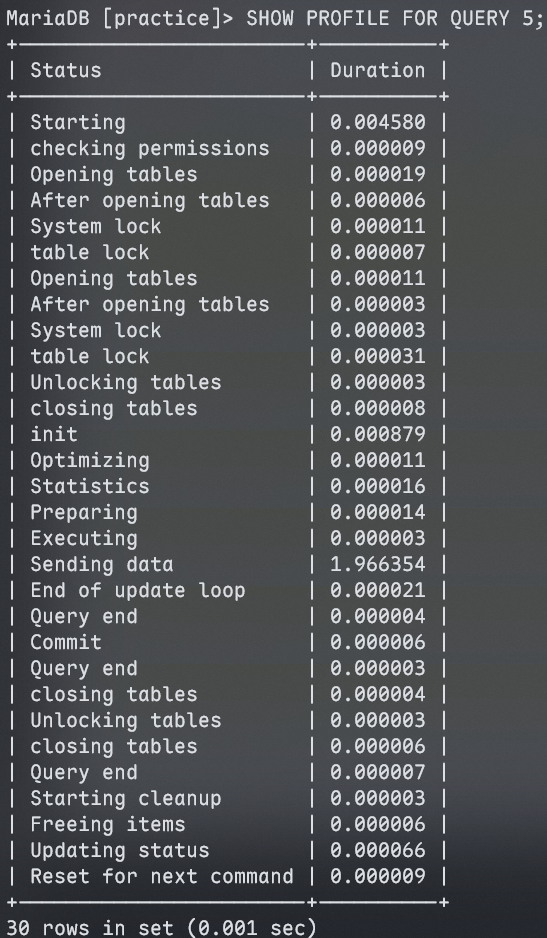

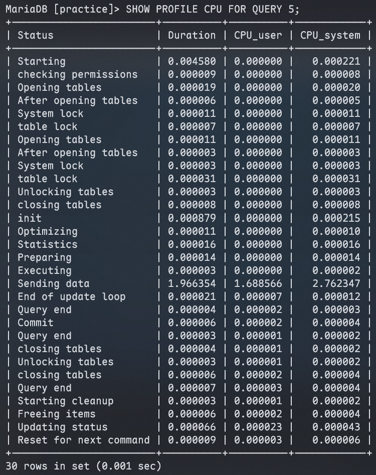

### Explain 执行计划

`EXPLAIN` 或者 `DESC` 命令获取 MySQL 如何执行 `SELECT` 语句的信息，包括 `SELECT` 语句执行过程中表如何连接和连接的顺序。

```mariadb
# 直接在 SELECT 语句前加上关键字 EXPLAIN/DESC
EXPLAIN SELECT 字段列表 FROM 表名 WHERE 条件;
```

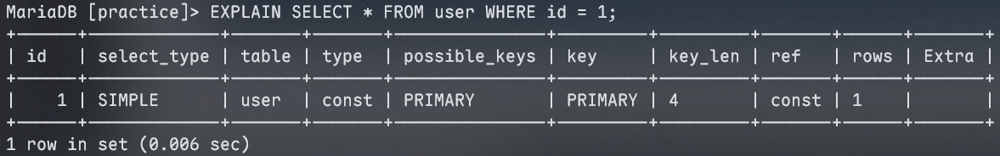

Explain 执行计划各字段含义：

- **`id`**：`SELECT` 查询的序列号，表示查询中执行 `SELECT` 子句或者是操作表的顺序（`id` 相同，执行顺序从上到下；`id` 不同，值越大，越先执行）。

  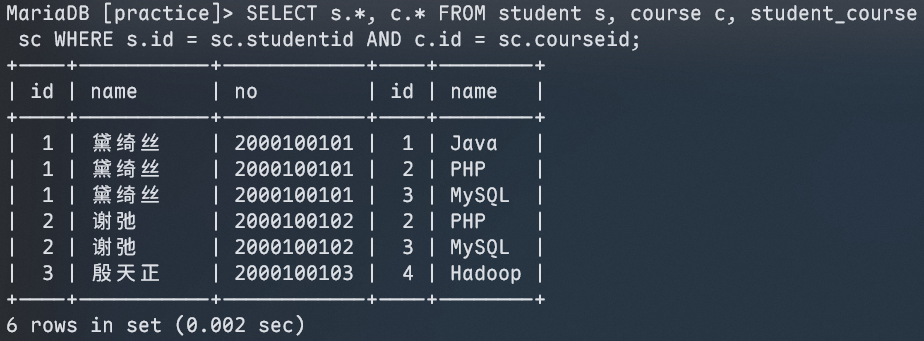

  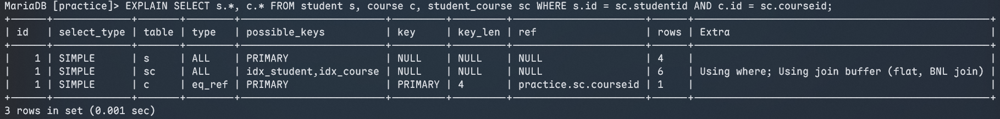

  ```mariadb
  EXPLAIN
  SELECT *
  FROM student
  WHERE
      id IN (
          SELECT studentid
          FROM student_course
          WHERE
              courseid = (
                  SELECT id
                  FROM course
                  WHERE
                      name = 'MySQL'
              )
      );
  ```

  

- **`select_type`**：表示 `SELECT` 的类型，常见的取值类型有 `SIMPLE`（简单表，即不使用表连接或者子查询）、`PRIMARY`（主查询，即外层的查询）、`UNION`（`UNION` 中第二个或者后面的查询语句）、`SUBQUERY`（`SELECT`/`WHERE` 之后包含了子查询）等。

- **`type`**：代表访问类型。性能从好到差依次为：`NULL`、`system`、`const`、`eq_ref`、`ref`、`range`、`index`、`ALL`。

- **`possible_key`**：显示可能应用在这张表上的索引，一个或多个。

- **`key`**：实际使用的索引，若为 NULL，则没有使用索引。

- **`key_len`**：表示索引中使用的字节数，该值为索引字段最大可能长度，并非实际使用长度，在不损失精确性的前提下，长度越短越好。

- **`rows`**：MySQL 认为必须要执行查询的行数，在 InnoDB 引擎中，是一个估计值，可能并不总是准确的。

- **`filtered`**：表示返回结果的行数占所需读取行数的百分比，`filtered` 的值越大越好。

> [!tip]
>
> MariaDB 默认隐藏 `partitions` 和 `filtered` 字段。若需显式查看，请分别使用 `EXPLAIN PARTITIONS`（查看分区）或 `EXPLAIN EXTENDED`（查看过滤比）来进行查询。
>
> 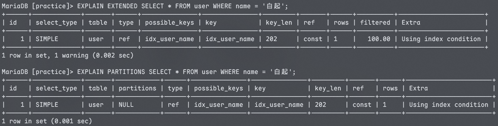

## 使用

### 验证索引效率

在未建立索引之前，执行如下 SQL 语句，查看 SQL 的耗时。

```mariadb
SELECT * FROM test WHERE content='content_00000000';
```

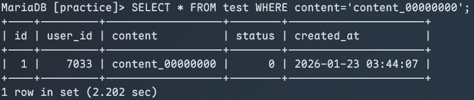

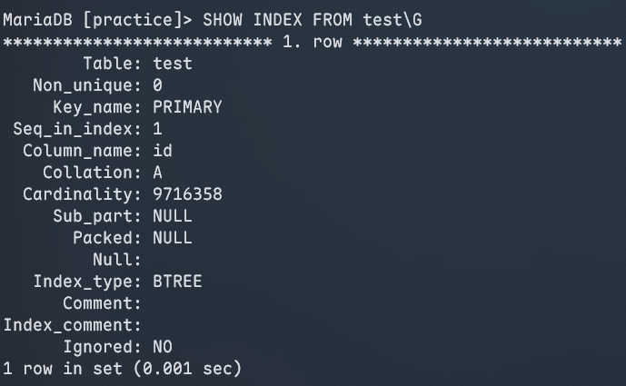

查询效率偏低的核心原因是仅创建了主键索引，未针对查询条件建立专用索引。

针对字段创建索引：

```mariadb
CREATE INDEX idx_test_content ON test (content);
```

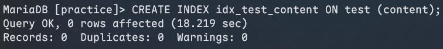

然后再次执行相同的 SQL 语句，查看对应 SQL 的耗时。

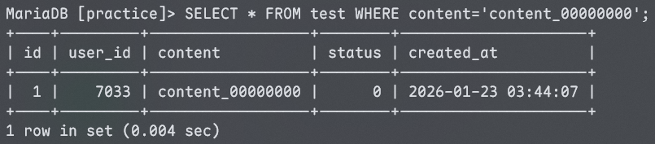

建立索引后，查询性能得到**显著提升**。

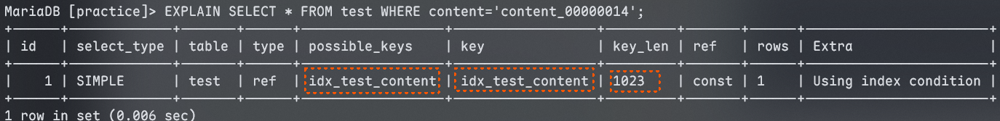

### 最左前缀法则

若索引了多列（联合索引），要遵循最左前缀法则。最左前缀法则指的是查询从索引的最左列开始，并且不跳过索引中的列。

若跳过某一列，<span style="color:#D02752">索引将部分失效（后面的字段索引失效）</span>。

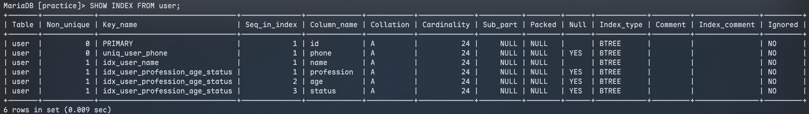

```mariadb
EXPLAIN SELECT * FROM user WHERE profession = '软件工程' AND age = 31 AND status = '0'\G
```


```mariadb
EXPLAIN SELECT * FROM user WHERE profession = '软件工程' AND age = 31;
```

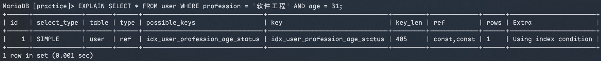

```mariadb
EXPLAIN SELECT * FROM user WHERE profession = '软件工程';
```

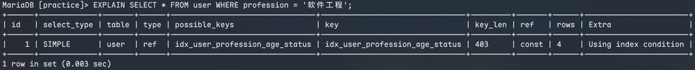

```mariadb
EXPLAIN SELECT * FROM user WHERE age = 31 AND status = '0';
```

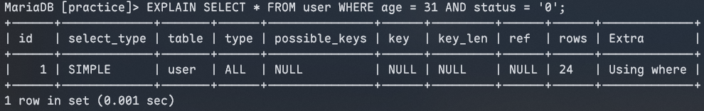

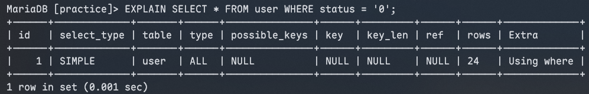

由于查询条件未包含最左字段 `profession`，导致索引完全失效并触发**全表扫描**（`type: ALL`），这印证了最左前缀法则。

```mariadb
EXPLAIN SELECT * FROM user WHERE profession = '软件工程' AND status = '0';
```

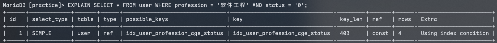

虽然查询包含了最左列 `profession` 使得索引生效，但 `key_len` 为 403（与单查 `profession` 一致），意味着**部分索引失效**。

这是因为跳过了中间的 `age` 字段；根据法则，一旦跳过某一列，索引将从该列之后截断，后面的字段（`status`）将无法使用索引。

> [!tip]
>
> 最左前缀法则不受查询条件书写顺序的影响（比如先写 `age` 再写 `profession` 依然生效），因为数据库的查询优化器会自动调整条件的执行顺序。

### 范围查询

联合索引中，出现范围查询（`>`、`<`），<span style="color:#D25353">范围查询右侧的列索引失效</span>。

```mariadb
EXPLAIN SELECT * FROM user WHERE profession = '软件工程' AND age > 30 AND status = '0';
```

405 表示索引在 `age` 列**截断**，导致其**右侧**的 `status` 列失效。

在业务允许的情况下，尽量使用 `>=` 或 `<=` 来替代 `>` 或 `<`，这样可以延续索引的使用。

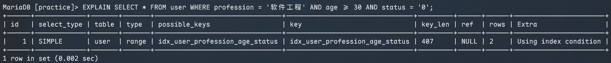

### 索引列运算

不要在索引列上进行运算操作，否则<span style="color:#1C4D8D">索引将失效</span>。

```mariadb
DESC SELECT * FROM user WHERE phone = '17799990015';
```

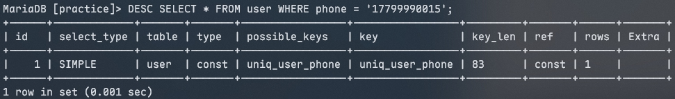

查询尾号为 15 的手机号：

```mariadb
EXPLAIN SELECT * FROM user WHERE SUBSTRING(phone, 10, 2) = '15';
```

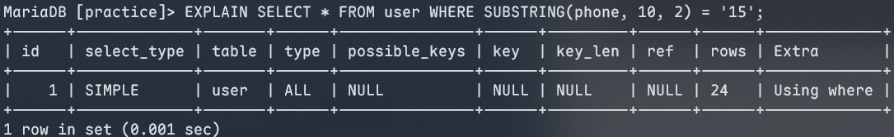

对索引列进行**运算**或**使用函数**（如 `SUBSTRING`），会导致索引失效并触发全表扫描。

### 字符串不加引号

字符串类型字段使用时，不加引号，<span style="color:#6E026F">索引将失效</span>。

```mariadb
EXPLAIN SELECT * FROM user WHERE phone = 17799990015;
```


字符串字段若不加引号，会触发数据库的**隐式类型转换**，导致索引失效并降级为**全表扫描**，严重影响性能。

> [!note]
>
> **MySQL 隐式转换规则**：比较时默认将**字符串**转为**数字**。
>
> - **字符串列 = 数字**：数据库需将**字段**转为数字。**字段发生改变，索引失效。**
> - **数值列 = 字符串**：数据库只需将**输入值**转为数字。**字段未受影响，索引有效。**

### 模糊查询

在模糊匹配中，索引是否生效取决于通配符 `%` 的位置：

- **尾部模糊匹配**（`abc%`）：索引**生效**。
- **头部模糊匹配**（`%abc`）：索引**失效**。

```mariadb
EXPLAIN SELECT * FROM user WHERE profession LIKE '软件%';
```

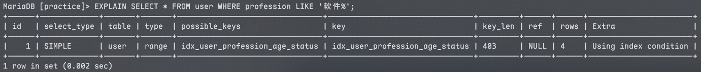

可以看到索引依然被使用。虽然 `profession` 是联合索引的一部分，但查询条件提供了确定的前缀，**符合最左前缀法则**，因此可以利用索引进行范围扫描。

```mariadb
EXPLAIN SELECT * FROM user WHERE profession LIKE '%工程';
```

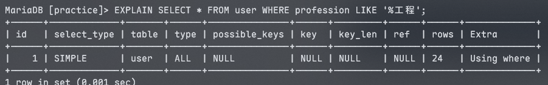

由于通配符出现在头部，无法确认索引的起始位置，查询**退化为全表扫描**。

```mariadb
EXPLAIN SELECT * FROM user WHERE profession LIKE '%件工%';
```

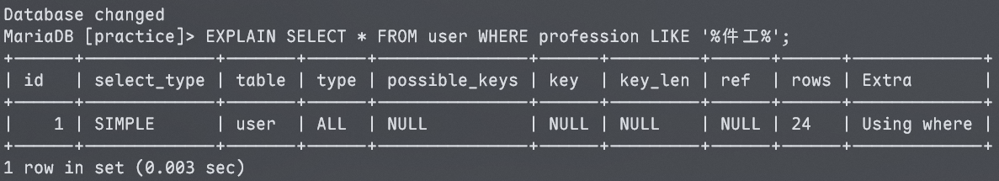

前后均均线模糊匹配的情况，与头部模糊匹配的效果一致，索引同样**失效**，触发全表扫描。

### `OR` 连接的条件

用 `OR` 分割开的条件，若 `OR` 前的条件中的列有索引，而后面的列中没有索引，那么涉及到的索引都不会被用到。

```mariadb
EXPLAIN SELECT * FROM user WHERE id = 10 OR age = 23;
```

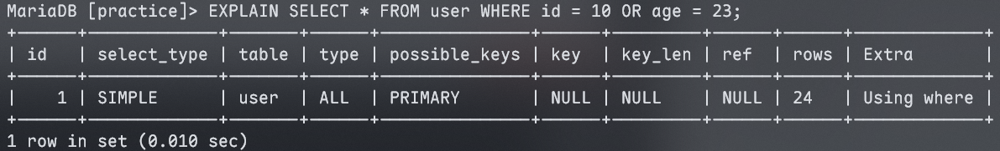

```mariadb
EXPLAIN SELECT * FROM user WHERE phone = '17799990017' OR age = 23;
```


虽然 `age` 是联合索引的字段，但并非联合索引的最左字段，因此单独使用 `age` 无法触发索引生效。所以，即便 `id` 或 `phone` 本身有索引，只有 `OR` 条件中包含了无法触发索引的 `age`，整个查询就无法使用任何索引。

针对 `age` 也建立索引：

```mariadb
CREATE INDEX idx_user_age ON user (age);
```

重新执行之前的两条查询语句，得到的执行计划如下：


从执行计划可知，查询已成功使用索引（通过 `index_merge` 机制合并了多个索引），不再进行全表扫描。

### 数据分布影响

若 MySQL 评估使用索引比全表更慢，则不使用索引。

```mariadb
EXPLAIN SELECT * FROM user WHERE phone >= '17799990020';
```

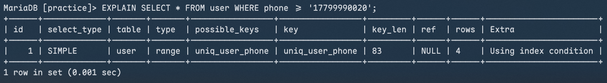

```mariadb
EXPLAIN SELECT * FROM user WHERE phone >= '17799990000';
```

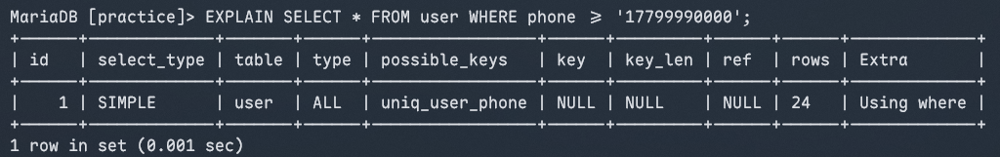

由执行计划可见，当查询需要扫描的数据量占表中数据的比例较高时，MySQL 优化器会判定全表扫描的效率高于索引扫描，因此会选择放弃使用索引。后续的查询案例也遵循这一逻辑。

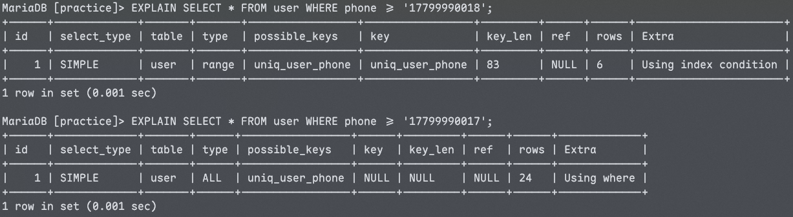

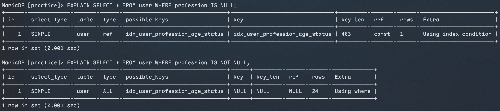

从执行计划可见：

- 查询 `profession` 为 `NULL` 时命中索引。
- 查询 `profession` 为 `NOT NULL` 时未命中索引。

这是因为表中 `NOT NULL` 数据占多数，`NULL` 数据占少数。若表中大部分数据为 `NULL`，则查询 `NULL` 时也会执行全表扫描，不再使用索引。

### SQL 提示

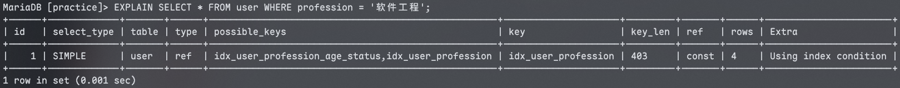

**SQL 提示**是优化数据库的一个重要手段，简单来说，就是在 SQL 语句中加入一些人为的提示来达到优化操作的目的。

**`USE INDEX`**（建议使用指定索引）：

```mariadb
EXPLAIN SELECT * FROM user USE INDEX (idx_user_profession_age_status) WHERE profession = '软件工程';
```

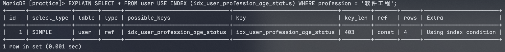

**`IGNORE INDEX`**（忽略使用指定索引）：

```mariadb
EXPLAIN SELECT * FROM user IGNORE INDEX (idx_user_profession_age_status) WHERE profession = '软件工程';
```

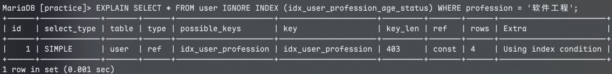

**`FORCE INDEX`**（强制使用指定索引）：

```mariadb
EXPLAIN SELECT * FROM user FORCE INDEX (idx_user_profession_age_status) WHERE profession = '软件工程';
```

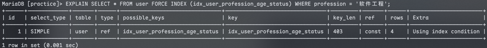

> [!note]
>
> - **共同点**：两者均采用“白名单”机制，将优化器的**索引选择范围**严格限制在指定的索引列表中。
> - **区别**：
>   - `FORCE INDEX` 会将**全表扫描的代价判定为极高**，迫使优化器必须使用指定索引（除非无法执行）。
>   - `USE INDEX` 仅作为**参考建议**，优化器仍会进行成本评估；若全表扫描效率更高，优化器仍然会**放弃索引而选择全表扫描**。

### 覆盖索引

应尽量使用覆盖索引（即查询所需返回的所有列，都能在使用的索引中直接获取），避免使用 `SELECT *`。

```mariadb
EXPLAIN SELECT id, profession FROM user WHERE profession = '软件工程' AND age = 31 AND status = '0';
```

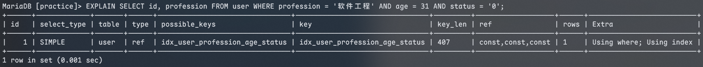

```mariadb
EXPLAIN SELECT id, profession, age, status FROM user WHERE profession = '软件工程' AND age = 31 AND status = '0';
```

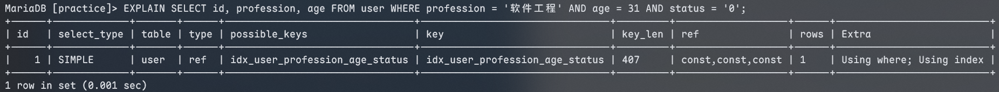

```mariadb
EXPLAIN SELECT id, profession, age, status, name FROM user WHERE profession = '软件工程' AND age = 31 AND status = '0';
```

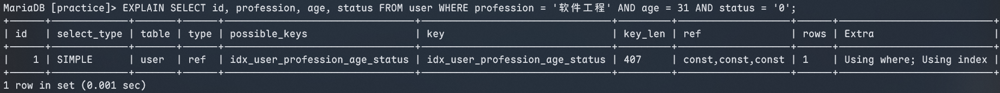

```mariadb
EXPLAIN SELECT * FROM user WHERE profession = '软件工程' AND age = 31 AND status = '0';
```

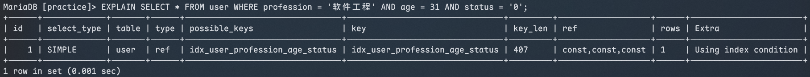

> [!tip]
>
> - `using index condition`：查找使用了索引，但是需要回表查询数据。
> - `using where; using index`：查找使用了索引，但是需要的数据都在索引列中能找到，所以无需回表查询数据。

前三个查询涉及的列均为索引包含的字段，因此无需回表；其中 `id` 字段无需回表的核心原因是，`(profession, age, status)` 联合索引作为二级索引，其叶子节点本身就存储了 `id` 值。而最后一个查询包含了索引中未覆盖的字段（如 `name`，或通过 `SELECT *` 引入的其他字段），因此触发了回表查询。

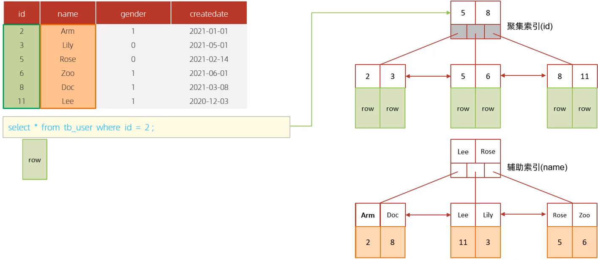


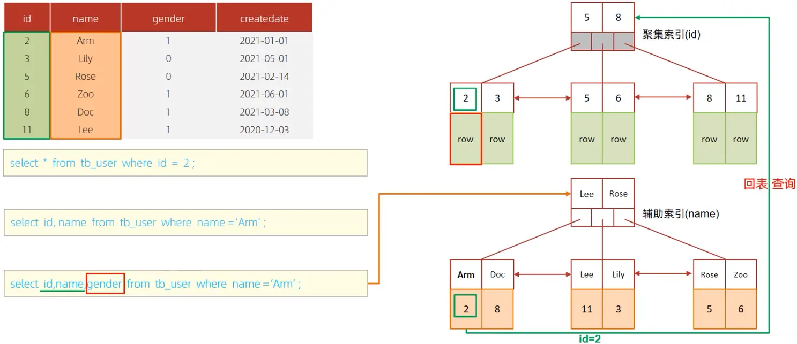

基于主键 `id` 查询时，因使用聚集索引，所以无需回表。

---

**一张表，有四个字段 `(id, username, password, status)`，由于数据量大，需要对以下 SQL 语句进行优化，该如何进行才是最优方案？**

```mariadb
SELECT id, username, password FROM user WHERE username = 'nataro';
```

为 `(username, password)` 建立联合索引，该联合索引作为二级索引，其叶子节点会存储主键 `id`。

### 前缀索引

当字段为字符串类型（`VARCHAR`、`TEXT` 等）时，若为长字符串建立完整索引会导致索引体积过多，查询时消耗大量磁盘 I/O，降低查询效率。此时可仅对字符串的部分前缀建立索引，大幅节省索引空间，进而提升索引使用效率。

```mariadb
CREATE INDEX idx_xxx ON table_name (column(n));
```

**前缀长度**：需依据索引的“选择性”来确定。其中，索引选择性的定义为：不重复的索引值（即基数）与数据表总记录数的比值。索引选择性越高，查询效率越好；唯一索引的选择性为 1，属于最优的索引选择性，对应的索引性能也达到最佳。

```mariadb
SELECT COUNT(DISTINCT email) / COUNT(*) FROM user;
SELECT COUNT(DISTINCT SUBSTRING(email, 1, 5)) / COUNT(*) FROM user;
```

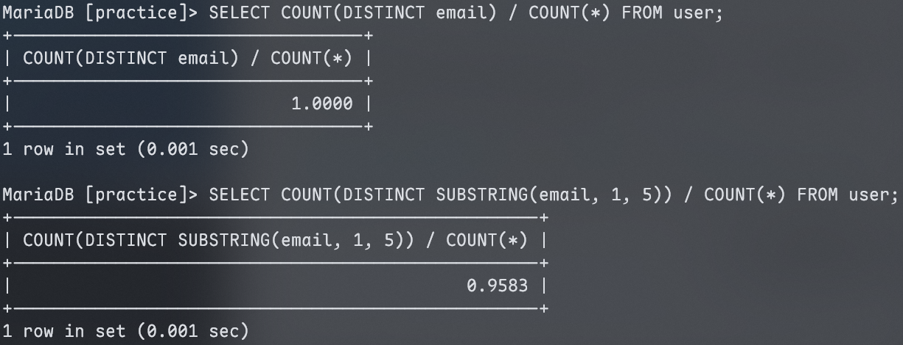

```mariadb
CREATE INDEX idx_user_email_prefix5 ON user (email(5));
```

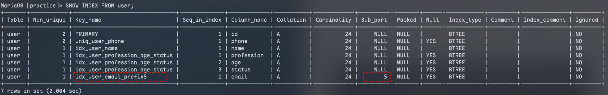

```mariadb
EXPLAIN SELECT * FROM user WHERE email = 'daqiao666@sina.com';
```

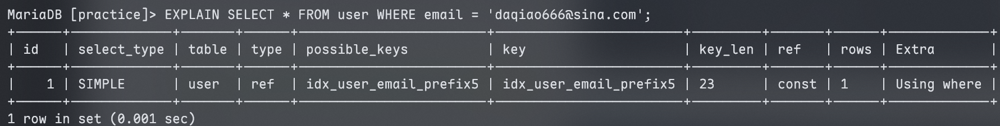

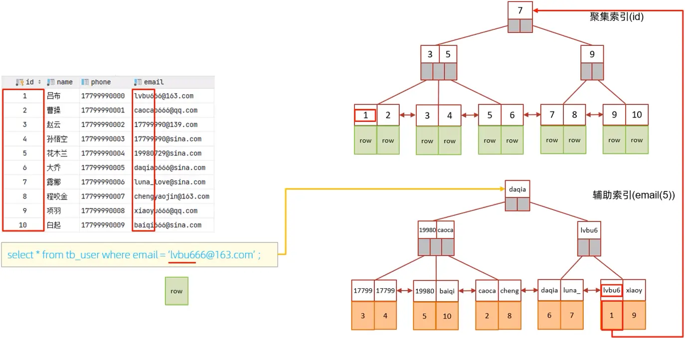

该查询的执行流程如下：

1. **前缀匹配定位**：通过 `email(5)` 辅助索引，找到所有前缀符合条件的叶子节点，从中提取主键 `id`。
2. **回表获取完整数据**：使用这些主键 `id` 查询聚集索引，获取对应的完整行数据。
3. **精确匹配校验**：从完整行数据中取出 `email` 字段，与原始查询条件进行精确匹配。
4. **遍历检查后续节点**：在辅助索引中，当前叶子节点处理完毕后，会继续检测下一个叶子节点的前缀是否仍匹配，若匹配则重复上述回表与校验步骤，若不匹配则结束整个查询过程。

### 单列索引与联合索引

- **单列索引**：一个索引只包含单个列。
- **联合索引**：一个索引包含了多个列。

```mariadb
EXPLAIN SELECT id, phone, name FROM user WHERE phone = '17799990010' AND name = '韩信';
```

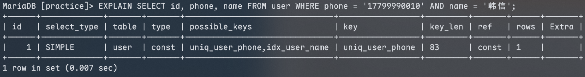

从执行计划可见，该查询仅命中了 `uniq_user_name` 这个单列索引。由于 `name` 字段不在此索引的覆盖范围内，因此必须通过回表查询才能获取完整数据，这正是覆盖查询可以解决的问题。

```mariadb
CREATE INDEX idx_user_phone_name ON user (phone, name);
```

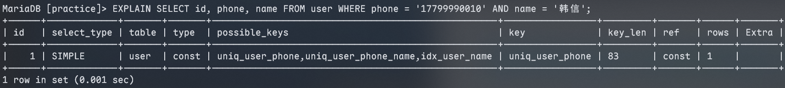

从执行计划可见，当前查询使用 `uniq_user_phone` 索引。也可以通过 `USE INDEX` 语法显式指定查询要使用的索引 `uniq_user_phone_name`：

```mariadb
EXPLAIN SELECT id, phone, name FROM user USE INDEX (uniq_user_phone_name) WHERE phone = '17799990010' AND name = '韩信';
```

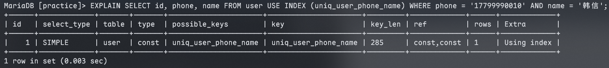

---

在包含多个查询条件的业务场景下，当需要为查询字段建立索引时，推荐使用联合索引，而非为每个查询字段单独创建单列索引。

- **单列索引情况**：在仅依赖单列索引的多条件查询环境中，MySQL 优化器会评估各字段索引的效率，选择最优的索引执行查询。

- **联合索引情况**：

  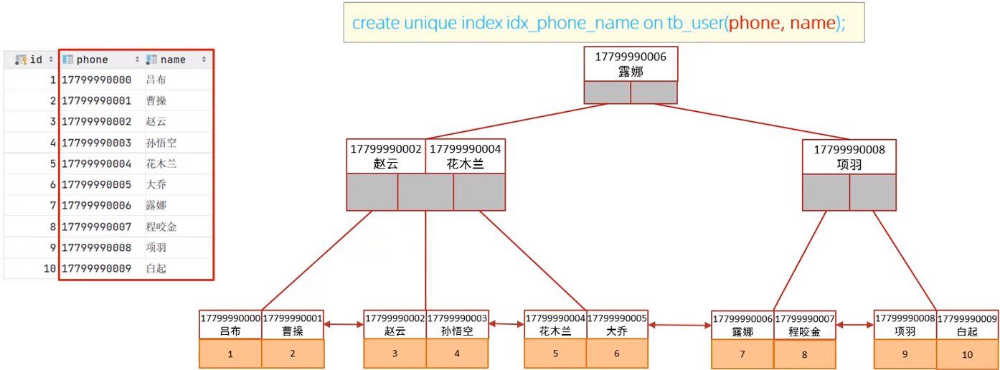

## 设计原则

1. **选表原则**：优先为数据量较大且查询频率高的表建立索引。
2. **选列原则**：针对高频出现在 `WHERE` 条件、`ORDER BY` 排序及 `GROUP BY` 分组中的字段建立索引。
3. **高区分度**：优先选择区分度（Selectivity）高的列，尽量建立**唯一索引**。区分度越高，索引过滤效果越好。
4. **前缀索引**：对于较长的字符串字段，建议建立**前缀索引**，以兼顾索引区分度与存储空间的平衡。
5. **联合索引优先**：优先使用联合索引代替多个单列索引。利用**覆盖索引**（Covering Index）机制，既能减少存储开销，又能避免回表，大幅提升查询效率。
6. **控制数量**：索引并非越多越高。过多的索引会增加维护成本，显著降低 `INSERT`、`UPDATE`、`DELETE` 的性能。
7. **非空约束**：若业务允许，尽量将索引列定义为 `NUT NULL`。这有助于优化器更准确地计算索引成本，简化查询逻辑。

---

**知识回顾**：

1. **索引概述**：<span style="color:#2C4E80">索引时高效获取数据的数据结构。</span>

2. **索引结构**：B+Tree、Hash。

3. **索引分类**：
   - 主键索引、唯一索引、常规索引、全文索引。
   - 聚集索引、二级索引。

4. **索引语法**：

   ```mariadb
   CREATE [UNIQUE] INDEX xxx ON xxx (xxx);
   SHOW INDEX FROM xxx;
   DROP INDEX xxx ON xxx;
   ```

5. **SQL 性能分析**：执行频次、慢查询日志、Profile、Explain。

6. **索引使用**：联合索引、索引失效、SQL 提示、覆盖索引、前缀索引、单列/联合索引。

7. **索引设计原则**：表、字段、索引。
