# SQL 优化

## 插入数据

**`INSERT` 优化**：

```mariadb
INSERT INTO test VALUE (1, 'tom');
INSERT INTO test VALUE (2, 'cat');
INSERT INTO test VALUE (3, 'jerry');
```

- **批量插入**：

  ```mariadb
  INSERT INTO test VALUES (1, 'tom'), (2, 'cat'), (3, 'jerry');
  ```

- **手动事务提交**：

  ```mariadb
  START TRANSACTION;
  INSERT INTO test VALUE (1, 'tom'), (2, 'cat'), (3, 'jerry');
  INSERT INTO test VALUE (4, 'tom'), (5, 'cat'), (6, 'jerry');
  INSERT INTO test VALUE (7, 'tom'), (8, 'cat'), (9, 'jerry');
  COMMIT;
  ```

- **主键顺序插入**：
  - **乱序插入**：0、1、9、21、88、2、4、15、89、5、7、3。
  - **顺序插入**：1、2、3、4、5、7、8、9、15、21、88、89。

**大批量插入数据**：

若需要一次性插入大批量数据，使用 `INSERT` 语句插入性能较低，此时可使用 MySQL 提供的 `LOAD` 指令进行插入。操作如下：

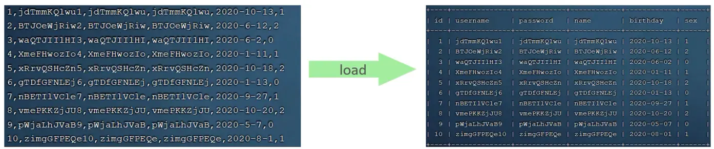

```bash
# 客户端连接服务器时，加上参数 --local-infile
mysql --local-infile -u root -p
```

```mariadb
# 设置全局参数 local_infile 为 1，开始从本地加载文件导入数据的开关
SET GLOBAL local_infile = 1;
# 执行 LOAD 指令将准备好的数据加载到表结构中
LOAD DATA LOCAL INFILE '/root/sql1.log' INTO TABLE `user` FIELDS TERMINATED BY ',' LINES TERMINATED BY '\n';
```

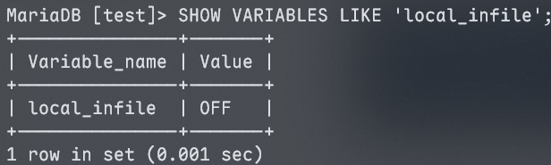

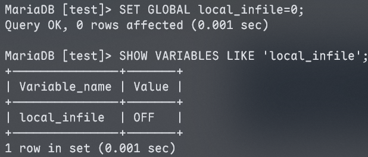

作为测试数据的表结构，其创建语句如下：

```mariadb
CREATE TABLE IF NOT EXISTS `user` (
    `id` INT(11) NOT NULL AUTO_INCREMENT,
    `username` VARCHAR(50) NOT NULL,
    `password` VARCHAR(50) NOT NULL,
    `name` VARCHAR(20) NOT NULL,
    `birthday` DATE DEFAULT NULL,
    `sex` CHAR(1) DEFAULT NULL,
    PRIMARY KEY (`id`),
    UNIQUE KEY `uniq_user_username` (`username`)
) ENGINE = InnoDB DEFAULT CHARSET = utf8;
```

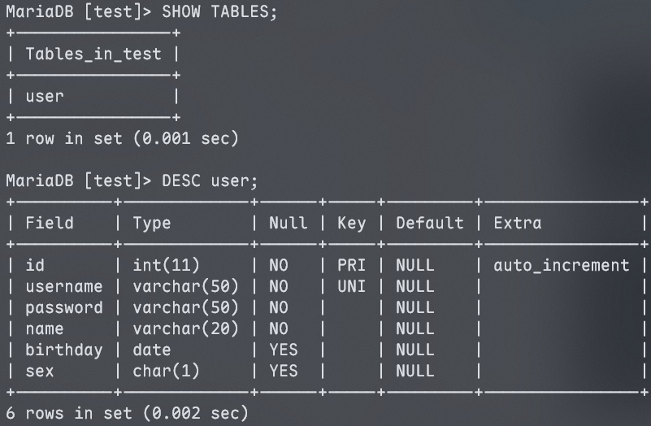

```mariadb
LOAD DATA LOCAL INFILE '/home/leafevans/test/data_100w.txt' INTO TABLE user FIELDS TERMINATED BY ',' LINES TERMINATED BY '\n';
```

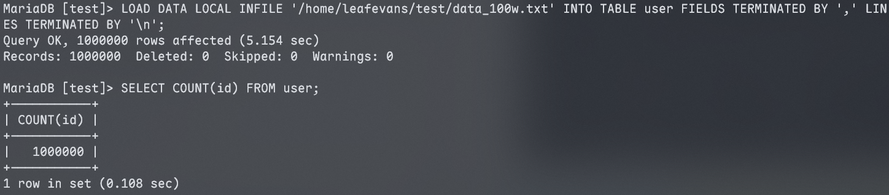

> [!note]
>
> 大批量插入时，请按主键顺序插入，顺序插入的性能显著优于乱序插入。

## 主键优化

### 数组组织方式

在 InnoDB 存储引擎中，数据表的**数据行**会按照主键顺序进行组织和存储，采用这种存储方式的表被称为<span style="color:#C3110C">索引组织表</span>（Index Organized Table, <span style="color:#C3110C">IOT</span>）。

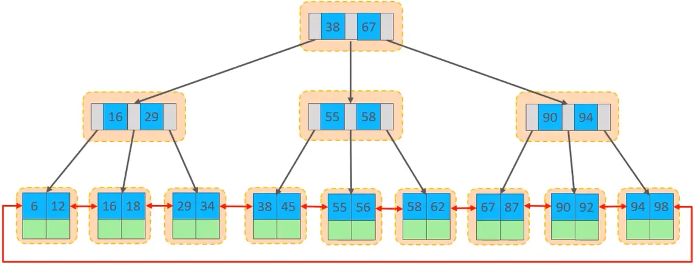

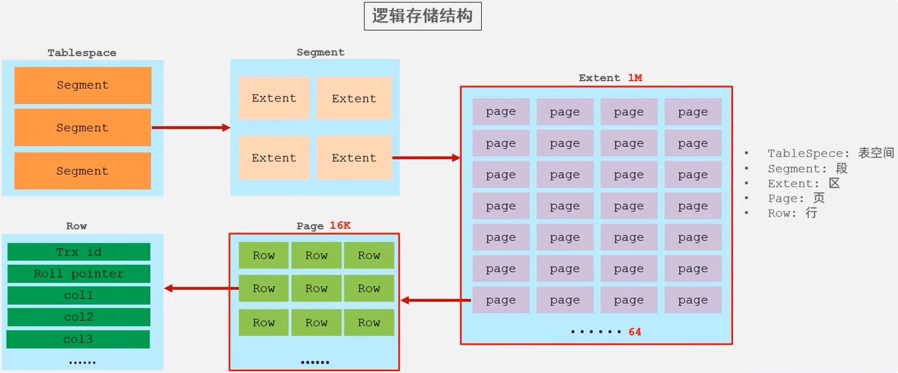

### 页分裂

InnoDB 的页填充率可处于 0% 到 100% 的任意状态，既可以是空页，也可以是半满或完全填满的页。每个页通常包含 2 至 N 行数据（当单条数据行过大、超出页的剩余容纳空间时，会触发行溢出机制），所有数据行均按主键顺序排列。

**主键顺序插入**：

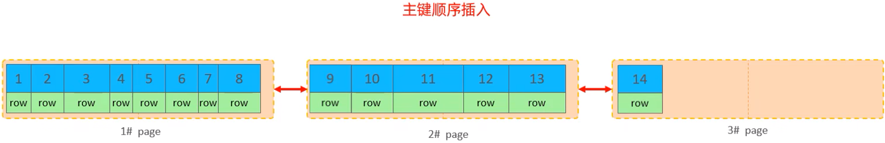

**主键乱序插入**：

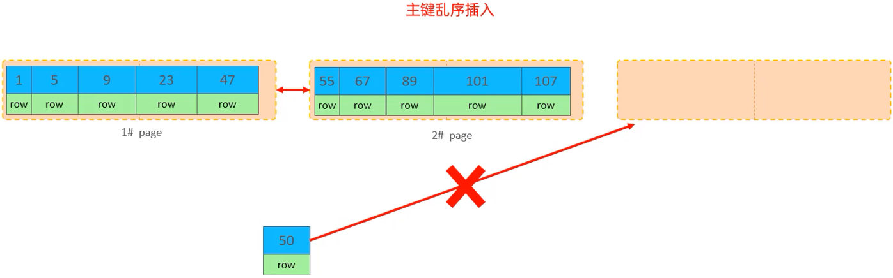

当插入新数据行时，与主键顺序插入直接追加到最新页的方式不同，乱序插入需要定位到主键对应的逻辑位置。

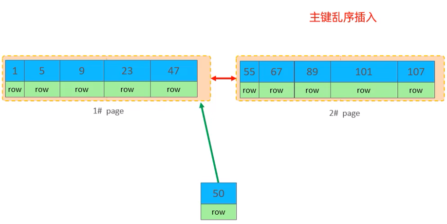

新行需要插入到主键顺序对应的目标页，但此时该页已无剩余空间。

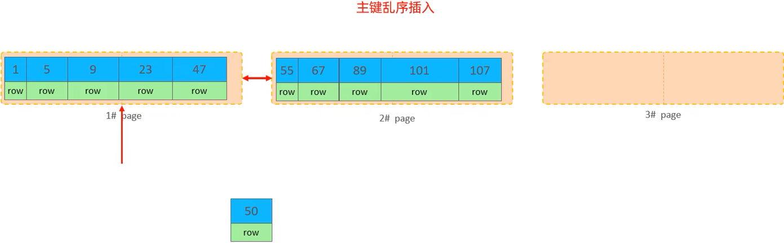

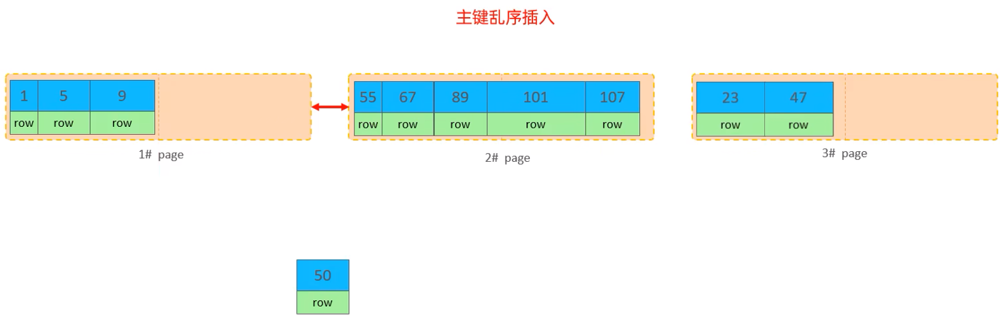

InnoDB 会将目标页中约 50% 的数据（例如主键 `id` 为 23、47 的行）拆分出来，并将这部分数据迁移到新开辟的空白页中。

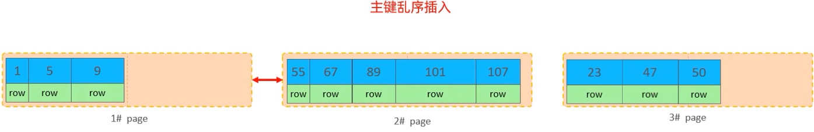

随后将主键 `id` 为 50 的新数据行插入到目标位置。

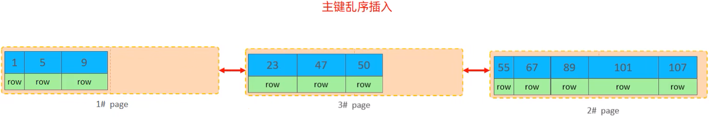

最终，系统会调整各页之间的链表指针，确保所有页仍按主键顺序串联。

这一过程被称为**页分裂（Page Split）**。

### 页合并

在 InnoDB 中，删除数据行时并不会立即执行物理删除，而是将该行**标记（flagged）为“已删除”状态**，其占用的存储空间会被标记为可复用，后续新插入的记录可以直接占用这些空间。

当页内**被标记为已删除的记录占比**达到 `MERGE_THRESHOLD` 阈值（默认值为页容量的 50%）时，InnoDB 会尝试寻找该页的**前后相邻页**，判断是否可以将两个页合并，以释放冗余页并优化空间利用率。


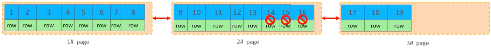

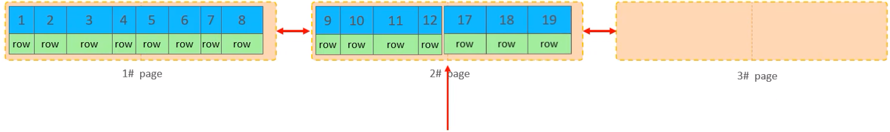


> [!tip]
>
> **`MERGE_THRESHOLD`**：合并页的阈值，可自行设置，在创建表或创建索引时指定。

### 主键设计原则

- **控制主键长度**：在满足业务唯一标识需求的前提下，应尽可能缩短主键的长度。这是因为 InnoDB 的二级索引叶子节点中存储的是主键值，过长的主键会显著增加二级索引的磁盘占用，降低空间利用率。
- **优先使用自增主键**：插入数据时，建议采用顺序插入方式，并使用 `AUTO_INCREMENT` 自增主键。乱序插入会频繁触发页分裂，产生较大性能开销，而自增主键可保证插入顺序与主键顺序一致，从根源上避免该问题。
- **避免使用 UUID 或过长自然主键**：应避免使用 UUID、身份证号等作为主键。一方面，UUID 是无序的随机字符串，插入时会引发大量页分裂；另一方面，这类主键通常长度较长，会增加索引的存储空间开销，违反“主键尽可能短”的设计原则。
- **禁止修改主键值**：业务操作中应避免修改主键值。主键是 InnoDB 表中数据行的唯一标识，修改主键会触发所有关联二级索引的全量更新，产生显著的性能开销，同时可能破坏数据的唯一性。

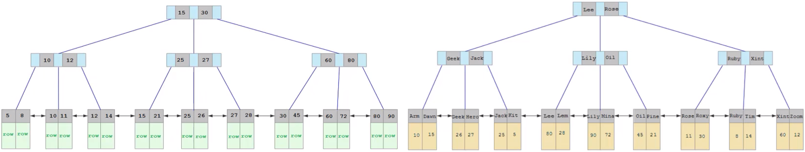

## `ORDER BY` 优化

1. **Using filesort**：当查询无法利用索引的有序性直接返回结果时，MySQL 必须先读取数据，然后在排序缓冲区（Sort Buffer）中进行额外的排序操作。若数据量过大，甚至需要借用磁盘文件。所有不是通过索引直接完成的排序都称为 FileSort。
2. **Using index**：直接利用索引本身的有序性进行顺序扫描，从而直接返回有序数据。这种方式不需要执行额外的排序操作，效率极高。


```mariadb
EXPLAIN SELECT id, age, phone FROM user ORDER BY age;
```

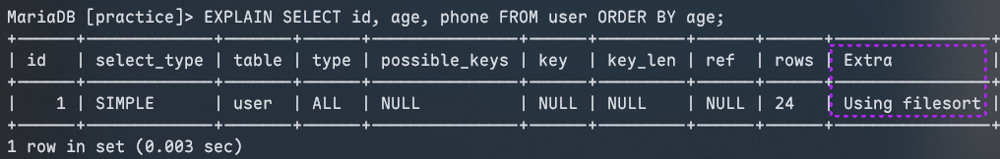

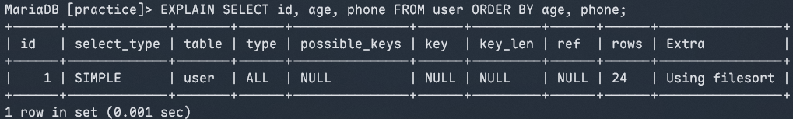

这两条查询在使用 `age` 或 `age, phone` 进行排序时出现了 `Using filesort`，核心原因是这些排序字段未建立对应的索引。因此，需要为这些字段创建索引来优化查询性能。

```mariadb
CREATE INDEX idx_user_age_phone ON user (age, phone);
```

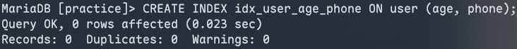

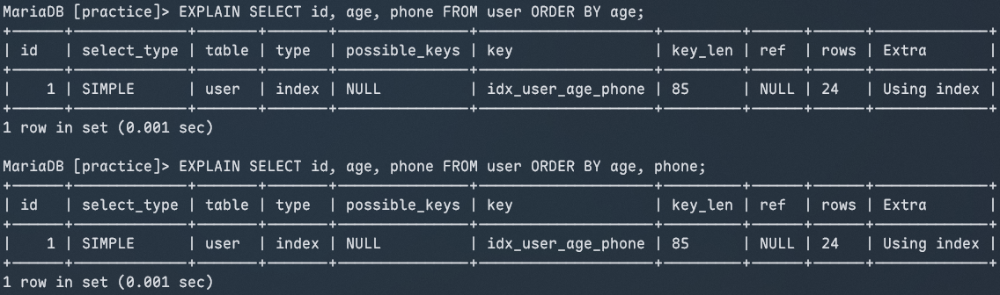

创建对应的联合索引后可知，排序操作将以 `Using index` 方式执行，即直接利用索引的有序性完成排序，查询效率显著提升。

```mariadb
EXPLAIN SELECT id, age, phone FROM user ORDER BY age DESC, phone DESC;
```

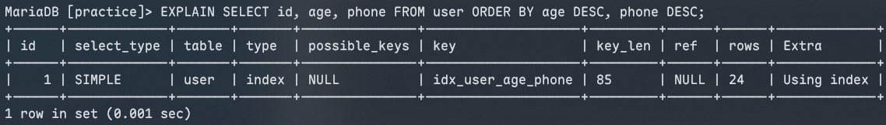

从执行计划中可见，即便采用倒序排序（`age DESC, phone DESC`），查询依然可利用索引完成排序。在 MySQL 中，执行计划的 `Extra` 字段还可能出现 `Backward index scan` 提示，用于表示反向扫描索引的行为。

```mariadb
EXPLAIN SELECT id, age, phone FROM user ORDER BY phone, age;
```

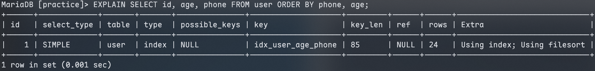

此处排序字段的顺序违背了联合索引的最左前缀原则，导致查询无法借助索引的有序性完成排序，因此触发 `Using filesort`；而 `Using index` 并非表示排序使用了索引，而是因为查询所需的所有字段均包含在该索引中（即覆盖索引），无需回表查询原表数据。

```mariadb
EXPLAIN SELECT id, age FROM user ORDER BY age ASC, phone DESC;
```

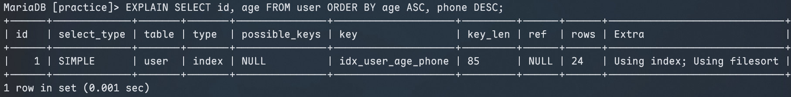

联合索引的排序方向统一（默认均为升序），而上述查询要求 `age` 升序、`phone` 降序，这种混合的排序方向与索引有序性不匹配，因此无法利用索引完成排序，触发了 `Using filesort`。

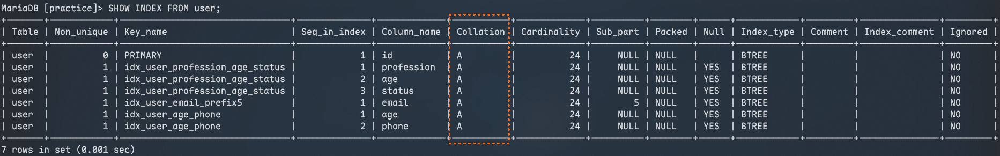

在 `SHOW INDEX` 的输出中，`Collation` 列代表索引字段的排序方式，其中 `A` 表示该字段以升序（`ASC`）存储。

为了消除之前查询中的 `Using filesort`，可创建一个支持混合排序方向的索引：

```mariadb
CREATE INDEX idx_user_age_phone_desc ON user (age ASC, phone DESC);
```

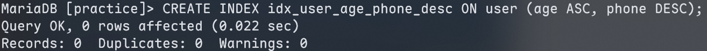

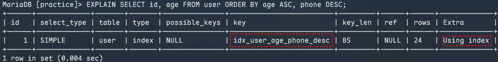

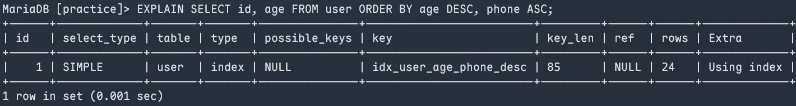

从执行计划可见，查询已切换为使用新创建的混合排序索引 `idx_user_age_phone_desc`；即使采用 `age DESC, phone ASC` 的反向排序，也能像之前全字段倒序场景一样，直接利用索引完成排序。

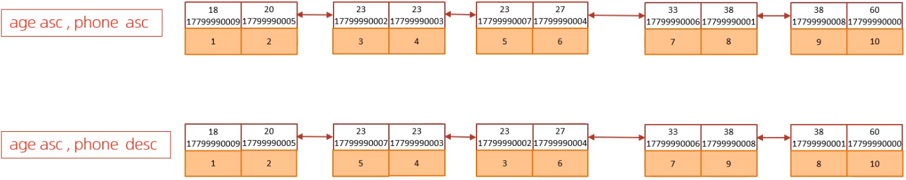

> [!note]
>
> 这些排序规则的生效前提是查询命中**覆盖索引**，即所需字段都在索引中，无需回表。

---

- **遵循最左前缀法则**：根据索引字段建立合适的索引。在涉及多字段排序时，必须严格遵守联合索引的最左前缀法则，否则索引可能失效。

- **优先使用覆盖索引**：尽量让索引列覆盖查询所需的所有字段，避免因回表（Back to Table）导致索引排序失效。

- **匹配混合排序方向**：对于“一升一降”的混合排序场景（如 `A ASC, B DESC`），在创建联合索引时必须显式指定对应的 `ASC` 或 `DESC` 规则，确保物理存储与查询需求一致。

- **调整排序缓冲区大小**：若 `Using filesort` 不可避免且数据量较大，可适当增加 `sort_buffer_size` 参数的值（MySQL 默认 256KB，MariaDB 默认值较大），以减少磁盘临时文件的使用。

  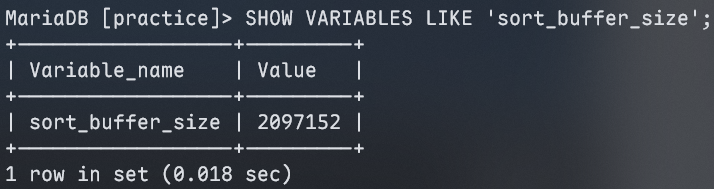

## `GROUP BY` 优化

在表中仅存主键索引、无其他二级索引时，执行分组查询会触发低效执行逻辑：

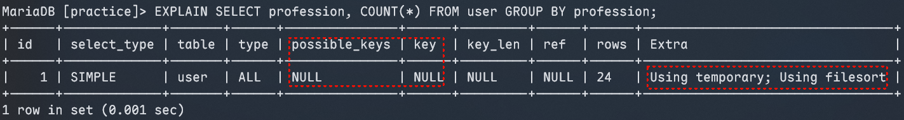

从执行计划可见，该查询触发了全表扫描，且因分组操作创建了临时表（`Using temporary`），这会带来显著的性能开销。

因此，为 `user` 表创建联合索引：

```mariadb
CREATE INDEX idx_user_profession_age_status ON user (profession, age, status);
```

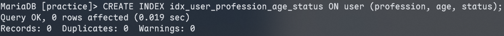

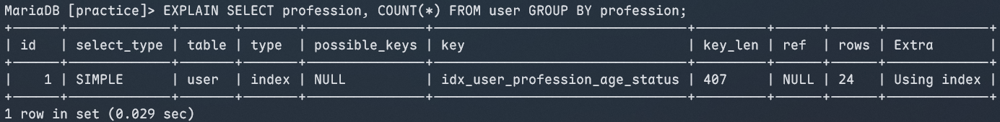

重新执行原分组查询后，执行计划显式已成功利用该联合索引，性能得到优化。

**不同分组场景的索引生效验证**：

1. **仅按 `age` 分组（索引失效）**

   执行如下查询：

   ```mariadb
   EXPLAIN SELECT age, COUNT(*) FROM user GROUP BY age;
   ```

   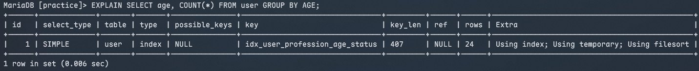

   由于仅按 `age` 分组违背了联合索引的最左前缀原则，执行计划中仍出现 `Using tempoary`，查询性能未得到提升。

2. **按 `profession, age` 分组（索引生效）**

   执行如下查询：

   ```mariadb
   EXPLAIN SELECT profession, age, COUNT(*) FROM user GROUP BY profession, age;
   ```

   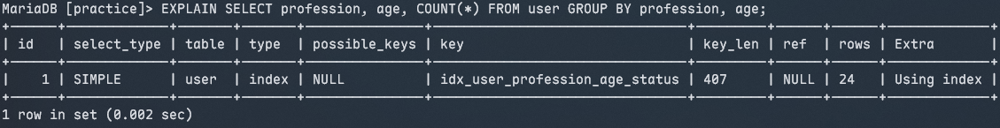

   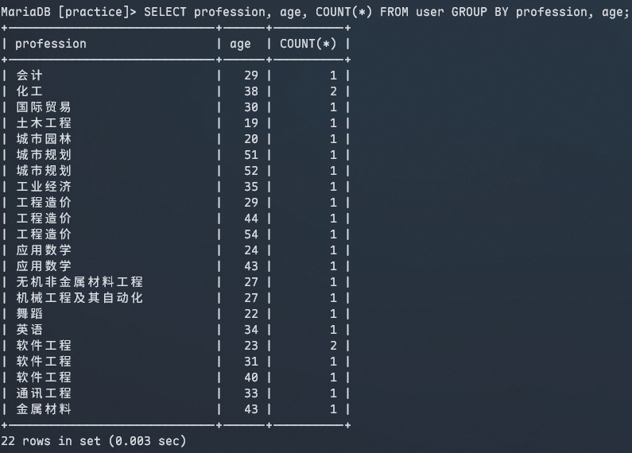

   分组字段顺序与联合索引最左前缀（`profession, age`）完全匹配，因此索引正常生效，避免了临时表的创建。

3. **`WHERE` 过滤 + 按 `age` 分组（索引生效）**

   执行如下查询：

   ```mariadb
   EXPLAIN SELECT age, COUNT(*) FROM user WHERE profession='软件工程' GROUP BY age;
   ```

   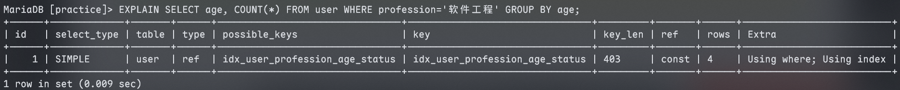

   根据 SQL 执行顺序，`WHERE` 子句先通过 `profession` 过滤数据，后续 `GROUP BY` 按 `age` 分组，整体字段组合（`profession` + `age`）符合联合索引的最左前缀原则，因此索引成功生效。

## `LIMIT` 优化

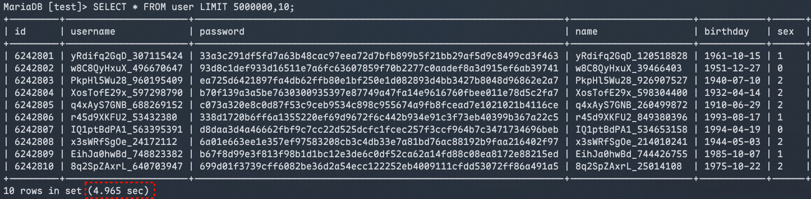

从上述执行结果可见，查询耗时严重。这是一个典型的**“深度分页”**性能问题。

当执行 `LIMIT 2000000, 10` 时，MySQL 必须扫描并（在必要时）排序前 2,000,010 条记录，然后**抛弃**前 2,000,000 条，仅返回最后 10 条。随着偏移量（Offset）的增加，扫描和丢弃的数据量越来越大，导致大量的需要 I/O 和 CPU 消耗。

针对此类场景，利用**覆盖索引 + 子查询**的形式可显著提升性能。

**原理**：先在子查询中利用覆盖索引（不回表）快速提取出目标分页的主键 ID，然后再通过主键关联（Inner Join）原表获取完整的行数据。这避免了对前 200 万条数据进行无意义的回表读取。

```mariadb
SELECT u1.* FROM user u1 INNER JOIN (SELECT id FROM user ORDER BY id LIMIT 5000000, 10) u2 ON u1.id = u2.id;
```

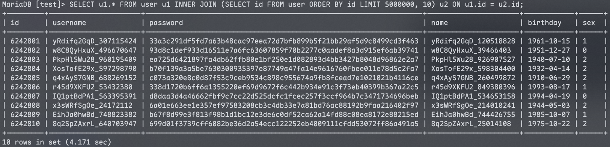

### `COUNT` 优化

```mariadb
EXPLAIN SELECT COUNT(*) FROM user;
```

- **MyISAM 引擎**：会将表的总行数维护在磁盘的元数据中，因此在无 `WHERE` 过滤条件时，执行 `COUNT(*)` 可直接读取元数据返回结果，无需扫描表数据，效率极高。
- **InnoDB 引擎**：受事务隔离性和多版本并发控制（MVCC）机制影响，无法依赖元数据直接获取准确行数。执行 `COUNT(*)` 时需要扫描数据并逐行计数，性能开销较大。

**业务层维护计数**：

使用 Redis 等键值型内存数据库，在业务代码中维护表的行数：插入数据时对计数执行 `INCR` 操作，删除数据时执行 `DECR` 操作，以此实现高效的计数查询。该方案适合对计数实时性要求高、且能接受少量一致性偏差的场景，需注意处理并发更新时的一致性问题。

### `COUNT` 的用法

`COUNT()` 是 MySQL 中的聚合函数，核心逻辑为：遍历查询结果集的每一行，若函数参数值不为 `NULL`，则累计计数加 1；若为 `NULL` 则不计入，最终返回累计值。

**常见用法**：`COUNT(*)`、`COUNT(主键)`、`COUNT(字段)`、`COUNT(1)`。

**InnoDB 引擎下各用法的执行逻辑**：

- **`COUNT(主键)`**：InnoDB 会扫描表（或最优索引），提取每一行的主键值并返回至 Server 层；由于主键值不可能为 `NULL`，Server 层直接按行累加计数。
- **`COUNT(字段)`**：
  - **字段无 `NOT NULL` 约束**：InnoDB 扫描表（或对应索引），提取每一行的该字段值返回至 Server 层；Server 层判断字段值是否为 `NULL`，非 `NULL` 则累加计数。
  - **字段有 `NOT NULL` 约束**：InnoDB 扫描表（或对应索引），提取每一行的该字段值返回至 Server 层；因字段值必不为 `NULL`，Server 层直接按行累加计数。
- **`COUNT(1)`**：InnoDB 扫描表（或最优索引），但不会提取任何字段值；Server 为每一行填充常数“1”（该值恒不为 `NULL`），直接按行累加计数。
- **`COUNT(*)`**：MySQL 对该写法做了专属优化——InnoDB 扫描表（或最优索引）时不提前任何字段值，直接将行数信息返回至 Server 层；Server 无需额外判断，直接按行累加计数。

在 InnoDB 引擎下，各用法的执行效率如下：

`COUNT(字段)`（无 `NOT NULL` 约束）< `COUNT(字段)`（有 `NOT NULL` 约束）< `COUNT(主键)` < `COUNT(1)` ≈ `COUNT(*)`

综上，开发中应优先使用 `COUNT(*)`，其语义最清晰且性能最优。

## `UPDATE` 优化

**初始数据**：

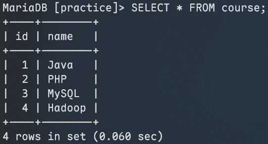

开启两个独立会话，同时执行以下事务：

```mariadb
START TRANSACTION;
UPDATE course SET name='C#' WHERE id=1;
COMMIT;
```

```mariadb
START TRANSACTION;
UPDATE course SET name='Golang' WHERE id=4;
COMMIT;
```

在 MySQL 默认的**可重复度（RR）隔离级别**下，由于 `id` 是主键索引，`UPDATE` 会触发**行级锁**，仅锁住 `id=1` 和 `id=4` 的两行数据，彼此互不影响，两个事务可以并行执行。

开启两个独立会话，同时执行以下事务：

```mariadb
START TRANSACTION;
UPDATE course SET name='Rust' WHERE name='PHP';
COMMIT;
```

```mariadb
START TRANSACTION;
UPDATE course SET name='Zig' WHERE id=4;
COMMIT;
```

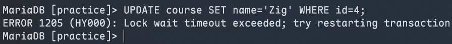

由于 `name` 字段未创建索引，MySQL 无法通过索引定位目标行，只能全表扫描，因此会触发**表级锁**（锁住整个 `course` 表）。这导致会话 2 的 `UPDATE` 操作被阻塞，最终因锁等待超时失败；只有当会话 1 提交事务释放表锁后，会话 2 才能执行成功。

---

`UPDATE` 语句的核心优化原则是：**确保 `WHERE` 条件的过滤字段存在有效索引**，让 MySQL 能快速定位目标行，从而触发行级锁，避免全表扫描和表级锁，提高并发性能。

```mariadb
CREATE INDEX idx_course_name ON course (name);
```

InnoDB 的行级锁是基于索引而非具体数据记录加锁的；若加锁依赖的索引失效（如索引未命中、无有效索引），行锁会升级为表级锁，导致并发性能显著下降。

---

**知识回顾**：

1. **插入数据**：
   - **`INSERT`**：批量插入、手动控制事务、主键顺序插入。
   - **大批量插入**：`LOAD DATA LOCAL INFILE`。
2. **主键优化**：
   - 主键长度尽量短、顺序插入。
   - 使用 `AUTO_INCREMENT`、不使用 `UUID`。
3. **`ORDER BY`** 优化：
   - **Using index**：直接通过索引返回数据，性能高。
   - **Using filesort**：需要将返回的结果在排序缓冲区中排序。
4. **`GROUP BY` 优化**：索引、多字段分组满足最左前缀原则。
5. **`LIMIT` 优化**：覆盖索引 + 子查询。
6. **`COUNT` 优化**：`COUNT(字段)` < `COUNT(主键)` < `COUNT(1)` ≈ `COUNT(*)`。
7. **`UPDATE` 优化**：尽量根据主键/索引字段进行数据更新。
