# 存储对象

## 视图

视图（View）是数据库中的虚拟表，其本身不存储任何实际数据，仅保存查询的 SQL 逻辑；视图的行、列数据均来源于定义视图时引用的基础表，且这些数据会在查询视图时动态生成，而非提前持久化存储。

因此创建视图的核心工作，是编写并保存这条用于生成虚拟数据的 SQL 查询语句。

### 基本语法

**创建**：

```mariadb
CREATE [OR REPLACE] VIEW 视图名称 [(列名列表)] AS SELECT语句 [WITH[CASCADED | LOCAL] CHECK OPTION];
```

```mariadb
CREATE OR REPLACE VIEW `vw_student_top10` AS (
    SELECT id, name
    FROM student
    WHERE
        id <= 10
);
```

**查询**：

- **查看创建视图语句**：

  ```mariadb
  SHOW CREATE VIEW 视图名称;
  ```

  ```mariadb
  SHOW CREATE VIEW vw_student_top10;
  ```

  

- **查看视图数据**：

  ```mariadb
  SELECT * FROM 视图名称...;
  ```

  ```mariadb
  SELECT * FROM vw_student_top10;
  ```

  

  ```mariadb
  SELECT * FROM vw_student_top10 WHERE id < 3;
  ```

  

**修改**：

- **方式一**：

  ```mariadb
  CREATE OR REPLACE VIEW 视图名称 [(列名列表)] AS SELECT语句 [WITH[CASCADED | LOCAL] CHECK OPTION];
  ```

  ```mariadb
  CREATE OR REPLACE VIEW `vw_student_top10` AS (
      SELECT id, name, no
      FROM student
      WHERE
          id <= 10
  );
  ```

  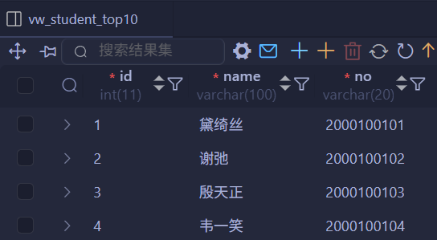

- **方式二**：

  ```mariadb
  ALTER VIEW 视图名称 [(列标名称)] AS SELECT语句 [WITH[CASCADE | LOCAL] CHECK OPTION];
  ```

  ```mariadb
  ALTER VIEW `vw_student_top10` AS (
      SELECT id, name
      FROM student
      WHERE
          id <= 10
  );
  ```

  

**删除**：

```mariadb
DROP VIEW [IF EXISTS] 视图名称 [, 视图名称] ...;
```

```mariadb
DROP VIEW IF EXISTS `vw_student_top10`;
```

### 检查选项

**正常插入**：


向视图中插入满足条件的数据：

```mariadb
INSERT INTO vw_student_top20 VALUES (6, 'Tom');
```

查询基表 `student`，数据已同步，说明通过视图写入正常。

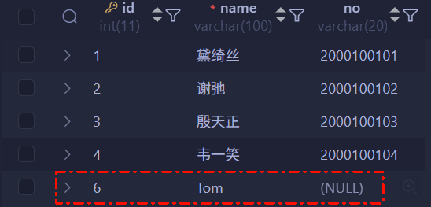

发现基表已经发生变化。

**越界插入（数据隐身）**：

尝试插入不满足视图 `WHERE` 条件的数据（`id > 20`）：

```mariadb
INSERT INTO vw_student_top20 VALUES (30, 'Tom');
```

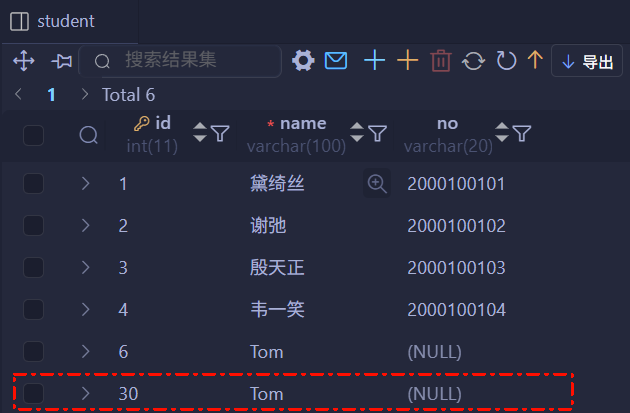

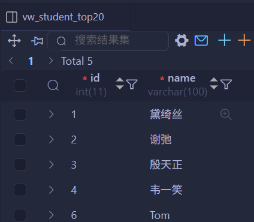

SQL 执行成功，基表中也可查到该条记录。但在视图 `vw_student_top20` 中**无法查询到**该数据。

**原因**：视图定义了 `id <= 20`，虽然数据成功写入基表，但因不满足筛选条件而被视图过滤。这导致了“写入成功但不可见”的数据不一致性。

为了强制保证数据操作符合视图定义，需开启检查选项：

```mariadb
CREATE OR REPLACE VIEW `vw_student_top20` AS
SELECT id, name
FROM student
WHERE
    id <= 20
WITH CASCADE CHECK OPTION
```

此时插入 `id=30` 的数据：

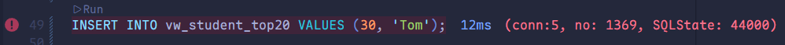

系统报错 `CHECK OPTION failed`。

开启该选项后，MySQL 会拦截所有违背视图定义的写入或更新操作，确保视图和基表逻辑一致性。

> [!note]
>
> 在本例单层视图场景中，`CASCADED` 和 `LOCAL` 效果一致。

---

为了强制保证数据操作符合视图定义，需开启检查选项。该选项分为两种模式：

- **`CASCADED`**（默认值）：**级联检查**。不仅检查当前视图的条件，还会**递归强制检查**底层视图的条件（无论底层视图是否开启了检查选项）。
- **`LOCAL`**：**本地检查**。检查当前视图的条件。对于底层视图，**仅在底层视图自身定义了检查选项时才检查**，否则忽略底层规则。

**`CASCADED`**：

创建一个**没有**检查选项的底层视图 `vw_student_top20`（`id <= 20`）。

```mariadb
CREATE OR REPLACE VIEW `vw_student_top20` AS
SELECT id, name
FROM student
WHERE
    id <= 20;
```

基于上表，创建一个**带有 `CASCADED`** 的上层视图 `vw_student_10_to_20`（`id >= 10`）。

```mariadb
CREATE VIEW `vw_student_10_to_20` AS
SELECT id, name
FROM vw_student_top20
WHERE
    id >= 10
WITH
    CASCADED CHECK OPTION;
```

通过该嵌套视图写入数据时，会同时校验当前视图（`id >= 10`）和底层视图（`id <= 20`）的条件（等效于给底层视图也添加了 `CASCADED CHECK OPTION`）。

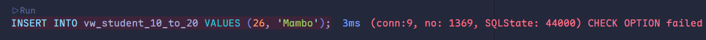

此时若向 `vw_student_10_to_20` 插入 `id=26` 的数据，会抛出 `CHECK OPTION failed` 的错误（违反级联校验的 `id<=20` 规则）。

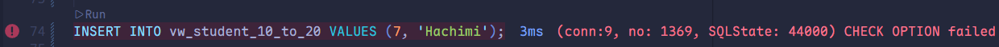

同理，插入 `id=7` 的数据也会报相同错误（违反 `id>=10` 的校验规则）。

**`LOCAL`**：

基于已有的 `vw_student_10_to_20`（该视图已启用 `CASCADED` 校验，范围 `id >= 10`）创建嵌套视图，并启用 `LOCAL CHECK OPTION`：

```mariadb
CREATE OR REPLACE VIEW vw_student_15_to_20 AS
SELECT id, name
FROM vw_student_10_to_20
WHERE
    id <= 15
WITH
    LOCAL CHECK OPTION;
```

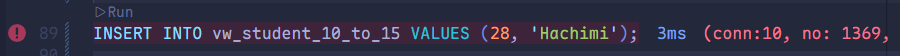

**插入 `id=28`**：违反当前视图 `id <= 15` 的条件。执行 `INSERT` 后直接抛出 `CHECK OPTION failed` 错误。这是 `LOCAL` 选项对自己定义的条件进行了强制检查。

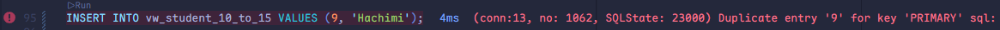

**插入 `id=9`**：违反底层视图 `id >= 10` 的条件。执行 `INSERT` 后抛出 `CHECK OPTION failed` 错误。

---

> [!important]
>
> - **`LOCAL` 的行为**：
>   1. **对自己**：强制校验当前视图定义的条件。
>   2. **对底层**：若底层视图**定义了 `CHECK OPTION`**，则进行检查；若底层视图**没定义**，则忽略检查。
> - **`CASCADED` 的行为**：
>
>   无论底层视图是否定义检查选项，都会**强制递归检查**所有依赖视图的条件。

### 更新

视图支持 `INSERT`/`UPDATE`/`DELETE` 等写入操作的必要条件是：**视图中的行与基表中的行必须为一对一映射关系**。

**不可更新的视图场景**：

若视图定义包含以下任一元素，则该视图无法被更新：

1. 聚合函数（如 `SUM()`、`MIN()`、`MAX()`、`COUNT()`）或窗口函数
2. `DISTINCT` 关键字
3. `GROUP BY` 子句
4. `HAVING` 子句
5. `UNION` / `UNION ALL` 联合查询

```mariadb
CREATE OR REPLACE VIEW `vw_student_count` AS
SELECT COUNT(*)
FROM student;
```

```mariadb
INSERT INTO vw_student_count VALUES (10);
```

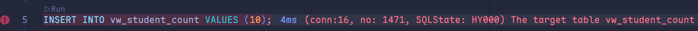

可见，包含聚合函数 `COUNT()` 的视图因不满足“行一对一映射”前提，无法执行插入操作。

### 作用

- **简化使用**：

  视图可封装高频查询逻辑，既降低用户理解数据的复杂度，又简化日常操作。将常用查询定义为视图后，用户无需在每次操作时重复编写完整查询条件。

- **安全管控**：

  数据库原生授权无法实现行 / 列级的细粒度权限控制，而视图可精准限制用户仅能访问和修改其可见范围内的数据，避免直接暴露底层全表，提升数据安全性。

- **数据隔离**：

  视图作为应用与基表之间的中间层，可屏蔽底层表结构变更带来的影响。即使基表结构发生调整，只要保持视图定义不变，上层应用就无需修改代码，保证业务连续性。

### 案例

基于以下业务需求创建视图：

1. **数据安全管控**：为保障 `user` 的数据安全，限制开发人员操作该表时仅能查看用户基础字段，屏蔽手机号、邮箱字段，需创建对应视图实现权限隔离。
2. **简化高频操作**：“查询每位学生选修的课程”需通过三张表关联查询实现，该逻辑在多个业务场景中高频使用。为简化重复操作，需创建视图封装此联查逻辑。

```mariadb
CREATE OR REPLACE VIEW `vw_user_profile` AS
SELECT
    id,
    name,
    profession,
    age,
    gender,
    status,
    createtime
FROM `user`;
```

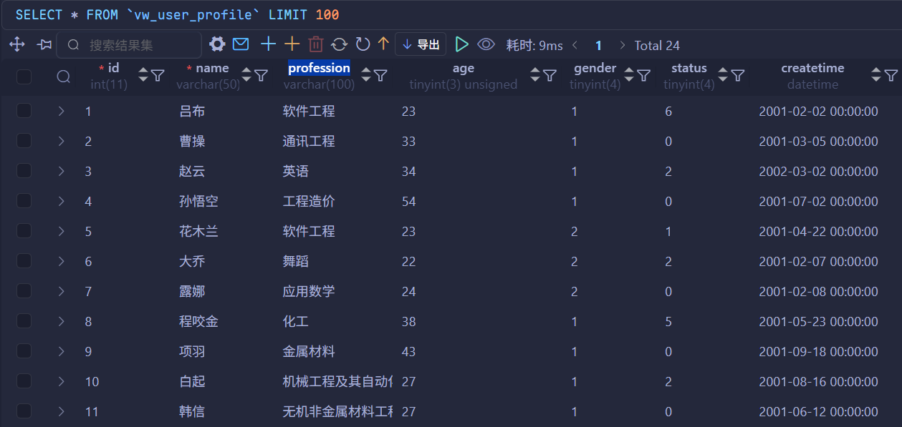

```mariadb
CREATE OR REPLACE VIEW `vw_student_course` AS
SELECT
    s.name AS student_name,
    s.no AS student_no,
    c.name AS course_name
FROM
    student s
    LEFT JOIN student_course sc ON s.id = sc.studentid
    LEFT JOIN course c ON sc.courseid = c.id;
```

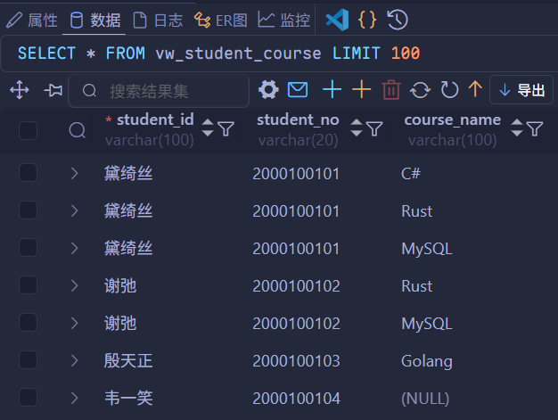

## 存储过程

存储过程是预先编译并持久化存储在数据库中的 SQL 语句集合。调用存储过程可简化应用开发人员的工作流程，减少数据库与应用服务器间的数据传输量，从而有效提升数据处理效率。

从设计逻辑来看，存储过程的核心思想十分简洁：本质是数据库 SQL 语言层面的代码封装与复用。

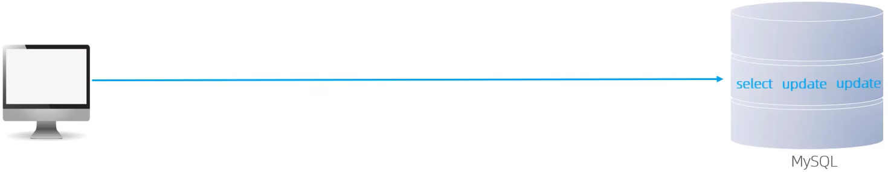

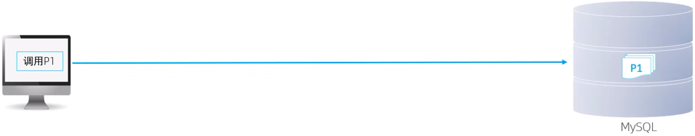

**特点**：

- **封装复用**：将高频 SQL 逻辑封装为存储过程，可重复调用，避免重复编写相同代码。
- **参数调用**：支持接收输入参数，也可返回输出结果，适配多样化业务逻辑场景的参数传递。
- **性能提升**：减少应用层与数据库的网络交互次数，降低数据传输开销，优化整体处理效率。

### 语法

**创建**：

```mariadb
CREATE PROCEDURE 存储过程名称([参数列标])
BEGIN
-- SQL 语句
END;
```

```mariadb
CREATE PROCEDURE `sp_student_count`()
BEGIN
SELECT COUNT(*) FROM student;
END;
```

> [!note]
>
> 上述存储过程创建语句无法直接在命令行执行，因为命令行默认将 `;` 作为 SQL 结束符，会误把存储过程内部 SQL 末尾的 `;` 判定为整个过程定义的结束。
>
> 在命令行执行存储过程创建语句时，需通过 `DELIMITER` 关键字修改 SQL 语句的结束符。
>
> 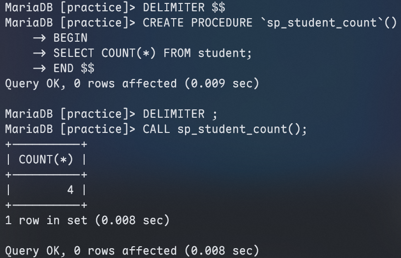

**调用**：

```mariadb
CALL 名称 ([参数]);
```

```mariadb
CALL sp_student_count ();
```


**查看**：

```mariadb
-- 查询指定数据库的存储过程及状态信息
SELECT * FROM information_schema.ROUTINES ROUTINE_SHCEMA='xxx'
-- 查询某个存储过程的定义
SHOW CREATE PROCEDURE 存储过程名称;
```

```mariadb
SELECT *
FROM information_schema.ROUTINES
WHERE
    `ROUTINE_SCHEMA` = 'practice';
```


```mariadb
SHOW CREATE PROCEDURE sp_student_count;
```


> [!note]
>
> `information_schema` 是 MySQL/MariaDB 自带的**系统信息数据库**，相当于数据库的「数据字典」+「运行监控仪表盘」，不存储业务数据，只存系统元数据和状态。
>
> 1. **存元数据**：记录所有库、表、字段、索引等对象的定义。
> 2. **监控状态**：提供锁、事务、连接等实时运行数据，用于排查问题。
> 3. **管对象信息**：存储存储过程、触发器、权限等配置。

**删除**：

```mariadb
DROP PROCEDURE [IF EXISTS] 存储过程名称;
```

### 变量

#### 系统变量

MySQL <span style="color:#C3110C">系统变量</span>由服务器内置提供，非用户自定义，归属服务器层面，分为<span style="color:#C3110C">全局变量</span>（`GLOBAL`）和<span style="color:#C3110C">会话变量</span>（`SESSION`）两类。

**查看系统变量**：

```mariadb
-- 查看所有系统变量
SHOW [SESSION | GLOBAL] VARIABLES;
-- 可以通过 LIKE 模糊匹配方式查找变量
SHOW [SESSION | GLOBAL] VARIABLES LIKE '...';
-- 查看指定变量的值
SELECT @@[SESSION | GLOBAL].系统变量名;
```

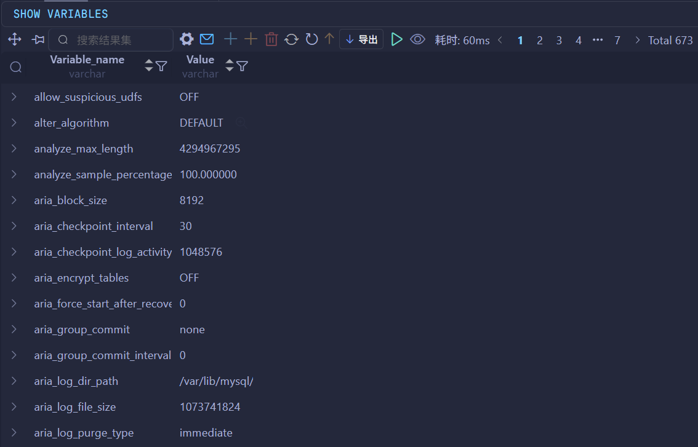

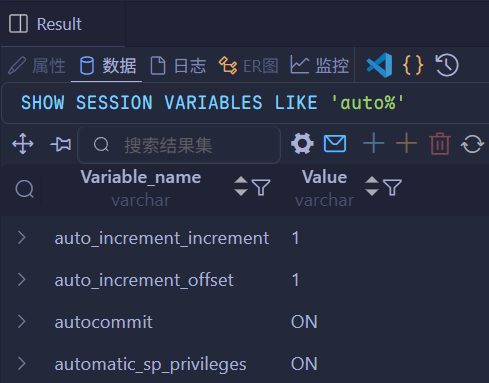


**设置系统变量**：

```mariadb
SET [SESSION | GLOBAL] 系统变量名=值;
SET @@[SESSION | GLOBAL].系统变量名=值;
```

```mariadb
SET SESSION autocommit = 0;
```


> [!note]
>
> 若未显式指定 `SESSION` / `GLOBAL` 作用域，默认采用 `SESSION`（会话变量）作用域。
>
> MySQL 服务重启后，手动设置的全局变量会失效；如需永久生效，可在 `/etc/my.cnf` 中配置。

#### 用户自定义变量

MySQL <span style="color:#F63049">用户自定义变量</span>（简称用户变量）由用户按需自行定义，无需提前声明，使用时直接通过 `@变量名` 调用即可，其作用域为当前数据库连接。

**赋值**：

```mariadb
SET @var_name = expr [, @var_name = expr]...;
SET @var_name := expr [, @var_name := expr]...;
```

```mariadb
SELECT @var_name := expr [, @var_name := expr]...;
SELECT 字段名 INTO @var_name FROM 表名;
```

**使用**：

```mariadb
SELECT @var_name;
```

---

```mariadb
SET @testname = 'Hachimi';

SET @testage := 10;

SET @testgender := '女', @testhobby := 'Golang';

SELECT @testname, @testage, @testgender, @testhobby;
```


```mariadb
SELECT @testcolor := 'red';

SELECT COUNT(*) INTO @testcount FROM user;

SELECT @testcolor, @testcount;
```


> [!note]
>
> MySQL 用户自定义变量无需声明或初始化，未定义的变量直接获取时取值为 `NULL`。（例如执行 `SELECT @abc`，因 `@abc` 未被定义，返回结果为 `NULL`）

#### 局部变量

MySQL <span style="color:#0E21A0">局部变量</span>是按需定义、仅在局部作用域生效的变量，使用前需通过 `DECLARE` 关键字声明。该类变量常用于存储过程内，可作为局部变量或输入参数使用，其作用域限定在声明该变量的 `BEGIN ... END` 代码块内。

**声明**：

```mariadb
DECLARE 变量名 变量类型 [DEFAULT ...];
```

> [!note]
>
> 变量类型就是数据库字段类型，即 `INT`、`BIGINT`、`CHAR`、`VARCHAR`、`DATE`、`TIME` 等。

**赋值**：

```mariadb
SET 变量名 = 值;
SET 变量名 := 值;
SELECT 字段名 INTO 变量名 FROM 表名...;
```

---

```mariadb
CREATE PROCEDURE `sp_student_count`()
BEGIN
DECLARE `student_count` INT DEFAULT 0;
SELECT COUNT(*) INTO student_count FROM student;
SELECT student_count;
END;
```


### `IF`

**语法**：

```mariadb
IF 条件1 THEN
...
ELSEIF 条件2 THEN  -- 可选
...
ELSE							 -- 可选
...
END IF;
```

基于已定义的分数变量 `score`，判定其对应的分数等级，规则如下：

1. 当 `score >= 85` 时，等级为“优秀”。
2. 当 `60 <= score < 85` 时，等级为“及格”。
3. 当 `score < 60` 时，等级为“不及格”。

```mariadb
CREATE PROCEDURE `sp_score_grade`()
BEGIN
DECLARE `score` INT DEFAULT 55;
DECLARE `res` VARCHAR(10) CHARACTER SET utf8mb4;
IF score > 85 THEN
SET res := '优秀';
ELSEIF score >= 60 THEN
SET res := '及格';
ELSE
SET res := '不及格';
END IF;
SELECT res;
END;

CALL sp_score_grade ();
```


### 参数

|  类型   |                     含义                     | 备注 |
| :-----: | :------------------------------------------: | :--: |
|  `IN`   |   该类参数作为输入，也就是需要调用时传入值   | 默认 |
|  `OUT`  | 该类参数作为输出，也就是该参数可以作为返回值 |      |
| `INOUT` |    既可以作为输入参数，也可以作为输出参数    |      |

**用法**：

```mariadb
CREATE PROCEDURE 存储过程名称([IN/OUT/INOUT 参数名 参数类型])
BEGIN
-- SQL 语句
END;
```

定义存储过程，完成如下需求：

接受<span style="color:#0C7779">传入</span>参数 `score`，根据以下规则判定其对应的分数等级并<span style="color:#0C7779">返回</span>结果：

1. 当 `score >= 85` 时，返回等级为“优秀”。
2. 当 `60 <= score < 85` 时，返回等级为“及格”。
3. 当 `score < 60` 时，返回等级为“不及格”。

```mariadb
CREATE PROCEDURE `sp_score_grade` (IN score INT, OUT res VARCHAR(10) CHARACTER SET utf8mb4)
BEGIN
IF score >= 85 THEN
SET res := '优秀';
ELSEIF score >= 60 THEN
SET res := '及格';
ELSE
SET res := '不及格';
END IF;
END;

CALL sp_score_grade (65, @res);

SELECT @res;
```


将<span style="color:#0C7779">传入</span>的 200 分制分数换算为百分制，并<span style="color:#0C7779">返回</span>换算后的结果。

```mariadb
CREATE PROCEDURE `sp_halve_score`(INOUT score DOUBLE)
BEGIN
SET score := score * 0.5;
END;

SELECT @score := 127;

CALL sp_halve_score (@score);

SELECT @score;
```


### `CASE`

**语法一**：

```mariadb
CASE case_value
		WHEN when_value1 THEN statement_list1
		[WHEN when_value2 THEN statement_list2]...
		[ELSE statement_list]
END CASE;
```

**语法二**：

```mariadb
CASE
		WHEN search_condition1 THEN statement_list1
		WHEN search_condition2 THEN statement_list2
		[ELSE statement_list]
END CASE;
```

定义存储过程，完成如下需求：

接收传入的月份参数，采用 `CASE` 结构判定该月份所属季度，判定规则如下：

1. 月份为 1-3 月时，判定为第一季度。
2. 月份为 4-6 月时，判定为第二季度。
3. 月份为 7-9 月时，判定为第三季度。
4. 月份为 10-12 月时，判定为第四季度。

```mariadb
CREATE PROCEDURE `sp_month_to_quarter`(IN p_month TINYINT)
BEGIN
DECLARE res VARCHAR(10) CHARACTER SET utf8mb4;
CASE
WHEN p_month BETWEEN 1 AND 3 THEN SET res = '第一季度';
WHEN p_month BETWEEN 4 AND 6 THEN SET res = '第二季度';
WHEN p_month BETWEEN 7 AND 9 THEN SET res = '第三季度';
WHEN p_month BETWEEN 10 AND 12 THEN SET res = '第四季度';
ELSE SET res = '未知';
END CASE;
SELECT CONCAT('您输入的月份为：', p_month, '，它所属的季度为：', res);
END;

CALL sp_month_to_quarter (10);
```


### 循环

#### `WHILE`

`WHILE` 循环是 MySQL 中的条件型循环控制语句，仅当指定条件满足时，才执行循环体中的 SQL 语句。其标准语法如下：

```mariadb
WHILE 条件 DO
	SQL 逻辑...
END WHILE;
```

定义存储过程，完成如下需求：

计算从 1 累加 n 的值，n 为传入的参数值。

```mariadb
CREATE PROCEDURE `sp_sum_to_n`(IN n INT)
BEGIN
DECLARE total INT DEFAULT 0;
WHILE n > 0 DO
SET total := total + n;
SET n := n - 1;
END WHILE;
SELECT total;
END;

CALL sp_sum_to_n (50);
```


#### `REPEAT`

`REPEAT` 是 MySQL 中的条件型循环控制语句，遵循“先执行循环体，后判断条件”的逻辑，当预设条件满足时退出循环。其标准语法如下：

```mariadb
REPEAT
	SQL 逻辑...
	UNTIL 条件
END REPEAT;
```

定义存储过程，完成如下需求：

计算从 1 累加 n 的值，n 为传入的参数值。

```mariadb
CREATE PROCEDURE `sp_sum_to_n`(IN n INT)
BEGIN
DECLARE total INT DEFAULT 0;
REPEAT
SET total := total + n;
SET n := n - 1;
UNTIL n = 0
END REPEAT;
SELECT total;
END;

CALL sp_sum_to_n (45);
```


#### `LOOP`

`LOOP` 是 MySQL 中的基础循环语句，可实现简单的循环逻辑；若未在 SQL 逻辑中设置退出循环的条件，`LOOP` 会执行死循环。`LOOP` 通常配合以下两个语句使用：

- `LEAVE`：用于循环中，作用是直接退出当前循环。
- `ITERATE`：仅可用于循环内，作用是跳过当前循环剩余的语句，直接进入下一次循环。

```mariadb
[begin_label:] LOOP
	SQL 逻辑...
END LOOP [end_label];
```

```mariadb
LEAVE label;   -- 退出指定标记的循环体
ITERATE label; -- 直接进入下一次循环
```

定义存储过程，完成如下需求：

计算从 1 累加 n 的值，n 为传入的参数值。

```mariadb
CREATE PROCEDURE `sp_sum_to_n`(IN n INT)
BEGIN
DECLARE total INT DEFAULT 0;
sum_loop: LOOP
SET total:= total + n;
SET n := n - 1;
IF n = 0 THEN
LEAVE sum_loop;
END IF;
END LOOP sum_loop;
SELECT total;
END;

CALL sp_sum_to_n (45);
```


计算从 1 到 n 之间的偶数累加的值，n 为传入的参数值。

```mariadb
CREATE PROCEDURE `sp_sum_even_to_n`(IN n INT)
BEGIN
DECLARE total INT DEFAULT 0;

sum_loop: LOOP
IF n = 0 THEN
LEAVE sum_loop;
END IF;

IF MOD(n, 2) = 1 THEN
SET n := n - 1;
ITERATE sum_loop;
END IF;

SET total := total + n;
SET n := n - 1;
END LOOP sum_loop;

SELECT total;
END;

CALL sp_sum_even_to_n (45);
```


### 游标

修改原有存储过程，将原查询中的 `COUNT(*)` 替换为 `*` 以取出 `student` 表的全部数据，执行后触发报错。

```mariadb
CREATE PROCEDURE `sp_student_count`()
BEGIN
DECLARE `student_count` INT DEFAULT 0;
SELECT * INTO student_count FROM student;
SELECT student_count;
END;

CALL sp_student_count ();
```

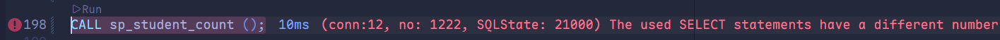

报错原因是 `SELECT *` 返回多列结果集，而变量 `student_count` 为 `INT` 类型，仅能存储单列单行的值；这表明通过 `DECLARE` 声明的普通变量仅支持单行单列数据，若需返回完整结果集，需采用其他方案（如游标）。

---

<span style="color:#F075AE">游标（CURSOR）</span>是 MySQL 中用于存储查询结果集的数据库对象（非基础数据类型），可在存储过程和函数中通过游标对结果集进行循环遍历处理。游标的完整使用流程包含声明、OPEN（打开）、FETCH（提取数据）和 CLOSE（关闭）四个步骤，各步骤语法如下：

**声明游标**：

```mariadb
DECLARE 游标名称 CURSOR FOR 查询语句;
```

**打开游标**：

```mariadb
OPEN 游标名称;
```

**获取游标记录**：

```mariadb
FETCH 游标名称 INTO 变量[, 变量];
```

**关闭游标**：

```mariadb
CLOSE 游标名称;
```

定义存储过程，完成如下需求：

根据传入的参数 `uage`，来查询用户表 `user` 中，所有的用户年龄小于等于 `uage` 的用户姓名（`name`）和专业（`profession`），并将用户的姓名和专业插入到所创建的一张新表 `(id, name, profession)` 中。

```mariadb
DROP PROCEDURE IF EXISTS sp_export_users_by_age;

CREATE PROCEDURE IF NOT EXISTS `sp_export_users_by_age`(IN p_max_age INT)
BEGIN
DECLARE v_name VARCHAR(100) CHARACTER SET utf8mb4;
DECLARE v_profession VARCHAR(100) CHARACTER SET utf8mb4;
DECLARE cur_users CURSOR FOR SELECT name, profession FROM user WHERE age <= p_max_age;

DROP TABLE IF EXISTS tmp_users;

CREATE TABLE IF NOT EXISTS `tmp_users` (
	id INT AUTO_INCREMENT PRIMARY KEY,
  name VARCHAR(100),
  profession VARCHAR(100)
) CHARACTER SET = utf8mb4;

OPEN cur_users;
WHILE TRUE DO
FETCH cur_users INTO v_name, v_profession;
INSERT INTO tmp_users VALUES (NULL, v_name, v_profession);
END WHILE;

CLOSE cur_users;
END;

CALL sp_export_users_by_age (40);
```

> [!note]
>
> 游标（CURSOR）的声明必须置于普通变量声明之后，否则会触发语法错误。

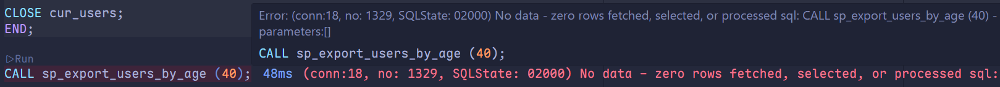

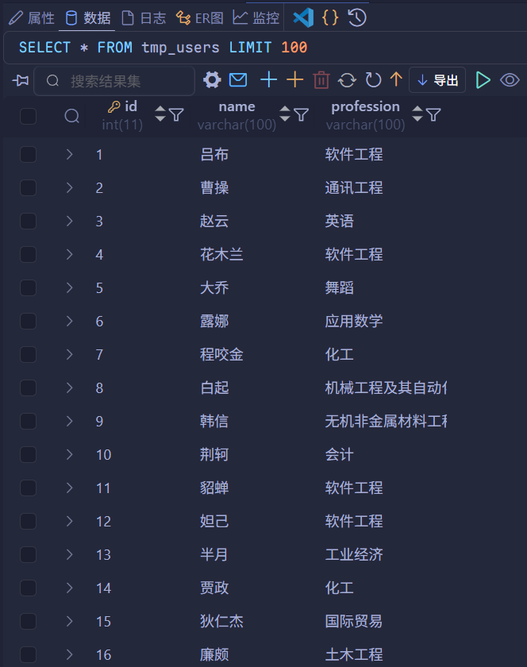

可见，该报错是由于未处理游标 `FETCH` 的退出条件导致的，但目标表中已成功插入符合条件的数据。

### 条件处理程序

<span style="color:#5C6F2B">条件处理程序（Handler）</span>用于定义流程控制结构执行期间，遇到异常时的对应处理逻辑。其标准语法如下：

```mariadb
DECLARE handler_action HANDLER FOR condition_value [, condition_value]... statement;
```

- `handler_action`（触发动作）：
  - `CONTINUE`：触发异常后，继续执行当前程序逻辑。
  - `EXIT`：触发异常后，立即终止执行当前程序逻辑。
- `condition_value`（触发条件）：
  - `SQLSTATE sqlstate_value`：指定具体的 SQLSTATE 状态码（如 02000）。
  - `SQLWARNING`：所以以 01 开头的 SQLSTATE 代码的简写形式。
  - `NOT FOUND`：所以以 02 开头的 SQLSTATE 代码的简写形式。
  - `SQLEXCEPTION`：所有未被 `SQLWARNING` 或 `NOT FOUND` 捕获的 SQLSTATE 代码的简写形式。

```mariadb
DROP PROCEDURE IF EXISTS sp_export_users_by_age;

CREATE PROCEDURE IF NOT EXISTS `sp_export_users_by_age`(IN p_max_age INT)
BEGIN
DECLARE v_name VARCHAR(100) CHARACTER SET utf8mb4;
DECLARE v_profession VARCHAR(100) CHARACTER SET utf8mb4;
DECLARE cur_users CURSOR FOR SELECT name, profession FROM user WHERE age <= p_max_age;
DECLARE EXIT HANDLER FOR NOT FOUND CLOSE cur_user;

DROP TABLE IF EXISTS tmp_users;

CREATE TABLE IF EXISTS `tmp_users` (
	id INT AUTO_INCREMENT PRIMARY KEY,
  name VARCHAR(100),
  profession VARCHAR(100)
) CHARACTER SET = utf8mb4;

OPEN cur_users;
WHILE TRUE DO
FETCH cur_users INTO v_name, v_profession;
INSERT INTO tmp_users VALUES (NULL, v_name, v_profession);
END WHILE;
END;
```

新增 `DECLARE EXIT HANDLER FOR SQLSTATE '02000' CLOSE cur_users` 条件处理程序声明后，此前游标触发的报错问题已解决。

此外，除了显式指定 `'02000'` 状态码外，也可直接使用 `NOT FOUND` 作为等效替代。

## 存储函数

存储函数是一类有返回值的特殊存储程序（区别于普通存储过程），且其参数仅支持 `IN` 类型。其标准语法如下：

```mariadb
CREATE FUNCTION 存储函数名称 ([参数列标])
RETURNS type [characteristic ...]
BEGIN
  -- 函数体 SQL 逻辑
  SQL 语句
  RETURN 返回值;
END;
```

**`characteristic`（函数特性）**：

- `DETERMINISTIC`：相同输入参数始终返回相同结果。
- `NO SQL`：函数体中不包含任何 SQL 语句。
- `READS SQL DATA`：函数体仅包含读取数据的 SQL 语句，不包含写入数据的操作。

定义存储函数，完成如下要求：

计算从 1 累加 n 的值，n 为传入的参数值。

```mariadb
CREATE FUNCTION `fn_sum_to_n`(n INT)
RETURNS INT DETERMINISTIC
BEGIN
DECLARE total INT DEFAULT 0;
WHILE n > 0 DO
SET total := total + n;
SET n := n - 1;
END WHILE;
RETURN total;
END;

SELECT fn_sum_to_n (77);
```

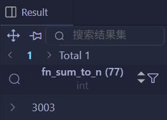

## 触发器

**触发器**是关联数据表的数据库对象，指在执行 `INSERT`/`UPDATE`/`DELETE` 操作之前或之后，自动触发并执行触发器中定义的 SQL 语句逻辑块。触发器的这一特性，可在数据库层面协助应用实现数据完整性保障、日志记录、数据校验等需求。

可通过 `OLD` 和 `NEW` 别名引用触发器中发生变更的记录数据，这一点与其他数据库的设计逻辑一致；当前触发器仅支持行级触发，不支持语句级触发。

|    触发器类型     |                       `NEW` 和 `OLD`                       |
| :---------------: | :--------------------------------------------------------: |
| `INSERT` 型触发器 |              `NEW` 表示将要或者已经新增的数据              |
| `UPDATE` 型触发器 | `OLD` 表示修改之前的数据，`NEW` 表示将要或已经修改后的数据 |
| `DELETE` 型触发器 |              `OLD` 表示将要或者已经删除的数据              |

> [!tip]
>
> - **行级触发器**：以「数据行」为单位触发——**每修改一行数据，触发器就执行一次**。
> - **语句级触发器**：以「SQL 语句」为单位触发——**无论一条 SQL 改多少行，触发器只执行一次**。

### 语法

**创建**：

```mariadb
CREATE TRIGGER trigger_name
BEFORE/AFTER INSERT/UPDATE/DELETE
ON tbl_name FOR EACH ROW -- 行级触发器
BEGIN
	trigger_stmt;
END;
```

**查看**：

```mariadb
SHOW TRIGGERS;
```

**删除**：

```mariadb
-- 若无指定 schema_name，默认为当前数据库
DROP TRIGGER [schema_name.]trigger_name;
```

定义触发器，完成如下需求：

通过触发器记录 `user` 表的全量数据变更记录，将新增（`INSERT`）、修改（`UPDATE`）、删除（`DELETE`）操作的变更日志插入到日志表 `user_log` 中。

```mariadb
CREATE TABLE `user_log` (
    id INT(11) NOT NULL AUTO_INCREMENT,
    operation VARCHAR(20) NOT NULL COMMENT '操作类型',
    operation_time DATETIME NOT NULL COMMENT '操作时间',
    operation_id INT(11) NOT NULL COMMENT '操作 ID',
    operation_params VARCHAR(500) COMMENT '操作参数',
    PRIMARY KEY (`id`)
) ENGINE = InnoDB DEFAULT CHARSET = utf8mb4;
```

**插入**：

```mariadb
DROP TRIGGER IF EXISTS trg_user_after_insert;

CREATE IF NOT EXISTS `trg_user_after_insert`
AFTER INSERT ON user FOR EACH ROW
BEGIN
INSERT INTO
	user_log (
  	id,
    operation,
    operation_time,
    operation_id,
    operation_params
  )
VALUES (
		NULL,
  	'INSERT',
  	NOW(),
  	NEW.id,
  	CONCAT (
    	'插入的数据内容为：id = ',
      NEW.id,
      ', name = ',
      NEW.name,
      ', phone = ',
      NEW.phone,
      ', email = ',
      NEW.email,
      ', profession = ',
      NEW.profession
    )
	);
END;
```

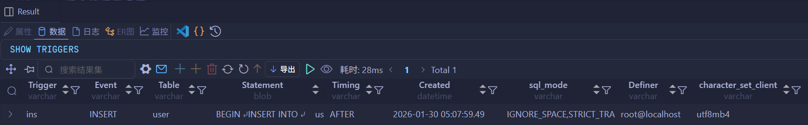

```mariadb
INSERT INTO
    user (
        id,
        name,
        phone,
        email,
        profession,
        age,
        gender,
        status,
        createtime
    )
VALUES (
        25,
        '织田信长',
        '18809091212',
        'odanobunaga@163.com',
        '软件工程',
        23,
        '1',
        '1',
        NOW()
    );

SELECT * FROM user_log;
```


**修改**：

```mariadb
DROP TRIGGER IF EXISTS trg_user_after_update;

CREATE TRIGGER IF NOT EXISTS `trg_user_after_update`
AFTER UPDATE ON user FOR EACH ROW
BEGIN
INSERT INTO
    user_log (
        id,
        operation,
        operation_time,
        operation_id,
        operation_params
    )
VALUES (
        NULL,
        'UPDATE',
        NOW(),
        NEW.id,
        CONCAT(
            '更新之前的数据内容为：id = ',
            OLD.id,
            ', name = ',
            OLD.name,
            ', phone = ',
            OLD.phone,
            ', email = ',
            OLD.email,
            ', profession = ',
            OLD.profession,
            '更新之后的数据内容为：id = ',
            NEW.id,
            ', name = ',
            NEW.name,
            ', phone = ',
            NEW.phone,
            ', email = ',
            NEW.email,
            ', profession = ',
            NEW.profession
        )
    );
END;
```


```mariadb
UPDATE user SET age = 32 WHERE id = 23;

SELECT * FROM user_log;
```

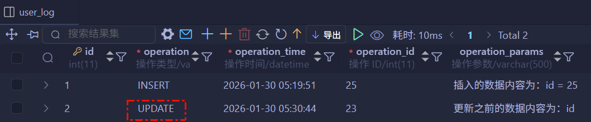

```mariadb
UPDATE user SET profession = '会计' WHERE id <= 3;

SELECT * FROM user_log;
```

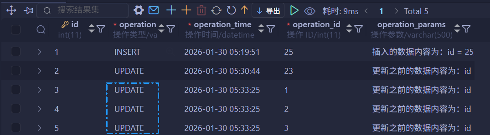

由于采用行级触发器，因此像 `id <= 3` 这类范围更新操作，会生成与被修改行数一致的日志记录。

**删除**：

```mariadb
DROP TRIGGER IF EXISTS trg_user_after_delete;

CREATE TRIGGER IF NOT EXISTS `trg_user_after_delete`
AFTER DELETE ON user FOR EACH ROW
BEGIN
INSERT INTO
    user_log (
        id,
        operation,
        operation_time,
        operation_id,
        operation_params
    )
VALUES (
        NULL,
        'DELETE',
        NOW(),
        OLD.id,
        CONCAT(
            '删除的数据内容为：id = ',
            OLD.id,
            ', name = ',
            OLD.name,
            ', phone = ',
            OLD.phone,
            ', email = ',
            OLD.email,
            ', profession = ',
            OLD.profession
        )
    );
END;
```

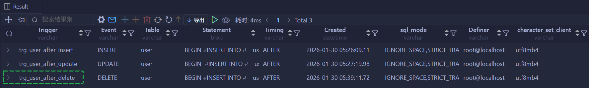

```mariadb
DELETE FROM user WHERE id = 25;

SELECT * FROM user_log;
```

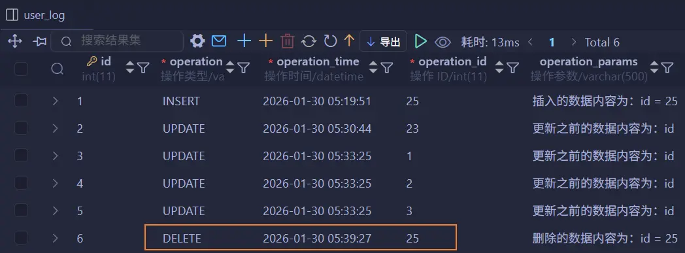

---

**知识回顾**：

1. **视图（`VIEW`）**：
   - 虚拟存在的表，不保存查询结果，只保存查询的 SQL 逻辑。
   - 简单、安全、数据独立。

2. **存储过程（`PROCEDURE`）**：
   - 事先定义并存储在数据库中的一段 SQL 语句的集合。
   - 减少网络交互，提高性能、封装重用。
   - 变量、`IF`、`CASE`、参数（`IN`/`OUT`/`INOUT`）、`WHILE`、`REPEAT`、`LOOP`、`CURSOR`、`HANDLER`。

3. **存储函数（`FUNCTION`）**：
   - 存储函数是有返回值的存储过程，参数类型只能为 `IN` 类型。
   - 存储函数可以被存储过程替代。

4. **触发器（`TRIGGER`）**：
   - 可以在表数据进行 `INSERT`、`UPDATE`、`DELETE` 之前或之后触发。
   - 保证数据完整性、日志记录、数据校验。
