# 锁

## 概述

锁是协调多进程或线程并发访问共享资源的计算机核心机制。在数据库中，除 CPU、RAM、I/O 等传统计算资源的争用外，数据也是多用户共享的核心资源。如何保障数据并发访问的一致性和有效性，是所有数据库必须解决的关键问题；而锁冲突则是影响数据库并发性能的重要因素。从这一角度来看，锁对于数据库而言不仅至关重要，且机制更为复杂。

MySQL 中的锁按锁定粒度可分为以下三类：

1. **全局锁**：锁定数据库内所有数据表。
2. **表级锁**：操作时锁定整张数据表。
3. **行级锁**：操作时仅锁定对应的行数据。

## 全局锁

<span style="color:#85409D">全局锁</span>是对整个数据库实例施加的锁，加锁后实例进入只读状态，后续的 DML 写操作语句、DDL 语句，以及事务提交语句都会被阻塞。

其典型应用场景是全库逻辑备份：通过锁定所有数据表获取一致性视图，保障备份数据的完整性。


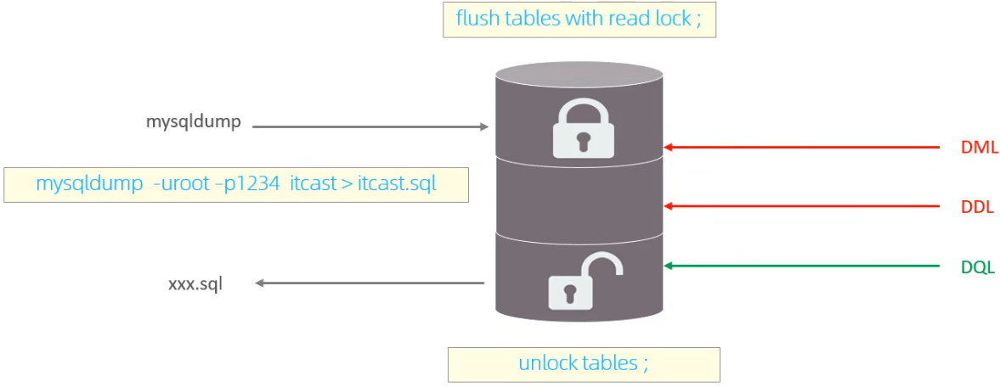

在终端中开启三个独立的 MariaDB 会话，按以下步骤操作：

1. **加全局读锁**

   ```mariadb
   FLUSH TABLES WITH READ LOCK;
   ```

   

   执行后，整个数据库实例进入**只读状态**：所有其他会话仅能执行 `SELECT` 等读操作，`INSERT/UPDATE/DELETE` 等写操作会被阻塞。

2. **验证只读效果**

   在第二个会话中验证该特性：执行 `SELECT` 读取数据可正常返回结果，但执行 `UPDATE` 等写操作时会被阻塞（终端光标持续闪烁，无响应）。

   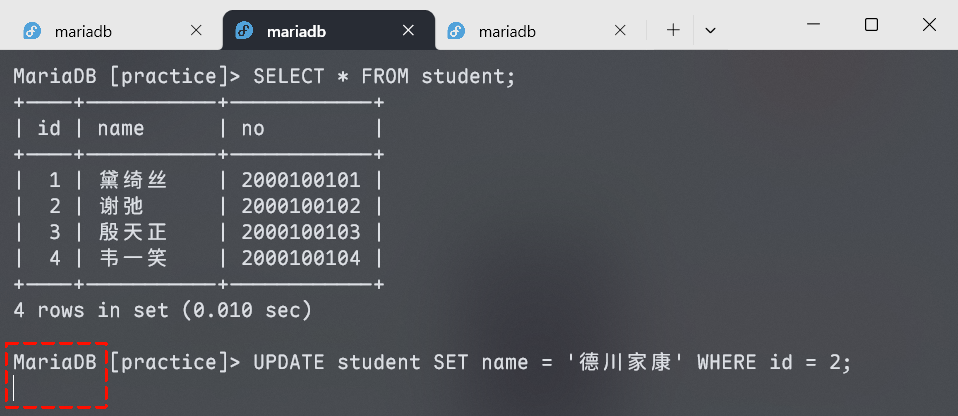

3. **执行全库备份**

   在第三个终端会话中执行逻辑备份命令：

   ```sh
   mysqldump -u root -p practice > practice_backup.sql
   ```

   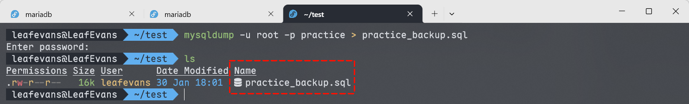

   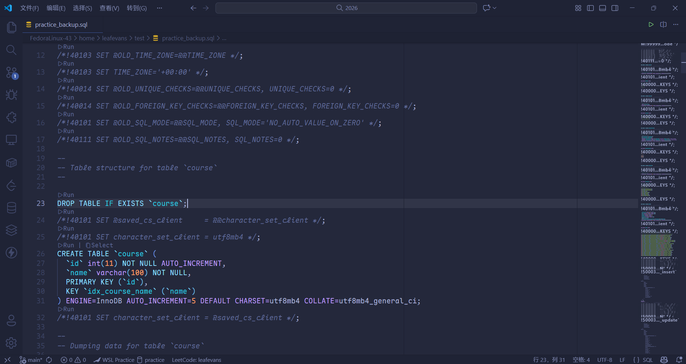

4. **释放全局读锁**

   备份完成后，在第一个会话中执行解锁命令，释放全局读锁。此时被阻塞的写操作会立即恢复执行，并完成数据变更。

   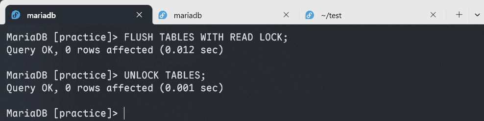

**特点**：

数据库加全局锁属于重量级操作，主要存在以下问题：

1. 若在主库执行备份，备份期间无法处理任何更新操作，会导致业务几乎停摆。
2. 若在从库执行备份，备份期间从库无法应用主库同步的二进制日志（binlog），进而引发主从延迟。

针对 InnoDB 引擎，可在备份时添加 `--single-transaction` 参数，实现无锁的一致性数据备份。

```sh
mysqldump --single-transaction -u root -p practice > practice_backup.sql
```

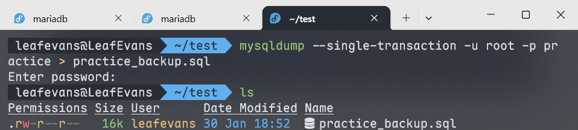

## 表级锁

<span style="color:#4D2B8C; font-weight:bold">表级锁</span>：操作时锁定整张数据表，锁定粒度大，锁冲突概率最高，并发度低，适用于 MyISAM、InnoDB、BDB 等存储引擎。

表级锁主要分为三类：

1. 表锁
2. 元数据锁（meta data lock, MDL）
3. 意向锁

### 表锁

**表锁分为两类**：

1. 表共享读锁（read lock）
2. 表独占写锁（write lock）

**语法**：

1. **加锁**

   ```mariadb
   LOCK TABLES 表名... READ/WRITE;
   ```

2. **释放锁**

   ```mariadb
   UNLOCK TABLES;
   ```

   客户端断开连接时也会自动释放锁。

**读锁**：

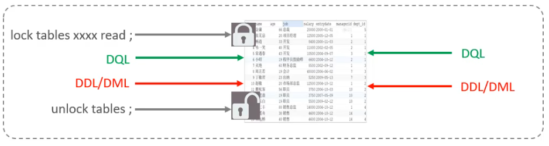

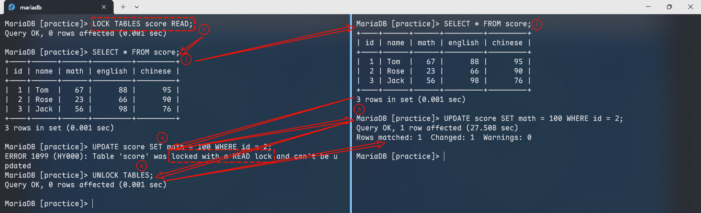

开启两个终端进行测试：

1. 终端 1 对 `score` 表加锁，执行查询操作，可正常读取数据；终端 2 执行相同查询，同样可以正常读取，体现读锁的共享性。
2. 终端 1 尝试执行更新操作，直接报错；终端 2 尝试更新则进入阻塞状态（光标闪烁），说明读锁会阻塞所有写操作。
3. 终端 1 释放读锁后，终端 2 的更新操作立即执行完成。

该现象完全符合表共享读锁的定义。

**写锁**：

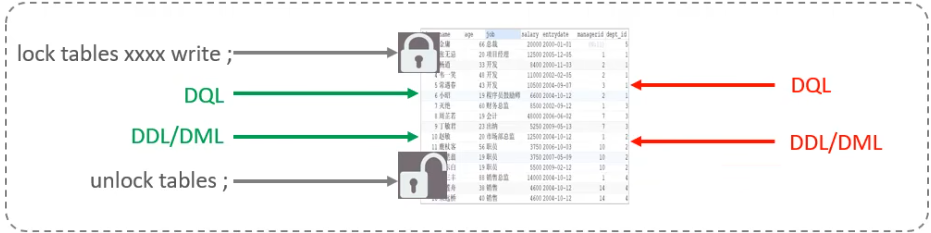

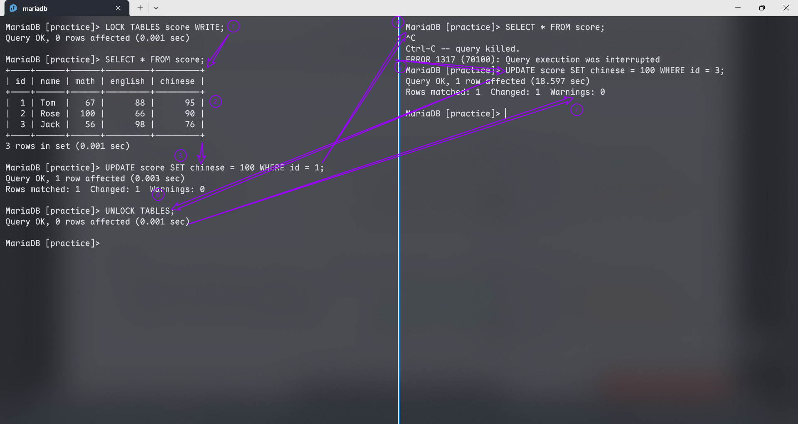

开启两个终端进行测试：

1. 终端 1 对 `score` 表加锁，执行查询与更新操作，均能正常完成，说明持有写锁的会话拥有完整的读写权限。
2. 终端 2 尝试执行任何读写操作（如查询、更新），均进入阻塞状态，体现写锁的排他性。
3. 终端 1 释放写锁后，终端 2 的阻塞操作立即执行完成。

该现象完全符合表独占写锁的预期。

> [!important]
>
> - **读锁（共享锁）**：具有读操作共享性，不会阻塞其他会话的读请求，但会阻塞所有会话的写请求。
> - **写锁（排他锁）**：具有完全排他性，会同时阻塞其他会话的读请求和写请求。

### 元数据锁

**元数据锁（meta data lock, MDL）**：由系统自动完成加锁与释放，无需显式调用，在会话访问表时会自动触发。它的核心作用是维护表元数据的一致性，具体表现为：当表上存在活动事务时，会阻止对该表元数据的写入操作，<span style="color:#D73535">以此避免数据操作（DML）与元数据操作（DDL）的并发冲突，最终保障表数据读写的一致性与正确性</span>。

> [!note]
>
> **元数据**：描述数据的数据，在 MySQL 中特指**数据表的结构与属性信息**，而非表内的业务记录。
>
> - 核心内容：字段定义、索引信息、存储引擎、字符集、约束规则等。
> - 与 MDL 的关联：MDL 锁保护元数据的一致性，防止 DML 与 DDL 操作并发冲突。

**MDL 自 MySQL 5.5 起引入**：对表执行增删改查（DML）操作时，自动加 MDL 共享读锁；执行表结构变更（DDL）操作时，自动加 MDL 排他写锁。

|                       对应 SQL                        |                  锁类型                   |                            说明                            |
| :---------------------------------------------------: | :---------------------------------------: | :--------------------------------------------------------: |
|             `LOCK TABLES xxx READ/WRITE`              | `SHARED_READ_ONLY`/`SHARED_NO_READ_WRITE` |                                                            |
|       `SELECT`、`SELECT ... LOCK IN SHARE MODE`       |               `SHARED_READ`               | 与 `SHARED_READ`、`SHARED_WRITE` 兼容，与 `EXCLUSIVE` 互斥 |
| `INSERT`、`UPDATE`、`DELETE`、`SELECT ... FOR UPDATE` |              `SHARED_WRITE`               | 与 `SHARED_READ`、`SHARED_WRITE` 兼容，与 `EXCLUSIVE` 互斥 |
|                   `ALTER TABLE ...`                   |                `EXCLUSIVE`                |                    与其他的 MDL 都互斥                     |

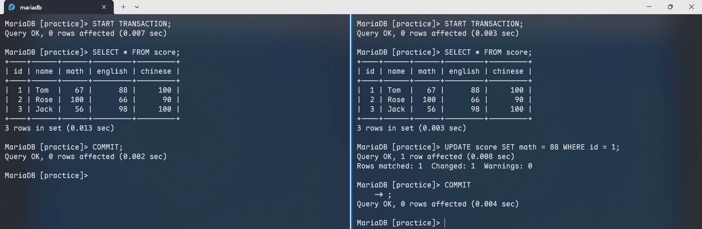

可见，系统会为读写操作**隐式添加** `SHARED_READ` 和 `SHARED_WRITE` 类型的元数据锁，从而保障并发读写操作无冲突、正确执行。

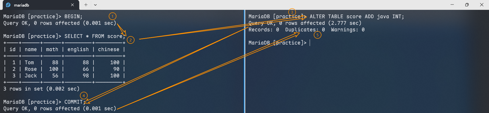

开启两个测试会话：

1. 会话 1 开启事务并执行查询，会持有 `SHARED_READ` 类型的 MDL 锁。
2. 会话 2 执行表结构修改（DDL）操作，该操作需要申请 `EXCLUSIVE` 类型的 MDL 锁，因与会话 1 的共享锁互斥而进入阻塞状态。
3. 会话 1 提交事务、释放共享锁后，会话 2 的 DDL 操作才会执行完成。

**查看元数据锁**：

```mariadb
SELECT object_type, object_schema, object_name, lock_type, lock_duration FROM performance_schema.metadata_locks;
```

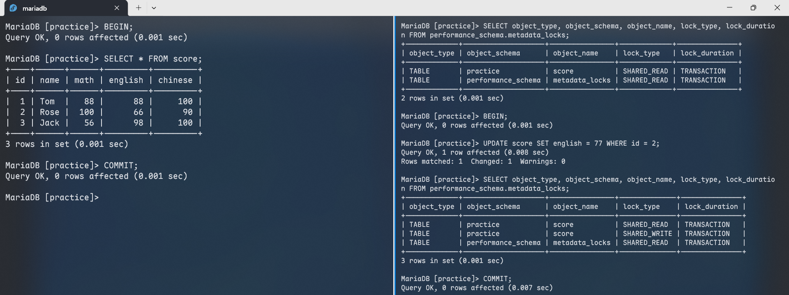

> [!note]
>
> `performance_schema.metadata_locks` 表查询为空，核心原因是 `performance_schema` 全局开关默认关闭。由于该变量具有只读属性，无法通过 SQL 命令动态修改，必须在配置文件（如 `mariadb-server.cnf`）的 `[mysqld]` 标签下手动添加 `performance_schema = ON` 并重启数据库服务。
>
> 服务重启后，系统默认仍不会采集 MDL 信息，还需执行以下语句激活监控仪器：
>
> ```mariadb
> UPDATE performance_schema.setup_instruments SET ENABLED = 'YES' WHERE NAME = 'wait/lock/metadata/sql/mdl';
> ```
>
> 配置完成后，即可实时观测到未提交事务持有的元数据共享锁或排他锁。
>
> ---
>
> `performance_schema` 是 MySQL/MariaDB 自带的**性能监控专用数据库**，专注于收集数据库运行时的动态性能数据，是定位性能瓶颈、锁冲突、慢查询的核心工具。

### 意向锁

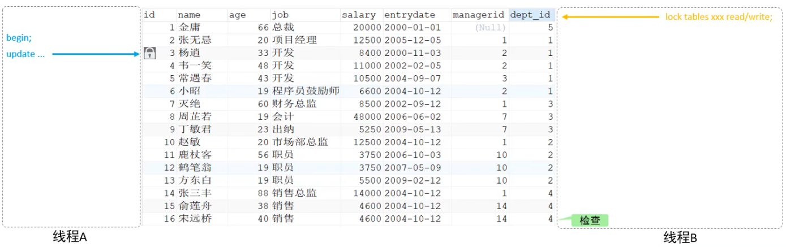

在 InnoDB 中，意向锁的引入是为了解决行锁与表锁的冲突问题：它让表锁无需逐行检查数据行的锁状态，仅通过意向锁的标记即可快速判断是否存在冲突，从而大幅降低表锁的检查开销。

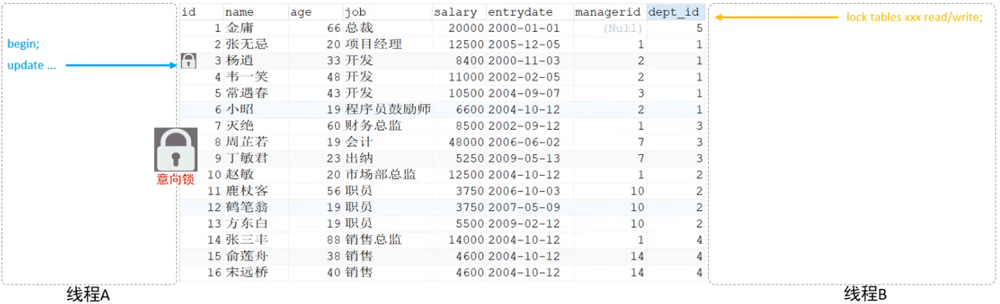

1. **意向共享锁（IS, Intent Shared Lock）**：由 `SELECT ... LOCK IN SHARE MODE` 语句触发条件；与表共享读锁（READ）兼容，与表独占写锁（WRITE）排斥。
2. **意向排他锁（IX, Intent Exclusive Lock）**：由 `INSERT`、`UPDATE`、`DELETE`、`SELECT ... FOR UPDATE` 等语句触发添加；与表共享读锁（READ）、表独占写锁（WRITE）均互斥；**意向锁之间互不排斥**。

可以通过以下 SQL 语句，查看意向锁及行锁的加锁情况：

```mariadb
SELECT object_schema, object_name, index_name, lock_type, lock_mode, lock_data FROM performance_schema.data_locks;
```

> [!note]
>
> 在 MariaDB 中，需通过 `SELECT * FROM information_schema.INNODB_LOCKS` 查看 InnoDB 事务锁信息（包括行锁、意向锁、间隙锁等），该语句是 MySQL 8.0+ 中 `performance_schema.data_locks` 的 InnoDB 等效替代方案。


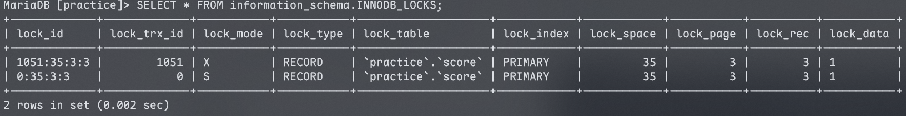

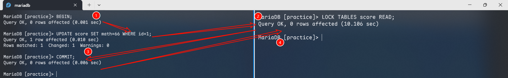

1. 会话 1 开启事务并执行更新操作，系统会自动为目标数据行添加行级排他锁，同时为整张表添加**意向排他锁（IX）**。
2. 会话 2 尝试为该表添加表共享读锁（READ），因与 IX 锁互斥而进入阻塞状态。
3. 会话 1 提交事务、释放行锁与意向锁后，会话 2 的表锁操作才会执行完成。

## 行级锁

**行级锁（Row-Level Lock）**：仅锁定操作涉及的数据行，是粒度最小的数据库锁。因其锁定范围精准，锁冲突概率最低，并发处理能力最强，该锁机制由 InnoDB 存储引擎实现。

InnoDB 采用索引组织表（IOT）结构，其行级锁是通过对索引项加锁来实现的，而非直接锁定数据本身。行级锁主要分为以下三类：

1. **行锁（Record Lock）**：锁定单个索引记录的锁，核心作用是阻止其他事务对该行执行 `UPDATE`、`DELETE` 等写操作。在 **RC** 和 **RR** 隔离级别下均支持。

   

2. **间隙锁（Gap Lock）**：锁定索引记录之间的间隙（不包含记录本身），核心作用是阻止其他事务在该间隙中插入新数据，从而避免幻读问题。仅在 **RR** 隔离级别下支持。

   

3. **临键锁（Next-Key Lock）**：行锁与间隙锁的组合锁，会同时锁住目标索引记录及其前方的间隙，是 InnoDB 在可重复读隔离级别下默认的行锁算法，用于彻底解决幻读问题。仅在 **RR** 隔离级别下支持。

   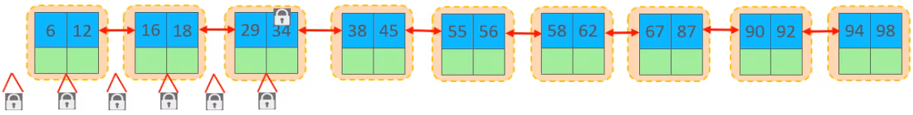

### 行锁

InnoDB 实现了以下两种核心行锁类型：

1. **共享锁（S, Shared Lock）**：允许持有锁的事务读取目标数据行，同时阻止其他事务获取同一数据集的排他锁（X）。
2. **排他锁（X, Exclusive Lock）**：允许持有锁的事务更新目标数据行，同时阻止其他事务获取同一数据集的共享锁（S）与排他锁（X）。

| 当前锁类型 \ 请求锁类型 | S（共享锁） | X（排他锁） |
| :---------------------: | :---------: | :---------: |
|     **S（共享锁）**     |    兼容     |    冲突     |
|     **X（排他锁）**     |    冲突     |    冲突     |

|               SQL               |                   行锁类型                    |                      说明                       |
| :-----------------------------: | :-------------------------------------------: | :---------------------------------------------: |
|          `INSERT ...`           |                    排他锁                     |                    自动加锁                     |
|          `UPDATE ...`           |                    排他锁                     |                    自动加锁                     |
|          `DELETE ...`           |                    排他锁                     |                    自动加锁                     |
|        `SELECT`（正常）         | <span style="color:#D73535">不加任何锁</span> |                                                 |
| `SELECT ... LOCK IN SHARE MODE` |                    共享锁                     | 需要手动在 `SELECT` 之后加 `LOCK IN SHARE MODE` |
|     `SELECT ... FOR UPDATE`     |                    排他锁                     |     需要手动在 `SELECT` 之后加 `FOR UPDATE`     |

默认情况下，InnoDB 运行在**可重复读（REPEATABLE READ, RR）**事务隔离级别，在执行索引扫描与数据检索时，会采用**临键锁（Next-Key Lock）**机制，以此规避幻读问题。

1. 当基于唯一索引执行等值检索，且匹配到已存在的记录时，临键锁会自动优化为**行锁（Record Lock）**。
2. InnoDB 行锁的锁定对象是索引项；若检索数据未使用索引条件，InnoDB 会对表中所有记录加锁，此时行锁将升级为<span style="color:#E9762B; font-weight:bold">表级锁</span>。

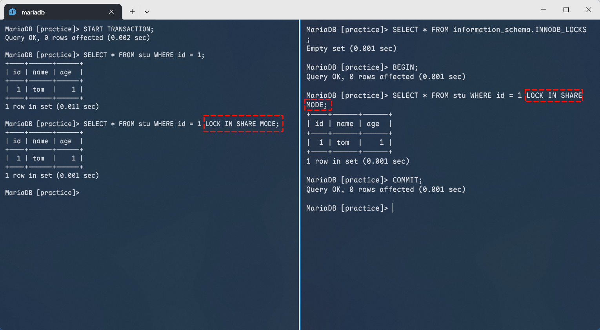

**验证了共享锁（S 锁）的兼容性**，多个事务可以同时持有同一行的共享锁，支持并行执行查询操作。

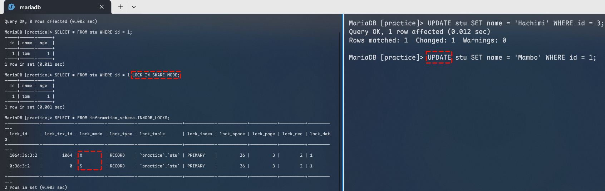

**验证了共享锁与排他锁的互斥性**，当某行已被持有共享锁时，其他事务对该行发起的更新等写操作（需要获取排他锁 X）会被阻塞，无法执行。

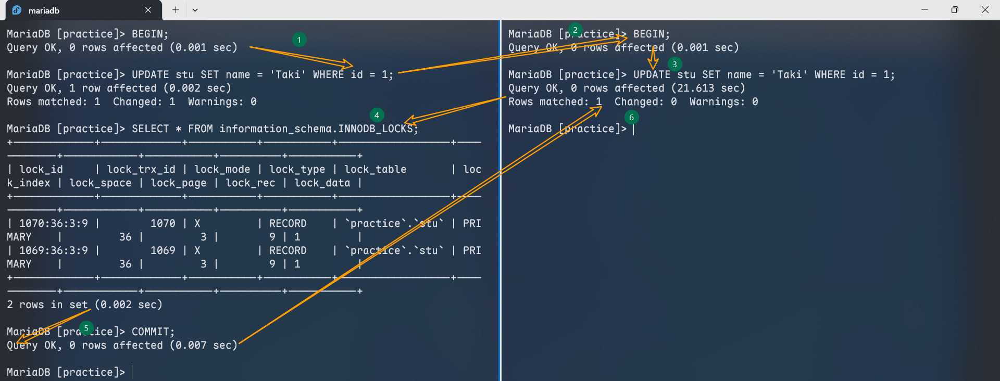

**验证了排他锁（X 锁）的强互斥性**，当某行被一个事务持有排他锁时，其他事务对该行的任何写操作（同样需要排他锁）都会被阻塞，直到锁被释放。

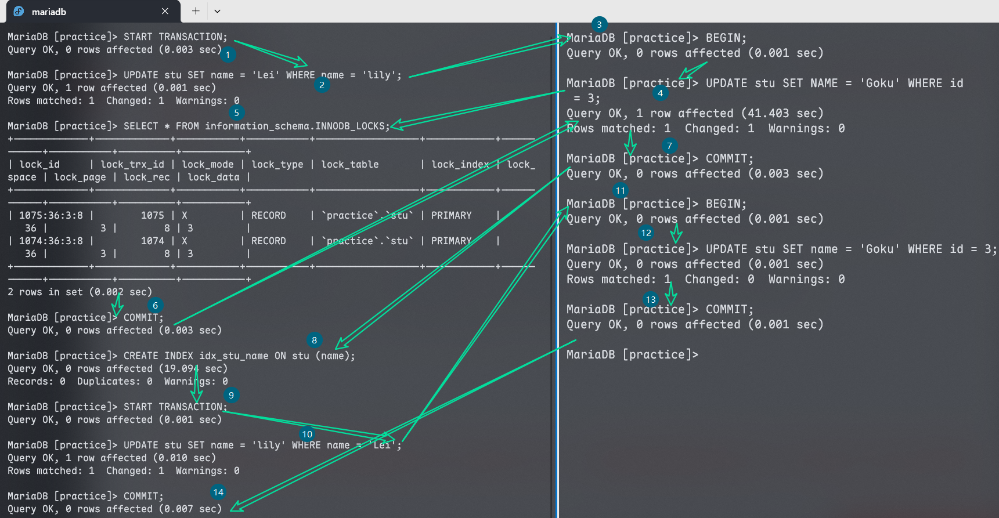

InnoDB 的行锁依赖索引实现，当查询条件未使用索引时：

1. 由于无法通过索引精准定位目标行，会触发**全表扫描**。
2. InnoDB 会对表中**每一行都加行锁**，这种“全表行锁”的效果等价于表级锁。
3. 最终会阻塞其他事务对表中任何行的读写操作，这一现象称为「行锁的表级锁等效升级」。

### 间隙锁/临键锁

默认情况下，InnoDB 运行于**可重复读（REPEATABLE READ, RR）事务隔离级别**，会在索引扫描与数据检索时采用**临键锁（Next-Key Lock）**机制，以此规避幻读问题。

1. 唯一索引等值查询不存在的记录 → 临键锁优化为**间隙锁**
2. 普通索引等值查询遍历至首个不满足值 → 临键锁退化为**间隙锁**
3. 唯一索引范围查询 → 访问至首个不满足值为止

> [!important]
>
> 间隙锁的唯一作用是阻止其他事务在锁定的间隙中插入新数据。此外，间隙锁之间互相兼容，多个事务可以在同一间隙上同时持有间隙锁，彼此不会产生阻塞。

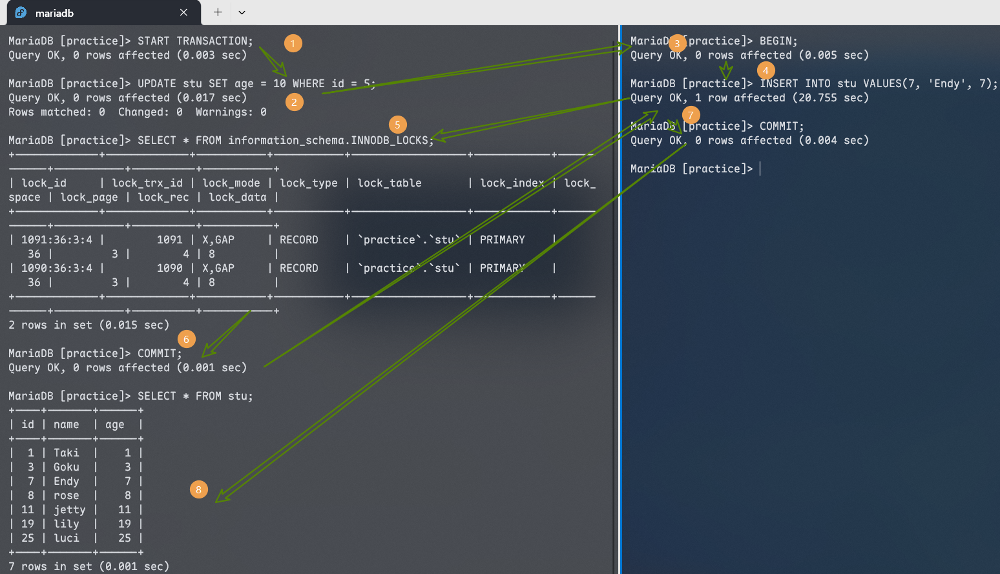

1. 第一个会话对不存在的 `id=5`（处于 `id=3` 到 `id=8` 的间隙内）执行更新操作，InnoDB 会为该间隙添加**排他间隙锁（X, GAP）**。
2. 第二个会话执行插入操作时，因插入意向锁与现有间隙锁互斥而被阻塞；但间隙锁本身互相兼容，因此两个事务可同时持有该间隙的间隙锁。
3. 当第一个会话提交事务、释放锁后，插入操作即可执行完成，此时仅剩余第二个会话的锁。

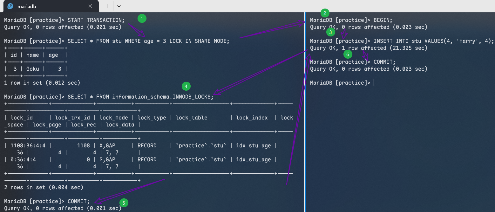

第一个会话通过普通索引执行等值查询并添加共享锁（S 锁）时，InnoDB 会向右遍历至第一个不满足条件的值，此时临键锁退化为**共享间隙锁（S, GAP）**。

第二个会话的插入操作需要获取插入意向锁，而插入意向锁与间隙锁互斥，因此被阻塞——其核心原因就是插入数据的位置恰好落在这个被锁定的间隙内。

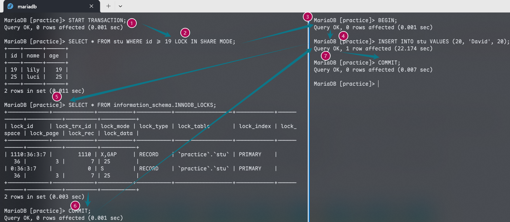

事务 1 基于唯一索引 `id` 执行范围查询，锁定行 `19`、`25` 及间隙 `(19, 25)`、`(25, +∞)`，导致事务 2 的插入操作被阻塞。

---

**知识回顾**：

1. **概述**：
   - 在并发访问时，解决数据访问的一致性、有效性问题。
   - 全局锁、表级锁、行级锁。
2. **全局锁**：
   - 对整个数据库实例加锁，加锁后整个实例就处于只读状态。
   - 性能较差，数据逻辑备份时使用。
3. **表级锁**：
   - 操作锁住整张表，锁定粒度大，发生锁冲突的概率高。
   - 表锁、元数据锁、意向锁。
4. **行级锁**：
   - 操作锁住对应的行数据，锁定粒度最小，发生锁冲突的概率最低。
   - 行锁、间隙锁、临键锁。
