# InnoDB 引擎

## 逻辑存储结构


- **表空间（`ibd` 文件）**：一个 MySQL 实例可对应多个表空间，用于存储记录、索引等核心数据。
- **段**：分为数据段、索引段、回滚段。InnoDB 为索引组织表，数据段对应 B+ 树的叶子节点，索引段对应 B+ 树的非叶子节点；段的作用是管理多个**区（Extent）**。
- **区**：表空间的单元结构，大小固定为 1M。默认 InnoDB 页大小为 16K，因此一个区包含 64 个连续的页。
- **页**：InnoDB 磁盘管理的最小单元，默认大小为 16KB。为保证页的连续性，InnoDB 每次从磁盘申请 4-5 个连续的区。
- **行**：InnoDB 数据的存储单位，包含两个关键隐藏列：
  - `Trx_id`：记录每次被改动时，对应的事务 ID。
  - `Roll_pointer`：记录每次被改动时，旧版本数据写入 undo 日志的指针，可通过它追溯记录修改前的信息。

## 架构

MySQL 5.5+ 默认采用 InnoDB 引擎（支持事务、崩溃恢复，应用广泛）。下图为 InnoDB 架构：左为内存结构，右为磁盘结构。

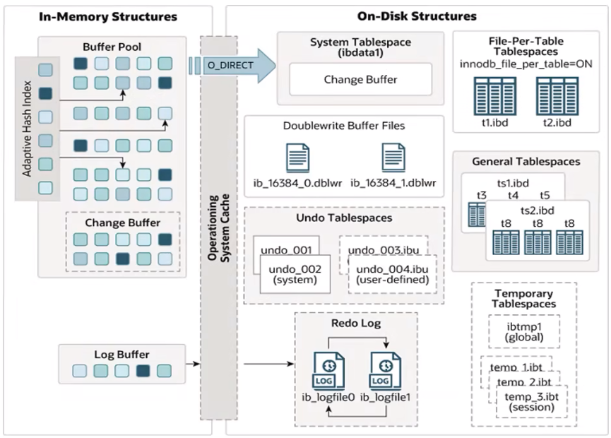

### 内存结构

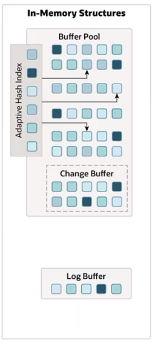

- **Buffer Pool（缓冲池）**：是 InnoDB 在主内存中开辟的缓存区域，用于缓存磁盘上频繁访问的数据页。执行增删改查操作时，会优先操作缓冲池中的数据；若缓冲池无对应数据，则从磁盘加载并缓存。缓冲池中的数据会以一定频率刷新到磁盘，从而减少磁盘 I/O 次数，大幅提升处理速度。

  缓冲池以页（Page）为基本单位，底层通过链表结构管理所有页，并根据页的状态将其分为三类：
  - **空闲页（free page）**：未被分配使用的页。
  - **干净页（clean page）**：已加载数据但未被修改的页，内存与磁盘数据完全一致。
  - **脏页（dirty page）**：已加载且被修改的页，内存与磁盘数据存在不一致，需后续刷新到磁盘以完成持久化。

- **Change Buffer（更改缓冲区）**：仅作用于非唯一二级索引页。在执行 DML 操作时，若目标索引页不在 Buffer Pool 中，不会直接写入磁盘，而是将变更记录缓存到 Change Buffer。当后续读取该数据时，再将变更合并到 Buffer Pool 的对应页中，最终随脏页刷新到磁盘，以此减少磁盘 IO。

  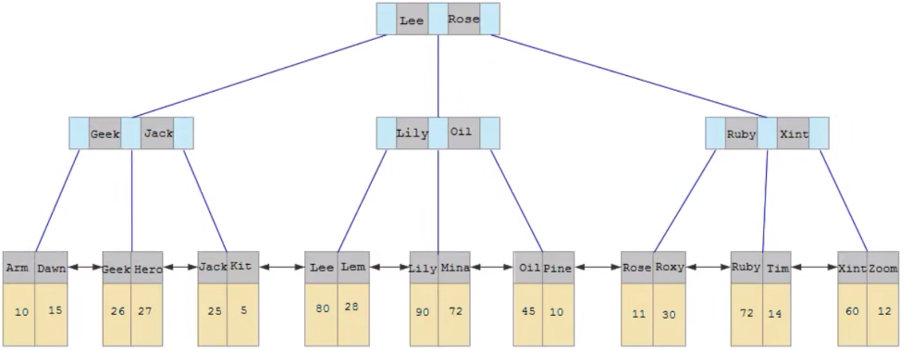

  与聚集索引不同，二级索引通常为非唯一，且插入顺序相对随机；删除或更新操作也可能影响索引树中离散的二级索引页。若每次变更都直接写入磁盘，会产生大量随机磁盘 IO。借助 Change Buffer，这些变更可先在缓冲池中合并处理，再批量刷盘，从而大幅减少磁盘 IO 次数。

  > [!note]
  >
  > 对唯一二级索引执行 DML 操作时，因需校验唯一性约束，InnoDB 会将目标索引页加载至 Buffer Pool，变更可直接在内存页完成，无需借助 Change Buffer。

- **Adaptive Hash Index（自适应哈希索引）**：用于优化 Buffer Pool 中数据的查询性能。InnoDB 会自动监控表上各索引页的查询，当发现哈希索引可提升查询速度时，<span style="color:#F96E5B">会自动创建该索引，全程无需人工干预</span>。

  **相关配置参数**：`adaptive_hash_index`。

  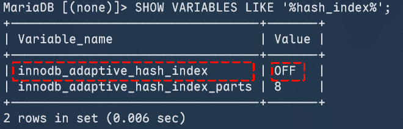

- **Log Buffer（日志缓冲区）**：用于缓存待刷盘的 redo log 与 undo log 数据，默认大小为 16MB。日志会定期刷新到磁盘，在大事务场景下，调大缓冲区大小可有效减少磁盘 IO 开销。

  **核心配置参数**：
  - `innodb_log_buffer_size`：设置日志缓冲区的大小。
  - `innodb_flush_log_at_trx_commit`：控制日志刷新到磁盘的时机。
    - 1：事务提交时，日志立即写入并刷新到磁盘。
    - 0：事务提交不触发操作，日志每秒批量写入并刷新到磁盘。
    - 2：事务提交时日志写入内存日志文件，每秒批量刷新到磁盘。

  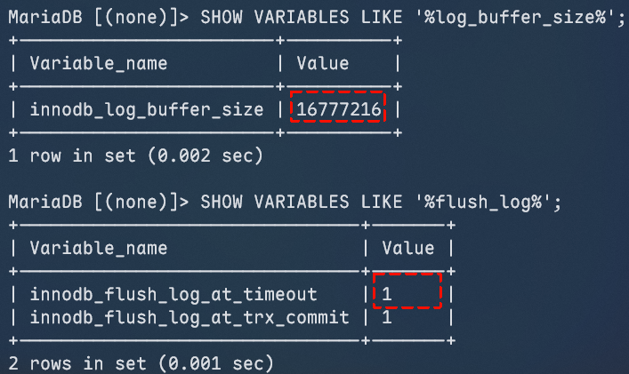

### 磁盘结构

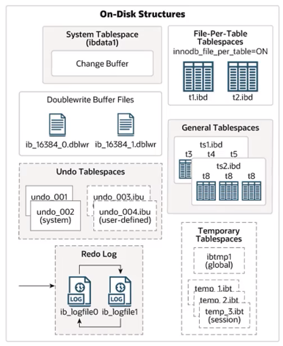

- **System Tablespace（系统表空间）**：存放变更缓冲区的存储区域；若表未创建于独立表文件或通用表空间，该表的表数据与索引也会存储于此。（MySQL 5.x 版本中，系统表空间还包含 InnoDB 数据字典、undo log 等内容）

  **关联参数**：`innodb_data_file_path`。

  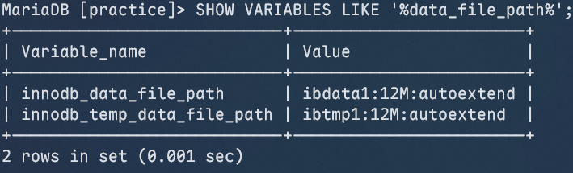

  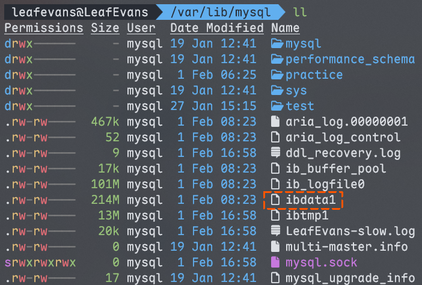

- **File-Per-Table Tablespace（一表一文件表空间）**：在该模式下，每个 InnoDB 表的数据和索引会被单独存储在一个独立的 `.ibd` 数据文件中，文件直接存在于文件系统中，实现单表数据的隔离。

  **关联参数**：`innodb_file_per_table`。

  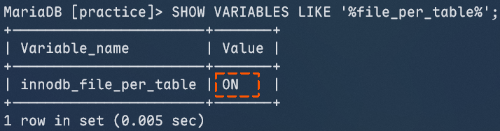

  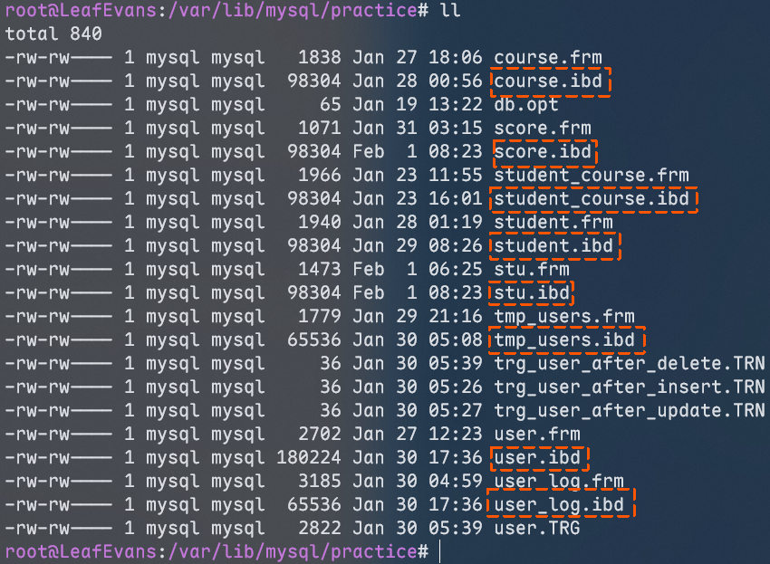

  > [!note]
  >
  > 在 MariaDB 中，表的元数据（包括表结构、字段定义等）存储在 `.frm` 格式文件中；而 `.ibd` 文件作为独立表空间文件，仅用于存储对应表的数据与索引。

- **General Tablespaces（通用表空间）**：需通过 `CREATE TABLESPACE` 语法手动创建，支持在 `CREATE TABLE` 或 `ALTER TABLE` 时显式指定表所属的表空间，可实现多表共享同一物理文件的存储模式。

  ```mariadb
  CREATE TABLESPACE xxx
  ADD DATAFILE 'file_name'
  ENGINE=engine_name;

  CREATE TABLE xxx... TABLESPACE ts_name;
  ```

- **Undo Tablespaces（撤销表空间）**：MySQL 实例初始化会自动生成两个默认的撤销表空间（初始大小为 16MB），用于存储支撑事务回滚的 undo log 日志。

  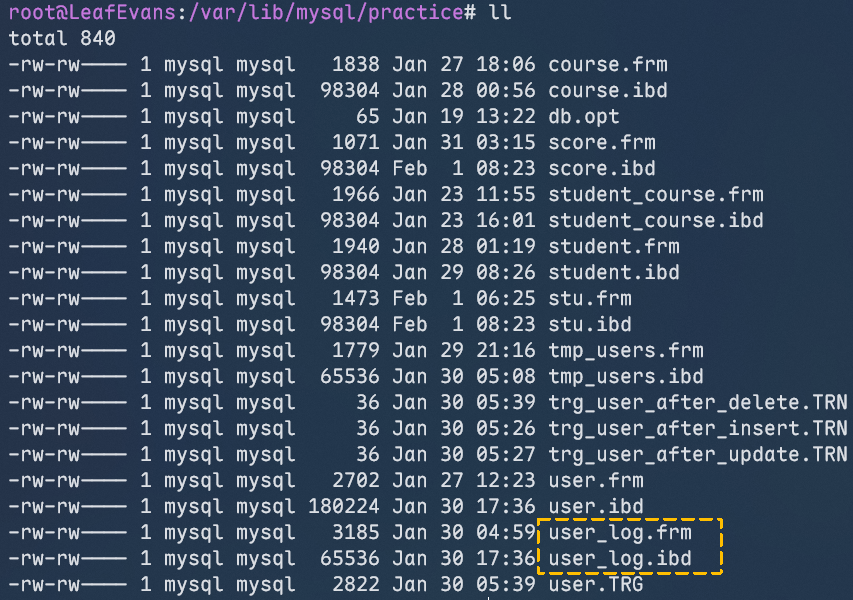

  > [!note]
  >
  > MariaDB 采用单一 Undo 表空间设计（`undo.ibd`），通过内部回滚段管理并发；相比之下，MySQL 8.0 默认生成两个独立表空间（`undo_001`/`undo_002`），以便在文件间切换执行动态清理。

- **Temporary Tablespaces（临时表空间）**：InnoDB 包含会话临时表空间和全局临时表空间两类，用于存储用户创建的临时表及其他临时数据。

- **Doublewrite Buffer Files（双写缓冲区文件）**：InnoDB 引擎在将 Buffer Pool 中的数据页刷新到磁盘前，会先将数据页写入双写缓冲区文件，用于在系统异常时实现数据恢复。

  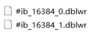

- **Redo Log（重做日志）**：InnoDB 保障事务持久性的核心机制，分为内存中的重做日志缓冲（redo log buffer）和磁盘上的重做日志文件（redo log）。事务提交时，所有修改信息会被写入该日志，用于在脏页刷盘异常时进行数据恢复。

  重做日志采用双文件循环写入机制：

  

### 后台线程

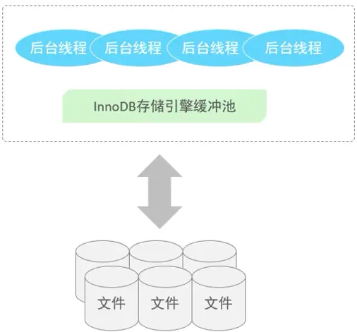

1. **Master Thread**

   作为核心后台线程，其职责包括调度其他线程，并异步将缓冲池数据刷新至磁盘以保障数据一致性；同时负责脏页刷新、插入缓存合并以及 undo 页回收等核心问题。

2. **IO Thread**

   InnoDB 存储引擎大量采用异步 IO（AIO）机制处理 IO 请求，以此大幅提升数据库性能。而 IO Thread 的核心作用，是负责处理这些 IO 请求的回调工作。

   |       线程类型       | 默认个数 |             职责             |
   | :------------------: | :------: | :--------------------------: |
   |     Read Thread      |    4     |          负责读操作          |
   |     Write Thread     |    4     |          负责写操作          |
   |      Log Thread      |    1     |  负责将日志缓冲区刷新到磁盘  |
   | Insert Buffer Thread |    1     | 负责将写缓冲区内容刷新到磁盘 |

   ```mariadb
   SHOW ENGINE InnoDB STATUS;
   ```

   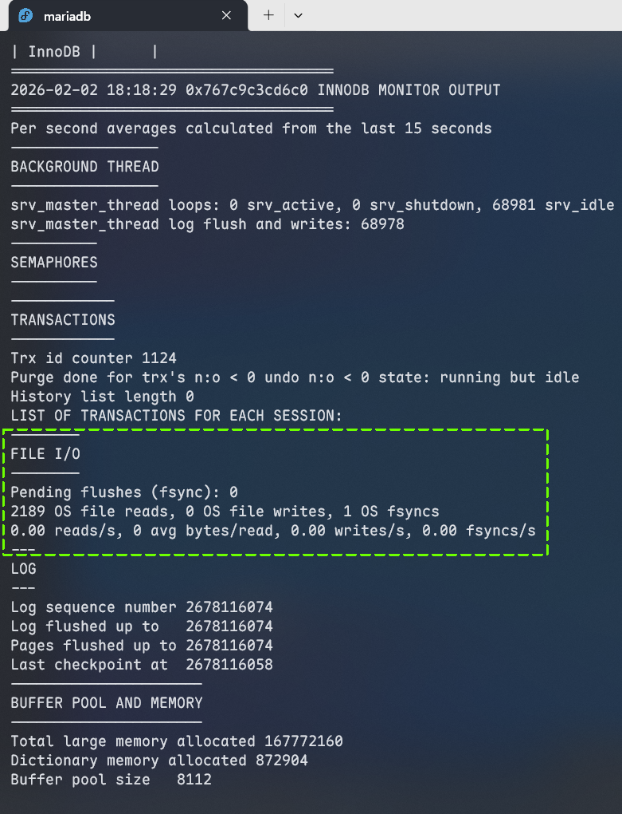

3. **Purge Thread**

   专门负责回收**已提交事务的失效 undo log**，当事务提交后，其产生的 undo log 不再被任何活跃事务或 MVCC 机制引用时，由该线程执行清理与回收操作。

4. **Page Cleaner Thread**

   专门用于协助 Master Thread，将缓冲池中的脏页异步刷新至磁盘的后台线程，可有效分担 Master Thread 的工作负载，降低其因脏页刷新任务过载而引发的阻塞。

## 事务原理

事务是由一组操作构成的**不可分割的工作单位**，它会将这组操作作为整体向系统提交或撤销，实现“要么全部执行成功，要么全部执行失败”的原子性特性。

**特性**：

1. **原子性（Atomicity）**：事务是不可分割的最小操作单元，其包含的所有操作要么全部执行成功，要么全部执行失败，不存在部分完成的中间状态。
2. **一致性（Consistency）**：事务执行前后，数据库中的数据必须始终保持一致状态，即从一个符合完整性约束的状态，转换为另一个符合约束的状态。
3. **隔离性（Isolation）**：数据库系统通过隔离机制保障并发事务相互独立，每个事务的执行过程不受其他并发事务的干扰。
4. **持久性（Durability）**：事务一旦提交，其对数据库数据的修改即为永久生效，后续的系统故障、重启等操作都不会导致该修改丢失。


### redo log

重做日志（redo log）记录事务提交时数据页的物理变更，是数据库实现**事务持久化**的核心机制。

它的存储载体分为两部分：内存中的**重做日志缓冲（redo log buffer）**和磁盘上的**重做日志文件（redo log file）**。事务提交时，会将本次事务所有修改信息写入重做日志；当脏页刷新到磁盘的过程中发生异常时，数据库可借助重做日志完成数据恢复，保障数据一致性。

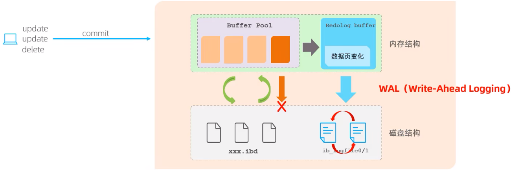

### undo log

回滚日志（undo log）记录数据修改前的原始状态，核心作用有二：**支持事务回滚**、**实现多版本并发控制（MVCC）**。

与记录数据页物理变更的重做日志（redo log）不同，undo log 属于**逻辑日志**。其记录规则可以概括为：执行 `DELETE` 操作时，undo log 会留存对应的 `INSERT` 逻辑；执行 `INSERT` 操作时，则记录对应的 `DELETE` 逻辑；执行 `UPDATE` 操作时，会记录反向的 `UPDATE` 逻辑。当触发事务回滚（`rollback`）时，数据库便可读取 undo log 中的逻辑记录，逆向恢复数据至修改前的状态。

- **undo log 的销毁机制**：undo log 在事务执行过程中动态生成，事务提交时**不会立即删除**——这些日志仍需用于 MVCC 的读一致性保障，待其不再被任何活跃事务引用时，才会被后台线程清理回收。
- **undo log 的存储方式**：采用段式管理方式，统一存储于**回滚段（rollback segment）**中，每个回滚段内置 1024 个 undo log 段（undo log segment）。

## MVCC

### 基本概念

#### 当前读

**当前读**，指读取数据记录的**最新版本**，且读取过程中会对目标记录加锁，阻止其他并发事务修改该记录，以此保障数据一致性。

常见的当前读操作及对应锁类型：

- 共享锁：`SELECT ... LOCK IN SHARE MODE`。
- 排他锁：`SELECT ... FOR UPDATE`、`UPDATE`、`INSERT`、`DELETE`。

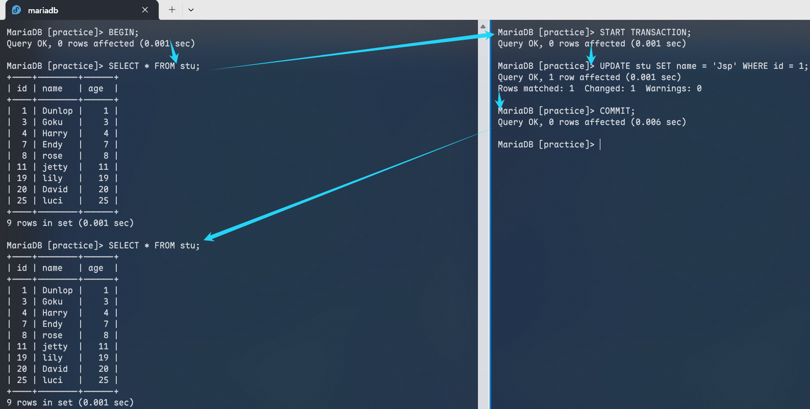

MySQL 默认隔离级别为**可重复读（REPEATABLE READ）**，在该级别下，即便其他事务提交了新数据，第一个事务使用相同查询再次查询时，结果仍与初次查询保持一致，无法读取到最新数据，这类读操作不属于当前读。

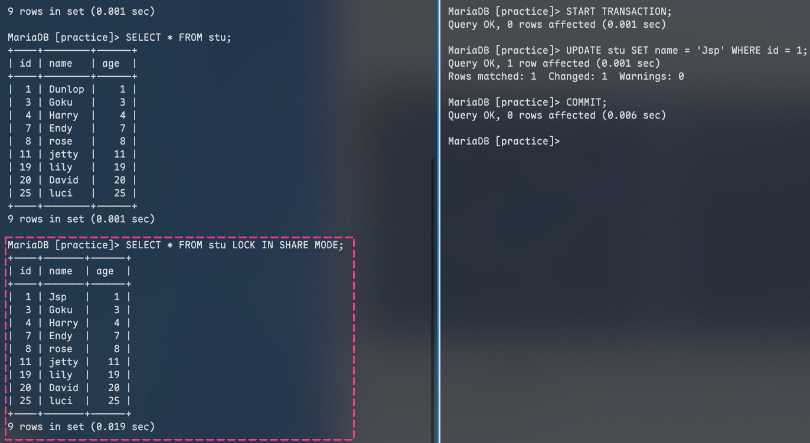

执行 `SELECT * FROM stu LOCK IN SHARE MODE` 会对目标记录施加**共享锁**，阻止其他事务对该记录执行修改操作，同时当前事务将读取记录的最新版本，因此这类带锁的读操作属于当前读。

#### 快照读

不加锁的普通 `SELECT` 操作属于**快照读**。快照读的核心特征是：读取记录的可见版本（可能是历史数据），全程不加锁，属于非阻塞读。

在不同隔离级别，快照读的行为存在差异：

- **读已提交（Read Committed）**：每次执行 `SELECT` 都会生成全新的快照。
- **可重复读（Repeatable Read）**：事务内的第一个 `SELECT` 语句会生成快照，后续查询将服用该快照。
- **串行化（Serializable）**：快照读会退化为当前读，即读取时会对记录施加锁。

#### MVCC

多版本并发控制（**MVCC**, Multi-Version Concurrency Control）是一种数据库并发控制技术，核心原理是维护数据的多个版本，从而让读写操作无需互相阻塞等待，有效提升数据库并发性能。在 MySQL 中，快照读正是 MVCC 实现非阻塞读的核心方式。

MVCC 的具体实现依赖三大核心机制：

- 数据库记录中的三个隐式字段
- undo log 回滚日志
- ReadView 一致性视图

### 实现原理

#### 记录中的隐藏字段

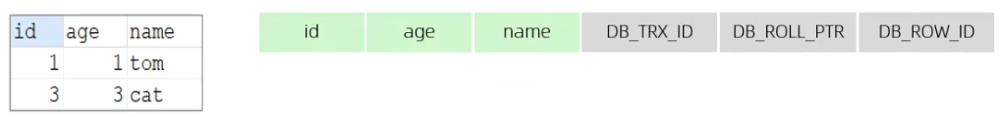

|   隐藏字段    |                                 含义                                  |
| :-----------: | :-------------------------------------------------------------------: |
|  `DB_TRX_ID`  |    最近修改事务 ID，记录插入这条记录或最后一次修改该记录的事务 ID     |
| `DB_ROLL_PTR` | 回滚指针，指向这条记录的上一个版本，用于配合 undo log，指向上一个版本 |
|  `DB_ROW_ID`  |          隐藏主键，若表结构没有指定主键，将会生成该隐藏字段           |

#### undo log

**回滚日志（undo log）**是InnoDB 存储引擎在执行 `INSERT`、`UPDATE`、`DELETE` 等写操作时生成的日志，核心作用是支持事务回滚，同时为 MVCC（多版本并发控制）提供历史数据版本。

不同写操作生成的 undo log 生命周期存在差异：

- **`INSERT` 操作**：生成 undo log 仅用于事务回滚，事务提交后无其他依赖，可被 InnoDB 立即清理回收。
- **`UPDATE`/`DELETE` 操作**：生成的 undo log 不仅用于事务回滚，还需为快照读提供历史数据版本，因此事务提交后不会立即删除，会保留至对应的历史版本不再被任何快照读引用。

#### undo log 版本链

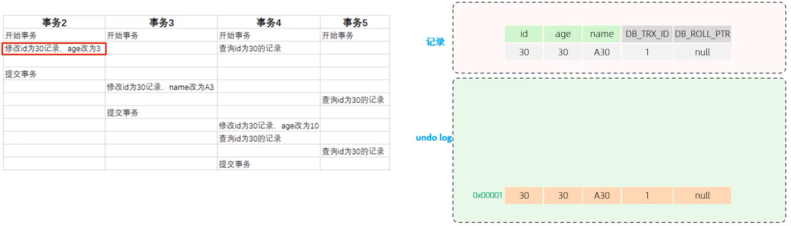

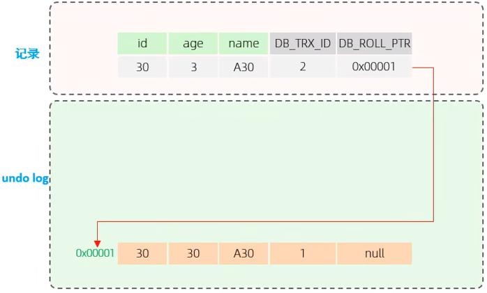

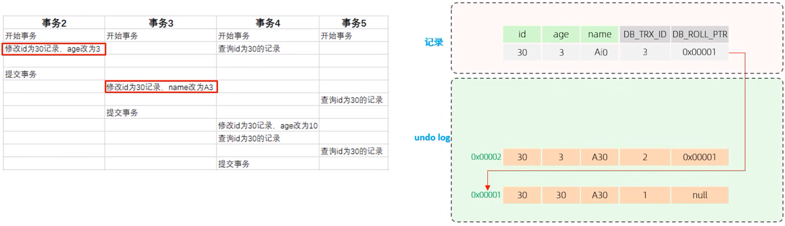

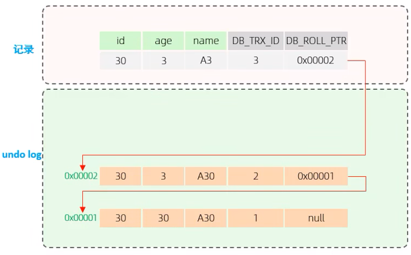

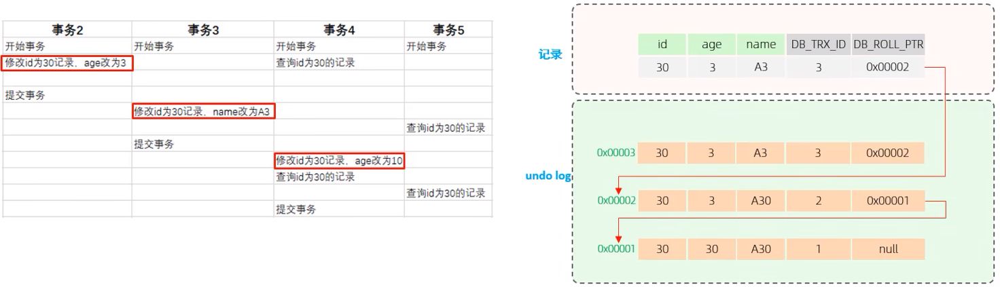

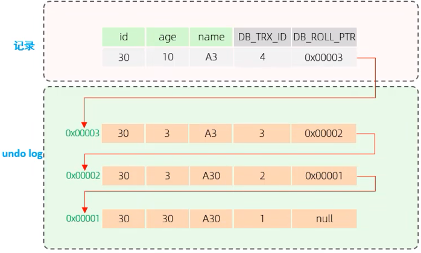

当多个事务（或同一事务多次）对同一条记录执行修改操作时，InnoDB 会为该记录生成一条基于 undo log 的**版本链**。版本链头部执行最新的历史版本，尾部指向最早的历史版本。

### ReadView

ReadView（读视图）是 InnoDB 在执行<span style="color:#FF502F">快照读</span>（普通 `SELECT`）时生成的一致性视图，它是 MVCC 机制判断数据版本可见性的核心依据。ReadView 会记录当前系统中所有活跃事务（即未提交事务）的 ID 集合，其内部包含四个核心字段：

|       字段       |                            含义                             |
| :--------------: | :---------------------------------------------------------: |
|     `m_ids`      |                   当前活跃的事务 ID 集合                    |
|   `min_trx_id`   |                       最小活跃事务 ID                       |
|   `max_trx_id`   | 预分配事务 ID，当前最大事务 ID 加 1（因为事务 ID 是自增的） |
| `creator_trx_id` |                  ReadView 创建者的事务 ID                   |

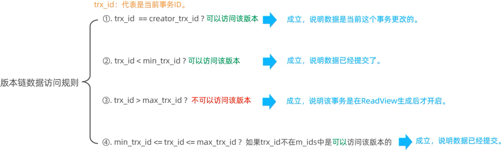

不同事务隔离级别下，ReadView 的生成时机存在显著差异，这直接决定了快照读的一致性表现：

- **读已提交（READ COMMITTED）**：事务内每次执行快照读时，都会生成一个全新的 ReadView，因此每次查询可能读取到其他事务提交的最新数据。
- **可重复读（REPEATABLE READ）**：仅在事务首次执行快照读时生成 ReadView，后续所有快照读复用该视图，从而保证事务内多次查询结构的一致性。

在**读已提交（RC）**隔离级别下，事务内每次执行快照读时，都会生成一个全新的 ReadView。

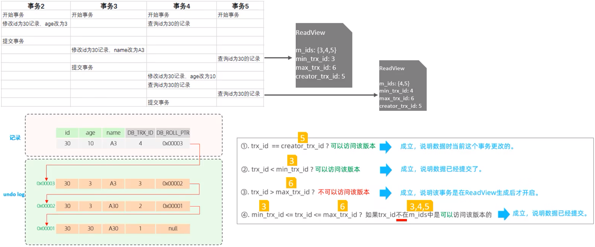

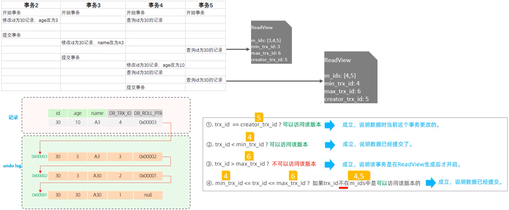

在**可重复读（RR）**隔离级别下，事务仅会在首次执行快照时生成一个 ReadView，后续所有快照读操作将复用该视图，以此保证事务内多次查询结果的一致性。

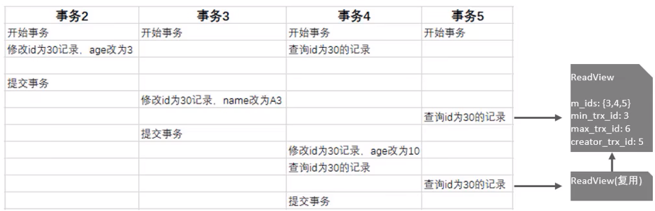

---

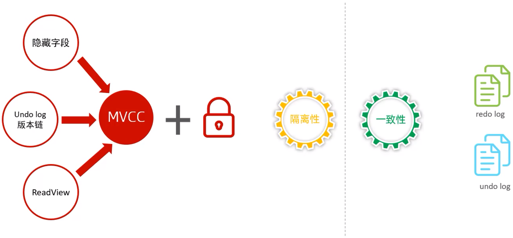

---

**知识回顾**：

1. **逻辑存储结构**

   表空间、段、区、页、行。

2. **架构**
   - 内存结构
   - 磁盘结构

3. **事务原理**
   - 原子性 - undo log
   - 持久性 - redo log
   - 一致性 - undo log + redo log
   - 隔离性 - 锁 + MVCC

4. **MVCC**

   记录隐藏字段、undo log 版本链、ReadView。
