# MySQL 管理

## 系统数据库

MySQL 数据库安装完成后，默认自带以下四个系统数据库，具体说明如下：

|        数据库        |                                                        含义                                                         |
| :------------------: | :-----------------------------------------------------------------------------------------------------------------: |
|       `mysql`        |       存储 MySQL 服务器正常运行所需的核心元数据，包括用户账号、权限配置、时区信息及主从复制状态等关键系统信息       |
| `information_schema` | 作为 MySQL 的元数据信息库，提供一系列只读系统表与视图，用于查询数据库、表、字段的定义信息及对象访问权限等核心元数据 |
| `performance_schema` | 作为 MySQL 内置的性能监控核心组件，通过底层机制持续收集服务器的运行状态与性能参数，为性能分析与故障排查提供数据支撑 |
|        `sys`         |    基于 `performance_schema` 构建的易用性视图集合，专为 DBA 与开发人员设计，用于简化数据库性能调优与故障诊断操作    |

## 常用工具

### `mysql`

此处的 `mysql` 并非指 MySQL 数据库服务，而是 MySQL 官方提供的**命令行客户端工具**，用于连接并操作远端或本地的 MySQL 服务器。

```sh
mysql [options] [database]
```

|          选项           |                           说明                            |
| :---------------------: | :-------------------------------------------------------: |
|    `-u, --user=name`    |               指定连接 MySQL 服务器的用户名               |
| `-p, --password[=name]` | 指定连接密码（建议留空以交互式输入，避免命令行明文泄露）  |
|    `-h, --host=name`    | 指定 MySQL 服务器的 IP 或域名（默认连接本地 `localhost`） |
|    `-P, --port=port`    |           指定 MySQL 服务器的端口（默认 3306）            |
|  `-e, --execute=name`   |       直接执行指定 SQL 语句并退出，无需进入交互模式       |

> [!note]
>
> `-e` 选项是批处理场景的核心用法：无需进入 MySQL 交互终端，即可直接执行 SQL 语句，尤其适合脚本批量操作。

```sh
mysql -uroot -p db01 -e "SELECT * FROM stu";
```

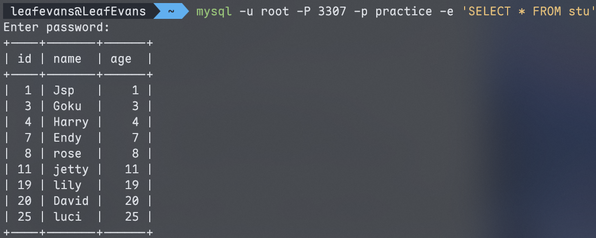

### `mysqladmin`

`mysqladmin` 是 MySQL 官方提供的**命令行管理客户端**，用于快速执行数据库服务器的各类运维操作，核心能力包括检查服务器配置与运行状态、创建 / 删除数据库、刷新全新等。

若需获取所有可用操作与参数，可执行帮助命令：

```sh
mysqladmin --help
```

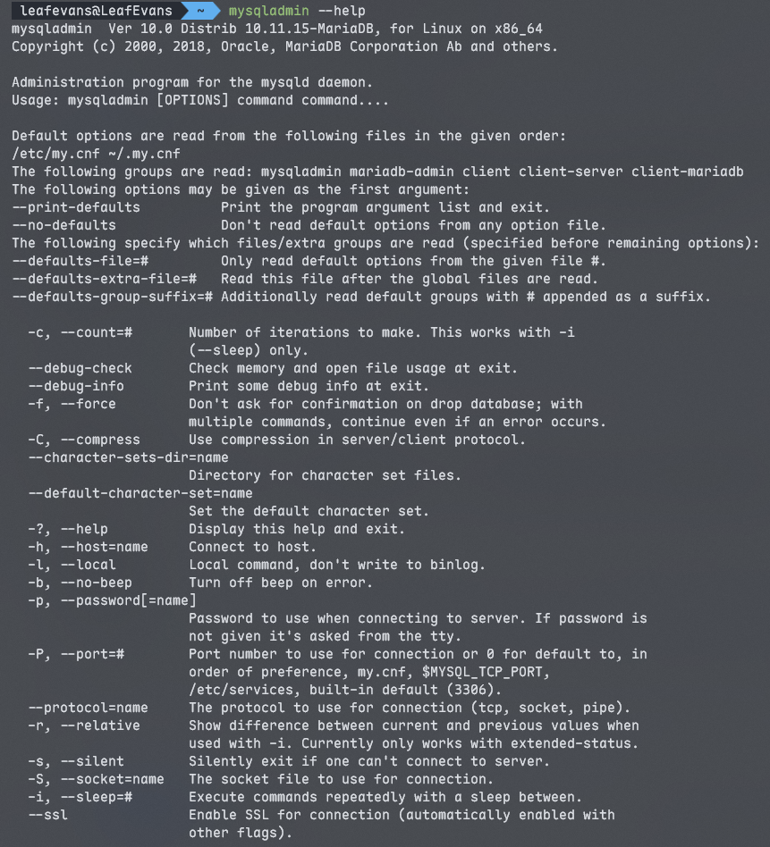

**删除数据库**：

```sh
mysqladmin -uroot -p drop test01
```

执行后会触发交互确认，防止误删数据库。

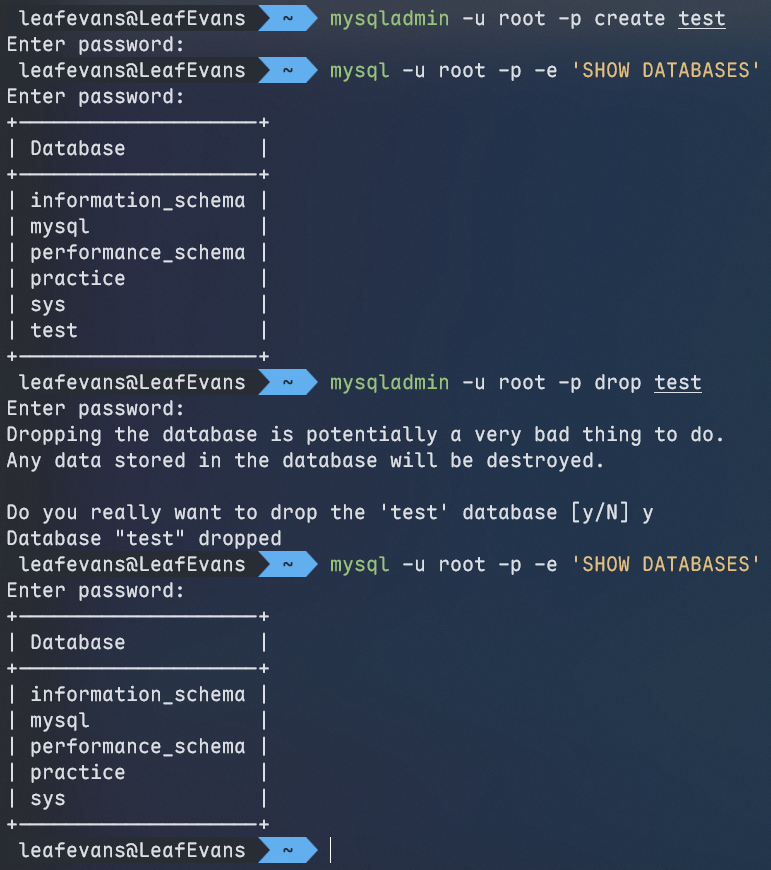

**查看服务器版本与状态**：

```sh
mysqladmin -uroot -p version
```

输出包含 MySQL 版本、运行时长、当前连接数等关键运维信息。

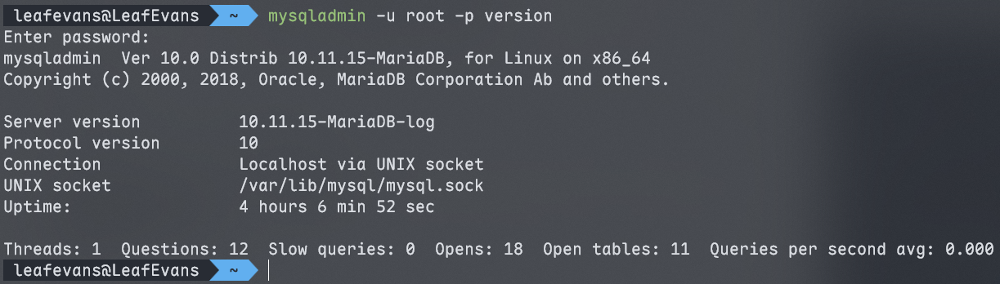

### `mysqlbinlog`

MySQL 服务器生成的**二进制日志（binary log）**以二进制格式存储，无法直接读取。

`mysqlbinlog` 是官方提供的日志解析工具，核心作用是将二进制日志转换为可读的文本格式，用于问题排查、数据恢复或操作审计。

```sh
mysqlbinlog [options] log-file1 [log-file2 ...]
```

支持同时解析多个二进制日志文件。

**常用选项**：

|           选项           | 缩写 |                              说明                              |
| :----------------------: | :--: | :------------------------------------------------------------: |
|    `--database=name`     | `-d` |          仅解析指定数据库相关的操作日志，过滤无关内容          |
|       `--offset=#`       | `-o` |       跳过日志开头的前 `#` 条命令，从第 `#+1` 条开始解析       |
|   `--result-file=name`   | `-r` |      将解析后的文本日志输出到指定文件，而非直接打印到终端      |
|      `--short-form`      | `-s` |    以精简格式输出，省略部分元数据信息，便于快速查看核心操作    |
| `--start-datetime=date1` |  -   | 仅解析 `data1` 时间点之后的日志（格式：`YYYY-MM-DD HH:MM:SS`） |
| `--stop-datetime=date2`  |  -   |                仅解析 `date2` 时间点之前的日志                 |
| `--start-position=pos1`  |  -   |               仅解析从日志位置 `pos1` 开始的内容               |
|  `--stop-position=pos2`  |  -   |               仅解析到日志位置 `pos2` 结束的内容               |

### `mysqlshow`

`mysqlshow` 是 MySQL 官方提供的客户端工具，可**快速查询**服务器上的数据库、表、列及索引等对象信息。

```sh
mysqlshow [options] [db_name [table_name [col_name]]]
```

可以根据需求，从“数据库”到“表”再到“列”，逐层精准定位查询对象。

|   选项    |                             说明                             |
| :-------: | :----------------------------------------------------------: |
| `--count` | 显示数据库或表的统计信息（数据库、表均可省略，默认查询全部） |
|   `-i`    |                 显示指定数据库或表的状态信息                 |

查询所有数据库的表数量，以及各表的记录数。

```sh
mysqlshow -u root -p --count
```

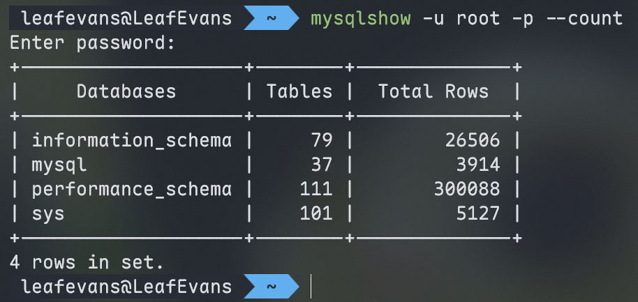

查询 `mysql` 数据库中，每个表的字段数和行数。

```sh
mysqlshow -u root -p mysql --count
```

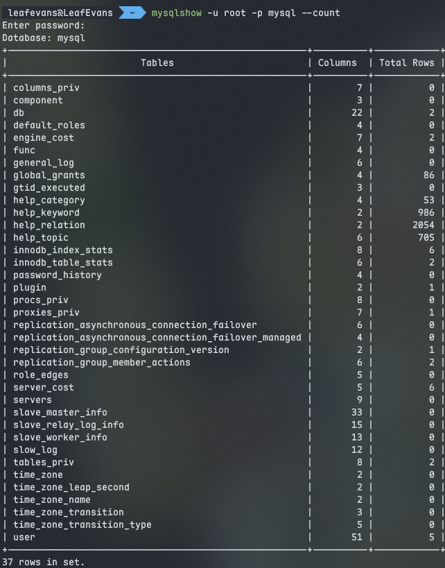

查询 `mysql` 数据库中 `db` 表的详细统计信息：

```sh
mysqlshow -u root -p mysql db --count
```

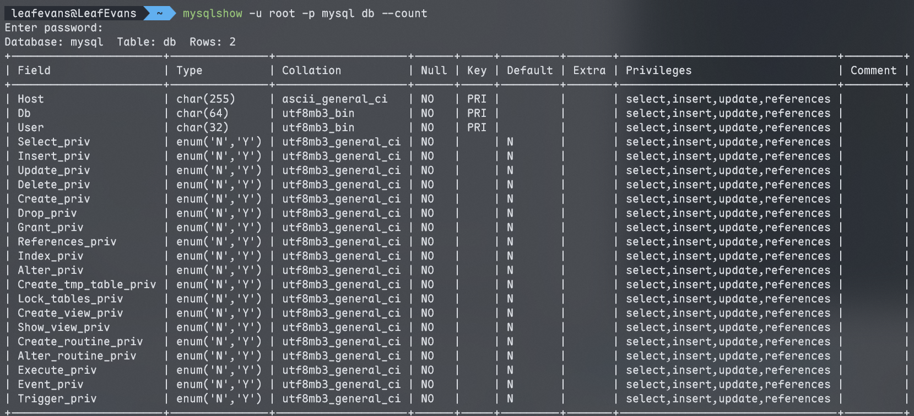

使用 `-i` 即可查看数据库或表的状态信息：

```sh
mysqlshow -u root -p mysql db -i
```

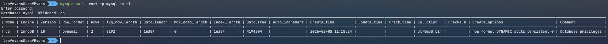

### `mysqldump`

`mysqldump` 是 MySQL 官方客户端工具，主要用于数据库备份，也可实现不同数据库间的数据迁移。备份文件中包含表结构创建语句（`CREATE TABLE`）及数据插入语句（`INSERT`）等完整的 SQL 语句。

备份指定数据库的指定表（若忽略 `tables` 则备份整个数据库）：

```sh
mysqldump [options] db_name [tables]
```

备份一个或多个指定数据库（需显示声明 `--database`/`-B`）：

```sh
mysqldump [options] --database/-B db1 [db2 db3 ...]
```

备份服务器上所有数据库：

```sh
mysqldump [options] --all-database/-A
```

**连接选项**：

| 选项                    | 功能说明                                      |
| ----------------------- | --------------------------------------------- |
| `-u, --user=name`       | 指定连接数据库的用户名                        |
| `-p, --password[=name]` | 指定用户密码（建议仅写 `-p`，交互输入更安全） |
| `-h, --host=name`       | 指定数据库服务器的 IP 或域名                  |
| `-P, --port=#`          | 指定数据库连接端口                            |

**输出选项**：

| 选项格式               | 功能说明                                                                                     |
| ---------------------- | -------------------------------------------------------------------------------------------- |
| `--add-drop-database`  | 在每个数据库创建语句前，自动添加 `DROP DATABASE` 语句                                        |
| `-add-drop-table`      | 在每个表创建语句前，自动添加 `DROP TABLE` 语句（默认开启；关闭需用 `--skip-add-drop-table`） |
| `-n, --no-create-db`   | 备份文件中不包含数据库的创建语句                                                             |
| `-t, --no-create-info` | 备份文件中不包含表的创建语句                                                                 |
| `-d, --no-data`        | 备份文件中仅保留表结构，不包含任何数据                                                       |
| `-T, --tab=name`       | 自动生成两个文件：`.sql` 文件（存储表结构创建语句）、`.txt` 文件（存储表数据）               |

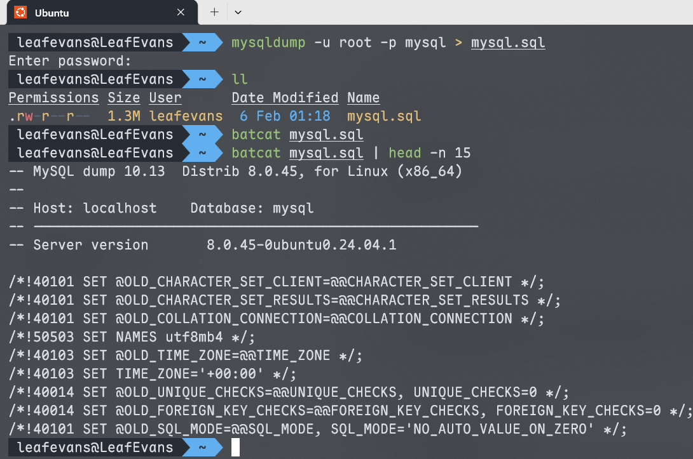

执行 `mysqldump` 命令，将数据库备份内容直接写入 `mysql.sql` 文件。

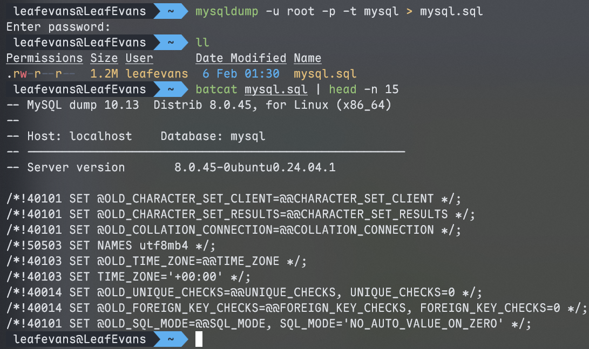

添加 `-t` 参数后，备份文件仅包含数据插入语句，不包含数据库建表语句。

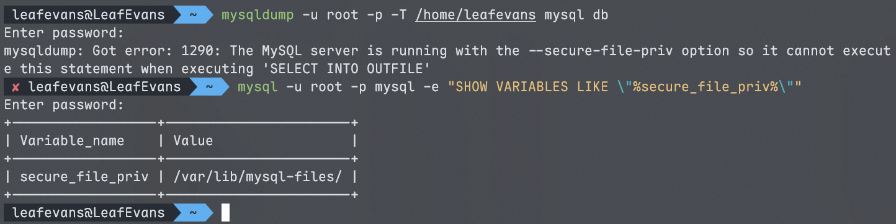

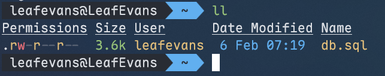

使用 `-T` 参数指定自定义路径导出时触发报错，提示需通过系统变量 `secure_file_priv`（报错信息中显示为 `secure-file-priv`）查看 MySQL 允许的导出目录，此处为 `/var/lib/mysql-files`。

报错时，仅在当前目录生成了包含表结构创建语句的 `.sql` 文件，而本应分离导出的 `.txt` 数据文件并未生成。

修正路径后执行命令：

```sh
mysqldump -u root -p -T /var/lib/mysql-files test_mysql_dump student
```

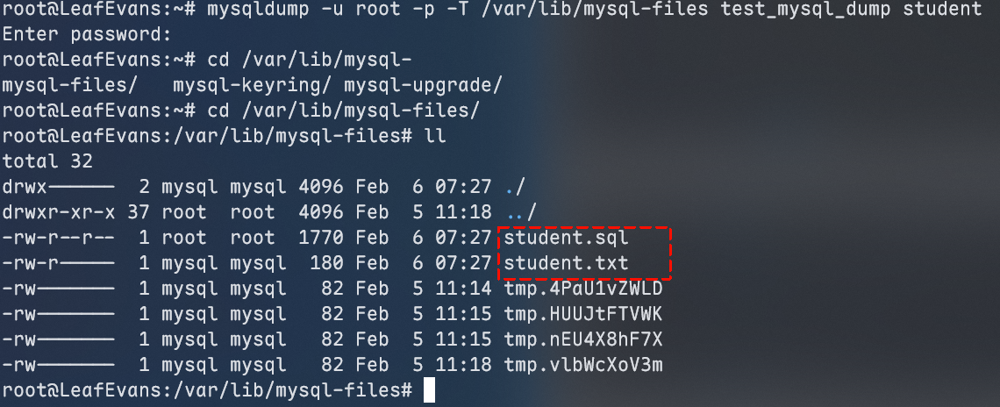

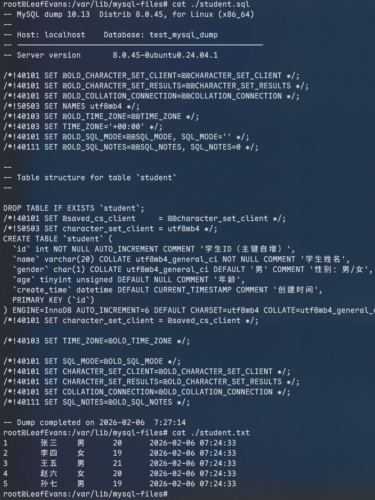

验证后可见，在符合 `secure_file_priv` 限制的正确路径下，包含表结构的 `.sql` 文件与仅包含数据的 `.txt` 文件已成功生成。

### `mysqlimport`/`SOURCE`

`mysqlimport` 是 MySQL 官方客户端数据导入工具，**专门适配 `mysqldump -T` 参数分离导出的纯文本数据文件（`.txt`），可快速将文本数据导入对应数据库表**。

```sh
mysqlimport [options] 数据库名 文本文件1 [文本文件2 ...]
```

**示例**：

```sh
mysqlimport -u root -p test /tmp/city.txt
```

若需导入 `mysqldump` 常规导出的 SQL 脚本文件（`.sql`），可使用 MySQL 客户端**内置 `source` 指令**实现，操作更便捷。

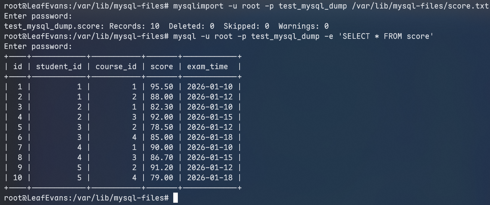

```mysql
SOURCE 本地SQL文件的绝对路径;
```

**示例**：

```mysql
SOURCE /root/xxxxx.sql
```

---

**知识回顾**：

1. **`mysql`**：MySQL 客户端工具，`-e` 执行 SQL 并退出。
2. **`mysqladmin`**：MySQL 管理工具。
3. **`mysqlbinlog`**：二进制日志查看工具。
4. **`mysqlshow`**：查看数据库、表、字段的统计信息。
5. **`mysqldump`**：数据备份工具。
6. **`mysqlimport`/`SOURCE`**：数据导入工具。
