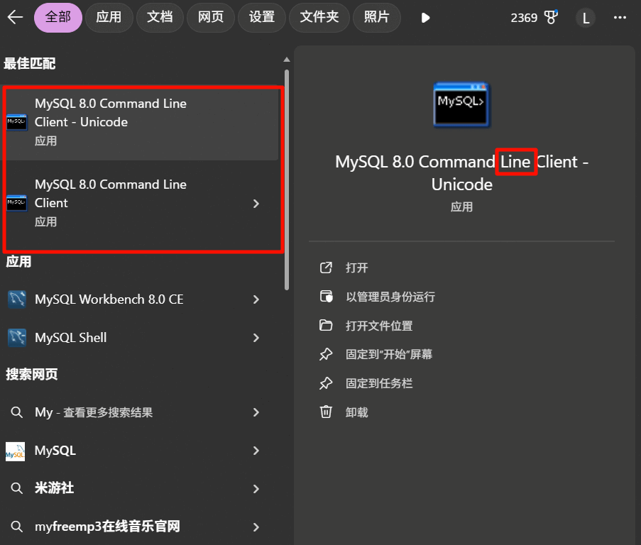
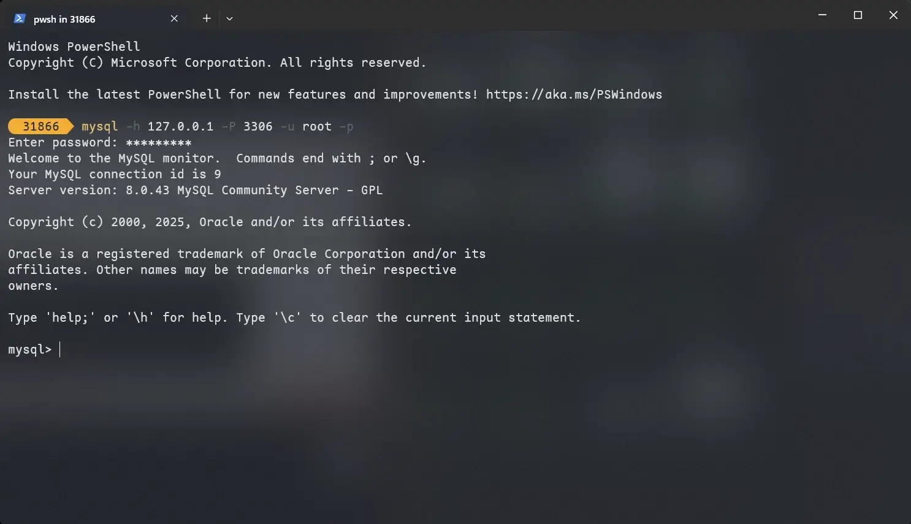

# 概述

## 数据库相关概念

| 名称           | 全称                                                                                              | 简称                             |
| :------------- | :------------------------------------------------------------------------------------------------ | -------------------------------- |
| 数据库         | 存储数据的仓库，数据是有组织地进行存储                                                            | Database, DB                     |
| 数据库管理系统 | 操纵和管理数据库的大型软件                                                                        | Database Management System, DBMS |
| SQL            | 操作关系型数据库的编程语言，定义了一套操作关系型数据库统一<span style="color:#F40552">标准</span> | Structured Query Language, SQL   |


主流的关系型数据库管理系统。


---

**知识回顾**：

1. **数据库**：数据存储的仓库。
2. **数据库管理系统**：操纵和管理数据库的大型软件。
3. **SQL**：操作关系型数据库的编程语言，是一套标准。

## MySQL 数据库

### 启动与停止

**启动**：

```sh
net start mysql80
```

**停止**：

```sh
net stop mysql80
```

> [!tip]
>
> MySQL 默认是**开机自启**的。

### 客户端连接

**方式一**：直接使用 MySQL 提供的客户端命令行工具。



**方式二**：系统自带的命令行工具执行指令。

```sh
mysql [-h 127.0.0.1] [-P 3306] -u root -p
```



> [!tip]
>
> 使用该方式时，需要配置 Path 环境变量。

### 关系型数据库（RDBMS）

**概念**：建立在<span style="color:#497D74">关系模型基础</span>上，由多张相互连接的<span style="color:#F6490D">二维表</span>组成的数据库。

**特点**：

1. 使用表存储数据，格式统一，便于维护。
2. 使用 SQL 语言操作，标准统一，使用方便。


### 数据模型


---

**知识回顾**：

1. **MySQL 启动和关闭**：

   ```sh
   net start mysql80
   net stop mysql80
   ```

2. **MySQL 客户端连接**：
   - 使用 MySQL 自带的客户端命令行。
   - `mysql [-h 127.0.0.1] [-P 3306] -u root -p`

3. **MySQL 数据模型**：数据库、表。
