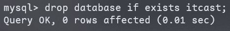
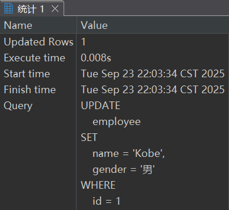

# SQL

## SQL 通用语法

1. SQL 语句可<span style="color:#5DA7AE">单行</span>或<span style="color:#5DA7AE">多行</span>书写，以分号结尾。
2. SQL 语句可以使用<span style="color:#38598B">空格/缩进</span>来增强语句的可读性。
3. MySQL 数据库的 SQL 语句<span style="color:#DE3163">不区分大小写</span>，关键字<span style="color:#A03271">建议使用<span style="font-weight:bold">大写</span></span>。
4. 注释：
   - **单行注释**：`-- 注释内容` 或 `# 注释内容`（MySQL 特有）
   - **多行注释**：`/* 注释内容 */`

## SQL 分类

| 分类 | 全称                       | 说明                                                   |
| ---- | -------------------------- | ------------------------------------------------------ |
| DDL  | Data Definition Language   | 数据定义语言，用来定义数据库对象（数据库、表、字段）   |
| DML  | Data Manipulation Language | 数据操作语言，用来对数据库表中的数据进行增删改         |
| DQL  | Data Query Language        | 数据查询语言，用来查询数据库中表的记录                 |
| DCL  | Data Control Language      | 数据控制语言，用来创建数据库用户、控制数据库的访问权限 |

## DDL

### 数据库操作

#### 查询

查询所有数据库：

```mysql
SHOW DATABASES;
```


查询当前数据库：

```mysql
SELECT DATABASE();
```


#### 创建

```mysql
CREATE DATABASE [IF NOT EXISTS] 数据库名 [DEFAULT CHARSET 字符集] [COLLATE 排序规则];
```


#### 删除

```mysql
DROP DATABASE [IF EXISTS] 数据库名;
```



#### 使用

```mysql
USE 数据库名;
```


> [!tip]
>
> `USE` 是 MySQL 特有的专用指令。

### 表操作

#### 查询

查询当前数据库所有表：

```mysql
SHOW TABLES;
```


查询表结构：

```mysql
DESC 表名;
```


查询指定表的建表语句：

```mysql
SHOW CREATE TABLE 表名;
```


#### 创建

```mysql
CREATE TABLE 表名(
	字段1 字段1类型[COMMENT 字段1注释],
  字段2 字段2类型[COMMENT 字段2注释],
  字段3 字段3类型[COMMENT 字段3注释],
  ...
  字段n 字段n类型[COMMENT 字段n注释]
)[COMMENT 表注释];
```

> [!tip]
>
> `[...]` 为可选参数，最后一个字段后无逗号。


#### 数据类型

MySQL 中的**数据类型**有很多，主要分为三类：<span style="color:#AC0D0D">数值类型</span>、<span style="color:#AC0D0D">字符串类型</span>、<span style="color:#AC0D0D">日期时间类型</span>。

##### 数值类型

|      类型       |  大小   |        范围（有符号 → 无符号）         |    描述    |
| :-------------: | :-----: | :------------------------------------: | :--------: |
|    `TINYINT`    | 1 byte  |       `(-128, 127)` → `(0, 255)`       |   小整数   |
|   `SMALLINT`    | 2 bytes |    `(-32768, 32767)` → `(0, 65535)`    |   中整数   |
|   `MEDIUMINT`   | 3 bytes |        `(-8M, 8M)` → `(0, 16M)`        |  中大整数  |
|      `INT`      | 4 bytes |     `(-2.1G, 2.1G)` → `(0, 4.3G)`      | 常用大整数 |
|    `BIGINT`     | 8 bytes |     `(-2⁶³, 2⁶³-1)` → `(0, 2⁶⁴-1)`     |  超大整数  |
|     `FLOAT`     | 4 bytes |  `±3.4E+38` → `0, 1.2E-38 ~ 3.4E+38`   | 单精度浮点 |
|    `DOUBLE`     | 8 bytes | `±1.8E+308` → `0, 2.2E-308 ~ 1.8E+308` | 双精度浮点 |
| `DECIMAL(M, D)` |  可变   |  由 `M`（总位数）和 `D`（小数位）决定  |  精确小数  |

> [!tip]
>
> - 使用**无符号整数**时，在类型后添加 `UNSIGNED`，例如：`age TINYINT UNSIGNED`。
> - 定义**浮点数精度**时，使用 `类型(总位数, 小数位)` 格式，例如：`score DECIMAL(4, 1)`。

##### 字符串类型

|     类型     |         大小          |             描述              |
| :----------: | :-------------------: | :---------------------------: |
|    `CHAR`    |      0~255 bytes      |          定长字符串           |
|  `VARCHAR`   |     0~65535 bytes     |          变长字符串           |
|  `TINYBLOB`  |      0~255 bytes      | 不超过 255 个字符的二进制数据 |
|  `TINYTEXT`  |      0~255 bytes      |         短文本字符串          |
|    `BLOB`    |    0~65,535 bytes     |    二进制形式的长文本数据     |
|    `TEXT`    |    0~65,535 bytes     |          长文本数据           |
| `MEDIUMBLOB` |  0~16,777,215 bytes   | 二进制形式的中等长度文本数据  |
| `MEDIUMTEXT` |  0~16,777,215 bytes   |       中等长度文本数据        |
|  `LONGBLOB`  | 0~4,294,967,295 bytes |   二进制形式的极大文本数据    |
|  `LONGTEXT`  | 0~4,294,967,295 bytes |         极大文本数据          |

> [!tip]
>
> 使用 `CHAR` 或 `VARCHAR` 时，必须指定长度，如 `CHAR(50)`、`VARCHAR(10)`。

##### 日期时间类型

|    类型     | 大小 |                    范围                    |        格式         |           描述           |
| :---------: | :--: | :----------------------------------------: | :-----------------: | :----------------------: |
|   `DATE`    |  3   |          1000-01-01 至 9999-12-31          |     YYYY-MM-DD      |          日期值          |
|   `TIME`    |  3   |          -838:59:59 至 838:59:59           |      HH:MM:SS       |      时间或持续时间      |
|   `YEAR`    |  1   |                1901 至 2155                |        YYYY         |          年份值          |
| `DATETIME`  |  8   | 1000-01-01 00:00:00 至 9999-12-31 23:59:59 | YYYY-MM-DD HH:MM:SS |     混合日期和时间值     |
| `TIMESTAMP` |  4   | 1970-01-01 00:00:01 至 2038-01-19 03:14:07 | YYYY-MM-DD HH:MM:SS | 混合日期和时间值，时间戳 |

##### 案例

设计一张员工信息表，要求如下：

1. 编号（纯数字）
2. 员工工号（字符串类型，长度不超过 10 位。）
3. 员工姓名（字符串类型，长度不超过 10 位。）
4. 性别（男/女，存储一个汉字。）
5. 年龄（正常人年龄，不可能存储负数。）
6. 身份证号（二代身份证号均为 18 位，身份证中有 X 这样的字符。）
7. 入职时间（取值年月日即可。）

```mysql
create table emp(
	id int comment '编号', 
  workno varchar(10) comment '姓名',
  name varchar(10) comment '工号',
  gender char(1) comment '性别',
  age tinyint unsigned comment '年龄',
  idcard char(18) comment '身份证号',
  entrydate date comment '入职时间'
) comment '员工表';
```


#### 修改

##### 添加字段

```mysql
ALTER TABLE 表名 ADD 字段名 类型(长度) [COMMENT 注释] [约束];
```

为前文的 `emp` 表添加一个新的字段“昵称”为 `nickname`，类型为 `varchar(20)`。

```mysql
alter table emp add nickname varchar(20) comment '昵称';
```


##### 修改字段

**修改数据类型**：

```mysql
ALTER TABLE 表名 MODIFY 字段名 新数据类型(长度);
```

**修改字段名和字段类型**：

```mysql
ALTER TABLE 表名 CHANGE 旧字段名 新字段名 类型(长度) [COMMENT 注释] [约束];
```

将 `emp` 表中的 `nickname` 字段修改为 `username`，类型为 `varchar(30)`。

```mysql
alter table emp change nickname username varchar(30) comment '用户名';
```


##### 删除字段

```mysql
ALTER TABLE 表名 DROP 字段名;
```

将 `emp` 表的字段 `username` 删除。

```mysql
alter table emp drop username;
```


##### 修改表名

```mysql
ALTER TABLE 表名 RENAME TO 新表名;
```

将 `emp` 表的表名修改为 `employee`。

```mysql
alter table emp rename to employee;
```


#### 删除

**删除表**：

```mysql
DROP TABLE [IF EXISTS] 表名;
```


**删除指定表并重新创建该表**：

```mysql
TRUNCATE TABLE 表名;
```


> [!tip]
>
> `TRUNCATE` 清空表数据并重置自增计数器，相当于重建空表。

---

**知识回顾**：

1. 数据库操作：

   ```mysql
   SHOW DATABASE 
   CREATE DATABASE 数据库名;
   USE 数据库名;
   SELECT DATABASE();
   DROP DATABASE 数据库名;

2. 表操作：

   ```mysql
   SHOW TABLES;
   CREATE TABLE 表名 (
   	字段 字段类型,
     字段 字段类型
   );
   DESC 表名;
   SHOW CREATE TABLE 表名;
   ALTER TABLE 表名 ADD/ MODIFY/ CHANGE/ DROP/ RENAME TO...
   DROP TABLE 表名;
   ```

## DML

DML 英文全称是<span style="color:#CA5116"> Data Manipulation Language（数据操作语言）</span>，用来对数据库中表的数据记录进行<span style="color:#CD3131">增删改操作</span>。

- 添加数据（`INSERT`）
- 修改数据（`UPDATE`）
- 删除数据（`DELETE`）

### 添加数据

**给指定字段添加数据**：

```mysql
INSERT INTO 表名 (字段名1, 字段名2, ...) VALUES(值1, 值2, ...);
```

```mysql
INSERT
	INTO
	employee (id,
	workno,
	name,
	gender ,
	age,
	idcard,
	entrydate )
VALUES(
1, '1', 'Hachimi', '男', 18, '01234567890123456X', '2005-05-14')
```


**给全部字段添加数据**：

```mysql
INSERT INTO 表名 VALUES(值1, 值2, ...)
```

```mysql
INSERT
	INTO
	employee
VALUES(2, '2', 'Mambo', '男', 19, '012345678901234567', '2005-05-16')
```


**批量添加数据**：

```mysql
INSERT INTO 表名 (字段名1, 字段名2, ...) VALUES(值1, 值2, ...), (值1, 值2, ...), (值1, 值2, ...)
```

```mysql
INSERT INTO 表名 VALUES(值1, 值2, ...), (值1, 值2, ...), (值1, 值2, ...)
```

```mysql
INSERT
	INTO
	employee
VALUES
(3,
'3',
'Fender',
'女',
20,
'112345678901234567',
'2004-11-12'),
(4,
'4',
'Gibson',
'女',
21,
'212345678901234567',
'2004-11-01')
```


> [!tip]
>
> - 插入数据时，<span style="color:#F9499E">指定的字段顺序</span>需要<span style="color:#A56CC1">与值的顺序是一一对应的</span>。
> - 字符串和日期型数据应该<span style="color:#EB5E0B">包含在引号中</span>。
> - 插入的数据大小，应该在<span style="color:#E2703A">字段的规定范围内</span>。

### 修改数据

```mysql
UPDATE 表名 SET 字段名1=值1, 字段名2=值2, ...[WHERE 条件];
```

```mysql
UPDATE
	employee
SET
	name = 'Kobe',
	gender = '男'
WHERE
	id = 1;
```




> [!tip]
>
> 若修改语句中**没有指定条件**，则会修改整张表的**所有数据**。

#### 删除数据

```mysql
DELETE FROM 表名 [WHERE 条件]
```

```mysql
DELETE
FROM
	employee
WHERE
	gender = '女';
```


> [!tip]
>
> - `DELETE` 语句的条件可以有，也可以没有；若没有条件，则会删除整张表的**所有数据**。
> - `DELETE` 语句**不能删除**某一个字段的值。（可以使用 `UPDATE`。）

---

**知识回顾**：

1. 添加数据：

   ```mysql
   INSERT INTO 表名 (字段名1, 字段名2, ...) VALUES(值1, 值2, ...) [, (值1, 值2, ...)...]
   ```

2. 修改数据：

   ```mysql
   UPDATE 表名 SET 字段1=值1, 字段2=值2 [WHERE 条件];
   ```

3. 删除数据：

   ```mysql
   DELETE FROM 表名 [WHERE 条件];
   ```

## DQL

DQL 英语全称是 Data Query Language（<span style="color:#E94560">数据查询语言</span>），用来查询数据库中表的记录。

**查询关键字**：`SELECT`。

```mysql
SELECT
	字段列表
FROM 
	表名列表
WHERE	
	条件列表
GROUP BY
	分组字段列表
HAVING
	分组后条件列表
ORDER BY
	排序字段列表
LIMIT
	分页参数
```

- **基本查询**
- **条件查询（`WHERE`）**
- **聚合函数（`count`、`max`、`min`、`avg`、`sum`）**
- **分组查询（`GROUP BY`）**
- **排序查询（`ORDER BY`）**
- **分页查询（`LIMIT`）**

### 基本查询

#### 查询多个字段

```mysql
SELECT 字段1, 字段2, 字段3... FROM 表名;
SELECT * FROM 表名;
```

```mysql
SELECT idcard,
    name,
    age
FROM emp;
```


#### 设置别名

```mysql
SELECT 字段1 [AS 别名1], 字段2 [AS 别名2]... FROM 表名;
```

```mysql
SELECT workaddress AS '工作地址'
FROM emp;
```


> [!tip]
>
> 上述代码中的 `AS` 字段可以省略。

#### 去除重复记录

```mysql
SELECT DISTINCT 字段列表 FROM 表名;
```

```mysql
SELECT DISTINCT age 
FROM emp;
```


### 条件查询（`WHERE`）

#### 语法

```mysql
SELECT 字段列表 FROM 表名 WHERE 条件列表;
```

#### 条件

| 比较运算符         | 功能                                             |
| ------------------ | ------------------------------------------------ |
| `>`                | 大于                                             |
| `>=`               | 大于等于                                         |
| `<`                | 小于                                             |
| `<=`               | 小于等于                                         |
| `=`                | 等于                                             |
| `<>` 或 `!=`       | 不等于                                           |
| `BETWEEN...AND...` | 在某个范围之内（含最小、最大值）                 |
| `IN(...)`          | 在 `IN` 之后的列表中的值，多选一                 |
| `LIKE` 占位符      | 模糊匹配（`_` 匹配单个字符，`%` 匹配任意个字符） |
| `IS NULL`          | 是 `NULL`                                        |

| 逻辑运算符    | 功能                         |
| ------------- | ---------------------------- |
| `AND` 或 `&&` | 并且（多个条件同时成立）     |
| `OR` 或 `||`  | 或者（多个条件任意一个成立） |
| `NOT` 或 ` !` | 非，不是                     |

---

1. 查询年龄等于 16 的员工。

   ```mysql
   SELECT id,
       name
   FROM emp
   WHERE age = 16;
   ```

   

2. 查询年龄大于 25 的员工。

   ```mysql
   SELECT id,
       name
   FROM emp
   WHERE age > 25;
   ```

   

3. 查询年龄大于等于 25 的员工。

   ```mysql
   SELECT id,
       name
   FROM emp
   WHERE age >= 25;
   ```

   

4. 查询没有身份证号的员工信息。

   ```mysql
   SELECT id,
       name
   FROM emp
   WHERE idcard IS NULL;
   ```

   

5. 查询有身份证号的员工信息。

   ```mysql
   SELECT id,
       name
   FROM emp
   WHERE idcard IS NOT NULL;
   ```

   

6. 查询年龄不等于 16 的员工信息。

   ```mysql
   SELECT id,
       name
   FROM emp
   WHERE age != 16;
   
   SELECT id,
       name
   FROM emp
   WHERE age <> 16;
   ```

   

7. 查询年龄在 15 岁（包含）到 20 岁（包含）之间的员工信息。

   ```mysql
   SELECT id,
       name
   FROM emp
   WHERE age <= 20
       AND age >= 15;
   
   SELECT id,
       name
   FROM emp
   WHERE age BETWEEN 15 AND 20;
   ```

   

8. 查询性别为男且年龄小于 25 岁的员工信息。

   ```mysql
   SELECT id,
       name
   FROM
   WHERE gender = '男'
       AND age <= 25
   ```

   

9. 查询年龄等于 18 或 20 或 40 的员工信息。

   ```mysql
   SELECT id,
       name
   FROM emp
   WHERE age = 18
       OR age = 25
       OR age = 30;
   
   SELECT id,
       name
   FROM emp
   WHERE age IN(18, 20, 40)
   ```

   

10. 查询姓名为三个字的员工信息。

    ```mysql
    SELECT id,
        name
    FROM emp
    WHERE name LIKE '___';
    ```

    

11. 查询身份证号最后一位是 1 的员工信息。

    ```mysql
    SELECT id,
        name
    FROM emp
    WHERE idcard LIKE '%1';
    ```

    

### 聚合函数（`count`、`max`、`min`、`avg`、`sum`）

#### 介绍

将一列数据作为一个整体，进行纵向计算。

#### 常见聚合函数

|  函数   |   功能   |
| :-----: | :------: |
| `count` | 统计数量 |
|  `max`  |  最大值  |
|  `min`  |  最小值  |
|  `avg`  |  平均值  |
|  `sum`  |   求和   |

#### 语法

```mysql
SELECT 聚合函数(字段列表) FROM 表名;
```

---

1. 统计该企业员工的数量。

   ```mysql
   SELECT COUNT(id)
   FROM emp;
   ```

   

2. 统计该企业员工的平均年龄。

   ```mysql
   SELECT AVG(age)
   FROM emp;
   ```

   

3. 统计该企业员工的最大年龄。

   ```mysql
   SELECT MAX(age)
   FROM emp;
   ```

   

4. 统计该企业员工的最小年龄。

   ```mysql
   SELECT MIN(age)
   FROM emp;
   ```

   

5. 统计樱丘高中员工的年龄之和。

   ```mysql
   SELECT SUM(age)
   FROM emp
   WHERE workaddress = '樱丘高中';
   ```

   

> [!tip]
>
> `NULL` 值不参与所有聚合函数运算。

### 分组查询（`GROUP BY`）

#### 语法

```mysql
SELECT 字段列表 FROM 表名 [WHERE 条件] GROUP BY 分组字段名 [HAVING 分组后过滤条件];
```

#### `WHERE` vs. `HAVING`

- **执行时机不同**：`WHERE` 是<span style="color:#9112BC; font-weight:bold">分组之前</span>进行过滤，<u>不满足 `WHERE` 条件，不参与分组</u>；而 `HAVING` 是<span style="color:#9112BC; font-weight:bold">分组之后</span>对结果进行过滤。
- **判断条件不同**：`WHERE` <u>不能</u>对聚合函数进行判断，而 `HAVING` 可以。

---

1. 根据性别分组，统计男性员工和女性员工的数量。

   ```mysql
   SELECT gender,
       COUNT(id)
   FROM emp
   GROUP BY gender;
   ```

   

2. 根据性别分组，统计男性员工和女性员工的平均年龄。

   ```mysql
   SELECT gender,
       AVG(age)
   FROM emp
   GROUP BY gender;
   ```

   

   可以发现此时 `COUNT` 计算的就是各分组的数量而非整体数量。

3. 查询年龄小于 25 的员工，并根据工作地址分组，获取员工数量大于等于 3 的工作地址。

   ```mysql
   SELECT workaddress,
       COUNT(id) AS '员工数量'
   FROM emp
   WHERE age < 25
   GROUP BY workaddress
   HAVING COUNT(id) >= 3;
   ```

   

> [!tip]
>
> - **执行顺序**：`WHERE` → 聚合函数 → `HAVING`。
> - 分组之后，查询的字段一般为<span style="color:#006A67; font-weight:bold">聚合函数</span>和<span style="color:#006A67; font-weight:bold">分组字段</span>，查询其他字段无任何意义。

### 排序查询（`ORDER BY`）

#### 语法

```mysql
SELECT 字段列表 FROM 表名 ORDER BY 字段1 排序方式1, 字段2 排序方式2;
```

#### 排序方式

- **`ASC`（Ascending）**：升序（默认值）
- **`DESC`（Descending）**：降序

> [!tip]
>
> 如果是多字段排序，当第一个字段值<span style="color:#E45A92; font-weight:bold">相同</span>时，才会根据第二个字段进行排序。

---

1. 根据年龄对公司的员工进行升序排序。

   ```mysql
   SELECT id,
       name,
       age
   FROM emp
   ORDER BY age ASC
   ```

   

2. 根据入职时间，对员工进行降序排序。

   ```mysql
   SELECT id,
       name,
       entrydate
   FROM emp
   ORDER BY entrydate DESC;
   ```

   

3. 根据年龄对公司的员工进行升序排序，年龄相同再按照入职时间进行降序排序。

   ```mysql
   SELECT id,
       name,
       age,
       entrydate
   FROM emp
   ORDER BY age ASC,
       entrydate DESC;
   ```

   

### 分页查询（`LIMIT`）

#### 语法

```mysql
SELECT 字段列表 FROM 表名 LIMIT 起始索引, 查询记录数;
```

> [!tip]
>
> - 起始索引从 0 开始，`起始索引 = (查询页码 - 1) * 每页显示记录数`。
> - <span style="color:#67C090; font-weight:bold">分页查询</span>是数据库的方言，不同的数据库有不同的实现，MySQL 中是 `LIMIT`。
> - 如果查询的是第一页数据，<u>起始索引可以省略</u>，直接简写为 `LIMIT 10`。

---

1. 查询第 1 页员工数据，每页展示 10 条记录。

   ```mysql
   SELECT id,
       name
   FROM emp
   LIMIT 0, 10;
   ```

   

2. 查询第 2 页员工数据，每页展示 10 条记录。

   ```mysql
   SELECT id,
       name
   FROM emp
   LIMIT 10, 10;
   ```

   

> [!tip]
>
> 本质上，`LIMIT` 的作用其实就是<u>*从某个起始位置开始*</u>，<u>*返回指定数量的记录*</u>。

### 案例

1. 查询年龄为 15、16、17 岁的女性员工信息。

   ```mysql
   SELECT id,
       name,
       age,
       gender
   FROM emp
   WHERE age IN (15, 16, 17)
       AND gender = '女';
   ```

   

2. 查询性别为男，并且年龄在 20~40 岁（含）以内的姓名为三个字的员工。

   ```mysql
   SELECT id,
       name,
       age,
       gender
   FROM emp
   WHERE gender = '男'
       AND age BETWEEN 20 AND 40
       AND name LIKE '___';
   ```

   

3. 统计员工表中，年龄小于 30 岁的，男性员工和女性员工的人数。

   ```mysql
   SELECT gender,
       COUNT(id)
   FROM emp
   WHERE age < 30
   GROUP BY gender;
   ```

   

4. 查询所有年龄小于等于 30 岁员工的姓名和年龄，并对查询结果按年龄升序排序，如果年龄相同按入职时间降序排序。

   ```mysql
   SELECT name,
       age
   FROM emp
   WHERE age < 30
   ORDER BY age ASC,
       entrydate DESC;
   ```

   

5. 查询性别为男，且年龄在 20~40 岁（含）以内的前 5 个员工信息，对查询的结果按年龄升序排序，年龄相同按入职时间升序排序。

   ```mysql
   SELECT id,
       name,
       age,
       entrydate
   FROM emp
   WHERE age BETWEEN 20 AND 40
   ORDER BY age,
       entrydate
   LIMIT 5
   ```

   

### 执行顺序


---

**知识总览**：


