# 函数

<span style="color:#41A67E; font-weight:bold">函数</span>是指一段可以直接被另一段程序调用的程序或代码。


## 字符串函数

| 函数                         | 功能描述                                                            |
| ---------------------------- | ------------------------------------------------------------------- |
| `CONCAT(S1, S2, ..., Sn)`    | 字符串拼接，将 `S1`, `S2`, ..., `Sn` 拼接成一个字符串               |
| `LOWER(str)`                 | 将字符串 `str` 全部转为小写                                         |
| `UPPER(str)`                 | 将字符串 `str` 全部转为大写                                         |
| `LPAD(str, n, pad)`          | 左填充：用字符串 `pad` 对 `str` 的左边进行填充，达到 `n` 个字符长度 |
| `RPAD(str, n, pad)`          | 右填充：用字符串 `pad` 对 `str` 的右边进行填充，达到 `n` 个字符长度 |
| `TRIM(str)`                  | 去掉字符串头部和尾部的空格                                          |
| `SUBSTRING(str, start, len)` | 返回从字符串 `str` 从 `start` 位置起的 `len` 个长度的子字符串       |

```mysql
SELECT CONCAT("Hello", " World!");
```


```mysql
SELECT LOWER("Hello World!");
```


```mysql
SELECT UPPER("Hello World!");
```


```mysql
SELECT LPAD('Hello World!', 15, '-*');
```


```mysql
SELECT RPAD('Hello World!', 15, '-*');
```

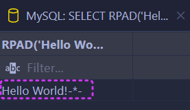

```mysql
SELECT TRIM('   Hello World!   ');
```


```mysql
SELECT SUBSTRING("Hello World!", 1, 5);
```


> [!tip]
>
> - SQL 的索引值是从 1 开始的，而非 0。
> - `LPAD` 和 `RPAD` 是 MySQL 方言。

### 练习

由于业务需求变更，企业员工的工号，统一为 5 位数，目前不足 5 位数的全部在前面补 0。比如：1 号员工的工号应该为 00001。

```mysql
UPDATE emp
SET workno = LPAD(workno, 5, '0');
```

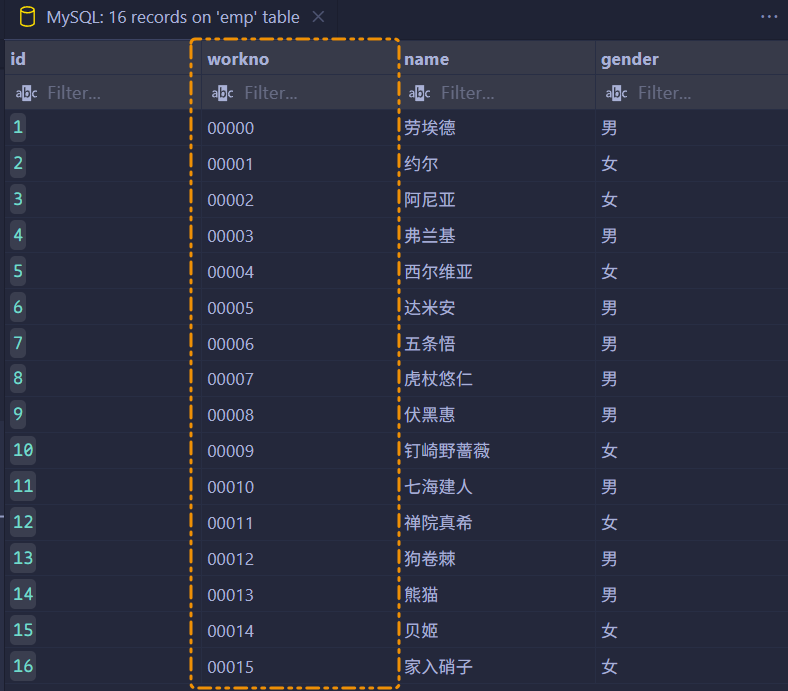

## 数值函数

常见的数值函数如下：

| 函数                    | 功能                                 |
| ----------------------- | ------------------------------------ |
| `CEIL(x)`, `CEILING(x)` | 向上取整                             |
| `FLOOR(x)`              | 向下取整                             |
| `MOD(x, y)`             | 返回 x/y 的模（余数）                |
| `RAND()`                | 返回 0~1 内的随机数                  |
| `ROUND(x, y)`           | 求参数 x 的四舍五入值，保留 y 位小数 |

```mysql
SELECT CEIL(3.14);
```

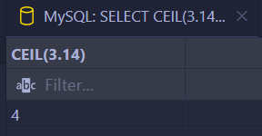

```mysql
SELECT FLOOR(3.14);
```

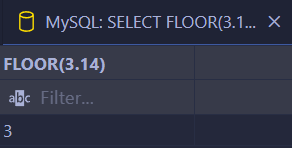

```mysql
SELECT MOD(10, 3);
```

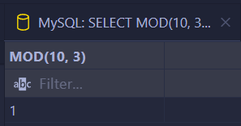

```mysql
SELECT RAND();
```

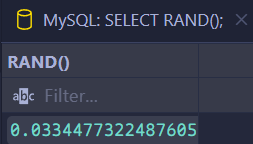

```mysql
SELECT ROUND(3.1415926, 3);
```

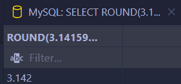

> [!TIP]
>
> `RAND` 是 MySQL 方言，但是 MySQL 不支持标准 SQL 的 `RANDOM`。

### 练习

通过数据库的函数，生成一个六位数的随机验证码。

```mysql
SELECT LPAD(FLOOR(RAND() * 1000000), 6, '0');
```

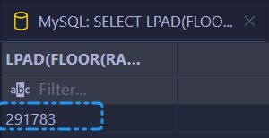

## 日期函数

| 函数                                 | 功能                                               |
| ------------------------------------ | -------------------------------------------------- |
| `CURDATE()`, `CURRENT_DATE()`        | 返回当前日期                                       |
| `CURTIME()`, `CURRENT_TIME()`        | 返回当前时间                                       |
| `NOW()`, `CURRENT_TIMESTAMP()`       | 返回当前日期和时间                                 |
| `YEAR(date)`                         | 获取指定 `date` 的年份                             |
| `MONTH(date)`                        | 获取指定 `date` 的月份                             |
| `DAY(date)`                          | 获取指定 `date` 的日期（日）                       |
| `DATE_ADD(date, INTERVAL expr type)` | 返回一个日期/时间加上一个时间间隔后的时间值        |
| `DATE_SUB(date, INTERVAL expr type)` | 返回一个日期/时间减去一个时间间隔后的时间值        |
| `DATEDIFF(date1, date2)`             | 返回起始时间 `date1` 和结束时间 `date2` 之间的天数 |

```mysql
SELECT CURRENT_DATE();
```

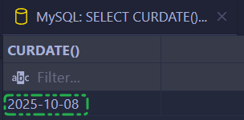

```mysql
SELECT CURTIME();
```

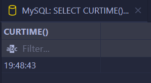

```mysql
SELECT NOW();
```

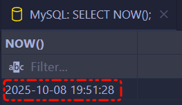

```mysql
SELECT YEAR(NOW());
```


```mysql
SELECT MONTH(NOW());
```


```mysql
SELECT DAY(NOW());
```

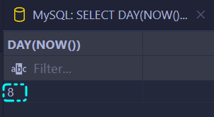

```mysql
SELECT DATE_ADD(NOW(), INTERVAL 70 DAY);
```

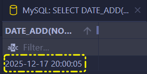

```mysql
SELECT DATE_SUB(NOW(), INTERVAL 70 MINUTE);
```


```mysql
SELECT DATEDIFF("2025-11-12", "2025-11-01");
```

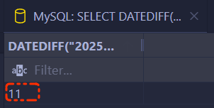

> [!TIP]
>
> 除 `CURRENT_DATE`、`CURRENT_TIME`、`CURRENT_TIMESTAMP` 以外，其他都是 MySQL 方言。

### 练习

查询所有员工的入职天数，并根据入职天数倒序排序。

```mysql
SELECT id,
    DATEDIFF(CURDATE(), entrydate)
FROM emp
ORDER BY DATEDIFF(CURDATE(), entrydate) DESC;
```

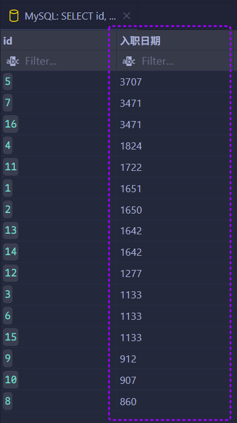

## 流程函数

流程函数也是很常用的一类函数，可以在 SQL 语句中实现条件筛选，从而提高语句的效率。

| 函数 / 语句                                                  | 功能描述                                                                  |
| ------------------------------------------------------------ | ------------------------------------------------------------------------- |
| `IF(value, t, f)`                                            | 如果 `value` 为 `true`，则返回 `t`，否则返回 `f`                          |
| `IFNULL(value1, value2)`                                     | 如果 `value1` 不为空，返回 `value1`；否则返回 `value2`                    |
| `CASE WHEN [val1] THEN [res1] ... ELSE [default] END`        | 如果 `val1` 为 `true`，返回 `res1`；`...` 否则返回 `default` 默认值       |
| `CASE [expr] WHEN [val1] THEN [res1] ... ELSE [default] END` | 如果 `expr` 的值等于 `val1`，返回 `res1`；`...` 否则返回 `default` 默认值 |

```mysql
SELECT IF(TRUE, 'OK', 'ERROR');
```

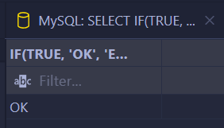

```mysql
SELECT IFNULL('OK', 'DEFAULT');
```

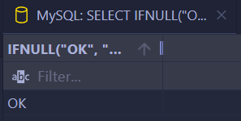

```mysql
SELECT IFNULL(NULL, 'DEFAULT');
```

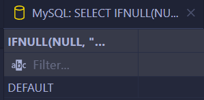

```mysql
SELECT
    name,
    CASE
        WHEN workaddress = '西国情报局' THEN '一线城市'
        WHEN workaddress = '伯林特市政府' THEN '一线城市'
        ELSE '二线城市'
    END AS `工作地址`
FROM emp;
```

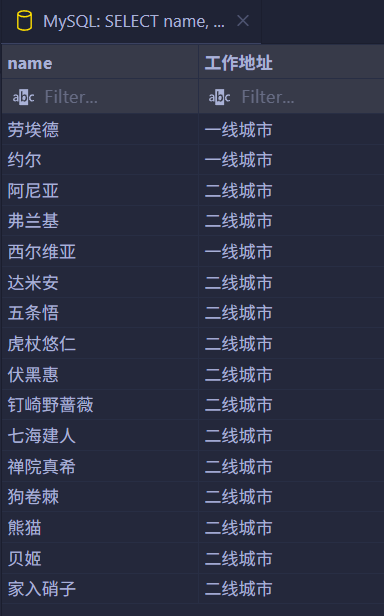

```mysql
SELECT name,
    (
        CASE
            workaddress
            WHEN '西国情报局' THEN '一线城市'
            WHEN '伯林特市政府' THEN '一线城市'
            ELSE '二线城市'
        END
    ) AS '工作地址'
FROM emp;
```


> [!tip]
>
> `IF` 和 `IFNULL` 都是 MySQL 方言。

### 练习

统计班级各个学员的成绩，展示的规则如下：、

- `>= 85`，展示**优秀**。
- `>= 60`，展示**及格**。
- 否则，展示**不及格**。

```mysql
SELECT name AS '姓名',
    CASE
        WHEN math >= 85 THEN '优秀'
        WHEN math >= 60 THEN '及格'
        ELSE '不及格'
    END AS '数学',
    CASE
        WHEN english >= 85 THEN '优秀'
        WHEN english >= 60 THEN '及格'
        ELSE '不及格'
    END AS '英语',
    CASE
        WHEN chinese >= 85 THEN '优秀'
        WHEN chinese >= 60 THEN '及格'
        ELSE '不及格'
    END AS '语文'
FROM score;
```


---

**知识回顾**：

1. 字符串函数：

   ```mysql
   CONCAT, LOWER, UPPER, LPAD, RPAD, SUBSTRING
   ```

2. 数值函数：

   ```mysql
   CEILING, FLOOR, MOD, RAND, ROUND
   ```

3. 日期函数：

   ```mysql
   CURDATE, CURTIME, NOW, YERA, MONTH, DAY, DATE_ADD, DATEDIFF
   ```

4. 流程函数：

   ```mysql
   IF, IFNULL, CASE[...] WHEN... THEN... ELSE... END
   ```
