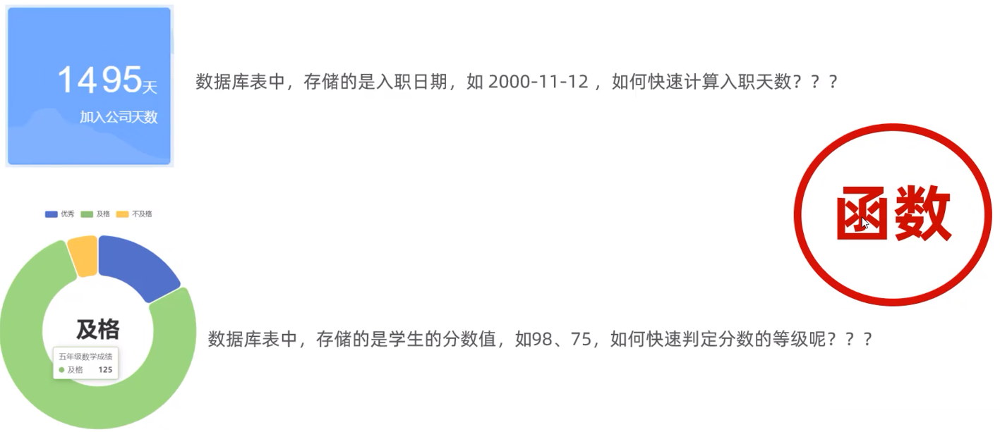
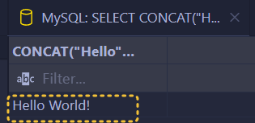
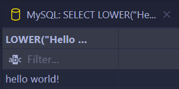

# 函数

<span style="color:#41A67E; font-weight:bold">函数</span>是指一段可以直接被另一段程序调用的程序或代码。



## 字符串函数

| 函数                         | 功能描述                                                     |
| ---------------------------- | ------------------------------------------------------------ |
| `CONCAT(S1, S2, ..., Sn)`    | 字符串拼接，将 `S1`, `S2`, ..., `Sn` 拼接成一个字符串        |
| `LOWER(str)`                 | 将字符串 `str` 全部转为小写                                  |
| `UPPER(str)`                 | 将字符串 `str` 全部转为大写                                  |
| `LPAD(str, n, pad)`          | 左填充：用字符串 `pad` 对 `str` 的左边进行填充，达到 `n` 个字符长度 |
| `RPAD(str, n, pad)`          | 右填充：用字符串 `pad` 对 `str` 的右边进行填充，达到 `n` 个字符长度 |
| `TRIM(str)`                  | 去掉字符串头部和尾部的空格                                   |
| `SUBSTRING(str, start, len)` | 返回从字符串 `str` 从 `start` 位置起的 `len` 个长度的子字符串 |

```mysql
SELECT CONCAT("Hello", " World!");
```



```mysql
SELECT LOWER("Hello World!");
```



```mysql
SELECT UPPER("Hello World!");
```

