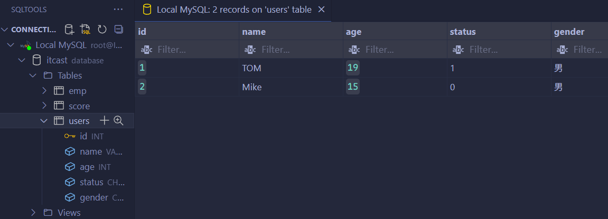
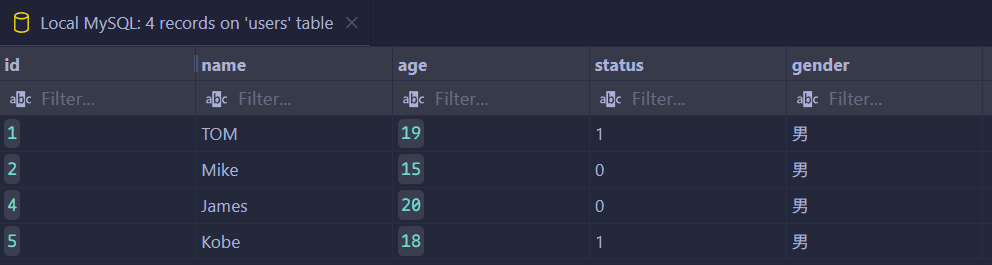
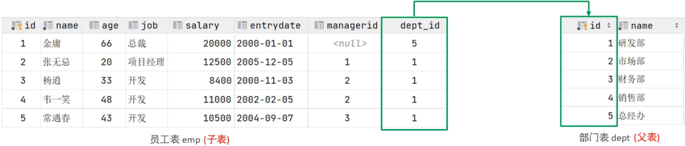
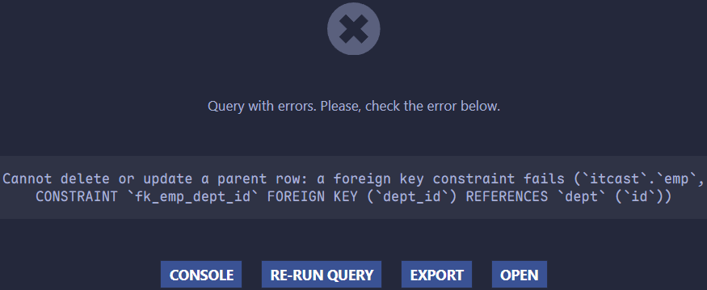
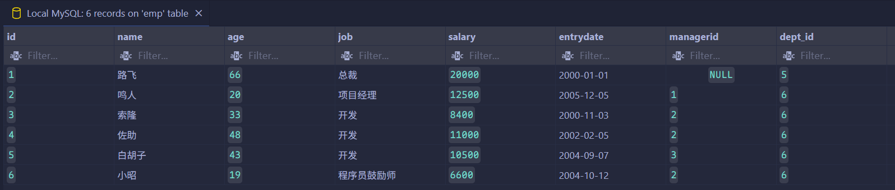
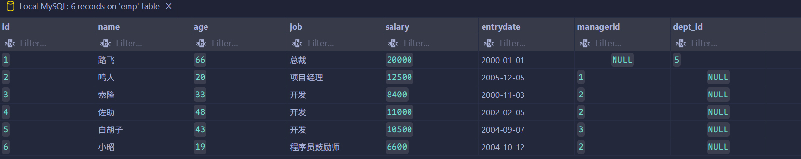

# 约束

## 概述

约束是作用于表中字段上的规则，用于限制存储在表中的数据。其目的是为了保证数据库中数据的正确性、有效性以及完整性。

约束的分类如下：

| 约束     | 描述                                                     | 关键字        |
| -------- | -------------------------------------------------------- | ------------- |
| 非空约束 | 限制该字段的数据不能为 null                              | `NOT NULL`    |
| 唯一约束 | 保证该字段的所有数据都是唯一、不重复的                   | `UNIQUE`      |
| 主键约束 | 主键是一行数据的唯一标识，要求非空且唯一                 | `PRIMARY KEY` |
| 默认约束 | 保存数据时，如果未指定该字段的值，则采用默认值           | `DEFAULT`     |
| 检查约束 | 保证字段值满足某一个条件                                 | `CHECK`       |
| 外键约束 | 用来让两张表的数据之间建立连接，保证数据的一致性和完整性 | `FOREIGN KEY` |

> [!tip]
>
> 约束是作用于表中字段上的，可以在创建表/修改表的时候添加约束。

## 约束演示

根据需求，完成下列表结构的创建。

| 字段名   | 字段含义    | 字段类型      | 约束条件                   | 约束关键字                      |
| -------- | ----------- | ------------- | -------------------------- | ------------------------------- |
| `id`     | ID 唯一标识 | `int`         | 主键，并且自动增长         | `PRIMARY KEY`, `AUTO_INCREMENT` |
| `name`   | 姓名        | `varchar(10)` | 不为空，并且唯一           | `NOT NULL`, `UNIQUE`            |
| `age`    | 年龄        | `int`         | 大于 0，并且小于等于 120   | `CHECK`                         |
| `status` | 状态        | `char(1)`     | 如果没有指定该值，默认为 1 | `DEFAULT`                       |
| `gender` | 性别        | `char(1)`     | 无                         |                                 |

```mysql
CREATE TABLE `users`(
    id int PRIMARY KEY AUTO_INCREMENT COMMENT '主键',
    name VARCHAR(10) NOT NULL UNIQUE COMMENT '姓名',
    age INT CHECK (
        age > 0
        AND age <= 120
    ) COMMENT '年龄',
    `status` CHAR(1) DEFAULT '1' COMMENT '状态',
    gender CHAR(1) COMMENT '性别'
) COMMENT = '用户表';
```


```mysql
INSERT INTO user(name, age, `status`, gender)
VALUES('TOM', 19, '1', '男'),
    ("Mike", 15, '0', '男');
```



可以发现 `id` 不仅是主键，而且从 1 开始自动增加。

```mysql
INSERT INTO user(name, age, `status`, gender)
VALUES(NULL, 19, '1', '女');
```


`name` 字段若为 null，则会报错。

```mysql
INSERT INTO users(name, age, `status`, gender)
VALUES('Mike', 19, '1', '女');
```


如果重名，也会报相应的错误。

```mysql
INSERT INTO users(name, age, `status`, gender)
VALUES('James', 20, '0', '男');
```


可以发现，尽管之前的两条插入语句执行失败，但仍向数据库申请了两个主键值。

```mysql
INSERT INTO users(name, age, `status`, gender)
VALUES('Carry', 30, '1', -1);
```


可以发现，对 `gender` 的约束也生效了。

```mysql
INSERT INTO users(name, age, gender)
VALUES('Kobe', 18, '男');
```



可以发现，当没有指定 `status` 时，其默认为 `1`。

## 外键约束

外键用来让两张表的数据之间建立连接，从而保证数据的一致性和完整性。



> [!tip]
>
> 目前上述的两张表，在数据库层面，并未建立外键关联，所以无法保证数据的一致性和完整性。

```mysql
CREATE TABLE IF NOT EXISTS dept (
    id INT AUTO_INCREMENT COMMENT 'ID' PRIMARY KEY,
    name VARCHAR(50) NOT NULL COMMENT '部门名称'
) COMMENT = '部门表';

INSERT INTO dept (id, name)
VALUES (1, '研发部'),
    (2, '市场部'),
    (3, '财务部'),
    (4, '销售部'),
    (5, '总经办');

CREATE TABLE IF NOT EXISTS emp (
    id INT AUTO_INCREMENT COMMENT 'ID' PRIMARY KEY,
    name VARCHAR(50) NOT NULL COMMENT '姓名',
    age INT COMMENT '年龄',
    job VARCHAR(20) COMMENT '职位',
    salary INT COMMENT '薪资',
    entrydate DATE COMMENT '入职时间',
    managerid INT COMMENT '直属领导ID',
    dept_id INT COMMENT '部门ID'
) COMMENT = '员工表';

INSERT INTO emp (
        id,
        name,
        age,
        job,
        salary,
        entrydate,
        managerid,
        dept_id
    )
VALUES (1, '路飞', 66, '总裁', 20000, '2000-01-01', NULL, 5),
    (2, '鸣人', 20, '项目经理', 12500, '2005-12-05', 1, 1),
    (3, '索隆', 33, '开发', 8400, '2000-11-03', 2, 1),
    (4, '佐助', 48, '开发', 11000, '2002-02-05', 2, 1),
    (5, '白胡子', 43, '开发', 10500, '2004-09-07', 3, 1),
    (6, '小昭', 19, '程序员鼓励师', 6600, '2004-10-12', 2, 1);
```

### 添加外键

```mysql
CREATE TABLE 表名(
	字段名 数据类型,
  ...
  [CONSTRAINT] [外键名称] FOREIGN KEY (外键字段名) REFERENCES 主标 (主表列名)
);
```

```mysql
ALTER TABLE 表名 ADD CONSTRAINT 外键名称 FOREIGN KEY (外键字段名) REFERENCES 主表 (主表列名);
```

在之前的 `emp` 表中添加外键约束，有：

```mysql
ALTER TABLE emp
ADD CONSTRAINT fk_emp_dept_id FOREIGN KEY emp (dept_id) REFERENCES dept(id);
```


> [!tip]
>
> 上述代码中的 `emp(dept_id)` 中的 `emp` 可以省略，但是 `()` 不可以省略。

```mysql
DELETE FROM dept
WHERE id = 1;
```



可以发现，添加外键约束后，无法直接删除被其他表引用的主键记录。

### 删除外键

```mysql
ALTER TABLE emp DROP FOREIGN KEY fk_emp_dept_id;
```


### 删除/更新行为

| 行为          | 说明                                                                                                                   |
| ------------- | ---------------------------------------------------------------------------------------------------------------------- |
| `NO ACTION`   | 当在父表中删除/更新对应记录时，首先检查该记录是否有对应外键，如果有则不允许删除/更新（与 `RESTRICT` 一致）             |
| `RESTRICT`    | 当在父表中删除/更新对应记录时，首先检查该记录是否有对应外键，如果有则不允许删除/更新（与 `NO ACTION` 一致）            |
| `CASCADE`     | 当在父表中删除/更新对应记录时，首先检查该记录是否有对应外键，如果有，则也删除/更新外键在子表中的记录                   |
| `SET NULL`    | 当在父表中删除对应记录时，首先检查该记录是否有对应外键，如果有则设置子表中该外键值为 null（这就要求该外键允许取 null） |
| `SET DEFAULT` | 父表有变更时，子表将外键列设置成一个默认的值（InnoDB 不支持）                                                          |

```mysql
ALTER TABLE 表名 ADD CONSTRAINT 外键名称 FOREIGN KEY (外键字段) REFERENCES 主表名 (主表字段名) ON UPDATE CASCADE ON DELETE CASCADE;
```

```mysql
ALTER TABLE emp
ADD CONSTRAINT fk_emp_dept_id FOREIGN KEY (dept_id) REFERENCES dept(id) ON DELETE CASCADE ON UPDATE CASCADE;

UPDATE dept
SET id = 6
WHERE id = 1;
```



将 `dept` 表中的部门 ID 从 1 修改为 6 时，通过外键级联更新，`emp` 表中所有原属于部门 1 的员工记录也会自动更新为部门 6。

```mysql
DELETE FROM dept
WHERE id = 6;
```


由于启用了级联删除，当被外键引用的主表中 `id = 6` 的记录被删除时，子表中所有 `dept_id = 6` 的关联记录也会一并被删除。

```mysql
ALTER TABLE emp
ADD CONSTRAINT fk_emp_dept_id FOREIGN KEY (dept_id) REFERENCES dept(id) ON DELETE
SET NULL ON UPDATE
SET NULL;
```

```mysql
DELETE FROM dept
WHERE id = 1;
```



由于外键约束设置为 `SET NULL`，删除主表 `dept` 中 `id = 6` 的记录时，子表中所有 `dept_id = 6` 的关联字段将自动被设为 `NULL`。

---

**知识回顾**：

1. 非空约束：`NOT NULL`
2. 唯一约束：`UNIQUE`
3. 主键约束：`PRIMARY KEY`(自增：`AUTO_INCREMANT`)
4. 默认约束：`DEFAULT`
5. 检查约束：`CHECK`
6. 外键约束：`FOREIGN KEY`
