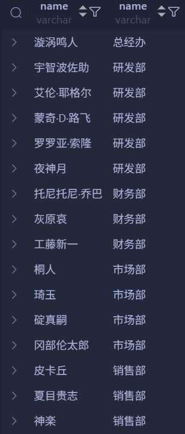
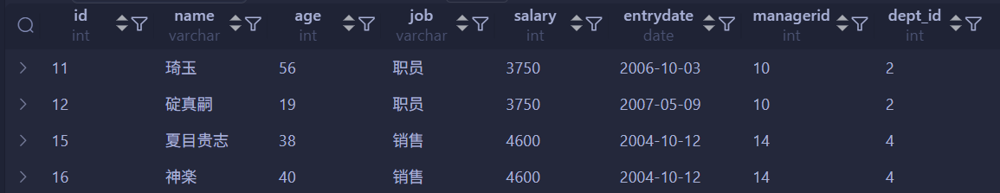

# 多表查询

## 多表关系

### 概述

项目开发中，在进行数据库表结构设计时，会根据业务需求及业务模块之间的关系，分析并设计表结构，由于业务之间相互关联，所以各个表结构之间也存在着各种联系，基本上分为三种：

- 一对一（多对一）
- 多对多
- 一对一

### 一对一（多对一）

- **案例**：部门与员工的关系。
- **关系**：一个部门对应多个员工，一个员工对应一个部门。
- **实现**：<span style="color:#BF092F">在多的一方建立外键，指向一的一方的主键。</span>


### 多对多

- **案例**：学生与课程的关系。
- **关系**：一个学生可以选修多门课程，一门课程也可以供多个学生选择。
- **实现**：<span style="color:#3B9797">建立第三张中间表，中间表至少包含两个外键，分别关联两方主键。</span>


```mysql
CREATE TABLE IF NOT EXISTS student (
    id INT AUTO_INCREMENT PRIMARY KEY COMMENT '主键ID',
    name VARCHAR(10) COMMENT '姓名',
    no VARCHAR(10) COMMENT '学号'
) COMMENT = '学生表';

INSERT INTO student
VALUES (NULL, '黛绮丝', '2000100101'),
    (NULL, '谢逊', '2000100102'),
    (NULL, '殷天正', '2000100103'),
    (NULL, '韦一笑', '2000100104');

CREATE TABLE IF NOT EXISTS course (
    id INT AUTO_INCREMENT PRIMARY KEY COMMENT '主键ID',
    name VARCHAR(10) COMMENT '课程名称'
) COMMENT = '课程表';

INSERT INTO course
VALUES (NULL, 'Java'),
    (NULL, 'PHP'),
    (NULL, 'MySQL'),
    (NULL, 'Hadoop');

CREATE TABLE IF NOT EXISTS student_course (
    id INT AUTO_INCREMENT PRIMARY KEY COMMENT '主键',
    studentid INT NOT NULL COMMENT '学生ID',
    courseid INT NOT NULL COMMENT '课程ID',
    CONSTRAINT fk_courseid FOREIGN KEY (courseid) REFERENCES course (id),
    CONSTRAINT fk_studentid FOREIGN KEY (studentid) REFERENCES student (id)
) COMMENT = '学生课程中间表';

INSERT INTO student_course
VALUES (NULL, 1, 1),
    (NULL, 1, 2),
    (NULL, 1, 3),
    (NULL, 2, 2),
    (NULL, 2, 3),
    (NULL, 3, 4);
```

多对多中间表（`student_course`）的规范设计，需把两个外键 `studentid` 和 `courseid` 组合作为候选键，避免插入重复的选课数据。

若仅用自增 `id` 作为主键，会导致重复的 `(studentid, courseid)` 组合被插入，仅靠 `id` 自增识别为新数据，破坏数据唯一性。

需对该字段组合做唯一性限制，三种实现方式如下：

1. **建表后追加复合唯一约束**

   ```mysql
   ALTER TABLE student_course ADD UNIQUE KEY uq_student_course (studentid, courseid);
   -- ALTER TABLE student_course
   -- ADD CONSTRAINT uq_student_course UNIQUE KEY (studentid, courseid);
   ```

2. **建表时，自增主键 + 复合唯一约束**

   ```mysql
   CREATE TABLE IF NOT EXISTS student_course (
       id INT AUTO_INCREMENT PRIMARY KEY COMMENT 'ID',
       studentid INT NOT NULL COMMENT '学生ID',
       courseid INT NOT NULL COMMENT '课程ID',
       CONSTRAINT fk_studentid FOREIGN KEY (studentid) REFERENCES student (id),
       CONSTRAINT fk_courseid FOREIGN KEY (courseid) REFERENCES course (id),
       UNIQUE KEY uq_student_course (studentid, courseid)
     	-- CONSTRAINT uq_student_course UNIQUE KEY (studentid, courseid)
   ) COMMENT '学生课程中间表';
   ```

3. **直接设置双字段复合主键**

   ```mysql
   CREATE TABLE IF NOT EXISTS student_course (
       studentid INT NOT NULL COMMENT '学生ID',
       courseid INT NOT NULL COMMENT '课程ID',
       CONSTRAINT fk_studentid FOREIGN KEY (studentid) REFERENCES student (id),
       CONSTRAINT fk_courseid FOREIGN KEY (courseid) REFERENCES course (id),
       PRIMARY KEY (studentid, courseid)
   ) COMMENT '学生课程中间表';
   ```

### 一对一

- **案例**：用户与用户详情的关系。
- **关系**：一对一关系，多用于**单表拆分**，将一张表的基础字段放在一张表中，其他详情字段放在另一张表中，以提升操作效率。
- **实现**：<span style="color:#4E56C0">在任意一方加入外键，关联另外一方的主键，并且设置外键为<span style="font-weight:bold">唯一的（`UNIQUE`）</span>。</span>


```mysql
CREATE TABLE tb_user (
    id INT AUTO_INCREMENT PRIMARY KEY COMMENT '主键ID',
    name VARCHAR(10) COMMENT '姓名',
    age INT COMMENT '年龄',
    gender CHAR(1) COMMENT '1: 男, 2: 女',
    phone CHAR(11) COMMENT '手机号'
) COMMENT = '用户基本信息表';

CREATE TABLE IF NOT EXISTS tb_user_edu (
    id INT AUTO_INCREMENT PRIMARY KEY COMMENT '主键ID',
    degree VARCHAR(20) COMMENT '学历',
    major VARCHAR(50) COMMENT '专业',
    primaryschool VARCHAR(50) COMMENT '小学',
    middleschool VARCHAR(50) COMMENT '中学',
    university VARCHAR(50) COMMENT '大学',
    userid INT UNIQUE COMMENT '用户ID',
    CONSTRAINT fk_userid FOREIGN KEY (userid) REFERENCES tb_user (id)
) COMMENT = '用户教育信息表';

INSERT INTO
    tb_user (id, name, age, gender, phone)
VALUES (
        NULL,
        '黄渤',
        45,
        '1',
        '18800001111'
    ),
    (
        NULL,
        '冰冰',
        35,
        '2',
        '18800002222'
    ),
    (
        NULL,
        '码云',
        55,
        '1',
        '18800008888'
    ),
    (
        NULL,
        '李彦宏',
        50,
        '1',
        '18800009999'
    );

INSERT INTO
    tb_user_edu (
        id,
        degree,
        major,
        primaryschool,
        middleschool,
        university,
        userid
    )
VALUES (
        NULL,
        '本科',
        '舞蹈',
        '静安区第一小学',
        '静安区第一中学',
        '北京舞蹈学院',
        1
    ),
    (
        NULL,
        '硕士',
        '表演',
        '朝阳区第一小学',
        '朝阳区第一中学',
        '北京电影学院',
        2
    ),
    (
        NULL,
        '本科',
        '英语',
        '杭州市第一小学',
        '杭州市第一中学',
        '杭州师范大学',
        3
    ),
    (
        NULL,
        '本科',
        '应用数学',
        '阳泉第一小学',
        '阳泉区第一中学',
        '清华大学',
        4
    );
```

## 多表查询概述

指从多张表中查询数据。

```mysql
CREATE TABLE IF NOT EXISTS dept (
    id INT AUTO_INCREMENT COMMENT 'ID' PRIMARY KEY,
    name VARCHAR(50) NOT NULL COMMENT '部门名称'
) COMMENT = '部门表';

INSERT INTO
    dept
VALUES (1, '研发部'),
    (2, '市场部'),
    (3, '财务部'),
    (4, '销售部'),
    (5, '总经办'),
    (6, '人事部');

CREATE TABLE IF NOT EXISTS emp (
    id INT AUTO_INCREMENT PRIMARY KEY COMMENT 'ID',
    name VARCHAR(50) NOT NULL COMMENT '姓名',
    age INT COMMENT '年龄',
    job VARCHAR(20) COMMENT '职位',
    salary INT COMMENT '薪资',
    entrydate DATE COMMENT '入职时间',
    managerid INT COMMENT '直属领导ID',
    dept_id INT COMMENT '部门ID'
) COMMENT = '员工表';

INSERT INTO
    emp (
        id,
        name,
        age,
        job,
        salary,
        entrydate,
        managerid,
        dept_id
    )
VALUES (
        1,
        '漩涡鸣人',
        66,
        '总裁',
        20000,
        '2000-01-01',
        NULL,
        5
    ),
    (
        2,
        '宇智波佐助',
        20,
        '项目经理',
        12500,
        '2005-12-05',
        1,
        1
    ),
    (
        3,
        '艾伦·耶格尔',
        33,
        '开发',
        8400,
        '2000-11-03',
        2,
        1
    ),
    (
        4,
        '蒙奇·D·路飞',
        48,
        '开发',
        11000,
        '2002-02-05',
        2,
        1
    ),
    (
        5,
        '罗罗亚·索隆',
        43,
        '开发',
        10500,
        '2004-09-07',
        3,
        1
    ),
    (
        6,
        '夜神月',
        19,
        '程序员鼓励师',
        6600,
        '2004-10-12',
        2,
        1
    ),
    (
        7,
        '托尼托尼·乔巴',
        60,
        '财务总监',
        8500,
        '2002-09-12',
        1,
        3
    ),
    (
        8,
        '灰原哀',
        19,
        '会计',
        48000,
        '2006-06-02',
        7,
        3
    ),
    (
        9,
        '工藤新一',
        23,
        '出纳',
        5250,
        '2009-05-13',
        7,
        3
    ),
    (
        10,
        '桐人',
        20,
        '市场部总监',
        12500,
        '2004-10-12',
        1,
        2
    ),
    (
        11,
        '琦玉',
        56,
        '职员',
        3750,
        '2006-10-03',
        10,
        2
    ),
    (
        12,
        '碇真嗣',
        19,
        '职员',
        3750,
        '2007-05-09',
        10,
        2
    ),
    (
        13,
        '冈部伦太郎',
        19,
        '职员',
        5500,
        '2009-02-12',
        10,
        2
    ),
    (
        14,
        '皮卡丘',
        88,
        '销售总监',
        14000,
        '2004-10-12',
        1,
        4
    ),
    (
        15,
        '夏目贵志',
        38,
        '销售',
        4600,
        '2004-10-12',
        14,
        4
    ),
    (
        16,
        '神楽',
        40,
        '销售',
        4600,
        '2004-10-12',
        14,
        4
    ),
    (
        17,
        '坂田银时',
        42,
        NULL,
        2000,
        '2011-10-12',
        1,
        NULL
    );

```

**笛卡尔积**：笛卡尔积指数学中两个集合 A 和 B 的所有元素的全部组合情况；映射到数据库多表中，查询产生的笛卡尔积结果为「字段（属性）数相加，记录（行）数相乘」。（<span style="color:#F63049">多表查询时，必须<span style="font-weight:bold">消除无效笛卡尔积</span>否则会出现大量冗余数据</span>）


消除无效的笛卡尔积后：


```mysql
SELECT * FROM emp, dept;
```


上图就出现了笛卡尔积的现象。

为了消除无效的笛卡尔积，使用下列 SQL 语句：

```mysql
SELECT * FROM emp, dept WHERE emp.dept_id = dept.id;
```


> [!tip]
>
> 第 17 号员工未分配部门，因此未出现在本次查询结果。

### 多表查询分类

#### 连接查询

- **内连接**：相当于查询 A、B 交集部分数据。
- **外连接**：
  - **左外连接**：查询<span style="color:#FA812F">左表</span>所有数据，以及两张表交集部分数据。
  - **右外连接**：查询<span style="color:#FA812F">右表</span>所有数据，以及两张表交集部分数据。
- **自连接**：当前表与自生的连接查询，自连接必须使用表别名。

#### 子查询


## 内连接

<span style="color:#E45A92; font-weight:bold">内连接查询的是两张表交集的部分。</span>

- 隐式内连接：

  ```mysql
  SELECT 字段列表 FROM 表1, 表2 WHERE 条件...;
  ```

- 显式内连接：

  ```mysql
  SELECT 字段列表 FROM 表1 [INNER] JOIN 表2 ON 连接条件...;
  ```

查询每一个员工的姓名，及关联的部门的名称（隐式内连接实现）。

```mysql
SELECT * FROM emp, dept WHERE emp.dept_id = dept.id;
```



查询每一个员工的姓名，及关联的部门的名称（显示内连接实现）。

```mysql
SELECT emp.name, dept.name
FROM emp
    INNER JOIN dept ON emp.dept_id = dept.id;
```


## 外连接

- 左外连接：

  ```mysql
  SELECT 字段列表 FROM 表1 LEFT [OUTER] JOIN 表2 ON 条件...;
  ```

  <span style="color:#DC143C">相当于查询表 1（左表）的所有数据以及包含表 1 和表 2 交集部分的数据。</span>

- 右外连接：

  ```mysql
  SELECT 字段列表 FROM 表1 RIGHT [OUTER] JOIN 表2 ON 条件...;
  ```

  <span style="color:#DC143C">相当于查询表 2（右表）的所有数据以及包含表 1 和表 2 交集部分的数据。</span>

查询 `emp` 表的所有数据以及对应部门的信息。（左外连接）

```mysql
SELECT emp.*, dept.name
FROM emp
    LEFT OUTER JOIN dept ON emp.dept_id = dept.id;
```


查询 `dept` 的所有数据以及对应的员工信息。（右外连接）

```mysql
SELECT dept.*, emp.*
FROM emp
    RIGHT JOIN dept ON emp.dept_id = dept.id;
```


> [!tip]
>
> 左外连接更常用，因为右外连接可以转换为左外连接。

## 自连接

```mysql
SELECT 字段列表 FROM 表A 别名A JOIN 表A 别名B ON 条件...;
```

<span style="color:#FF0066">自连接查询，可以是内连接查询，也可以是外连接查询。</span>

查询员工及其所属领导的名字。

```mysql
SELECT e1.name AS '职员姓名', e2.name AS '上司姓名'
FROM emp AS e1
    JOIN emp AS e2 ON e1.managerid = e2.id;
```


查询所有员工及其领导的名字，如果员工没有领导，也需要查询出来。

```mysql
SELECT e1.name AS '职员姓名', e2.name AS '上司姓名'
FROM emp AS e1
    LEFT JOIN emp AS e2 ON e1.managerid = e2.id;
```


## 联合查询

对于联合查询，就是把多次查询的结果合并起来，形成一个新的查询结果集。

```mysql
SELECT 字段列表 FROM 表A ...
UNION [ALL]
SELECT 字段列表 FROM 表B ...
```

将薪资低于 5000 的员工，和年龄大于 50 岁的员工全部查询出来。

```mysql
SELECT *
FROM emp
WHERE
    salary < 5000
UNION ALL
SELECT *
FROM emp
WHERE
    age > 50;
```


运行完上述 SQL 语句后，发现琦玉出现了两次。这是因为 `ALL` 关键字会保留重复行。

因此，为了去除重复行，将 `ALL` 关键字去除。

```mysql
SELECT *
FROM emp
WHERE
    salary < 5000
UNION
SELECT *
FROM emp
WHERE
    age > 50;
```


> [!tip]
>
> - <span style="color:#FF714B">使用 `UNION` 联合查询时，各子查询的<span style="font-weight:bold">字段数量、类型和顺序必须一致</span>。</span>
> - <span style="color:#1E93AB">`UNION ALL` 直接合并所有结果集，保留重复行；而 `UNION` 会自动去除重复行。</span>

## 子查询

SQL 语句中嵌套 `SELECT` 语句，称为**嵌套查询**，又称**子查询**。

```mysql
SELECT * FROM t1 WHERE column1 = (SELECT column1 FROM t2);
```

<span style="color:#B9375D">子查询外部的语句可以是 `INSERT` / `UPDATE` / `DELETE` / `SELECT` 的任何一个。</span>

根据子查询结果不同，分为：

- 标量子查询（子查询结果为单个值）
- 列子查询（子查询结果为一列）
- 行子查询（子查询结果为一行）
- 表子查询（子查询结果为多行多列）

根据子查询位置，分为：

- `WHERE` 之后
- `FROM` 之后
- `SELECT` 之后

### 标量子查询

子查询返回的结果是单个值（数字、字符串、日期等），最简单的形式，这种子查询成为<span style="color:#D92C54; font-weight:bold">标量子查询</span>。

常用的操作符：`=`、`<>`、`>`、`>=`、`<`、`<=`。

查询销售部的所有员工信息。

```mysql
SELECT *
FROM emp
WHERE
    dept_id = (
        SELECT id
        FROM dept
        WHERE
            name = '销售部'
    );
```


查询在“琦玉”后入职的员工信息。

```mysql
SELECT *
FROM emp
WHERE
    entrydate > (
        SELECT entrydate
        FROM emp
        WHERE
            name = '琦玉'
    );
```


**一个字段和一个值的关系。**

### 列子查询

子查询返回的结果是一列（可以是多行），这种子查询称为<span style="color:#FB4141; font-weight:bold">列子查询</span>。

常用的操作符：`IN`、`NOT IN`、`ANY`、`SOME`、`ALL`。

| 操作符   | 说明                                                                              |
| :------- | :-------------------------------------------------------------------------------- |
| `IN`     | 判断某值是否存在于指定的值列表中，等价于多个 `OR` 条件（例如 `col IN (1, 2, 3)`） |
| `NOT IN` | 判断某值**不在**指定的值列表中                                                    |
| `ANY`    | 与子查询结合使用，表示“只要子查询结果中**存在任意一个值**满足条件即可”            |
| `SOME`   | 功能与 `ANY` 完全相同，是 `ANY` 的同义词（SQL 标准支持，但较少使用）              |
| `ALL`    | 与子查询结合使用，表示“子查询结果中的**所有值**都必须满足条件”                    |

查询“销售部”和“市场部”的所有员工信息。

```mysql
SELECT *
FROM emp
WHERE
    dept_id IN (
        SELECT id
        FROM dept
        WHERE
            name = '销售部'
            OR name = '市场部'
    );
```


查询比研发部所有人工资都高的员工信息。

```mysql
SELECT *
FROM emp
WHERE
    salary > ALL (
        SELECT salary
        FROM emp
        WHERE
            dept_id = (
                SELECT id
                FROM dept
                WHERE
                    name = '研发部'
            )
    );
```


> [!tip]
>
> 也可以使用 `MAX` 聚合函数来替代：
>
> ```mysql
> SELECT *
> FROM emp
> WHERE
>     salary > (
>         SELECT MAX(salary)
>         FROM emp
>         WHERE
>             dept_id = (
>                 SELECT id
>                 FROM dept
>                 WHERE
>                     name = '研发部'
>             )
>     );
> ```

查询比总经办其中任意一人工资高的员工信息。

```mysql
SELECT *
FROM emp
WHERE
    salary > any (
        SELECT salary
        FROM emp
        WHERE
            dept_id = (
                SELECT id
                FROM dept
                WHERE
                    name = '总经办'
            )
    );
```


> [!tip]
>
> 类似地，可以使用 `MIN` 聚合函数来替代：
>
> ```mysql
> SELECT *
> FROM emp
> WHERE
>     salary > (
>         SELECT MIN(salary)
>         FROM emp
>         WHERE
>             dept_id = (
>                 SELECT id
>                 FROM dept
>                 WHERE
>                     name = '总经办'
>             )
>     );
> ```

**一个字段和多个值的关系。**

### 行子查询

子查询返回的结果是一行（可以是多列），这种子查询称为<span style="color:#EA5B6F; font-weight:bold">行子查询</span>。

常用的操作符：`=`、`<>`、`IN`、`NOT IN`。

查询与“桐人”的薪资及直属领导相同的员工信息。

```mysql
SELECT *
FROM emp
WHERE (salary, managerid) = (
        SELECT salary, managerid
        FROM emp
        WHERE
            name = '桐人'
    );
```


> [!tip]
>
> 可以将多个字段组合为一个元组进行匹配，例如 `(salary, managerid)`。

**多个字段和一个值的关系。**

### 表子查询

子查询返回的结果是多行多列，这种子查询称为<span style="color:#FE7743;font-weight:bold">表子查询</span>。

常用的操作符：`IN`。

查询与“碇真嗣”、“神楽”的职位和薪资相同的员工信息。

```mysql
SELECT *
FROM emp
WHERE (job, salary) IN (
        SELECT job, salary
        FROM emp
        WHERE
            name = '碇真嗣'
            OR name = '神楽'
    );
```



查询入职日期是“2006-01-01”之后的员工信息及其部门信息。

```mysql
SELECT *
FROM (
        SELECT *
        FROM emp
        WHERE
            entrydate > '2006-01-01'
    ) e
    LEFT JOIN dept d ON e.dept_id = d.id;
```


**多个字段和多个值的关系。**

## 多表查询案例

```mysql
CREATE TABLE salgrade (
    grade INT,
    losal INT,
    hisal INT
) comment = '薪资等级表';

INSERT INTO
    salgrade (grade, losal, hisal)
VALUES (1, 0, 3660),
    (2, 3001, 5000),
    (3, 5001, 8000),
    (4, 8001, 10000),
    (5, 10001, 15000),
    (6, 15001, 20000),
    (7, 20001, 25000),
    (8, 25001, 30000);

```

1. 查询员工的姓名、年龄、职位、部门信息。

   ```mysql
   SELECT e.name, e.age, e.job, d.name
   FROM emp e, dept d
   WHERE
       e.dept_id = d.id;
   ```

   

2. 查询年龄小于 30 岁的员工姓名、年龄、职位、部门信息。

   ```mysql
   SELECT e.name, e.age, e.job, d.name
   FROM emp e
       LEFT JOIN dept d ON e.dept_id = d.id
   WHERE
       e.age < 30;
   ```

   

3. 查询拥有员工的部门 ID、部门名称。

   ```mysql
   SELECT DISTINCT d.* FROM dept d JOIN emp e ON d.id = e.dept_id;
   ```

   

4. 查询所有年龄大于 40 岁的员工，及其归属的部门名称；如果员工没有分配部门，也需要展示出来。

   ```mysql
   SELECT e.*, d.name
   FROM emp e
       LEFT JOIN dept d ON e.dept_id = d.id
   WHERE
       e.age > 40;
   ```

   

5. 查询所有员工的工资等级。

   ```mysql
   SELECT e.*, s.grade
   FROM emp e, salgrade s
   WHERE
       e.salary BETWEEN s.losal AND s.hisal;
   ```

   

6. 查询“研发部”所有员工的信息及工资等级。

   ```mysql
   SELECT e.*, s.grade
   FROM emp e
       JOIN dept d ON e.dept_id = d.id
       JOIN salgrade s ON e.salary BETWEEN s.losal AND s.hisal
   WHERE
       d.name = '研发部';
   ```

   

7. 查询“研发部”员工的平均工资。

   ```mysql
   SELECT AVG(e.salary) AS `平均工资`
   FROM emp e
       JOIN dept d ON e.dept_id = d.id
   WHERE
       d.name = '研发部';
   ```

   

8. 查询工资比“夜神月”高的员工信息。

   ```mysql
   SELECT e1.*
   FROM emp e1
       JOIN emp e2 ON e2.name = '夜神月'
       AND e1.salary > e2.salary;
   ```

   

9. 查询比平均薪资高的员工信息。

   ```mysql
   SELECT e.*
   FROM emp e
   WHERE
       e.salary > (
           SELECT AVG(salary)
           FROM emp
       );
   ```

   

10. 查询低于本部门平均工资的员工信息。

    ```mysql
    SELECT e1.*
    FROM emp e1
    WHERE
        e1.salary < (
            SELECT AVG(salary)
            FROM emp e2
            WHERE
                e1.dept_id = e2.dept_id
        );
    ```

    ```mysql
    SELECT e.*
    FROM emp e
        JOIN (
            SELECT dept_id, AVG(salary) AS avg_sal
            FROM emp
            GROUP BY
                dept_id
        ) d ON e.dept_id = d.dept_id
    WHERE
        e.salary < d.avg_sal;
    ```

    

11. 查询所有的部门信息，并统计部门的员工人数。

    ```mysql
    SELECT d.*, e.emp_count
    FROM dept d
        LEFT JOIN (
            SELECT dept_id, COUNT(*) AS emp_count
            FROM emp
            GROUP BY
                dept_id
        ) e ON d.id = e.dept_id;
    ```

    

12. 查询所有学生的选课情况，展示出学生名称、学号、课程名称。

    ```mysql
    SELECT s.name, s.no, c.name AS course_name
    FROM
        student s
        LEFT JOIN student_course sc ON s.id = sc.studentid
        LEFT JOIN course c ON sc.courseid = c.id;
    ```

    

---

**知识回顾**：

1. **多表关系**：
   - **一对多**：在多的一方设置外键，关联一的一方的主键。
   - **多对多**：建立中间表，中间表包含两个外键，关联两张表的主键。
   - **一对一**：用于表结构拆分，在其中任何一方设置外键（`UNIQUE`），关联另一方的主键。
2. **多表查询**：
   - 内连接：
     - **隐式**：`SELECT ...FROM 表A, 表B WHERE 条件 ...`
     - **显式**：`SELECT ...FROM 表A INNER JOIN 表B ON 条件 ...`
   - 外连接：
     - **左外**：`SELECT ...FROM 表A LEFT JOIN 表B ON 条件 ...`
     - **右外**：`SELECT ...FROM 表B RIGHT JOIN 表B ON 条件 ...`
   - 自连接：`SELECT ...FROM 表A 别名1, 表A 别名2 WHERE 条件 ...`
   - 子查询：标量子查询、列子查询、行子查询、表子查询。
