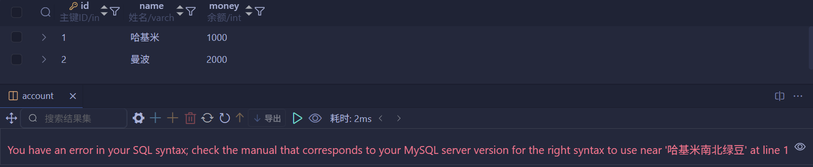
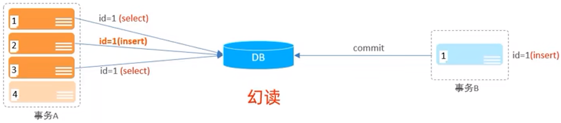

# 事务

## 事务简介

<span style="color:#BF092F">事务</span>是一组操作的集合，它是一个不可分割的工作单位，事务会把所有的操作作为一个整体一起向系统提交或撤销操作请求，即这些操作<span style="color:#F25912">要么同时成功，要么同时失败</span>。


> [!tip]
>
> MySQL 事务默认是自动提交的，也就是说，当执行一条 DML 语句时，MySQL 会立即隐式地提交事务。

先进行数据准备：

```mysql
-- 数据准备
DROP TABLE IF EXISTS `account`;

CREATE TABLE IF NOT EXISTS `account` (
    id INT AUTO_INCREMENT PRIMARY KEY comment '主键ID',
    name VARCHAR(10) COMMENT '姓名',
    money INT COMMENT '余额'
) COMMENT '账户表';

INSERT INTO
    `account` (id, name, money)
VALUES (NULL, '哈基米', 2000),
    (NULL, '曼波', 2000);

UPDATE `account` SET money = 2000 WHERE name = '哈基米' OR name = '曼波';
```


按照之前的逻辑编写 SQL 语句：

```mysql
-- 转账操作
-- 查询哈基米账户余额
SELECT * FROM `account` WHERE name = '哈基米';

-- 将哈基米账户余额减 1000
UPDATE `account` SET money = money - 1000 WHERE name = '哈基米';

-- 将曼波账户余额加 1000
UPDATE `account` SET money = money + 1000 WHERE name = '曼波';

```

直接连续执行这三条 SQL 语句后，有：


接下来模拟异常：

```mysql
SELECT * FROM `account` WHERE name = '哈基米';

-- 将哈基米账户余额减 1000
UPDATE `account` SET money = money - 1000 WHERE name = '哈基米';

哈基米南北绿豆

-- 将曼波账户余额加 1000
UPDATE `account` SET money = money + 1000 WHERE name = '曼波';
```

上述的“哈基米南北绿豆”不属于任何 SQL 语句，因此在执行上述 SQL 语句后：



可以看到“哈基米”的账户余额已经减少 1000 元，但是“曼波”的账户余额并没有增加 1000 元。

MySQL 默认以<u>单条 SQL 语句为单位</u>自动提交事务。 

## 事务操作

### 方式一

- 查看/设置事务提交方式：

  ```mysql
  SELECT @@autocommit;
  SET @@autocommit = 0;
  ```

- 提交事务：

  ```mysql
  COMMIT;
  ```

- 回滚事务：

  ```mysql
  ROLLBACK;
  ```

---

```mysql
SELECT @@autocommit;
```


```mysql
SET @@autocommit = 0;
```


```mysql
SELECT * FROM `account` WHERE name = '哈基米';

UPDATE `account` SET money = money - 1000 WHERE name = '哈基米';

UPDATE `account` SET money = money + 1000 WHERE name = '曼波';

COMMIT;
```

在 `COMMIT` 语句执行前，当前连接查询数据库时会看到数据已发生变化（例如“哈基米”的余额从 2000 变为 1000）：


但若新建另一个连接查询相同数据，会发现数据库中实际数据未变（仍为 2000）：


这体现了**事务隔离性**——未提交的更改仅对当前连接可见，其他连接看不到。执行 `COMMIT` 后，更改才持久化到数据库：


```mysql
SELECT * FROM `account` WHERE name = '哈基米';

UPDATE `account` SET money = money - 1000 WHERE name = '哈基米';

哈基米南北绿豆

UPDATE `account` SET money = money + 1000 WHERE name = '曼波';
```


当运行 SQL 语句出错时，不要执行 `COMMIT` 提交更改。为保证数据正确性，应运行 `ROLLBACK` 语句回滚事务：

```mysql
ROLLBACK;
```


### 方式二

- 开启事务：

  ```mysql
  START TRANSACTION;
  # or 
  BEGIN;
  ```

- 提交事务：

  ```mysql
  COMMIT;
  ```

- 回滚事务：

  ```mysql
  ROLLBACK;
  ```

```mysql
START TRANSACTION;

SELECT * FROM `account` WHERE name = '哈基米';

UPDATE `account` SET money = money - 1000 WHERE name = '哈基米';

哈基米南北绿豆

UPDATE `account` SET money = money + 1000 WHERE name = '曼波';

COMMIT;
```

当前连接查询数据库时会看到数据已发生变化：


新建另一个连接查询相同数据：


可以发现，使用方式二的效果与方式一相同，然后进行 `ROLLBACK` 操作：


## 事务的四大特性

- <span style="font-weight:bold">原子性（<span style="color:#BF092F">A</span>tomicity）</span>：事务是不可分割的最小操作单元，要么全部成功，要么全部失败。

  

- <span style="font-weight:bold">一致性（<span style="color:#BF092F">C</span>onsistency）</span>：事务完成时，必须使所有的数据都保持一致状态。

- <span style="font-weight:bold">隔离性（<span style="color:#BF092F">I</span>solation）</span>：数据库系统提供的隔离机制，保证事务在不受外部并发操作影响的独立环境下运行。

- <span style="font-weight:bold">持久性（<span style="color:#BF092F">D</span>urability）</span>：事务一旦提交或回滚，它对数据库中的数据的改变就是永久的。

  

## 并发事务问题

| 问题类型   | 描述                                                         |
| ---------- | ------------------------------------------------------------ |
| 脏读       | 一个事务读取了另一个事务**尚未提交**的数据                   |
| 不可重复读 | 同一个事务内，**多次读取同一行数据**，结果不一致（因其他事务已修改并提交） |
| 幻读       | 同一个事务内，**按相同条件查询多次**，返回的行数不同（因其他事务插入/删除了满足条件的行） |




## 事务隔离级别

|        隔离级别         | 脏读 | 不可重复读 | 幻读 |
| :---------------------: | :--: | :--------: | :--: |
|    Read uncommitted     |  ✅   |     ✅      |  ✅   |
|     Read committed      |  ❌   |     ✅      |  ✅   |
| Repeatable Read（默认） |  ❌   |     ❌      |  ✅   |
|      Serializable       |  ❌   |     ❌      |  ❌   |

> [!tip]
>
> - 事务隔离级别从 `READ UNCOMMITTED` 到 `SERIALIZABLE` 依次增强，但通常以降低并发性能为代价。  
> - 隔离级别仅影响**读操作的可见性**，而**写操作天然互斥**，由数据库锁机制保证一致性。


```mysql
-- 查看事务隔离级别
SELECT @@transaction_isolation;

-- 设置事务隔离级别
SET [SESSION|GLOBAL] TRANSACTION ISOLATION LEVEL {READ UNCOMMITTED | READ COMMITTED | REPEATABLE READ | SERIALIZABLE}
```

> [!tip]
>
> - 在 MySQL 中，`@@` 用于引用系统变量。  
> - `SET SESSION` 表示仅对**当前会话**设置事务隔离级别，而 `SET GLOBAL` 会对**后续新建的会话**生效（不影响当前及其他已有会话）。

### 脏读

接下来通过两个独立会话演示**<u>脏读</u>**现象。

事务 A（隔离级别设为 `READ UNCOMMITED`）：

```mysql
SET TRANSACTION ISOLATION LEVEL READ UNCOMMITTED;
START TRANSACTION;
SELECT * FROM `account`;
```

事务 B：

```mysql
START TRANSACTION;
UPDATE `account` SET money = money - 1000 WHERE name = '哈基米';
```

在事务 B 执行更新但尚未提交时，立即在事务 A 中再次执行 `SELECT`，结果如下图所示：


可见，事务 A 读取到了事务 B 未提交的修改数据——这正是**<u>脏读（Dirty Read）</u>**的典型表现。

将隔离级别设置为 `READ COMMITTED` 后再执行相同的操作，有：


将事务 B 的修改数据提交后，再执行一次查询语句，结果如下：


可见，当隔离等级为 `READ COMMITTED` 时，规避了脏读问题。

### 不可重复读

通过两个独立会话演示**不可重复读（Non-repeatable Read）**现象。

事务 A（隔离级别为 `READ COMMITTED`）：

```mysql
SET SESSION TRANSACTION ISOLATION LEVEL READ COMMITTED;
START TRANSACTION;
SELECT * FROM account;  -- 第一次查询
SELECT * FROM account;  -- 第二次查询
```

事务 B：

```mysql
START TRANSACTION;
UPDATE account SET money = money + 1000 WHERE name = '哈基米';
COMMIT;
```

事务 A 执行第一次 `SELECT`，结果如下：


随后，事务 B 执行更新并提交。事务 A 再执行第二次 `SELECT`，结果变为：


可见，在同一个事务中，<u>两次查询同一数据返回了不同结果</u>，这正是***不可重复读***的典型表现。

将事务 A 的隔离级别修改为 `REPEATABLE READ` 后，进行相同的操作，得出两次查询的结果如下：


可见，将隔离级别修改为 `REPEATABLE READ` 之后，<u>不可重复读</u>的现象消失。

### 幻读

通过两个独立会话演示**幻读（Phantom Read）**现象。

事务 A（隔离级别为 `REPEATABLE READ`）：

```mysql
SET SESSION TRANSACTION ISOLATION LEVEL REPEATABLE READ;
START TRANSACTION;
SELECT * FROM account WHERE id = 3;  -- 第一次查询，结果为空

-- 基于查询结果，尝试插入 id=3
INSERT INTO account (id, name, money) VALUES (3, '奶龙', 2000);

SELECT * FROM account WHERE id = 3;  -- 第二次查询
```

事务 B：

```mysql
START TRANSACTION;
INSERT INTO account (id, name, money) VALUES (3, '奶龙', 2000);
COMMIT;
```

事务 A 执行第一次 `SELECT`，未查到 `id = 3` 的记录，结果为空：


事务 A 尝试插入相同的 `id = 3`，由于主键冲突，**报错失败**：


随后，事务 B 插入一条 `id = 3` 的新记录并提交。事务 A 再次执行相同的 `SELECT` 查询，**在标准 SQL 定义下应出现幻读**。


将事务 A 的隔离级别设为 `SERIALIZABLE` 后，重复相同操作。此时事务 B 在执行 `INSERT` 语句时被阻塞，如下图所示：  


这是因为 `SERIALIZABLE` 隔离级别通过加锁机制强制事务串行执行——事务 B 必须等待事务 A 完全结束后才能继续，从而彻底避免了幻读。

虽然牺牲了并发性能，但保证了最高的数据一致性。

---

**知识回顾**：

1. 事务简介：事务是一组操作的集合，这组操作，要么全部执行成功，要么全部执行失败。

2. 事务操作：

   ```mysql
   START TRANSACTION;  -- 开启事务
   COMMIT / ROLLBACK;  -- 提交/回滚事务
   ```

3. 事务四大特性：原子性（Atomicity）、一致性（Consistency）、隔离性（Isolation）、持久性（Durability）。

4. 并发事务问题：脏读、不可重复读、幻读。

5. 事务隔离级别：`READ UNCOMMITED`、`READ COMMITTED`、`REPEATABLE READ`、`SERIALIZABLE`。

