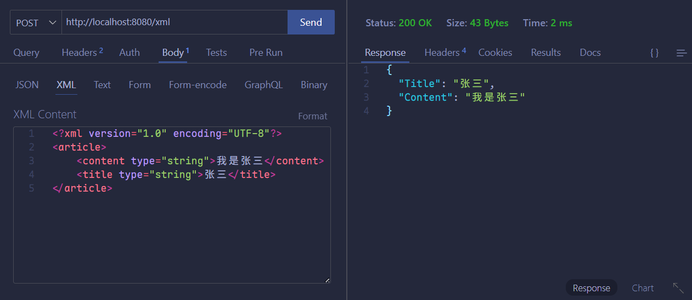

# Gin 框架

## 介绍

Gin 是一个用 Go（Golang）编写的轻量级 HTTP Web 框架，以其出色的性能和高效著称。如果你追求极致的运行速度和开发效率，Gin 是一个理想的选择。

Gin 尤其擅长处理高并发的 API 接口。对于规模不大、业务逻辑相对简单的项目，Gin 同样非常适用。

当某个接口面临较大的性能瓶颈时，也可以考虑使用 Gin 对其进行重构，以提升响应速度和吞吐能力。

## 环境搭建

下载并安装 Gin：

```sh
go get -u github.com/gin-gonic/gin
```

将 Gin 引入到代码中：

```go
import "github.com/gin-gonic/gin"
```

（可选）如果使用 `http.StatusOK` 之类的常量，则需要引入 `net/http` 包：

```go
import "net/http"
```

新建 `main.go` 配置路由：

```go
package main

import (
	"net/http"

	"github.com/gin-gonic/gin"
)

func main() {
	// 创建一个默认路由引擎
	r := gin.Default()
	// 配置路由
	r.GET("/", func(c *gin.Context) {
		c.JSON(http.StatusOK, gin.H{
			"message": "Hello World!",
		})
	})
	// 启动 HTTP 服务，默认在 0.0.0.0:8080 启动服务
	r.Run()
}

```


要改变默认启动的端口：

```go
r.Run(":9000")
```

## 热加载

**热加载（Hot Reload）** 是指在开发过程中，当代码发生修改时，程序能够自动重新编译并重启，无需手动干预。这一功能极大提升了开发效率，使我们能够即时验证代码变更，省去了反复手动编译和重启的繁琐步骤。

在 Beego 框架中，官方提供了 `bee` 工具，原生支持热加载，开箱即用。

而 Gin 作为轻量级框架，并未内置热加载功能，但我们可以借助优秀的第三方工具（如 `air`、`fresh` 或 `gowatch`）来实现相同的效果。

以 `air` 为例：

`air` 是一个专为 Go 项目设计的轻量级热重载工具，支持自动监听文件变化、重新编译并重启服务，且配置灵活、启动迅速，已成为 Gin 等轻量框架开发中的热门选择。

**通过 Go 安装（需 Go 1.17+）**：

```sh
go install github.com/air-verse/air@latest
```

**（可选）初始化配置，在项目根目录下运行**：

```sh
air init
```

会生成 `.air.toml` 配置文件，可以根据需要自定义监听目录、忽略文件、构建命令。

**启动热加载，在项目根目录运行**：

```sh
air
```

此时 `air` 会自动编译并运行主程序（默认为 `main.go`），并在修改 `.go` 文件时自动启动重启服务。

## 路由

### 概述

**路由（Routing）**是由一个 URL（或者称为路径）以及一个特定的 HTTP 方法（`GET`、`POST` 等）组成的，涉及到应用如何响应客户端对某个网站节点的访问。

RESTful API 是目前比较成熟的一套互联网应用程序 API 设计理念，因此自行设计时参考 RESTful API 指南。

在 RESTful 架构中，每个网址代表一种资源，不同的请求方式表示执行不同的操作：

| 方法                      | 说明                                           |
| ------------------------- | ---------------------------------------------- |
| `GET`（Retrieve）         | 获取服务器上的一个或多个资源                   |
| `POST`（Create）          | 在服务器上创建一个新资源                       |
| `PUT`（Update）           | 在服务器上更新资源（需提供完整的新资源表示）   |
| `PATCH`（Partial Update） | 对资源进行部分更新（仅提交需修改的字段）       |
| `DELETE`（Delete）        | 从服务器上删除指定资源                         |
| `HEAD`（Metadata）        | 获取资源的元信息（如响应头），不返回响应体     |
| `OPTIONS`（Discovery）    | 查询服务器对某资源支持的 HTTP 方法或 CORS 策略 |

### 简单路由配置

使用 `GET` 请求访问一个网址时：

```go
	r.GET("/select", func(c *gin.Context) {
		c.String(http.StatusOK, "Get")
	})
```


使用 `POST` 访问一个网址时：

```go
	r.POST("/create", func(c *gin.Context) {
		c.String(http.StatusOK, "Post")
	})
```


使用 `DELETE` 访问一个网址时：

```go
	r.DELETE("/delete", func(c *gin.Context) {
		c.String(http.StatusOK, "Delete")
	})
```


在路由中获取 `GET` 传值，域名为 `/news?aid=20`：

```go
	r.GET("/news", func(c *gin.Context) {
		aid := c.Query("aid")
		c.String(200, "aid = %s", aid)
	})
```


动态路由，域名为 `/user/20`：

```go
	r.GET("/user/:uid", func(c *gin.Context) {
		uid := c.Param("uid")
		c.String(200, "userID = %s", uid)
	})
```


### 响应数据格式

#### `c.String()`

返回一个字符串。

```go
	r.GET("/", func(c *gin.Context) {
		c.String(http.StatusOK, "值：%v", "首页")
	})
```


#### `c.JSON()`

返回一个 JSON 数据。

```go
	r.GET("/json", func(c *gin.Context) {
		c.JSON(http.StatusOK, map[string]any{
			"success": true,
			"message": "Hello Gin!",
		})
	})
```

或者：

```go
	r.GET("/json", func(c *gin.Context) {
		c.JSON(http.StatusOK, gin.H{
			"success": true,
			"message": "Hello Gin!",
		})
	})
```


因为 `c.JSON` 函数的第二个参数类型为 `any`，因此也可以自定义结构体返回：

```go
	r.GET("/struct", func(c *gin.Context) {
		a := &Article{
			"title", "desc", "content",
		}
		c.JSON(http.StatusOK, a)
	})
```


需要小写字段则添加对应的 Tag：

```go
type Article struct {
	Title   string `json:"title"`
	Desc    string `json:"desc"`
	Content string `json:"content"`
}
```


#### `c.JSONP`

```go
	r.GET("/jsonp", func(c *gin.Context) {
		a := &Article{
			"title-jsonp", "desc", "content",
		}
		c.JSONP(http.StatusOK, a)
	})
```

使用 JSONP 格式时，需通过 `callback` 查询参数指定回调函数名（例如 `/jsonp?callback=xxxx`），此时响应将被包裹在名为 `xxxx` 的函数调用中。


#### `c.XML`

与 JSON 格式类似，有：

```go
	r.GET("/xml", func(c *gin.Context) {
		c.XML(http.StatusOK, gin.H{
			"success": true,
			"message": "Hello XML!",
		})
	})
```


也可以自定结构体进行返回：

```go
	r.GET("/struct-xml", func(c *gin.Context) {
		a := &Article{
			"title", "desc", "content",
		}
		c.XML(http.StatusOK, a)
	})
```


#### `c.HTML()`

```go
	r := gin.Default()
	// 加载模板
	r.LoadHTMLGlob("templates/*")
	r.GET("/news", func(c *gin.Context) {
		c.HTML(http.StatusOK, "news.html", gin.H{
			"title": "我是后台数据",
		})
	})
```


在 HTML 模板中，使用 `{{}}` 包裹变量以访问后台传递的数据，例如下面的 `title`：

```html
<!DOCTYPE html>
<html lang="en">
  <head>
    <meta charset="UTF-8" />
    <meta name="viewport" content="width=device-width, initial-scale=1.0" />
    <title>Document</title>
  </head>
  <body>
    <h2>{{.title}}</h2>
  </body>
</html>
```


## HTML 模板渲染

### 所有模板放在相同目录

首先在项目根目录新建一个 `templates` 文件夹，然后在文件夹中新建 `index.html`：

```html
<!DOCTYPE html>
<html lang="en">
  <head>
    <meta charset="UTF-8" />
    <meta name="viewport" content="width=device-width, initial-scale=1.0" />
    <title>Document</title>
  </head>
  <body>
    <h1>这是一个 HTML 模板</h1>
  </body>
</html>
```

Gin 框架中使用 `c.HTML` 可以渲染模板，渲染模板前需要使用 `LoadHTMLGlob` 或 `LoadHTMLFiles` 方法加载模板。

```go
r.GET("/", func(c *gin.Context) {
  c.HTML(http.StatusOK, "default/index.html", gin.H{
    "title": "前台首页",
  })
})

r.GET("/", func(c *gin.Context) {
  c.HTML(http.StatusOK, "index.html", map[string]interface{}{
    "title": "Main website"
  })
})
```

```go
package main

import (
	"net/http"

	"github.com/gin-gonic/gin"
)

func main() {
	r := gin.Default()
	r.LoadHTMLGlob("templates/*")
	r.GET("/", func(c *gin.Context) {
		c.HTML(http.StatusOK, "index.html", gin.H{
			"title": "Main Website",
		})
	})
	r.Run()
}
```


### 不同模板放在不同目录

Gin 框架中，若不同目录下有同名模板则需要使用后文方法加载模板。

> [!tip]
>
> 定义模板时，需要使用 `define` 关键字。

`templates/admin/index.html`：

```html
{{define "admin/index.html"}}
<!DOCTYPE html>
<html lang="en">
  <head>
    <meta charset="UTF-8" />
    <meta name="viewport" content="width=device-width, initial-scale=1.0" />
    <title>Document</title>
  </head>
  <body>
    <h1>后台模板</h1>
    <h3>{{.title}}</h3>
  </body>
</html>
{{end}}
```

`templates/default/index.html`：

```html
{{define "default/index.html"}}
<!DOCTYPE html>
<html lang="en">
  <head>
    <meta charset="UTF-8" />
    <meta name="viewport" content="width=device-width, initial-scale=1.0" />
    <title>Document</title>
  </head>
  <body>
    <h1>前台模板</h1>
    <h3>{{.title}}</h3>
  </body>
</html>
{{end}}
```

对应的 Go 语言业务逻辑为：

```go
package main

import (
	"net/http"

	"github.com/gin-gonic/gin"
)

func main() {
	r := gin.Default()
	r.LoadHTMLGlob("templates/**/*")
	r.GET("/", func(c *gin.Context) {
		c.HTML(http.StatusOK, "default/index.html", gin.H{
			"title": "前台首页",
		})
	})
	r.GET("/admin", func(c *gin.Context) {
		c.HTML(http.StatusOK, "admin/index.html", gin.H{
			"title": "后台首页",
		})
	})
	r.Run()
}
```


> [!tip]
>
> 若模板在多级目录中，使用 `r.LoadHTMLGlob("templates/**/*")`，其中 `**` 是递归通配符，表示匹配任意深度的子目录。
>
> 如果想限制深度，可以用多个 `*`（如 `templates/*/*/*.html` 匹配三级）。

### 基本语法

#### `{{.}}` 输出数据

模板语法都包含在 `{{}}` 中，其中 `{{.}}` 中的 `.` 表示当前对象。

当传入一个结构体对象时，可以根据 `.` 来访问结构体的对应字段。

Go 代码如下：

```go
package main

import (
	"net/http"

	"github.com/gin-gonic/gin"
)

type UserInfo struct {
	Name   string
	Gender string
	Age    int
}

func main() {
	r := gin.Default()
	r.LoadHTMLGlob("template/**/*")
	user := &UserInfo{
		Name:   "哈基米",
		Gender: "女",
		Age:    18,
	}
	r.GET("/", func(c *gin.Context) {
		c.HTML(http.StatusOK, "default/index.html", gin.H{
			"title": "前台首页",
			"user":  user,
		})
	})
	r.Run()
}
```

模板如下：

```html
{{define "default/index.html"}}
<!DOCTYPE html>
<html lang="en">
  <head>
    <meta charset="UTF-8" />
    <meta name="viewport" content="width=device-width, initial-scale=1.0" />
    <title>Document</title>
  </head>
  <body>
    <h1>前台模板</h1>
    <h3>{{.title}}</h3>
    <h4>{{.user.Name}}</h4>
    <h4>{{.user.Age}}</h4>
  </body>
</html>
{{end}}
```


#### 注释

```html
{{/* a comment*/}}
```

注释在执行时会忽略，可以多行。注释不可嵌套，并且必须紧贴分界符始终。

#### 变量

可以在模板中声明变量，用来保存传入模板的数据或其他语句生成的结果。具体语法如下：

```html
<h4>
  {{$obj := .title}}
</h4>
<h4>
  {{$obj}}
</h4>
```

#### 移除空格

Go 模板在渲染时会原样保留模板中的空白字符。若希望避免因换行或缩进导致的多余空格，可在模板动作的 `{{` 后加 `-`（如 `{{-`）以去除左侧空白，或在 `}}` 前加 `-`（如 `-}}`）以去除右侧空白。

```html
{{- .Name .-}}
```

> [!tip]
>
> `-` 要紧挨 `{{` 和 `}}`，同时与模板值之间需要使用空格分隔。

#### 比较函数

布尔函数会将任何类型的零值视为假，其余视为真。

- `eq`：如果 `arg1 == arg2` 则返回真
- `ne`：如果 `arg1 != arg2` 则返回真
- `lt`：如果 `arg1 < arg2` 则返回真
- `le`：如果 `arg1 <= arg2` 则返回真
- `gt`：如果 `arg1 > arg2` 则返回真
- `ge`：如果 `arg1 >= arg2` 则返回真

#### 条件判断

Go 模板语法中条件判断有如下几种：

```html
{{if pipeline}}
  <p>T1</p>
{{end}}

{{if pipeline}}
	<p>T1</p>
{{else}}
	<p>T0</p>
{{end}}

{{if gt .score 60}}
	<p>及格</p>
{{else}}
	<p>不及格</p>
{{end}}

{{if gt .score 90}}
	<p>优秀</p>
{{else if gt .score 60}}
	<p>及格</p>
{{else}}
	<p>不及格</p>
{{end}}
```

#### `range`

Go 的模板语法中使用 `range` 关键字进行遍历，有以下两种写法，其中 `pipeline` 的值必须为数组、切片、字典或通道。

若 `pipeline` 的长度为 0，不会有任何输出。

```html
{{range $key, $value := .obj}}
  <p>{{$value}}</p>
{{end}}
```

若 `pipeline` 的长度为 0，则执行 `T0`。

```html
{{range $key, $value := .obj}}
  <p>{{$value}}</p>
{{else}}
  <p>pipeline 的长度为 0</p>
{{end}}
```

举例，Go 代码如下：

```go
	r.GET("/", func(c *gin.Context) {
		c.HTML(http.StatusOK, "default/index.html", gin.H{
			"hobby": []string{"吃饭", "睡觉", "敲代码"},
		})
	})
```

模板如下：

```html
    <u>
      {{range $key, $value := .hobby}}
      <pi>{{$key}}---{{$value}}</pi>
      {{end}}
    </u>
```


#### `with`

```go
package main

import (
	"net/http"

	"github.com/gin-gonic/gin"
)

type UserInfo struct {
	Name   string
	Gender string
	Age    int
}

func main() {
	r := gin.Default()
	r.LoadHTMLGlob("templates/**/*")
	user := &UserInfo{
		Name:   "曼波",
		Gender: "男",
		Age:    18,
	}
	r.GET("/", func(c *gin.Context) {
		c.HTML(http.StatusOK, "default/index.html", gin.H{
			"user": user,
		})
	})
}
```

之前输出数据需要：

```html
  <body>
    <h4>{{.user.Name}}</h4>
    <h4>{{.user.Gender}}</h4>
    <h4>{{.user.Age}}</h4>
  </body>
```

使用 `with` 后：

```html
  <body>
    {{with .user}}
    <h4>{{.Name}}</h4>
    <h4>{{.Gender}}</h4>
    <h4>{{.Age}}</h4>
    {{end}}
  </body>
```


#### 预定义函数

执行模板时，函数从两个函数字典中查找：首先是模板函数字典，然后是全局函数字典。一般不在模板内定义函数，而是使用 `SetFuncMap` 方法添加函数到模板中。

预定义的全局函数如下：

- **`and`**：
  
  返回第一个**空值（empty）**参数，若所有参数均非空，则返回最后一个参数。 
  
  等价于：`and x y` ⇔ `if x then y else x`。  
  
  > [!tip]
  >
  > 所有参数都会被求值。
  
- **`or`**：
  返回第一个**非空值（non-empty）**参数，若所有参数均为空，则返回最后一个参数。 
  
  等价于：`or x y` ⇔ `if x then x else y`。 

  > [!tip]
  >
  > 所有参数都会被求值。
  
- **`not`**：
  
  对其唯一参数进行布尔取反，返回其布尔值的否定结果。
  
- **`len`**：
  
  返回参数的长度（整数类型）。参数必须是支持 `len()` 的类型（如字符串、数组、切片、映射等）。
  
- **`index`**  
  
  使用后续参数作为索引（或键）依次访问第一个参数的嵌套元素。  
  
  例如：`index x 1 2 3` 等价于 `x[1][2][3]`。 
  
  每一步被索引的对象必须是数组、切片或字典（map）。
  
- **`print`**：
  
  等同于 Go 标准库中的 `fmt.Sprint`，将参数转换为字符串并拼接。
  
- **`printf`**：
  
  等同于 `fmt.Sprintf`，支持格式化字符串。
  
- **`println`**：
  
  等同于 `fmt.Sprintln`，将参数转换为字符串并以空格分隔，末尾添加换行符。
  
- **`html`**：
  
  返回参数文本表示的 **HTML 转义**形式（例如 `<` 转为 `&lt;`）。 

  > [!tip]
  >
  > 此函数在 `html/template` 包中**不可用**（因该包已自动转义）。
  
- **`urlquery`**：
  
  返回参数文本表示的 **URL 查询字符串转义**形式（适用于嵌入到 URL 查询参数中）。 

  > [!tip]
  >
  > 此函数在 `html/template` 包中**不可用**。
  
- **`js`**：
  返回参数文本表示的 **JavaScript 字符串转义**形式（例如换行符转为 `\n`，引号转义等）。 
  
  > [!tip]
  >
  > 此函数在 `html/template` 包中**不可用**。
  
- **`call`**：
  
  调用第一个参数所代表的函数，其余参数作为该函数的实参。 
  
  例如：`call .X.Y 1 2` 等价于 Go 代码中的 `dot.X.Y(1, 2)`，其中 `Y` 可以是函数类型的字段、map 中的函数值等。 
  
  **要求**：
  
  - 第一个参数的求值结果必须是**函数类型**（与 `print` 等预定义函数不同，`call` 的第一个参数是动态函数值）。
  - 该函数必须有 **1 或 2 个返回值**；若为两个，第二个必须是 `error` 类型。
  - 若函数返回非 `nil` 的 `error`，模板执行将立即终止，并将该错误返回给调用者。

```html
  <body>
    {{len .user.Name}}
    <br />
    {{index .hobby 2}}
  </body>
```


#### 自定义模板函数

语法如下：

```go
r.SetFuncMap(template.FuncMap{
  "formatDate": formatAsDate,
})
```

举例：

```go
package main

import (
	"net/http"
	"text/template"
	"time"

	"github.com/gin-gonic/gin"
)

func UnixToTime(timestamp int64) string {
	return time.Unix(timestamp, 0).Format("2006-01-02 15:03:04")
}

func main() {
	r := gin.Default()

	r.SetFuncMap(template.FuncMap{
		"UnixToTime": UnixToTime,
	})

	r.LoadHTMLGlob("templates/**/*")

	r.GET("/", func(c *gin.Context) {
		c.HTML(http.StatusOK, "default/index.html", gin.H{
			"title": "前台首页",
			"now":   time.Now().Unix(),
		})
	})

	r.Run()
}
```

在模板是使用：

```html
{{.now | UnixToTime}}
```

或：

```html
{{UnixToTime .now}}
```


### 嵌套 `template`

新建 `templates/public/page_header.html`：

```html
{{define "public/page_header.html"}}
<h1>我是公共头部</h1>
{{end}}
```

进行外部引入：

> [!tip]
>
> 1. 引入的名字要为 `page_header.html` 中定义的名字
> 2. 引入时要注意最后的 `.`

```html
{{template "public/page_header.html" .}}
```

举例：

```html
{{define "default/index.html"}}
<!DOCTYPE html>
<html lang="en">
  <head>
    <meta charset="UTF-8" />
    <meta name="viewport" content="width=device-width, initial-scale=1.0" />
    <title>Document</title>
  </head>
  <body>
    {{template "public/page_header.html" .}}
  </body>
</html>
{{end}}
```


## 静态文件服务

当渲染的 HTML 文件中引入了静态文件时，需要配置静态 Web 服务。

```go
r.Static("/static", "./static")
```

第一个参数 `/static` 代表路由，第二个参数 `./static` 代表路径。

`static/css/base.css`：

```css
h1 {
    background: #000;
    color: #fff;
    text-align: center;
}

h2 {
    color: red
}
```

Go 代码如下：

```go
package main

import (
	"net/http"

	"github.com/gin-gonic/gin"
)

func main() {
	r := gin.Default()

	r.Static("/xxxx", "./static")

	r.LoadHTMLGlob("templates/**/*")

	r.GET("/", func(c *gin.Context) {
		c.HTML(http.StatusOK, "default/index.html", gin.H{
			"title": "前台首页",
		})
	})

	r.Run()
}
```

模板代码如下：

```html
{{define "default/index.html"}}
<!DOCTYPE html>
<html lang="en">
  <head>
    <meta charset="UTF-8" />
    <meta name="viewport" content="width=device-width, initial-scale=1.0" />
    <title>Document</title>
    <link rel="stylesheet" href="/xxxx/css/base.css" />
  </head>
  <body>
    {{template "public/page_header.html" .}}
    <h2>哇这个好可爱</h2>
    
  </body>
</html>
{{end}}
```


## 路由详解

路由（Routing）是由一个 URL（或称为路径）和一个特定的 HTTP 方法（`GET`、`POST` 等）组成的，涉及到应用如何响应客户端对某个网站节点的访问。

### `GET`、`POST` 及其传值

#### `GET` 请求传值

```go
package main

import (
	"net/http"

	"github.com/gin-gonic/gin"
)

func main() {
	r := gin.Default()

	r.GET("/user", func(c *gin.Context) {
		uid := c.Query("uid")
		page := c.DefaultQuery("page", "0")
		c.String(http.StatusOK, "uid = %v, page = %v", uid, page)
	})

	r.Run()
}
```


在上述代码中：

- `c.Query` 用于直接获取 URL 查询参数的值，若参数不存在则返回空字符串。  
- `c.DefaultQuery` 在参数未传入时会返回指定的默认值，适用于需要兜底值的场景。

#### 动态路由传值

```go
	r.GET("/user/:uid", func(c *gin.Context) {
		uid := c.Param("uid")
		c.String(http.StatusOK, "userID = %s", uid)
	})
```


其中 `c.Param("uid")` 用于从动态路由中提取 `uid` 参数的值。

#### `POST` 请求传值及获取 `form` 表单数据

定义一个 `add_user.html` 页面：

```html
{{define "default/add_user.html"}}
<!DOCTYPE html>
<html lang="en">
  <head>
    <meta charset="UTF-8" />
    <meta name="viewport" content="width=device-width, initial-scale=1.0" />
    <title>Document</title>
  </head>
  <body>
    <form action="/doAddUser" method="post">
      用户名：<input type="text" name="username" />

      密码：<input type="password" name="password" />

      <input type="submit" value="提交" />
    </form>
  </body>
</html>
{{end}}
```

通过 `c.PostForm` 接收表单传过来的数据：

```go
	r.GET("/addUser", func(c *gin.Context) {
		c.HTML(http.StatusOK, "default/add_user.html", gin.H{})
	})

	r.POST("/doAddUser", func(c *gin.Context) {
		username := c.PostForm("username")
		password := c.PostForm("password")
		age := c.DefaultPostForm("age", "20")

		c.JSON(http.StatusOK, gin.H{
			"username": username,
			"password": password,
			"age":      age,
		})
	})
```


#### 获取 `GET`、`POST` 传递的数据绑定到结构体

为了更便捷地获取请求参数、提升开发效率，Gin 提供了自动绑定功能：

它会根据请求的 `Content-Type` 自动识别数据类型（如 JSON、表单、查询字符串等），并利用反射机制将请求中的参数自动映射到指定的结构体字段中。 

`c.ShouldBind` 方法正是实现这一功能的核心——它能智能解析请求体或 URL 查询参数（包括 JSON、form 表单和 QueryString 等格式），并将提取出的数据自动绑定到对应的结构体实例上。 

定义一个 `UserInfo` 结构体：

```go
type UserInfo struct {
	Username string `form:"username" json:"username"`
	Password string `form:"password" json:"password"`
}
```

##### `GET` 传值绑定到结构体

```go
	r.GET("/", func(c *gin.Context) {
		userInfo := &UserInfo{}
		if err := c.ShouldBind(userInfo); err != nil {
			c.JSON(http.StatusBadRequest, gin.H{
				"error": err.Error(),
			})
		} else {
			c.JSON(http.StatusOK, userInfo)
		}
	})
```


##### `POST` 传值绑定到结构体

```go
	r.POST("/doLogin", func(c *gin.Context) {
		userInfo := &UserInfo{}
		if err := c.ShouldBind(userInfo); err != nil {
			c.JSON(http.StatusBadRequest, gin.H{"error": err.Error()})
		} else {
			c.JSON(http.StatusOK, userInfo)
		}
	})
```

将之前的模板修改为：

```html
{{define "default/add_user.html"}}
<!DOCTYPE html>
<html lang="en">
  <head>
    <meta charset="UTF-8" />
    <meta name="viewport" content="width=device-width, initial-scale=1.0" />
    <title>Document</title>
  </head>
  <body>
    <form action="/doLogin" method="post">
      用户名：<input type="text" name="username" />
      <br />
      密码：<input type="password" name="password" />
      <br />
      <input type="submit" value="提交" />
    </form>
  </body>
</html>
{{end}}
```


#### 获取 `POST` 请求中的 XML 数据

在 API 开发中，经常使用 JSON 或 XML 作为数据交互的格式，此时可以在 `gin` 中使用 `c.GetRawData` 获取数据。

以下为示例 XML 数据：

```xml
<?xml version="1.0" encoding="UTF-8"?>
<article>
    <content type="string">我是张三</content>
    <title type="string">张三</title>
</article>
```

对应的结构体：

```go
type Article struct {
	Title   string `xml:"title"`
	Content string `xml:"content"`
}
```

对应的 Go 语言代码：

```go
	r.POST("/xml", func(c *gin.Context) {
		a := &Article{}
		if err := c.ShouldBindXML(a); err != nil {
			c.JSON(http.StatusBadRequest, gin.H{"error": err.Error()})
		} else {
			c.JSON(http.StatusOK, a)
		}
	})
```



> [!tip]
>
> 当请求体为 JSON 时，使用 `c.ShouldBindJSON` 进行绑定。

### 简单路由组

```go
package main

import (
	"net/http"

	"github.com/gin-gonic/gin"
)

func main() {
	r := gin.Default()
	defaultRouters := r.Group("/")
	{
		defaultRouters.GET("/", func(c *gin.Context) {
			c.String(http.StatusOK, "首页")
		})
		defaultRouters.GET("/news", func(c *gin.Context) {
			c.String(http.StatusOK, "新闻")
		})
	}
	apiRouters := r.Group("/api")
	{
		apiRouters.GET("/", func(c *gin.Context) {
			c.String(http.StatusOK, "我是一个 API 接口")
		})
		apiRouters.GET("/userlist", func(c *gin.Context) {
			c.String(http.StatusOK, "我是一个 API-userlist 接口")
		})
		apiRouters.GET("/plist", func(c *gin.Context) {
			c.String(http.StatusOK, "我是一个 API-plist 接口")
		})
	}
	adminRouters := r.Group("/admin")
	{
		adminRouters.GET("/", func(c *gin.Context) {
			c.String(http.StatusOK, "后台首页")
		})
		adminRouters.GET("/user", func(c *gin.Context) {
			c.String(http.StatusOK, "用户列表")
		})
		adminRouters.GET("/article", func(c *gin.Context) {
			c.String(http.StatusOK, "新闻列表")
		})
	}
	r.Run()
}
```


### 路由文件分组

新建 `routes` 文件夹，其下新建 `admin_routers.go`、`api_routers.go`、`web_routers.go`。

`admin_routers.go`：

```go
package routers

import (
	"net/http"

	"github.com/gin-gonic/gin"
)

func AdminRoutersInit(r *gin.Engine) {
	adminRouters := r.Group("/admin")
	{
		adminRouters.GET("/", func(c *gin.Context) {
			c.String(http.StatusOK, "后台首页")
		})
		adminRouters.GET("/user", func(c *gin.Context) {
			c.String(http.StatusOK, "用户列表")
		})
		adminRouters.GET("/article", func(c *gin.Context) {
			c.String(http.StatusOK, "新闻列表")
		})
	}
}
```

`api_routers.go`：

```go
package routers

import (
	"net/http"

	"github.com/gin-gonic/gin"
)

func APIRoutersInit(r *gin.Engine) {
	apiRouters := r.Group("/api")
	{
		apiRouters.GET("/", func(c *gin.Context) {
			c.String(http.StatusOK, "我是一个 API 接口")
		})
		apiRouters.GET("/userlist", func(c *gin.Context) {
			c.String(http.StatusOK, "我是一个 API-userlist 接口")
		})
		apiRouters.GET("/plist", func(c *gin.Context) {
			c.String(http.StatusOK, "我是一个 API-plist 接口")
		})
	}
}
```

`web_routers.go`：

```go
package routers

import (
	"net/http"

	"github.com/gin-gonic/gin"
)

func WebRoutersInit(r *gin.Engine) {
	webRouters := r.Group("/")
	{
		webRouters.GET("/", func(c *gin.Context) {
			c.String(http.StatusOK, "首页")
		})
		webRouters.GET("/news", func(c *gin.Context) {
			c.String(http.StatusOK, "新闻")
		})
	}
}
```

而后修改 `main.go` 文件为：

```go
package main

import (
	"test_2025_10_18/routers"

	"github.com/gin-gonic/gin"
)

func main() {
	r := gin.Default()

	routers.WebRoutersInit(r)
	routers.APIRoutersInit(r)
	routers.AdminRoutersInit(r)

	r.Run()
}
```


## 自定义控制器

### 控制器分组

新建 `controller/admin/index_controller.go`：

```go
package admin

import (
	"net/http"

	"github.com/gin-gonic/gin"
)

type IndexController struct{}

func (ic IndexController) Index(c *gin.Context) {
	c.String(http.StatusOK, "后台首页")
}
```

新建 `controller/admin/user_controller.go`：

```go
package admin

import (
	"net/http"

	"github.com/gin-gonic/gin"
)

type UserController struct{}

func (uc UserController) Index(c *gin.Context) {
	c.String(http.StatusOK, "用户列表")
}

func (uc UserController) Add(c *gin.Context) {
	c.String(http.StatusOK, "用户列表-add")
}

func (uc UserController) Edit(c *gin.Context) {
	c.String(http.StatusOK, "用户列表-edit")
}
```

新建 `controllers/admin/article_controller.go`：

```go
package admin

import (
	"net/http"

	"github.com/gin-gonic/gin"
)

type ArticleController struct{}

func (ac ArticleController) Index(c *gin.Context) {
	c.String(http.StatusOK, "新闻列表")
}

func (ac ArticleController) Add(c *gin.Context) {
	c.String(http.StatusOK, "新闻列表-add")
}

func (ac ArticleController) Edit(c *gin.Context) {
	c.String(http.StatusOK, "新闻列表-edit")
}

```

配置对应的路由 `routers/admin_routers.go`：

```go
package routers

import (
	"test_2025_10_18/controllers/admin"

	"github.com/gin-gonic/gin"
)

func AdminRoutersInit(r *gin.Engine) {
	adminRouters := r.Group("/admin")
	{
		adminRouters.GET("/", admin.IndexController{}.Index)

		adminRouters.GET("/user", admin.UserController{}.Index)
		adminRouters.GET("/user/add", admin.UserController{}.Add)
		adminRouters.GET("/user/edit", admin.UserController{}.Edit)

		adminRouters.GET("/article", admin.ArticleController{}.Index)
		adminRouters.GET("/article/add", admin.ArticleController{}.Add)
		adminRouters.GET("/article/edit", admin.ArticleController{}.Edit)
	}
}
```

其他路由配置的方法类似。

### 控制器继承

新建 `controllers/admin/base_controller.go`：

```go
package admin

import (
	"net/http"

	"github.com/gin-gonic/gin"
)

type BaseController struct{}

func (bc *BaseController) Success(c *gin.Context) {
	c.String(http.StatusOK, "成功")
}

func (bc *BaseController) Fail(c *gin.Context) {
	c.String(http.StatusOK, "失败")
}
```

`UserController` 继承 `BaseController`：

```go
package admin

import (
	"net/http"

	"github.com/gin-gonic/gin"
)

type UserController struct {
	BaseController
}

func (uc UserController) Index(c *gin.Context) {
	c.String(http.StatusOK, "用户列表")
	uc.Success(c)
}

func (uc UserController) Add(c *gin.Context) {
	c.String(http.StatusOK, "用户列表-add")
}

func (uc UserController) Edit(c *gin.Context) {
	c.String(http.StatusOK, "用户列表-edit")
}
```


## 中间件

Gin 框架支持在请求处理流程中插入自定义的钩子函数，这类函数被称为中间件（Middleware）。中间件非常适合用于实现通用的业务逻辑，例如用户认证、权限校验、数据分页、日志记录、请求耗时统计等。

通俗地说，中间件是在路由匹配之前或之后执行的一系列操作，用于对请求或响应统一处理。

### 路由中间件

#### 初始中间件

Gin 中的中间件必须为 `gin.HandleFunc` 类型，配置路由时可以传递多个 `func` 回调函数，最后一个 `func` 回调函数前面触发的方法均可称为中间件。

> [!tip]
>
> `gin.HandleFunc` 本质上就是 `func(*Context)`。

```go
package main

import (
	"fmt"
	"net/http"

	"github.com/gin-gonic/gin"
)

func initMiddleware(c *gin.Context) {
	fmt.Println("我是中间件")
}

func main() {
	r := gin.Default()

	r.GET("/", initMiddleware, func(c *gin.Context) {
		c.String(http.StatusOK, "首页——中间件演示")
	})

	r.GET("/news", initMiddleware, func(c *gin.Context) {
		c.String(http.StatusOK, "新闻页面——中间件演示")
	})

	r.Run()
}
```


#### `c.Next` 继续执行后续流程

在 Gin 中间件中调用 `c.Next()`，会将控制权交给下一个中间件或最终的路由处理函数。

调用之后的代码将在**路由处理完成、响应尚未返回前**执行，常用于日志记录、耗时统计、错误处理等后置操作。

```go
package main

import (
	"fmt"
	"net/http"
	"time"

	"github.com/gin-gonic/gin"
)

func initMiddleware(c *gin.Context) {
	start := time.Now().UnixNano()
	fmt.Println("1-执行中，中间件")
	c.Next()
	end := time.Now().UnixNano()
	fmt.Printf("3-程序执行完成，计算时间：%d\n", end-start)
}

func main() {
	r := gin.Default()

	r.GET("/", initMiddleware, func(c *gin.Context) {
		fmt.Println("2-执行首页返回数据")
		c.String(http.StatusOK, "首页——中间件演示")
	})

	r.GET("/news", initMiddleware, func(c *gin.Context) {
		c.String(http.StatusOK, "新闻页面——中间件演示")
	})

	r.Run()
}
```


#### 一个路由配置多个中间件的执行顺序

```go
package main

import (
	"fmt"
	"net/http"

	"github.com/gin-gonic/gin"
)

func initMiddlewareOne(c *gin.Context) {
	fmt.Println("1-执行中，中间件-One")
	c.Next()
	fmt.Println("3-执行中，中间件-One")
}

func initMiddlewareTwo(c *gin.Context) {
	fmt.Println("1-执行中，中间件-Two")
	c.Next()
	fmt.Println("3-执行中，中间件-Two")
}

func main() {
	r := gin.Default()

	r.GET("/", initMiddlewareOne, initMiddlewareTwo, func(c *gin.Context) {
		fmt.Println("2-执行路由中的程序")
		c.String(http.StatusOK, "首页——中间件演示")
	})

	r.Run()
}
```


#### `c.Abort`

调用 `c.Abort()` 会立即停止执行后续的中间件和路由处理函数，但**不会中断当前中间件中已开始的逻辑**。通常用于权限校验失败、请求非法等场景，配合 `c.JSON()` 等方法直接返回响应。

```go
package main

import (
	"fmt"
	"net/http"

	"github.com/gin-gonic/gin"
)

func initMiddlewareOne(c *gin.Context) {
	fmt.Println("1-执行中，中间件-One")
	// 调用该请求剩余处理程序
	c.Next()
	fmt.Println("3-执行中，中间件-One")
}

func initMiddlewareTwo(c *gin.Context) {
	fmt.Println("1-执行中，中间件-Two")
	// 终止该请求剩余处理程序
	c.Abort()
	fmt.Println("3-执行中，中间件-Two")
}

func main() {
	r := gin.Default()

	r.GET("/", initMiddlewareOne, initMiddlewareTwo, func(c *gin.Context) {
		fmt.Println("2-执行路由中的程序")
		c.String(http.StatusOK, "首页——中间件演示")
	})

	r.Run()
}
```

