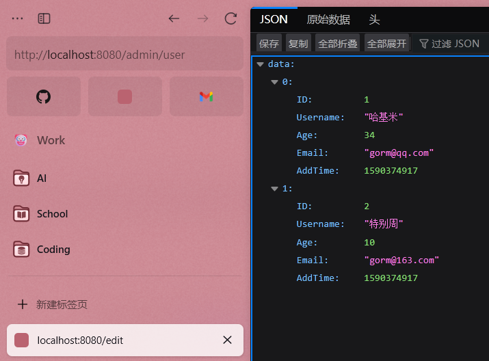

# GORM 框架

## 介绍

GORM 是 Go 语言中一个广受欢迎的 ORM（对象-关系隐射，Object-Relational Mapping）框架。ORM 技术允许开发者通过操作程序中的对象实例，以面向对象的方式完成对关系型数据库的增删改查等操作，从而显著简化数据库交互。GORM 官方支持多种主流数据库，包括 MySQL、PostgreSQL、SQLite 和 SQL Server。


## 特性

- 全功能 ORM：支持完整的对象映射能力，覆盖主流数据库操作场景。
- 丰富关联支持：包括 `Has One`、`Has Many`、`Belongs To`、`Many To Many`、多态关联、单表继承等复杂关系建模。
- CRUD 钩子机制：在 `Create`、`Save`、`Update`、`Delete`、`Find` 等操作中支持自定义钩子方法，灵活控制生命周期行为。
- 预加载与联表查询：支持 `Preload` 和 `Joins`，实现高效的数据关联加载。
- 事务管理：支持标准事务、嵌套事务、保存点（Save Point）、回滚至指定保存点。
- 上下文与调试支持：集成 `Context` 传递、预编译模式、DryRun 模式（仅生成 SQL 不执行），便于调试于性能分析。
- 批量操作与高级查询：
  - 批量插入（Batch Insert）
  - 分批查找（FindInBatches）
  - 使用 Map 进行 Find/Create
  - 支持原生 SQL 表达式、Context Valuer 参数绑定
- SQL 构建与优化工具：
  - 内置 SQL 构建器
  - Upsert（插入或更新）支持
  - 数据库锁机制
  - Optimizer/index/Comment Hint 注解
  - 命名参数、子查询支持
- 数据完整性保障：支持复合主键、索引、约束定义。
- 自动迁移：根据结构体自动同步数据库表结构（支持安全模式与版本控制）。
- 日志系统：支持自定义 Logger，灵活记录 SQL 执行与错误信息。
- 插件化拓展架构：
  - 提供可拓展插件 API，如 Database Resolver（支持多数据库、读写分离）、Prometheus 监控集成等。
- 质量保障：所有核心功能均经过严格单元测试与集成测试验证。
- 开发者体验友好：API 设计简单直观，文档完善，社区活跃，学习成本低。

## 使用

### 安装

```sh
go get -u gorm.io/gorm
go get -u gorm.io/driver/mysql
```

> [!tip]
>
> 使用其他数据库则安装对应的驱动。

### 连接数据库

在 `models` 包中新建 `db.go`，建立数据库连接：

```go
package models

import (
	"fmt"

	"gorm.io/driver/mysql"
	"gorm.io/gorm"
)

var DB *gorm.DB

func init() {
	dsn := "root:123456@tcp(127.0.0.1:3306)/test_db?charset=utf8mb4&parseTime=True&loc=Local"
	var err error
	DB, err = gorm.Open(mysql.Open(dsn), &gorm.Config{})

	if err != nil {
		fmt.Println(err)
	}
}
```

> [!tip]
>
> 为了便于外部访问，将 `DB` 定义为公共变量。

### 定义模型

GORM 官方提供给详细的文档：

https://gorm.io/zh_CN/docs/models.html

尽管 GORM 支持指定字段类型并自动生成数据表，但在实际项目开发中，通常现设计好数据库表结构，再基于该结构进行编码实现。

**在实际项目中定义数据库模型需要注意**：

- **结构体名称必须首字母大写**，并且和数据库表名称对应。例如，表名称为 `users`，则结构体名称定义为 `User`；表名称为 `article_cates`，结构体名称定义为 `ArticleCate`。将蛇形命名转换为驼峰命名。

- 结构体中的**字段名称首字母必须大写**，并且和数据库表的字段一一对应。例如，结构体中的 `ID` 与数据库中的 `id` 对应，`Username` 与数据库中的 `username` 对应，`Age` 和数据库中的 `age` 对应，`Email` 和数据库中的 `email` 对应，`AddTime` 和数据库中的 `add_time` 字段对应。

- **默认情况下，表名是结构体名称的复数形式。**若结构体名称定义为 `User`，表示这个模型默认操作的是 `users` 表。

- 可以使用结构体中的自定义方法 `TableName` 改变结构体的默认表名称，如下：

  ```go
  func (User) TableName() string {
    return "user"
  }
  ```

  表示将 `User` 结构体默认操作的表改为 `user` 表。

`user.go`：

```go
package models

type User struct {
	ID       int
	Username string
	Age      int
	Email    string
	AddTime  int
}

func (User) TableName() string {
	return "users"
}
```

`gorm.Model`：

GORM 中默认定义了一个 `gorm.Model 结构体，其包含以下字段：

- `ID`：主键  
- `CreatedAt`：记录创建时间  
- `UpdatedAt`：记录更新时间  
- `DeletedAt`：用于实现软删除   

```go
type Model struct {
	ID        uint `gorm:"primarykey"`
	CreatedAt time.Time
	UpdatedAt time.Time
	DeletedAt DeletedAt `gorm:"index"`
}
```

可以在其他结构体中直接嵌入 `gorm.Model` 来复用这些字段：

```go
type User struct {
	gorm.Model
	Name  string
	Email string `gorm:"unique"`
}
```

## CURD

首先，在对应数据库表的控制器中引入 `models` 模块。 

### 增加

https://gorm.io/zh_CN/docs/create.html

```go
func (UserController) Add(c *gin.Context) {
	user := models.User{
		Username: "大狗叫",
		Age:      22,
		Email:    "gin@gorm.com",
		AddTime:  int(models.GetUnix()),
	}
  models.DB.Create(&user)
  fmt.Println(user)
  c.String(http.StatusOK, "增加用户")
}
```

添加多条记录时，可以：

```go
func (UserController) Add(c *gin.Context) {
	users := []*models.User{
		{Username: "Fender", Age: 18, Email: "fender@qq.com", AddTime: int(models.GetUnix())},
		{Username: "Gibson", Age: 18, Email: "gibson@163.com", AddTime: int(models.GetUnix())},
	}
	models.DB.Create(users)
	fmt.Println(users)
	c.String(http.StatusOK, "增加用户")
}
```

使用现代方式，有：

```go
func (UserController) Add(c *gin.Context) {
	user := models.User{
		Username: "大狗叫",
		Age:      22,
		Email:    "gin@gorm.com",
		AddTime:  int(models.GetUnix()),
	}
	ctx := context.Background()
	err := gorm.G[models.User](models.DB).Create(ctx, &user)
	if err != nil {
		c.String(http.StatusInternalServerError, "创建用户失败")
		return
	}
	fmt.Println(user)
	c.String(http.StatusOK, "增加用户")
}
```

- `gorm.G[models.User](models.DB)`：这是 GORM 的泛型 API，`G` 是一个泛型函数，返回一个针对 `models.User` 类型的数据库接口。它提供了类型安全的 CRUD 操作，避免了运行时类型错误。
- `.Create(ctx, &user)`：在提供的上下文 `ctx`（这里是 `context.Background()`）中，将 `user` 插入数据库。若成功，`user` 的 `ID` 字段会被自动填充（若模型定义了主键）。

需要提供带有返回结果的创建语句，例如：

```go
func (UserController) Add(c *gin.Context) {
	user := models.User{
		Username: "大狗叫",
		Age:      22,
		Email:    "gin@gorm.com",
		AddTime:  int(models.GetUnix()),
	}
	ctx := context.Background()
	result := gorm.WithResult()
	err := gorm.G[models.User](models.DB, result).Create(ctx, &user)
	if err != nil {
		c.JSON(http.StatusInternalServerError, gin.H{"error": err.Error()})
		return
	}
	fmt.Println(user)
	c.String(http.StatusOK, "增加用户")
}
```

### 查找

#### 查找全部

```go
func (UserController) Index(c *gin.Context) {
	var users []models.User
	models.DB.Find(&users)
	c.JSON(http.StatusOK, gin.H{"data": users})
}
```


#### 指定条件查找

```go
func (UserController) Index(c *gin.Context) {
	var users []models.User
	models.DB.Where("age < ?", 20).Find(&users)
	c.JSON(http.StatusOK, gin.H{"data": users})
}
```


#### 泛型接口

```go
func (UserController) Index(c *gin.Context) {
	ctx := context.Background()
	users, err := gorm.G[models.User](models.DB).Find(ctx)
	if err != nil {
		c.JSON(http.StatusInternalServerError, gin.H{"error": err})
	}
	c.JSON(http.StatusOK, gin.H{"data": users})
}
```

### 修改

#### 保存所有字段

```go
func (UserController) Edit(c *gin.Context) {
	user := models.User{ID: 2}
	models.DB.Find(&user)
	user.Username = "特别周"
	user.Age = 10
	models.DB.Save(&user)
	c.String(http.StatusOK, "编辑用户")
}
```



### 更新单个列

```go
func (UserController) Edit(c *gin.Context) {
	var user models.User
	models.DB.Model(&user).Where("id = 1").Update("username", "黄金船")
	c.String(http.StatusOK, "编辑用户")
}
```

#### 泛型接口

```go
func (UserController) Edit(c *gin.Context) {
	ctx := context.Background()
	res, err := gorm.G[models.User](models.DB).Where("id = ?", 1).Update(ctx, "age", 100)
	if err != nil {
		c.JSON(http.StatusInternalServerError, gin.H{"error": err})
		return
	}
	fmt.Println(res)
	c.String(http.StatusOK, "编辑用户")
}
```

### 删除

#### 删除一条记录

删除一条记录时，删除对象需要指定主键，否则会出发<u>批量删除</u>。

```go
func (UserController) Delete(c *gin.Context) {
	user := models.User{}
	models.DB.Where("username = ?", "叮咚鸡").Delete(&user)
	c.String(http.StatusOK, "删除用户")
}
```

