# GORM 框架

## Gin 中使用 GROM

### 介绍

GORM 是 Go 语言中一个广受欢迎的 ORM（对象-关系隐射，Object-Relational Mapping）框架。ORM 技术允许开发者通过操作程序中的对象实例，以面向对象的方式完成对关系型数据库的增删改查等操作，从而显著简化数据库交互。GORM 官方支持多种主流数据库，包括 MySQL、PostgreSQL、SQLite 和 SQL Server。

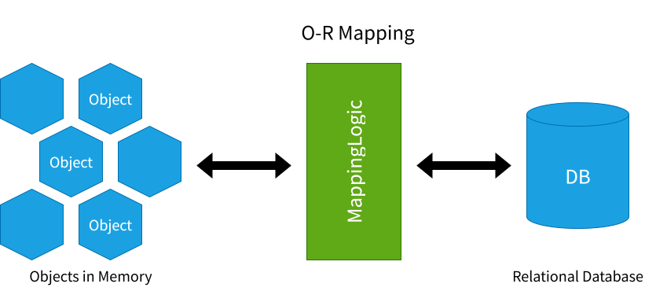

### 特性

- 全功能 ORM：支持完整的对象映射能力，覆盖主流数据库操作场景。
- 丰富关联支持：包括 `Has One`、`Has Many`、`Belongs To`、`Many To Many`、多态关联、单表继承等复杂关系建模。
- CRUD 钩子机制：在 `Create`、`Save`、`Update`、`Delete`、`Find` 等操作中支持自定义钩子方法，灵活控制生命周期行为。
- 预加载与联表查询：支持 `Preload` 和 `Joins`，实现高效的数据关联加载。
- 事务管理：支持标准事务、嵌套事务、保存点（Save Point）、回滚至指定保存点。
- 上下文与调试支持：集成 `Context` 传递、预编译模式、DryRun 模式（仅生成 SQL 不执行），便于调试于性能分析。
- 批量操作与高级查询：
  - 批量插入（Batch Insert）
  - 分批查找（FindInBatches）
  - 使用 Map 进行 Find/Create
  - 支持原生 SQL 表达式、Context Valuer 参数绑定
- SQL 构建与优化工具：
  - 内置 SQL 构建器
  - Upsert（插入或更新）支持
  - 数据库锁机制
  - Optimizer/index/Comment Hint 注解
  - 命名参数、子查询支持
- 数据完整性保障：支持复合主键、索引、约束定义。
- 自动迁移：根据结构体自动同步数据库表结构（支持安全模式与版本控制）。
- 日志系统：支持自定义 Logger，灵活记录 SQL 执行与错误信息。
- 插件化拓展架构：
  - 提供可拓展插件 API，如 Database Resolver（支持多数据库、读写分离）、Prometheus 监控集成等。
- 质量保障：所有核心功能均经过严格单元测试与集成测试验证。
- 开发者体验友好：API 设计简单直观，文档完善，社区活跃，学习成本低。

### 使用

#### 安装

```sh
go get -u gorm.io/gorm
go get -u gorm.io/driver/mysql
```

> [!tip]
>
> 使用其他数据库则安装对应的驱动。

#### 连接数据库

在 `models` 包中新建 `db.go`，建立数据库连接：

```go
package models

import (
	"fmt"

	"gorm.io/driver/mysql"
	"gorm.io/gorm"
)

var DB *gorm.DB

func init() {
	dsn := "root:123456@tcp(127.0.0.1:3306)/test_db?charset=utf8mb4&parseTime=True&loc=Local"
	var err error
	DB, err = gorm.Open(mysql.Open(dsn), &gorm.Config{})

	if err != nil {
		fmt.Println(err)
	}
}
```

> [!tip]
>
> 为了便于外部访问，将 `DB` 定义为公共变量。

#### 定义模型

GORM 官方提供给详细的文档：

https://gorm.io/zh_CN/docs/models.html

尽管 GORM 支持指定字段类型并自动生成数据表，但在实际项目开发中，通常现设计好数据库表结构，再基于该结构进行编码实现。

**在实际项目中定义数据库模型需要注意**：

- **结构体名称必须首字母大写**，并且和数据库表名称对应。例如，表名称为 `users`，则结构体名称定义为 `User`；表名称为 `article_cates`，结构体名称定义为 `ArticleCate`。将蛇形命名转换为驼峰命名。

- 结构体中的**字段名称首字母必须大写**，并且和数据库表的字段一一对应。例如，结构体中的 `ID` 与数据库中的 `id` 对应，`Username` 与数据库中的 `username` 对应，`Age` 和数据库中的 `age` 对应，`Email` 和数据库中的 `email` 对应，`AddTime` 和数据库中的 `add_time` 字段对应。

- **默认情况下，表名是结构体名称的复数形式。**若结构体名称定义为 `User`，表示这个模型默认操作的是 `users` 表。

- 可以使用结构体中的自定义方法 `TableName` 改变结构体的默认表名称，如下：

  ```go
  func (User) TableName() string {
    return "user"
  }
  ```

  表示将 `User` 结构体默认操作的表改为 `user` 表。

`user.go`：

```go
package models

type User struct {
	ID       int
	Username string
	Age      int
	Email    string
	AddTime  int
}

func (User) TableName() string {
	return "users"
}
```

`gorm.Model`：

GORM 中默认定义了一个 `gorm.Model 结构体，其包含以下字段：

- `ID`：主键
- `CreatedAt`：记录创建时间
- `UpdatedAt`：记录更新时间
- `DeletedAt`：用于实现软删除

```go
type Model struct {
	ID        uint `gorm:"primarykey"`
	CreatedAt time.Time
	UpdatedAt time.Time
	DeletedAt DeletedAt `gorm:"index"`
}
```

可以在其他结构体中直接嵌入 `gorm.Model` 来复用这些字段：

```go
type User struct {
	gorm.Model
	Name  string
	Email string `gorm:"unique"`
}
```

### CURD

首先，在对应数据库表的控制器中引入 `models` 模块。

#### 增加

用户创建成功，响应新增的完整记录。

https://gorm.io/zh_CN/docs/create.html

```go
func (uc UserController) Add(c *gin.Context) {
	user := models.User{
		Username: "哈基米",
		Age:      18,
		Email:    "hachimi@foxmail.com",
		AddTime:  int(time.Now().Unix()),
	}

	res := models.DB.Create(&user)
	if res.Error != nil {
		fmt.Println("添加用户失败", res.Error)
		c.String(http.StatusInternalServerError, "添加失败")
		return
	}

	if res.RowsAffected == 1 {
		fmt.Println(user.ID)
	}
	fmt.Println(res.RowsAffected)
	c.String(http.StatusOK, "add 成功")
}
```

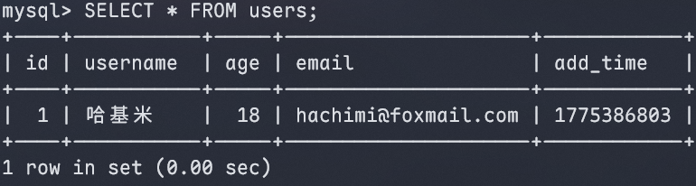

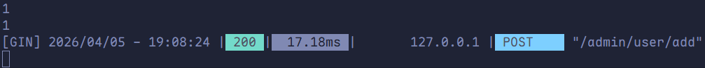

插入数据后，成功返回主键 ID 和受影响行数；未指定 ID 时数据库自动生成，因表中 ID 设为自增主键。

#### 查找

https://gorm.io/zh_CN/docs/query.html

##### 查找全部

```go
func (UserController) Index(c *gin.Context) {
	var users []models.User
	models.DB.Find(&users)
	c.JSON(http.StatusOK, gin.H{"data": users})
}
```

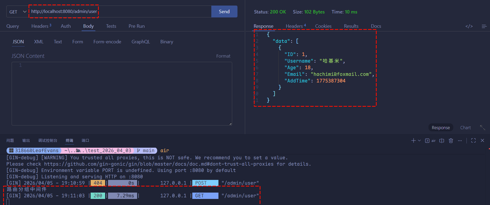

从返回结构能看出，接口返回的 `data` 字段为数组类型，数组元素是单个 `user` 实体对象。

##### 指定条件查找

```go
func (UserController) Index(c *gin.Context) {
	var users []models.User
	models.DB.Where("age < ?", 20).Find(&users)
	c.JSON(http.StatusOK, gin.H{"data": users})
}
```

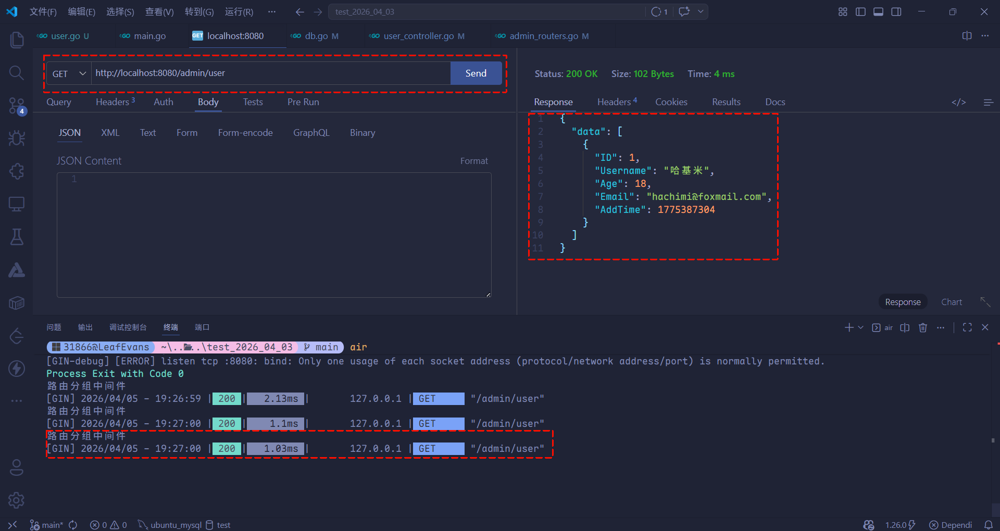

#### 修改

https://gorm.io/zh_CN/docs/update.html

```go
func (uc UserController) Edit(c *gin.Context) {
	user := models.User{ID: 7}
	models.DB.Find(&user)
	user.Username = "曼波"
	user.Age = 1
	models.DB.Save(&user)
	c.String(http.StatusOK, "Edit")
}
```

通过初始化携带**主键 ID 或唯一索引**的结构体对象作为查询条件查询数据，修改字段后，调用 `models.DB.Save` 对数据执行**全量更新**并同步到数据库。

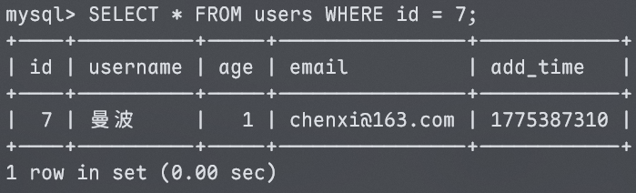

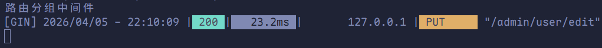

通过 `PUT` 方法完成指定数据的全量更新。

#### 删除

##### 单条记录删除

https://gorm.io/zh_CN/docs/delete.html

```go
func (uc UserController) Delete(c *gin.Context) {
	user := models.User{ID: 8}
	models.DB.Delete(&user)
	c.String(http.StatusOK, "Delete")
}
```

其他删除方法：

```go
// 写法 1：Where + Delete
models.DB.Where("id = ?", 8).Delete(&models.User{})

// 写法 2：直接传 ID
models.DB.Delete(&models.User{}, 8)
```

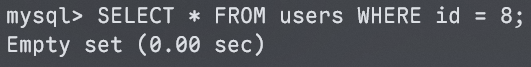

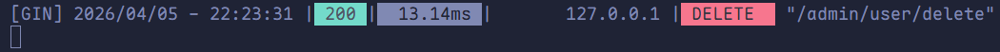

通过 `DELETE` 请求方法，成功删除了 ID 为 8 的指定数据。

##### 批量记录删除

```go
func (uc UserController) Delete(c *gin.Context) {
	models.DB.Where("id > 9").Delete(&models.User{})
	c.String(http.StatusOK, "DeleteAll")
}
```

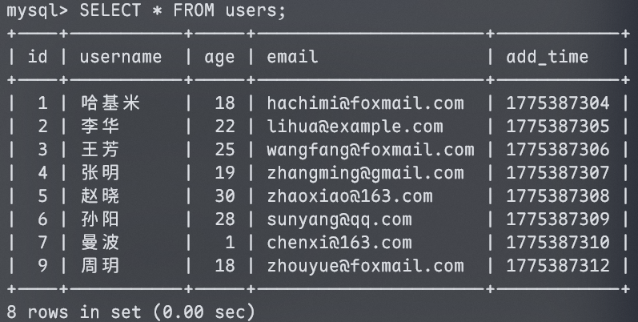

即可成功删除查询条件匹配的所有数据。

通过 `LIKE` 模糊匹配实现数据删除：

```go
// 写法 1：Where + Delete
db.Where("email LIKE ?", "%jinzhu%").Delete(Email{})

// 写法 2：Delete 直接传条件
db.Delete(&Email{}, "email LIKE ?", "%jinzhu%")
```

### 查询语句详解

https://gorm.io/zh_CN/docs/query.html

示例 `Nav` 结构体定义：

```go
package models

type Nav struct {
	ID     int
	Title  string
	URL    string
	Status int
	Sort   int
}

func (Nav) TableName() string {
	return "navs"
}
```

#### `Where`

直接在 `Where` 函数中指定查询条件与对应值。

```go
func (nc NavController) Index(c *gin.Context) {
	navs := []models.Nav{}
	models.DB.Where("id < 3").Find(&navs)
	c.JSON(http.StatusOK, gin.H{
		"success": true,
		"result":  navs,
	})
}
```

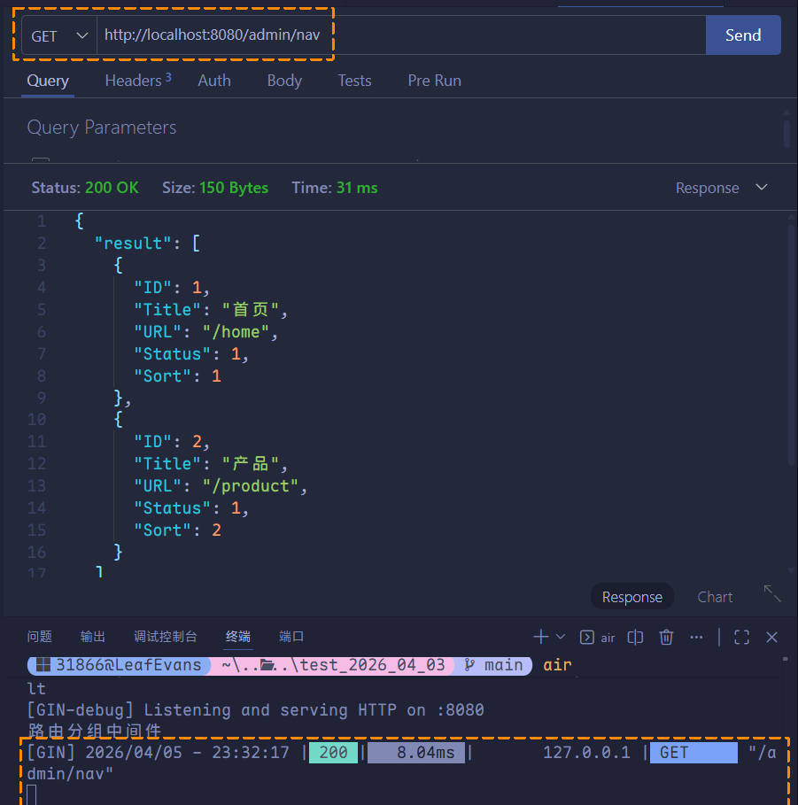

通过占位符 `?` 执行动态条件查询：

```go
func (nc NavController) Index(c *gin.Context) {
	n := 5
	navs := []models.Nav{}
	models.DB.Where("id > ?", n).Find(&navs)

	c.JSON(http.StatusOK, gin.H{
		"success": true,
		"result":  navs,
	})
}
```


使用双占位符结合 `AND` 实现多条件查询：

```go
func (nc NavController) Index(c *gin.Context) {
	n1 := 3
	n2 := 9
	navs := []models.Nav{}
	models.DB.Where("id > ? AND id < ?", n1, n2).Find(&navs)
	c.JSON(http.StatusOK, gin.H{
		"success": true,
		"result":  navs,
	})
}
```

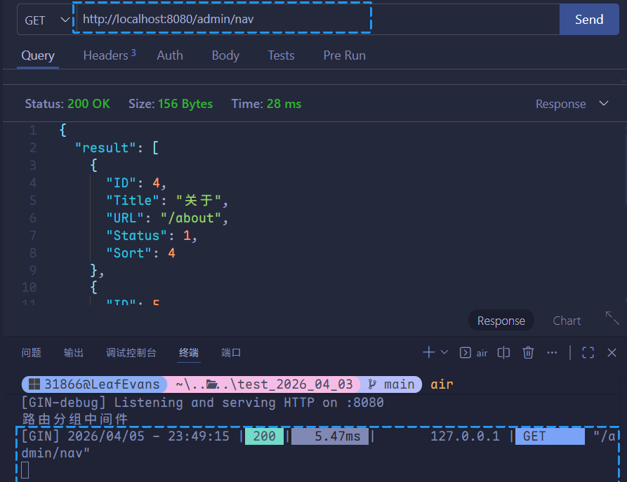

当通过 `IN` 关键字实现多值范围匹配查询时，需以切片作为查询参数。

```go
func (nc NavController) Index(c *gin.Context) {
	navs := []models.Nav{}
	models.DB.Where("id IN (?)", []int{1, 3, 5}).Find(&navs)
	c.JSON(http.StatusOK, gin.H{
		"success": true,
		"result":  navs,
	})
}
```

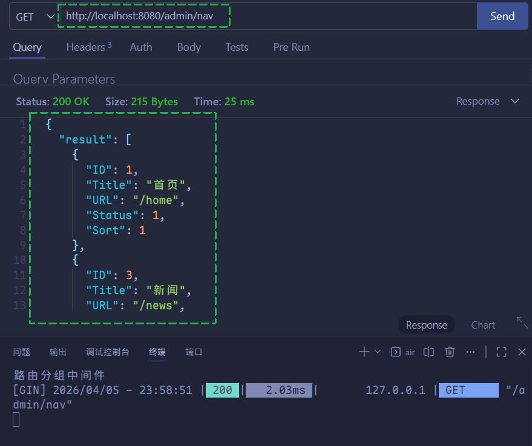

通过 `LIKE` 实现标题模糊匹配查询：

```go
func (nc NavController) Index(c *gin.Context) {
	navs := []models.Nav{}
	models.DB.Where("title LIKE ?", "%台%").Find(&navs)
	c.JSON(http.StatusOK, gin.H{
		"success": true,
		"result":  navs,
	})
}
```

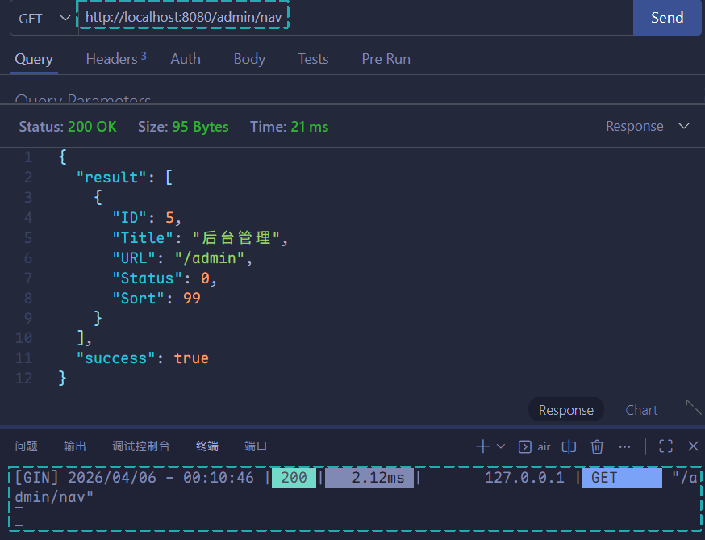

使用 `BETWEEN ... AND ...` 语法实现数值范围查询：

```go
func (nc NavController) Index(c *gin.Context) {
	navs := []models.Nav{}
	models.DB.Where("id BETWEEN ? AND ?", 1, 3).Find(&navs)
	c.JSON(http.StatusOK, gin.H{
		"success": true,
		"result":  navs,
	})
}
```

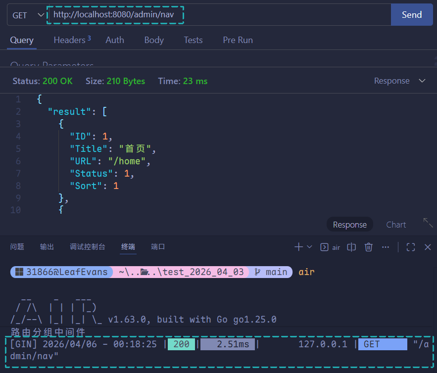

#### `OR`

在 `Where` 查询条件中使用 `OR` 实现多条件“或”匹配：

```go
func (nc NavController) Index(c *gin.Context) {
	navs := []models.Nav{}
	models.DB.Where("id = ? OR id = ?", 2, 3).Find(&navs)
	c.JSON(http.StatusOK, gin.H{
		"success": true,
		"result":  navs,
	})
}
```

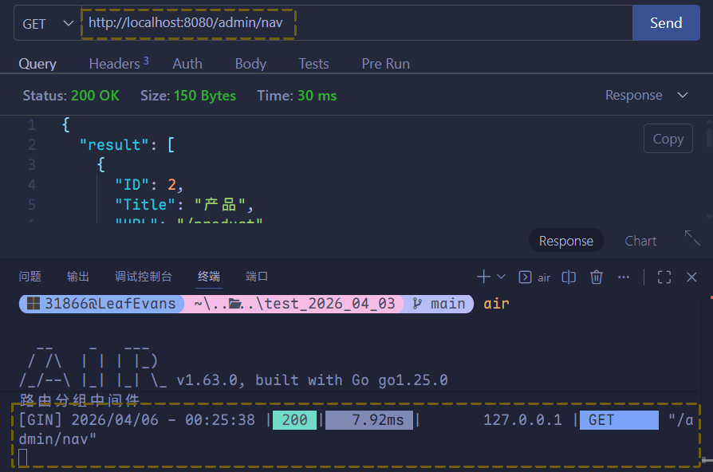

这里通过 GORM 的 `Or` 方法**链式拼接**多个“或”查询条件：

```go
func (nc NavController) Index(c *gin.Context) {
	navs := []models.Nav{}
	models.DB.Where("id = ?", 2).Or("id = ?", 3).Or("id = ?", 4).Find(&navs)
	c.JSON(http.StatusOK, gin.H{
		"success": true,
		"result":  navs,
	})
}
```

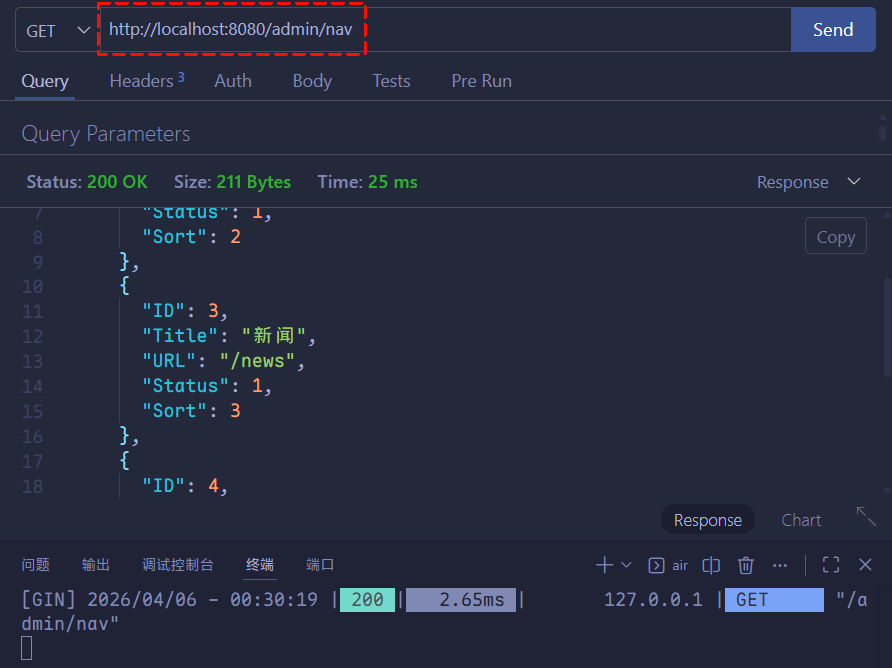

#### 选择字段查询

通过 `Select` 方法指定需查询的字段，若未调用该方法，GORM 会默认查询表中的所有字段，未被选中的字段则返回对应类型的零值。

```go
func (nc NavController) Index(c *gin.Context) {
	navs := []models.Nav{}
	models.DB.Select("id, title, url").Find(&navs)
	c.JSON(http.StatusOK, gin.H{
		"success": true,
		"result":  navs,
	})
}
```

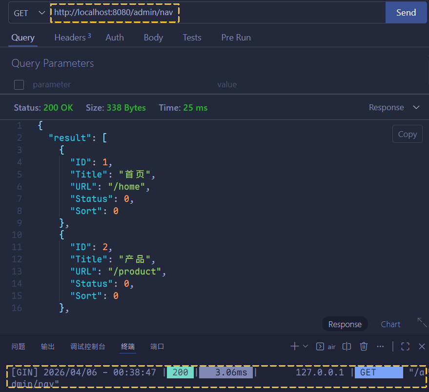

#### 排序、`Limit`、`Offset`

使用 `Order` 方法指定排序字段与排序方向，即可对查询结果进行指定规则的排序：

```go
func (nc NavController) Index(c *gin.Context) {
	navs := []models.Nav{}
	models.DB.Where("id > 2").Order("id ASC").Find(&navs)
	c.JSON(http.StatusOK, gin.H{
		"success": true,
		"result":  navs,
	})
}
```

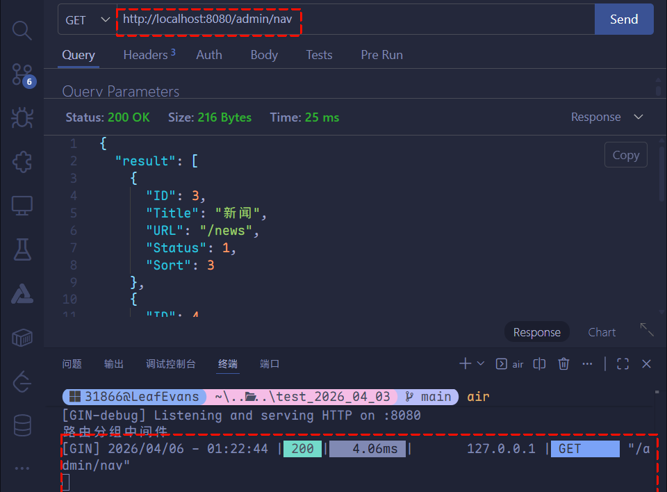

链式拼接 `Order` 方法，查询结果会**按调用顺序**依次执行多字段排序。

```go
func (nc NavController) Index(c *gin.Context) {
	navs := []models.Nav{}
	models.DB.Where("id > ?", 2).Order("sort DESC").Order("id ASC").Find(&navs)
	c.JSON(http.StatusOK, gin.H{
		"success": true,
		"result":  navs,
	})
}
```

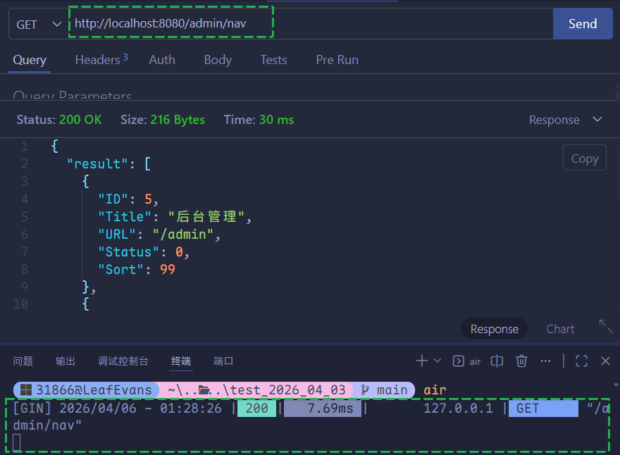

对查询结果通过 `Limit` 方法限制返回条数，此处仅显示两条数据：

```go
func (nc NavController) Index(c *gin.Context) {
	navs := []models.Nav{}
	models.DB.Where("id > ?", 1).Limit(2).Find(&navs)
	c.JSON(http.StatusOK, gin.H{
		"success": true,
		"result":  navs,
	})
}
```

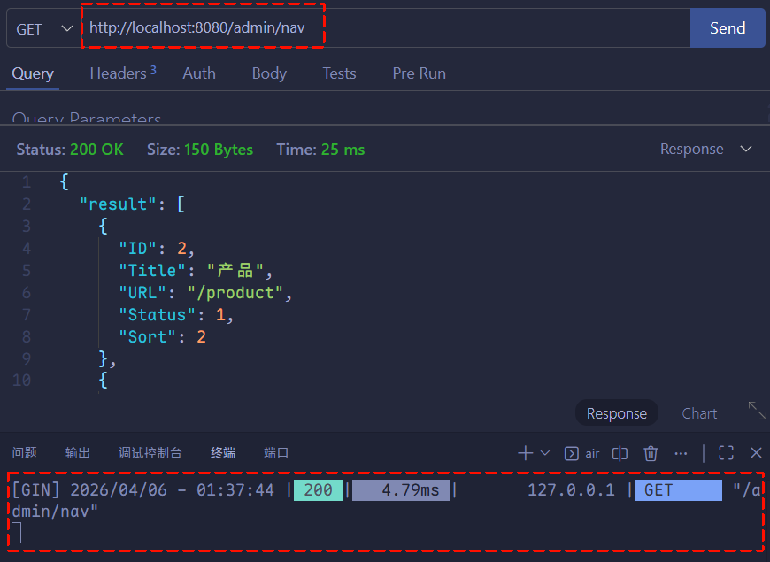

使用 `Offset` 方法跳过查询结果的前 N 条数据，此处设置为跳过 2 条：

```go
func (nc NavController) Index(c *gin.Context) {
	navs := []models.Nav{}
	models.DB.Where("id > ?", 1).Offset(2).Limit(2).Find(&navs)
	c.JSON(http.StatusOK, gin.H{
		"success": true,
		"result":  navs,
	})
}
```

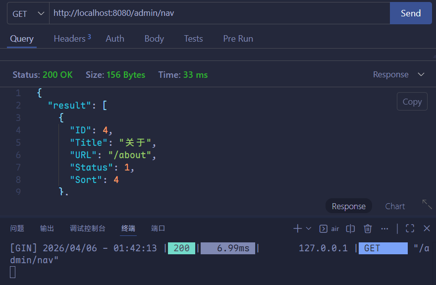

#### 获取总数

使用 `Count` 方法获取查询结果的数量，并将数据写入传入的指针参数中：

```go
func (nc NavController) Index(c *gin.Context) {
	navs := []models.Nav{}
	var num int64
	models.DB.Where("id > ?", 2).Find(&navs).Count(&num)
	c.JSON(http.StatusOK, gin.H{
		"success": true,
		"result":  navs,
		"num":     num,
	})
}
```

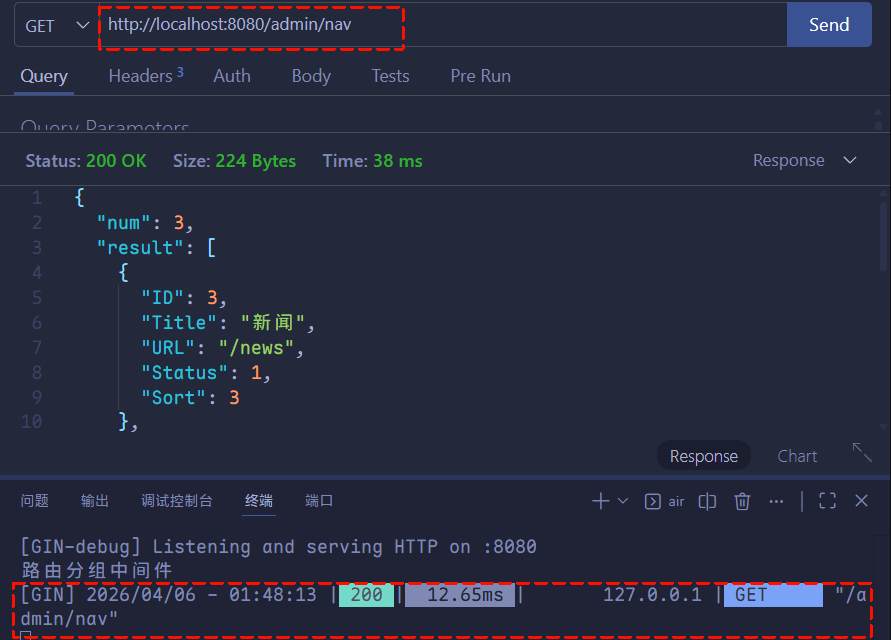

#### `Distinct`

使用 `Distinct` 方法对指定字段（如 `status`）执行去重查询操作：

```go
func (nc NavController) Index(c *gin.Context) {
	navs := []models.Nav{}
	models.DB.Distinct("status").Find(&navs)
	c.JSON(http.StatusOK, gin.H{
		"success": true,
		"navs":    navs,
	})
}
```

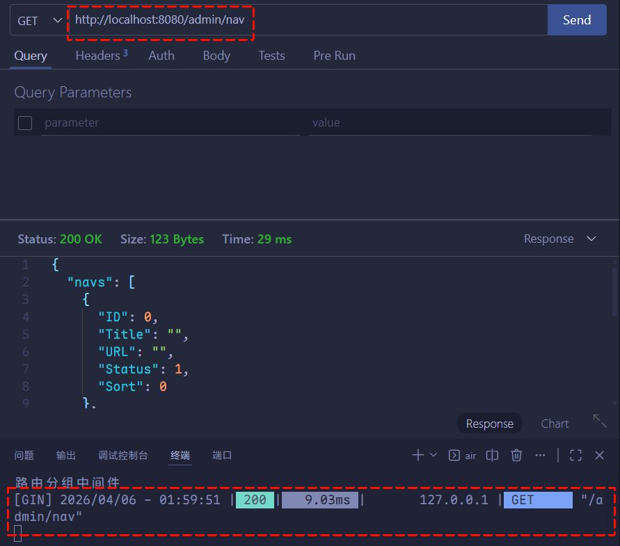

#### `Scan`

通过 `Table` 指定查询表（无需绑定结构体），通过 `Select` 筛选需要查询的字段，最后通过 `Scan` 将查询结果映射到 `Result` 结构体对象中。

```go
type Result struct {
	Name string
	Age  int
}

func (uc UserController) Index(c *gin.Context) {
	var res Result
	models.DB.Table("users").Select("name", "age").Where("name = ?", "曼波").Scan(&res)
	c.JSON(http.StatusOK, gin.H{
		"success": true,
		"result":  res,
	})
}
```

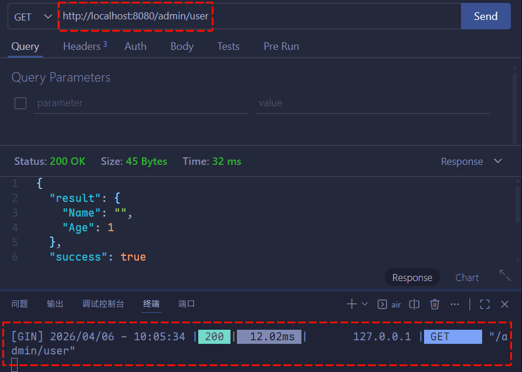

执行原生 SQL 查询。

```go
func (uc UserController) Index(c *gin.Context) {
	var res Result
	models.DB.Raw("SELECT username, age FROM users WHERE username = ?", "曼波").Scan(&res)
	c.JSON(http.StatusOK, gin.H{
		"success": true,
		"result":  res,
	})
}
```


#### `Join`

通过 `Model` 指定查询表对应的结构体，再调用 `Joins` 并传入联表语句，即可实现联合查询。

```go
func (uc UserController) Index(c *gin.Context) {
	var results []Result
	models.DB.Model(&models.User{}).Select("users.name", "emails.email").Joins("LEFT JOIN emails ON emails.user_id = users.id").Scan(&results)
	c.JSON(http.StatusOK, gin.H{
		"success": true,
		"result":  results,
	})
}
```

### 查看执行的 SQL 

在 `gorm.Config` 中开启 `QueryFields`（设为 `true`）。

```go
func init() {
	dsn := "leafevans:Qq20050514@tcp(127.0.0.1:3307)/test?charset=utf8mb4&parseTime=True&loc=Local"
	var err error
	DB, err = gorm.Open(mysql.Open(dsn), &gorm.Config{
		QueryFields: true,
	})

	if err != nil {
		fmt.Println(err)
	}
}
```

> [!note]
>
> `QueryFields: true` = 全局替换 `SELECT *` 为**显式字段列表**，无需改业务代码。

## 原生 SQL 和 SQL 生成器

https://gorm.io/zh_CN/docs/sql_builder.html

### 删除数据

使用原生 SQL 删除 `users` 表中的一条数据：

```go
```

