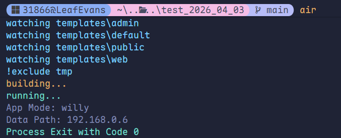
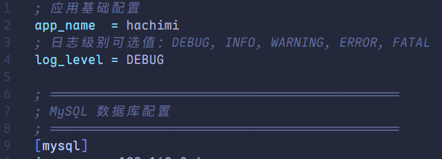
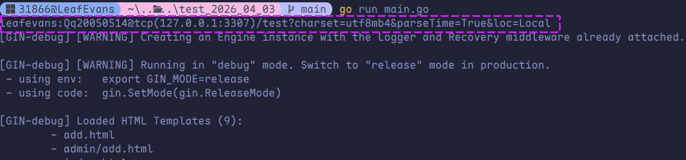

# go-ini 配置

## go-ini 介绍

go-ini 是 Go 语言主流的 INI 文件操作库，被官方称为「最强大、便捷的 INI 处理工具」。

- GitHub：https://github.com/go-ini/ini
- 官方文档：https://ini.unknwon.io/

## go-ini 使用

新建 `conf/app.ini` 配置文件，编辑该文件并填入以下内容：

```ini
; 应用基础配置
app_name  = hachimi
; 日志级别可选值：DEBUG, INFO, WARNING, ERROR, FATAL
log_level = DEBUG

; ==============================================
; MySQL 数据库配置
; ==============================================
[mysql]
ip       = 127.0.0.1
port     = 3307
user     = root
password = Qq20050514
database = test

; ==============================================
; Redis 缓存配置
; ==============================================
[redis]
ip   = 127.0.0.1
port = 6379

```

编写 `main.go` 文件读取刚才创建的配置文件。

```go
package main

import (
	"fmt"
	"os"

	"gopkg.in/ini.v1"
)

func main() {
	cfg, err := ini.Load("./conf/app.ini")
	if err != nil {
		fmt.Printf("Fail to read file: %v", err)
		os.Exit(1)
	}

	fmt.Println("App Mode:", cfg.Section("").Key("app_name").String())
	fmt.Println("Data Path:", cfg.Section("mysql").Key("ip").String())

	cfg.Section("").Key("app_name").SetValue("hachimi")
	cfg.SaveTo("./conf/app.ini")
}
```





## 从 INI 文件读取 MySQL 配置

```go
package models

import (
	"fmt"
	"os"

	"gopkg.in/ini.v1"
	"gorm.io/driver/mysql"
	"gorm.io/gorm"
)

var DB *gorm.DB

var err error

func init() {
	cfg, err := ini.Load("./conf/app.ini")
	if err != nil {
		fmt.Printf("Fail to read file: %v", err)
		os.Exit(1)
	}

	ip := cfg.Section("mysql").Key("ip").String()
	port := cfg.Section("mysql").Key("port").String()
	user := cfg.Section("mysql").Key("user").String()
	password := cfg.Section("mysql").Key("password").String()
	database := cfg.Section("mysql").Key("database").String()

	dsn := fmt.Sprintf("%v:%v@tcp(%v:%v)/%v?charset=utf8mb4&parseTime=True&loc=Local", user, password, ip, port, database)

	fmt.Println(dsn)

	DB, err = gorm.Open(mysql.Open(dsn), &gorm.Config{
		QueryFields: true,
	})

	if err != nil {
		fmt.Println(err)
		os.Exit(1)
	}
}
```

