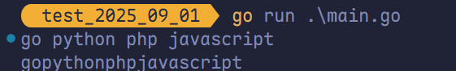
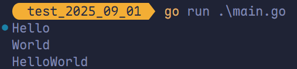
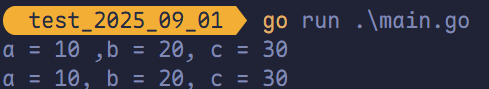
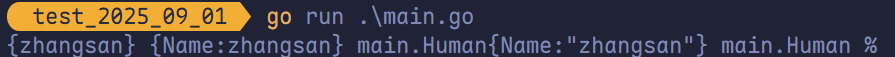

# 基本语法

## 定义变量

程序运行时的数据均存储于**内存**中。若要在代码中操作某个数据，就需要**访问其对应的地址**。

然而，直接在代码中使用内存地址不仅可读性差，还容易出错。

因此引入**变量**——本质上是<u>对内存地址的命名引用</u>。通过*<u>变量名</u>*，可以方便、安全地访问和操作内存中对应的数据。

### 使用 `var` 关键字定义变量

```go
var 变量名 类型 = 表达式
```

例如：

```go
var name string = "zhangsan"
```

### 类型推断定义变量（省略类型）

当表达式可以明确推导出类型时，可以省略类型声明：

```go
var 变量名 = 表达式
```

例如：

```go
var age = 25 // Go 自动推断为 int 类型
```

### 短变量声明（仅限函数内）

在函数内部，可以使用简洁的 `:=` 语法来声明并初始化变量：

```go
变量名 := 表达式
```

例如：

```go
n := 10
```

#### 使用说明

`:=` 是一种**短变量声明**语法，仅可用于**函数内部**，用于声明局部变量。

- 不能用于全局变量声明。
- 若变量已存在，`:=` 不能单独重复声明它。
- 在同一语句中，只要至少声明了一个新变量，就可以使用 `:=`。但匿名变量 `_` 不算作新变量。

#### 示例

```go
func main() {
    x := 10
    y, x := 20, 30    // 合法！y 是新变量，x 被重新赋值
    fmt.Println(x, y) // 输出：30 20
}
```

## `fmt` 包

Go 中要打印一个值需要引入 `fmt` 包：

```go
import "fmt"
```

`fmt` 包中给我们提供了一些常见的打印数据的方法，例如：`Print`、`Println`、`Printf`，在实际开发过程中，`Println`、`Printf` 用的非常多。

### `Print` vs. `Println`

一次输入多个值时，`Println` 中间有空格而 `Print` 没有：

```go
// go python php javascript
fmt.Println("go", "python", "php", "javascript")
// gopythonphpjavascript
fmt.Print("go", "python", "php", "javascript")
```



`Println` 会自动转行，`Print` 不会：

```go
package main

import (
	"fmt"
)

func main() {
	// Hello
	// World
	fmt.Println("Hello")
	fmt.Println("World")
	// HelloWorld
	fmt.Print("Hello")
	fmt.Print("World")
}
```



### `Println` vs. `Printf`

`Printf` 是格式化输出，在很多场景下比 `Println` 更方便，例如：

```go
a := 10
b := 20
c := 30
fmt.Println("a =", a, "\b ,b =", b, "\b, c =", c)
fmt.Printf("a = %d, b = %d, c = %d\n", a, b, c)
```



## 格式说明符

格式说明符（Format Specifier）是格式化字符串中以 `%` 开头的一段特殊代码，用于控制后续参数如何被转换和显示。

```sh
%[flags][width][.precision][length]type
```

> [!tip]
>
> 并非所有语言都支持全部字段（如 Go 不支持 `length`，Python 有差异），但核心结构一致。

### 起始符

- 必须以 `%` 开头，表示一个格式说明的开始。
- 若想输出字面 `%`，需写 `%%`。

### Flags

Flags（标志）用于对齐、符号、填充等。

| 标志        | 含义                                        | 示例（`%D`，值为 `42`） |
| ----------- | ------------------------------------------- | ----------------------- |
| `-`         | 左对齐（默认右对齐）                        | `%-5d` → `"42 "`        |
| `+`         | 强制显示正负号                              | `%+d` → `"+42"`         |
| ` `（空格） | 正数前加空格，负数加 `-`                    | `% d` → `" 42"`         |
| `0`         | 用 `0` 填充（而非空格）                     | `%05d` → `00042`        |
| `#`         | 替代格式（如八进制加 `0`，十六进制加 `0x`） | `%#x` → `"0x2a"`        |

> [!tip]
>
> `-` 和 `0` 同时出现时，`-` 优先（左对齐，空格填充）。

### Width

Width（宽度），**最小字段宽度**。

- 整数：指定输出**至少**占多少字符宽。
- 不足时按标志填充（默认空格，`0` 标志则补 0）
- 可用 `*` 动态指定（参数传入）

```go
fmt.Printf("%5d", 42)		 // "   42"
fmt.Printf("%*d", 6, 42) // "    42"
```

### .Precision

.Precision（精度），控制小数位数或字符串最大长度。

- 以 `.` 开头，后接数字（或 `*`）。

- 对不同类型作用不同：

  | 类型                             | 精度（如 `.n`）的含义                                        |
  | -------------------------------- | ------------------------------------------------------------ |
  | **`f`, `F`**（定点表示）         | **小数点后保留 `n` 位数字**<br>例：`%.3f` → `3.142`（对 `3.14159` 四舍五入） |
  | **`e`, `E`**（科学计数）         | **小数点后保留 `n` 位数字**<br>例：`%.3e` → `3.142e+00`      |
  | **`g`, `G`**（紧凑格式）         | **总共保留 `n` 位有效数字**（significant digits），自动选择 `f` 或 `e` 中更短的形式<br>例：`%.3g` → `3.14`（对 `3.14159`）；`%.3g` → `1.23e+06`（对 `1234567`） |
  | **`s`**（字符串）                | **最多输出 `n` 个字符**<br>例：`%.4s` → `"Hell"`（对 `"Hello"`） |
  | **整数类型**（`d`, `x`, `o` 等） | **最小数字位数**（不足补前导零）<br>例：`%.5d` → `00123`（对 `123`） |


> [!tip]
>
> 对于字符串，**先根据精度截取前 N 个字符，再按指定宽度进行填充对齐**。

### Length

Length（长度修饰符），指定参数大小（Go 不支持）。

- `hh` → `char`
- `h` → `short`
- `l` → `long`
- `ll` → `long long`
- `L` → `long double`

```c
printf("%lld", bigInt);  // C 中输出 long long1
```

> [!tip]
>
> Go 语言中无需 length 修饰符，因此 `fmt` 会自动根据参数类型推断。

### 普通占位符

| 占位符 | 说明                           | 举例                    | 输出                          |
| ------ | ------------------------------ | ----------------------- | ----------------------------- |
| `%v`   | 相应值的默认格式               | `Printf("%v", people)`  | `{zhangsan}`                  |
| `%+v`  | 打印结构体时，会添加字段名     | `Printf("%+v", people)` | `{Name:zhangsan}`             |
| `%#v`  | 相应值的 Go 语法表示           | `Printf("%#v", people)` | `main.Human{Name:"zhangsan"}` |
| `%T`   | 相应值的类型的 Go 语法表示     | `Printf("%T", people)`  | `main.Human`                  |
| `%%`   | 字面上的百分号（非值的占位符） | `Printf("%%")`          | `%`                           |

```go
package main

import (
	"fmt"
)

type Human struct {
	Name string
}

func main() {
	people := Human{Name: "zhangsan"}
	fmt.Printf("%v %+v %#v %T %%", people, people, people, people)
}
```



### 布尔占位符

| 占位符 | 说明                   | 举例                 | 输出   |
| ------ | ---------------------- | -------------------- | ------ |
| `%t`   | 输出 `true` 或 `false` | `Printf("%t", true)` | `true` |

### 整数占位符

| 占位符 | 说明                                      | 举例                   | 输出     |
| ------ | ----------------------------------------- | ---------------------- | -------- |
| `%b`   | 二进制表示                                | `Printf("%b", 5)`      | `101`    |
| `%c`   | 相应 Unicode 码点所表示的字符             | `Printf("%c", 0x4E2D)` | `中`     |
| `%d`   | 十进制表示                                | `Printf("%d", 0x12)`   | `18`     |
| `%o`   | 八进制表示                                | `Printf("%o", 10)`     | `12`     |
| `%q`   | 单引号围绕的字符字面值（Go 语法安全转义） | `Printf("%q", 0x4E2D)` | `'中'`   |
| `%x`   | 十六进制表示（小写 a-f）                  | `Printf("%x", 13)`     | `d`      |
| `%X`   | 十六进制表示（大写 A-F）                  | `Printf("%X", 13)`     | `D`      |
| `%U`   | Unicode 格式（U+1234，等同于 `U+%04X`）   | `Printf("%U", 0x4E2D)` | `U+4E2D` |

### 浮点数和复数的组成部分（实部和虚部）

| 占位符 | 说明                                                                                | 举例                     | 输出                  |
| ------ | ----------------------------------------------------------------------------------- | ------------------------ | --------------------- |
| `%b`   | 无小数部分的科学计数法（指数为 2 的幂，与 `strconv.FormatFloat` 的 `'b'` 格式一致） | -                        | `-123456p-78`（示例） |
| `%e`   | 科学计数法（小写 e）                                                                | `Printf("%e", 10.2)`     | `1.020000e+01`        |
| `%E`   | 科学计数法（大写 E）                                                                | `Printf("%E", 10.2)`     | `1.020000E+01`        |
| `%f`   | 有小数点无指数                                                                      | `Printf("%f", 10.2)`     | `10.200000`           |
| `%g`   | 自动选择 `%e` 或 `%f` 以产生更紧凑的表示（去除末尾 0）                              | `Printf("%g", 10.20)`    | `10.2`                |
| `%G`   | 自动选择 `%E` 或 `%f` 以产生更紧凑的表示（去除末尾 0）                              | `Printf("%G", 10.20+2i)` | `(10.2+2i)`           |

> [!TIP]
>
> 其中 `%b` 的浮点数表示根据 IEEE 754 标准。以单精度浮点数为例，将隐含 1 和尾数位相加后，乘以 2 的尾数位数次方，使得整个作为一个大整数来看待，便于输出。然后后面的指数就是真实指数再减去尾数位数，其以 2 为底。
>
> - `M = (隐含 1 + 尾数位) × 2^(尾数位数)`
> - `E = 真实指数 - 尾数位数`
> - 值 = `M × 2^E`

### 字符串与字节切片

| 占位符 | 说明                                       | 举例                             | 输出           |
| ------ | ------------------------------------------ | -------------------------------- | -------------- |
| `%s`   | 输出字符串表示（`string` 类型或 `[]byte`） | `Printf("%s", []byte("Go语言"))` | `Go语言`       |
| `%q`   | 双引号围绕的字符串（Go 语法安全转义）      | `Printf("%q", "Go语言")`         | `"Go语言"`     |
| `%x`   | 十六进制（小写字母，每字节两个字符）       | `Printf("%x", "golang")`         | `676f6c616e67` |
| `%X`   | 十六进制（大写字母，每字节两个字符）       | `Printf("%X", "golang")`         | `676F6C616E67` |

### 指针

| 占位符 | 说明                      | 举例                    | 输出                                   |
| ------ | ------------------------- | ----------------------- | -------------------------------------- |
| `%p`   | 十六进制表示（前缀 `0x`） | `Printf("%p", &people)` | `0x4f57f0`（示例，具体地址因环境而异） |

## Go 语言注释

Windows 下可以使用 `ctrl` + `/` 可以快速地注释，macOS 下使用 `⌘` + `/` 同样可以快速地注释：

```go
/*
这是一个块注释
*/

// 这是一个行注释
```

## Unicode 与 UTF-8

### Unicode

Unicode 是一个国际字符集标准，旨在为全球所有文字、符号和表情分配唯一的数字标识，称为 **码点**（Code Point）。

码点的标准表示形式为：`U+` 后接至少 4 位十六进制数字，不足 4 位时前面补零，例如：

- `U+0041` → 字母 `A`  
- `U+4E2D` → 汉字 “中”  
- `U+1F600` → 表情符号 😀

> [!tip]  
> Unicode 仅定义“每个字符对应哪个编号”，**不规定**该编号在计算机中如何存储为字节。

### UTF-8

UTF-8 是 Unicode 最常用的**编码格式**（Encoding），用于将 Unicode 码点转换为实际存储或传输的字节序列。

> [!tip]  
> 需要编码的原因是：码点本身是抽象编号，若直接以固定长度存储（如 4 字节），会浪费空间；若不加界定地拼接，又无法区分码点边界（类似网络协议中的帧定界问题）。UTF-8 通过特定的字节模式解决了这一问题。

**特点**：

- **变长编码**：根据码点大小使用 1–4 字节  
  - ASCII 字符（`U+0000` 到 `U+007F`）占 1 字节  
  - 常见汉字（如 `U+4E2D`）占 3 字节  
  - 表情符号（如 `U+1F600`）占 4 字节
- **完全兼容 ASCII**：所有 ASCII 文本在 UTF-8 下字节表示不变
- **广泛采用**：HTML、JSON、Go、Python 等默认使用 UTF-8

相比 UTF-16、UTF-32 等定长或混合长度编码，UTF-8 在节省空间的同时保持了对现有 ASCII 系统的良好兼容性。

> [!tip]
>
> UTF-8 本身能正确表示所有 Unicode 字符。但某些“表情”实际上由多个码点组合而成（如 👨‍👩‍👧‍👦），若处理不当（如错误截断），会导致显示异常——这通常为程序逻辑问题，而非 UTF-8 的缺陷。

### Go 中的字符串、`byte` 与 `rune`

Go 的字符串内部以 **UTF-8 编码的字节序列**存储。

- 使用下标（如 `s[i]`）访问时，返回的是 **字节**（`byte`）
- 使用 `for range` 遍历时，迭代的是 **Unicode 码点**，类型为 `rune`

`rune` 是 `int32` 的别名，足以容纳任意 Unicode 码点（`U+0000` 到 `U+10FFFF`）。

```go
s := "中"
fmt.Println(len(s))        // 输出 3（UTF-8 字节数）
for _, r := range s {
    fmt.Printf("%U\n", r)  // 输出 U+4E2D
}
```

### 合成字符（Grapheme Clusters）

某些“用户感知的一个字符”实际上由多个 `rune` 组合而成，例如：

- 👨‍👩‍👧‍👦 = `U+1F468` + `U+200D`（零宽连接符）+ `U+1F469` + `U+200D` + `U+1F457` + `U+200D` + `U+1f466`
- 🏳️‍🌈 = `U+1F3F3` + `U+FE0F` + `U+200D` + `U+1F308`

在 Go 中，`for range` 会将它们拆为多个 `rune`，这可能导致：

- 字符截断后显示为乱码
- 字符计数与用户预期不符（如“1 个表情”被算作 4 个字符）

若需按“用户看到的字符”处理（例如做输入长度限制、光标移动、文本渲染），应使用 grapheme cluster 分割。Go 标准库不直接支持，但可通过第三方库实现，例如：

```go
import "github.com/rivo/uniseg"

s := "👨‍👩‍👧‍👦"
gr := uniseg.NewGraphemes(s)
i := 0
for gr.Next() {
    fmt.Printf("Char %d: %s\n", i, gr.Str())
    i++
}
// 输出：Char 0: 👨‍👩‍👧‍👦
```

| 表达式                           | 含义                          | 场景               |
| -------------------------------- | ----------------------------- | ------------------ |
| `len(s)`                         | 字节数（UTF-8 编码长度）      | 网络传输、内存占用 |
| `utf8.RuneCountInString(s)`      | `rune` 数（Unicode 码点数量） | 基本字符遍历       |
| `uniseg.GraphemeClusterCount(s)` | 用户感知字符数                | UI 显示、输入限制  |

