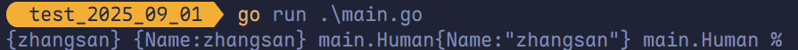

# 定义变量、`fmt` 包、`Print`、`Println`、`Printf`、Go 语言注释

## 定义变量

**关于变量**：程序运行过程中的数据都是保存在内存中，我们想要在代码中操作某个数据时就需要去内存上找到这个变量，但是如果我们直接在代码中通过<span style="color:#5682B1; font-weight:bold">内存地址</span>去操作变量的话，代码的可读性会非常差而且还容易出错，所以我们就**利用变量将这个数据的内存地址保存起来**，以后直接通过这个变量就能找到内存上对应的数据了。

### `var` 定义变量

```go
var 变量名 类型 = 表达式
```

例如：

```go
var name string = "zhangsan"
```

### 类型推导方式定义变量

`a` 在函数内部，可以使用更简略的 `:=` 方式声明并初始化变量。

> [!TIP]
>
> 短变量声明只能用于声明**局部变量**，不能用于**全局变量**的声明。

```go
变量名 := 表达式
```

例如：

```go
n := 10
```

## `fmt` 包、`Print`、`Println`、`Printf`

Go 中要打印一个值需要引入 `fmt` 包：

```go
import "fmt"
```

`fmt` 包中给我们提供了一些常见的打印数据的方法，例如：`Print`、`Println`、`Printf`，在实际开发过程中，`Println`、`Printf` 用的非常多。

### `Print` vs. `Println`

一次输入多个值时，`Println` 中间有空格而 `Print` 没有：

```go
// go python php javascript
fmt.Println("go", "python", "php", "javascript")
// gopythonphpjavascript
fmt.Print("go", "python", "php", "javascript")
```


`Println` 会自动转行，`Print` 不会：

```go
package main

import (
	"fmt"
)

func main() {
	// Hello
	// World
	fmt.Println("Hello")
	fmt.Println("World")
	// HelloWorld
	fmt.Print("Hello")
	fmt.Print("World")
}
```


### `Println` vs. `Printf`

`Printf` 是格式化输出，在很多场景下比 `Println` 更方便，例如：

```go
a := 10
b := 20
c := 30
fmt.Println("a =", a, "\b ,b =", b, "\b, c =", c)
fmt.Printf("a = %d, b = %d, c = %d\n", a, b, c)
```


#### 普通占位符

| 占位符 | 说明                           | 举例                    | 输出                          |
| ------ | ------------------------------ | ----------------------- | ----------------------------- |
| `%v`   | 相应值的默认格式               | `Printf("%v", people)`  | `{zhangsan}`                  |
| `%+v`  | 打印结构体时，会添加字段名     | `Printf("%+v", people)` | `{Name:zhangsan}`             |
| `%#v`  | 相应值的 Go 语法表示           | `Printf("%#v", people)` | `main.Human{Name:"zhangsan"}` |
| `%T`   | 相应值的类型的 Go 语法表示     | `Printf("%T", people)`  | `main.Human`                  |
| `%%`   | 字面上的百分号（非值的占位符） | `Printf("%%")`          | `%`                           |

```go
package main

import (
	"fmt"
)

type Human struct {
	Name string
}

func main() {
	people := Human{Name: "zhangsan"}
	fmt.Printf("%v %+v %#v %T %%", people, people, people, people)
}
```



#### 布尔占位符

| 占位符 | 说明                   | 举例                 | 输出   |
| ------ | ---------------------- | -------------------- | ------ |
| `%t`   | 输出 `true` 或 `false` | `Printf("%t", true)` | `true` |

#### 整数占位符

| 占位符 | 说明                                      | 举例                   | 输出     |
| ------ | ----------------------------------------- | ---------------------- | -------- |
| `%b`   | 二进制表示                                | `Printf("%b", 5)`      | `101`    |
| `%c`   | 相应 Unicode 码点所表示的字符             | `Printf("%c", 0x4E2D)` | `中`     |
| `%d`   | 十进制表示                                | `Printf("%d", 0x12)`   | `18`     |
| `%o`   | 八进制表示                                | `Printf("%o", 10)`     | `12`     |
| `%q`   | 单引号围绕的字符字面值（Go 语法安全转义） | `Printf("%q", 0x4E2D)` | `'中'`   |
| `%x`   | 十六进制表示（小写 a-f）                  | `Printf("%x", 13)`     | `d`      |
| `%X`   | 十六进制表示（大写 A-F）                  | `Printf("%X", 13)`     | `D`      |
| `%U`   | Unicode 格式（U+1234，等同于 `U+%04X`）   | `Printf("%U", 0x4E2D)` | `U+4E2D` |

#### 浮点数和复数的组成部分（实部和虚部）

| 占位符 | 说明                                                                                | 举例                     | 输出                  |
| ------ | ----------------------------------------------------------------------------------- | ------------------------ | --------------------- |
| `%b`   | 无小数部分的科学计数法（指数为 2 的幂，与 `strconv.FormatFloat` 的 `'b'` 格式一致） | -                        | `-123456p-78`（示例） |
| `%e`   | 科学计数法（小写 e）                                                                | `Printf("%e", 10.2)`     | `1.020000e+01`        |
| `%E`   | 科学计数法（大写 E）                                                                | `Printf("%E", 10.2)`     | `1.020000E+01`        |
| `%f`   | 有小数点无指数                                                                      | `Printf("%f", 10.2)`     | `10.200000`           |
| `%g`   | 自动选择 `%e` 或 `%f` 以产生更紧凑的表示（去除末尾 0）                              | `Printf("%g", 10.20)`    | `10.2`                |
| `%G`   | 自动选择 `%E` 或 `%f` 以产生更紧凑的表示（去除末尾 0）                              | `Printf("%G", 10.20+2i)` | `(10.2+2i)`           |

> [!TIP]
>
> 其中 `%b` 的浮点数表示根据 IEEE 754 标准。以单精度浮点数为例，将隐含 1 和尾数位相加后，乘以 2 的尾数位数次方，使得整个作为一个大整数来看待，便于输出。然后后面的指数就是真实指数再减去尾数位数，其以 2 为底。
>
> - `M = (隐含 1 + 尾数位) × 2^(尾数位数)`
> - `E = 真实指数 - 尾数位数`
> - 值 = `M × 2^E`

#### 字符串与字节切片

| 占位符 | 说明                                       | 举例                             | 输出           |
| ------ | ------------------------------------------ | -------------------------------- | -------------- |
| `%s`   | 输出字符串表示（`string` 类型或 `[]byte`） | `Printf("%s", []byte("Go语言"))` | `Go语言`       |
| `%q`   | 双引号围绕的字符串（Go 语法安全转义）      | `Printf("%q", "Go语言")`         | `"Go语言"`     |
| `%x`   | 十六进制（小写字母，每字节两个字符）       | `Printf("%x", "golang")`         | `676f6c616e67` |
| `%X`   | 十六进制（大写字母，每字节两个字符）       | `Printf("%X", "golang")`         | `676F6C616E67` |

#### 指针

| 占位符 | 说明                      | 举例                    | 输出                                   |
| ------ | ------------------------- | ----------------------- | -------------------------------------- |
| `%p`   | 十六进制表示（前缀 `0x`） | `Printf("%p", &people)` | `0x4f57f0`（示例，具体地址因环境而异） |

## Go 语言注释

Windows 下可以使用 `ctrl` + `/` 可以快速地注释，macOS 下使用 `⌘` + `/` 同样可以快速地注释：

```go
/*
这是一个块注释
*/

// 这是一个行注释
```
