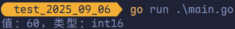
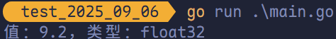
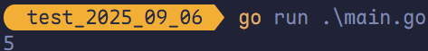
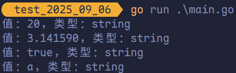
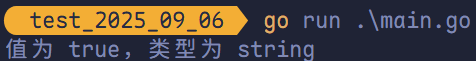
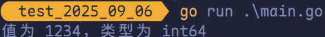
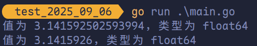
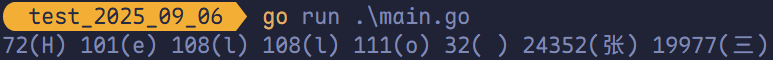

# 基本数据类型转换

## 关于 Golang 中的数据类型转换

Go 语言中只有<span style="color:#9B177E">强制类型转换</span>，没有<span style="color:#06923E">隐式类型转换</span>。

## 数值类型之间的相互转换

<span style="color:#640D5F; font-weight:bold">数值类型包括</span>：整型和浮点型。

```go
package main

import "fmt"

func main() {
	var a int8 = 20
	var b int16 = 40
	var c = int16(a) + b
	fmt.Printf("值：%v，类型：%T\n", c, c)
}
```



```go
package main

import "fmt"

func main() {
	var a float32 = 3.2
	var b int16 = 6
	c := a + float32(b)
	fmt.Printf("值：%v，类型：%T\n", c, c)
}
```



转换时，建议从<span style="color:#EA5B6F; font-weight:bold">低位</span>转换到<span style="color:#EA5B6F; font-weight:bold">高位</span>，<span style="color:#EA5B6F; font-weight:bold">高位</span>转换到<span style="color:#EA5B6F; font-weight:bold">低位</span>时，如果转换不成功就会溢出，出现预料之外的结果。

例如：

```go
package main

import "fmt"

func main() {
	var a int16 = 129
	var b = int8(a)
	fmt.Printf("b = %v\n", b)
}
```


例如计算直接三角形的斜边长使用 `math` 包的 `Sqrt()` 函数，该函数接收的是 `float64` 类型的参数，而变量 `a` 和 `b` 都是 `int` 类型的，这时就需要将 `a` 和 `b` 强制转换为 `float64` 类型。

```go
package main

import (
	"fmt"
	"math"
)

func main() {
	a, b := 3, 4
	// math.Sqrt 接收的参数是 float64 类型，需要强制转换
	c := int(math.Sqrt(float64(a*a + b*b)))
	fmt.Println(c)
}
```



## 其他类型转换为 `string` 类型

### `Sprintf` 将其他类型转换为 `string` 类型

> [!TIP]
>
> `Sprintf` 使用中需要注意转换的格式：
>
> - `int` 为 `%d`
> - `float` 为 `%f`
> - `bool` 为 `%t`
> - `byte` 为 `%c`

```go
package main

import "fmt"

func main() {
	var i int = 20
	var f float64 = 3.14159
	var t bool = true
	var b byte = 'a'

	str := fmt.Sprintf("%d", i)
	fmt.Printf("值：%v，类型：%T\n", str, str)

	str = fmt.Sprintf("%f", f)
	fmt.Printf("值：%v，类型：%T\n", str, str)

	str = fmt.Sprintf("%t", t)
	fmt.Printf("值：%v，类型：%T\n", str, str)

	str = fmt.Sprintf("%c", b)
	fmt.Printf("值：%v，类型：%T\n", str, str)
}
```



### 使用 `strconv` 包中的转换方法进行转换

#### `int` 转 `string`

其中 `Itoa` 是对 `FormatInt` 的<span style="color:#9929EA; font-weight:bold">简单封装</span>。

```go
// Itoa is equivalent to [FormatInt](int64(i), 10).
func Itoa(i int) string {
	return FormatInt(int64(i), 10)
}
```

```go
package main

import (
	"fmt"
	"strconv"
)

func main() {
	// int 转换为 string
	var num int = 20
	s := strconv.Itoa(num1)
	fmt.Printf("值：%v，类型：%T\n", s, s)

	// 或者使用 FormatInt，Itoa 是对其的便携封装
	s2 := strconv.FormatInt(int64(num), 10)
	fmt.Printf("值：%v，类型：%T\n", s2, s2)
}
```


#### `float` 转 `string`

`strconv.FormatFloat` 由四个参数：

- <span style="color:#E14434; font-weight:bold">参数 1</span>：要转换的值
- <span style="color:#E14434; font-weight:bold">参数 2</span>：格式化的类型
- <span style="color:#E14434; font-weight:bold">参数 3</span>：保留的小数点（若为 -1，代表不对小数点格式化）
- <span style="color:#E14434; font-weight:bold">参数 4</span>：格式化的位数

其中，格式化的类型有：

- `'f'`：十进制浮点数固定格式（`-ddd.dddd`）
- `'b'`：二进制指数格式（`-ddddp±ddd`，指数为二进制）
- `'e'`：十进制指数小写格式（`-d.dddde±dd`，指数以 `'e'` 表示）
- `'E'`：十进制指数大写格式（`-d.ddddE±dd`，指数以 `'E'` 表示）
- `'g'`：自动选择格式（指数较大时用 `'e'` 格式，否则用 `'f'` 格式）
- `'G'`：自动选择格式（指数较大时用 `'E'` 格式，否则用 `'f'` 格式）


```go
package main

import (
	"fmt"
	"strconv"
)

func main() {
	var num float32 = 1.14514
	s := strconv.FormatFloat(float64(num), 'f', 2, 64)
	fmt.Printf("值：%v，类型：%T\n", s, s)
}
```


> [!TIP]
>
> - <span style="color:#C83F12">对 `'f'`</span>：`prec` = 小数点后的位数（digits after decimal）。
> - <span style="color:#C83F12">对 `'e'` / `'E'`</span>：`prec` = 小数点后的位数（格式为 `d.dddde±dd`）。
> - <span style="color:#C83F12">对 `'g'` / `'G'`</span>：`prec` = 有效数字总数（significant digits）；若 `prec = -1` 则使用能唯一表示该浮点值的最少位数。
> - <span style="color:#C83F12">对 `'b'`</span>：`prec` 被忽略（`'b'` 用二进制指数表示，格式固定）。

#### `bool` 转 `string`

```go
package main

import (
	"fmt"
	"strconv"
)

func main() {
	str := strconv.FormatBool(true)
	fmt.Printf("值为 %v，类型为 %T\n", str, str)
}
```



## `string` 类型转换为数值类型

### `string` 类型转换为 `int` 类型

```go
package main

import (
	"fmt"
	"strconv"
)

func main() {
	str := "1234"
	// 第二个参数返回的是错误信息
	i64, _ := strconv.ParseInt(str, 10, 64)
	fmt.Printf("值为 %v，类型为 %T\n", i64, i64)
}
```



### `string` 类型转换为 `float` 类型

```go
package main

import (
	"fmt"
	"strconv"
)

func main() {
	str := "3.1415926"
	f32, _ := strconv.ParseFloat(str, 32)
	f64, _ := strconv.ParseFloat(str, 64)

	fmt.Printf("值为 %v，类型为 %T\n", f32, f32)
	fmt.Printf("值为 %v，类型为 %T\n", f64, f64)
}
```



> [!TIP]
>
> `strconv.ParseFloat` 的返回类型始终是 `float64`，但解析过程会遵循指定的精度（`bitSize`）进行处理。

### `string` 类型转换为 `bool` 类型

```go
package main

import (
	"fmt"
	"strconv"
)

func main() {
	b, _ := strconv.ParseBool("true")
	fmt.Printf("值为 %v，类型为 %T\n", b, b)
}
```


### `string` 转字符

```go
package main

import "fmt"

func main() {
	str := "Hello 张三"
	for _, ch := range str {
		fmt.Printf("%v(%c) ", ch, ch)
	}
	fmt.Println()
}
```



## 数值类型无法和 `bool` 类型进行转换

在 Go 语言中数值类型无法直接转换为 `bool` 类型，而 `bool` 类型也无法直接转换为数值类型。
