# 流程控制

## Golang 中的流程控制

<span style="color:#FB4141; font-weight:bold">流程控制</span>是每种编程语言控制逻辑走向和执行次序的重要部分，流程控制可以说是一门语言的“经脉”。

Go 语言中最常用的流程控制有 `if` 和 `for`，而 `switch` 和 `goto` 主要是为了简化代码、降低重复代码而生的结构，属于<span style="color:#799EFF">扩展类的流程控制</span>。

## `if else`（分支结构）

### `if` 条件判断基本写法

`if` 条件判断的格式如下：

```go
if 表达式 1 {
	分支 1
} else if 表达式 2 {
  分支 2
} else {
  分支 3
}
```

当表达式 1 的结果为 `true` 时，执行分支 1，否则判断表达式 2，如果满足则执行分支 2，都不满足时，则执行分支 3。`if` 判断中的 `else if` 以及 `else` 都是可选的，可以根据实际需要进行选择。

> [!TIP]
>
> Go 语言规定与 `if` 匹配的左括号 `{` 必须与 `if` 和表达式放在同一行，`{` 放在其他位置会触发编译错误。同理，与 `else` 匹配的 `{` 也必须与 `else` 写在同一行，`else` 也必须与上一个 `if` 或 `else if` 右边的大括号在同一行。

```go
package main

import "fmt"

func main() {
	score := 65
	if score >= 90 {
		fmt.Println("A")
	} else if score > 75 {
		fmt.Println("B")
	} else {
		fmt.Println("C")
	}
}
```

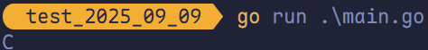

### `if` 条件判断特殊写法

`if` 条件判断还有一种特殊写法，可在 `if` 表达式前添加一个执行语句，再根据变量值进行判断：

```go
package main

import "fmt"

func main() {
	if score := 56; score >= 90 {
		fmt.Println("a")
	} else if score > 75 {
		fmt.Println("b")
	} else {
		fmt.Println("c")
	}
}
```

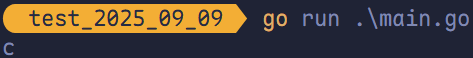

> [!TIP]
>
> 在 `if` 条件中声明的变量（如前文的 `score` ）属于局部变量，其作用域仅限于 `if` 和 `else` 代码块，无法在块外使用。

## `for`（循环结构）

Go 语言中的<span style="color:#FF894F; font-weight:bold">所有循环结构</span>均可使用 `for` 关键字来完成。

基本格式如下：

```go
for 初始语句; 条件表达式; 结束语句 {
  循环体语句
}
```

条件表达式返回 `true` 时，循环体不停地进行循环，直到条件表达式返回 `false` 自动退出循环。

```go
package main

import "fmt"

func main() {
	for i := 1; i <= 10; i++ {
		fmt.Printf("%v ", i)
	}
	fmt.Println()
}
```

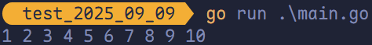

`for` 循环的初始语句<span style="color:#DC3C22; font-weight:bold">可以被省略</span>，但是初始语句后的分号必须要写，例如：

```go
package main

import "fmt"

func main() {
	i := 1
	for ; i <= 10; i++ {
		fmt.Printf("%v ", i)
	}
	fmt.Println()
}
```

`fot` 循环的初始语句和结束语句均可省略，例如：

```go
package main

import "fmt"

func main() {
	i := 1
	for i <= 10 {
		fmt.Printf("%v ", i)
		i++
	}
	fmt.Println()
}
```

这种写法类似其他编程语言中的 `while`，在 `while` 后添加一个表达式，满足表达式时持续循环，否则结束循环。

> [!TIP]
>
> Go 语言中无 `while` 语句，可以通过 `for` 替代。

### `for` 无限循环

```go
for {
  循环体语句
}
```

`for` 循环可以通过 `break`、`goto`、`return`、`panic` 语句强制退出循环。

```go
package main

import "fmt"

func main() {
	k := 1
	for {
		if k <= 10 {
			fmt.Println("ok~~~", k)
		} else {
			break
		}
		k++
	}
}
```


打印 0 到 50 之间的偶数：

```go
package main

import "fmt"

func main() {
	for i := 0; i < 50; i++ {
		if i%2 == 0 {
			fmt.Printf("%v ", i)
		}
	}
	fmt.Println()
}
```

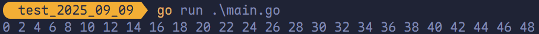

打印 0 到 100 之间所有是 9 的倍数的整数的个数及总和。

```go
package main

import "fmt"

func main() {
	count := 0
	sum := 0
	for i := 1; i <= 100; i++ {
		if i%9 == 0 {
			sum += i
			count++
		}
	}
	fmt.Println()
}
```

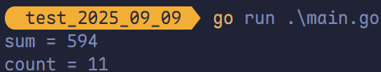

求 `1 + 2 + 3 + 4 + ... + 100` 的和。

```go
package main

import "fmt"

func main() {
	sum := 0
	for i := 1; i <= 100; i++ {
		sum += i
	}
	fmt.Println("sum =", sum)
}

```

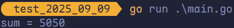

计算 5 的阶乘。

```go
package main

import "fmt"

func main() {
	n := 1
	for i := 1; i <= 5; i++ {
		n *= i
	}
	fmt.Println("n =", n)
}
```

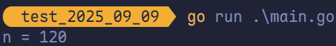

打印一个矩形。

```go
package main

import "fmt"

func main() {
	for i := 1; i <= 16; i++ {
		fmt.Print("*")
		if i%4 == 0 {
			fmt.Println()
		}
	}
}
```

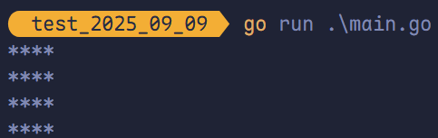

使用嵌套循环：

```go
package main

import "fmt"

func main() {
	for i := 0; i < 4; i++ {
		for j := 0; j < 4; j++ {
			fmt.Print("*")
		}
		fmt.Println()
	}
}
```

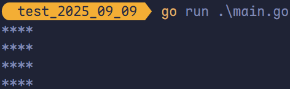

打印一个三角形：

```go
package main

import "fmt"

func main() {
	for i := 1; i <= 5; i++ {
		for j := 1; j <= i; j++ {
			fmt.Print("*")
		}
		fmt.Println()
	}
}
```

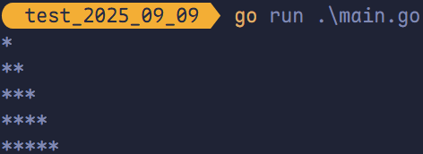

打印九九乘法表：

```go
package main

import "fmt"

func main() {
	for i := 1; i <= 9; i++ {
		for j := 1; j <= i; j++ {
			fmt.Printf("%v x %v = %v \t", i, j, i*j)
		}
		fmt.Println()
	}
}
```

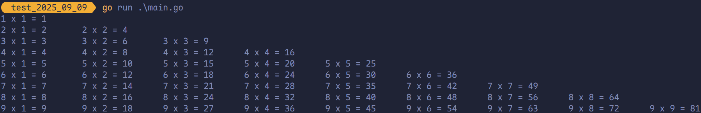

## `for range`（键值循环）

Go 语言中可以使用 `for range` 遍历数组、切片、字符串、`map` 以及通道（`channel`）。通过 `for range` 遍历的返回值有以下规律：

1. 数组、切片、字符串返回索引和值。
2. `map` 返回键和值。
3. 通道（`channel`）只返回通道内的值。

```go
package main

import "fmt"

func main() {
	str := "Mambo 哈基米"
	for index, val := range str {
		fmt.Printf("index = %d, val = %c\n", index, val)
	}
	for _, val := range str {
		fmt.Printf("val = %c\n", val)
	}
}
```

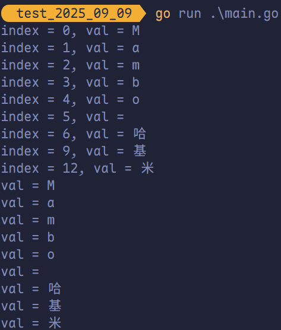

## `switch case`

<span style="color:#DC3C22; font-weight:bold">使用 `switch` 语句可方便地对大量的值进行条件判断。</span>

Go 语言规定每个 `switch` 只能有一个 `default` 分支。

```go
package main

import "fmt"

func main() {
	extname := ".html"
	switch extname {
	case ".html":
		{
			fmt.Println("text/html")
			break
		}
	case ".css":
		{
			fmt.Println("text/css")
			break
		}
	case ".js":
		{
			fmt.Println("text/javascript")
			break
		}
	default:
		{
			fmt.Println("格式错误")
			break
		}
	}
}
```

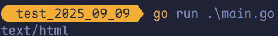

Go 语言中每个 `case` 语句可以不写 `break`，不加 `break` 也不会出现穿透现象，如下：

```go
package main

import "fmt"

func main() {
	extname := ".html"
	switch extname {
	case ".html":
		fmt.Println("text/html")
	case ".css":
		fmt.Println("text/css")
	case ".js":
		fmt.Println("text/javascript")
	default:
		fmt.Println("格式错误")
	}
}
```

一个分支可以有多个值，多个 `case` 值间使用 `,` 分隔。

```go
package main

import "fmt"

func main() {
	n := 2
	switch n {
	case 1, 3, 5, 7, 9:
		fmt.Println("奇数")
	case 2, 4, 6, 8:
		fmt.Println("偶数")
	default:
		fmt.Println(n)
	}
}
```

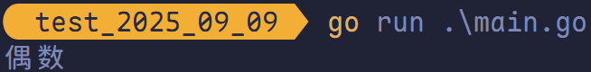

另一种使用初始化变量的写法：

```go
package main

import "fmt"

func main() {
	switch n := 7; n {
	case 1, 3, 5, 7, 9:
		fmt.Println("奇数")
	case 2, 4, 6, 8:
		fmt.Println("偶数")
	default:
		fmt.Println(n)
	}
}
```

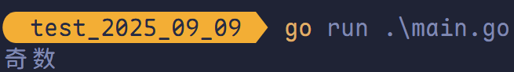

> [!TIP]
>
> 类似的，上面两种写法的作用域不一致。

分支还可以使用表达式，此时 `switch` 语句后面不需要<span style="color:#E14434; font-weight:bold">判断变量</span>（建议使用 `if else`）。例如：

```go
package main

import "fmt"

func main() {
	age := 56
	switch {
	case age < 25:
		fmt.Println("好好学习！")
	case age <= 60:
		fmt.Println("好好工作！")
	case age > 60:
		fmt.Println("好好享受！")
	default:
		fmt.Println("好好活着！")
	}
}
```

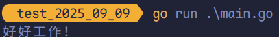

### `switch` 的穿透 `fallthrought`

`fallthrough` 语法可以执行满足条件的 `case` 的下一个 `case`，是为了兼容 C 语言中的 `case` 设计的。

```go
package main

import "fmt"

func main() {
	str := "a"
	switch str {
	case "a":
		fmt.Println("a")
		fallthrough
	case "b":
		fmt.Println("b")
		fallthrough
	case "c":
		fmt.Println("c")
		fallthrough
	default:
		fmt.Println("...")
	}
}
```

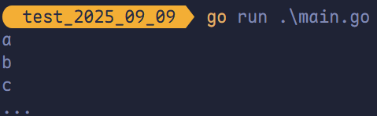

> [!TIP]
>
> `fallthrough` 默认只能穿透一层。

## `break`（跳出循环）

Go 语言中 `break` 语句用于以下几个方面：

- 用于循环语句中跳出循环，并开始执行循环之后的语句。
- `break` 在 `switch`（开关语句）中执行一条 `case` 后跳出语句的作用。
- 在多重循环中，可以使用标号 `label` 标出想 `break` 的循环。

<span style="color:#BA487F; font-weight:bold">`switch`（开关语句）中执行一条 `case` 后跳出语句的作用。</span>

```go
package main

import "fmt"

func main() {
	extname := ".html"
	switch extname {
	case ".html":
		{
			fmt.Println("text/html")
			break
		}
	case ".css":
		{
			fmt.Println("text/css")
			break
		}
	case ".js":
		{
			fmt.Println("text/javascript")
			break
		}
	default:
		{
			fmt.Println("格式错误")
			break
		}
	}
}
```


<span style="color:#4682A9; font-weight:bold">`for` 循环中默认 `break` 只能跳出一层循环。</span>

```go
package main

import "fmt"

func main() {
	for i := range 2 {
		for j := range 10 {
			if j == 3 {
				break
			}
			fmt.Printf("i = %v, j = %v\n", i, j)
		}
	}
}
```

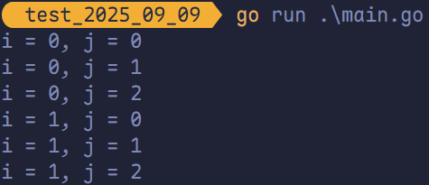

```go
package main

import "fmt"

func main() {
	k := 1
	for {
		if k <= 10 {
			fmt.Println("ok~~~", k)
		} else {
			break
		}
		k++
	}
}
```

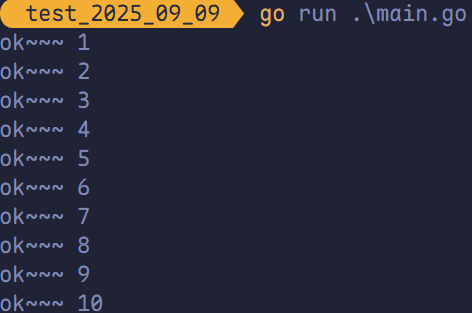

<span style="color:#EAA64D; font-weight:bold">在多重循环中，可以用标号 `label` 标出想 `break` 的循环。</span>

```go
package main

import "fmt"

func main() {
label:
	for i := range 2 {
		for j := range 10 {
			if j == 3 {
				break label
			}
			fmt.Printf("i = %v, j = %v\n", i, j)
		}
	}
}
```

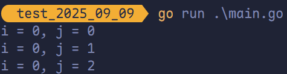

> [!TIP]
>
> 跳出的是紧跟着 `label` 标记的语句或块。（例如上述代码中的 `for`）

## `continue`（继续下次循环）

`continue` 语句可以结束当前循环，开始下一次的循环迭代过程，<span style="color:#9B177E; font-weight:bold">仅限在 `for` 循环内使用</span>。

```go
package main

import "fmt"

func main() {
	for i := range 2 {
		for j := range 4 {
			if j == 2 {
				continue
			}
			fmt.Printf("i = %v, j = %v\n", i, j)
		}
	}
}
```

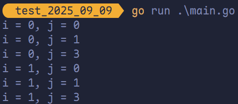

<span style="color:#640D5F; font-weight:bold">在 `continue`  语句后添加标签，表示标签对应的循环。</span>

```go
package main

import "fmt"

func main() {
label:
	for i := range 2 {
		for j := range 4 {
			if j == 2 {
				continue label
			}
			fmt.Printf("i = %v, j = %v\n", i, j)
		}
	}
}
```

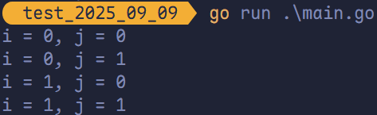

> [!TIP]
>
> - 普通 `continue` 只跳过当前循环的剩余部分。
> - 带标签的 `continue` 可以跳出内层循环，继续外层循环，避免使用额外变量或复杂逻辑。

## `goto`（跳转到指定标签）

`goto` 语句通过标签进行代码间的无条件跳转。`goto` 语句可以在快速跳出循环、避免重复退出上有一定的帮助。Go 语言中使用 `goto` 语句能简化一些代码的实现过程。

```go
package main

import "fmt"

func main() {
	n := 30
	fmt.Println("ok1")
	if n > 20 {
		goto label
	}
	fmt.Println("ok2")
	fmt.Println("ok2")
	fmt.Println("ok4")
label:
	fmt.Println("ok5")
	fmt.Println("ok6")
	fmt.Println("ok7")
}
```

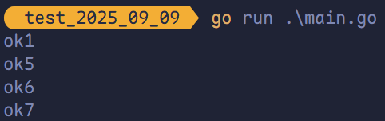

使用 `goto` 语句可以简化代码：

```go
package main

import "fmt"

func main() {
	for i := range 10 {
		for j := range 10 {
			if j == 2 {
				goto breakTag
			}
			fmt.Printf("i = %v, j = %v\n", i, j)
		}
	}
	return
breakTag:
	fmt.Println("结束循环")
}
```

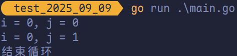
