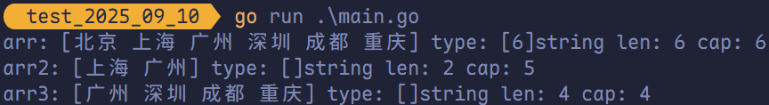
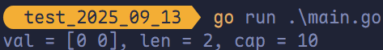
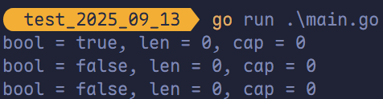
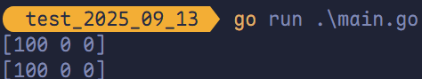
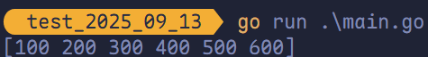
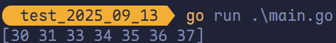
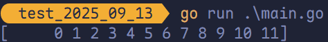

# 切片

## 使用切片的原因

因为数组长度是固定的并且数组长度属于类型的一部分，所以数组有很多局限性。例如：

```go
package main

import "fmt"

func arraySum(x [4]int) int {
	sum := 0
	for _, v := range x {
		sum = sum + v
	}
	return sum
}
func main() {
	a := [4]int{1, 2, 3, 4}
	println(arraySum(a))
	b := [5]int{1, 2, 3, 4, 5}
	// 错误
	fmt.Println(arraySum(b))
}
```

上述求和函数只能接受 `[4]int` 类型，其他的都不支持，因此传入长度为 5 的数组时会报错。

## 切片的定义

切片（Slice）是一个拥有相同类型元素的可变长度的序列。它是基于数组类型做的一层封装。它非常灵活，支持自动扩容。

切片是一个<span style="color:#FF204E; font-weight:bold">引用类型</span>，它的内部结构包含**地址**、**长度**和**容量**。

声明切片类型的基本语法如下：

```go
var name []T
```

其中：

1. **`name`**：表示变量名
2. **`T`**：表示切片中的元素类型

```go
package main

import "fmt"

func main() {
	var a []string              // 声明字符串切片
	var b = []int{}             // 声明整型切片并初始化
	var c = []bool{false, true} // 声明布尔切片并初始化
	// var d = []bool{false, true} // 声明布尔切片并初始化
	fmt.Println(a)
	fmt.Println(b)
	fmt.Println(c)
	fmt.Println(a == nil)
	fmt.Println(b == nil)
	fmt.Println(c == nil)
	// 切片是引用类型，不支持直接比较，仅能和 nil 比较
	// fmt.Println(c == d)
}
```


## 关于 `nil` 的认识

当声明了一个变量，却并没有赋值时，Golang 中会自动给变量添加一个默认零值。以下为每种类型对应的零值。

- `bool`：`false`
- `numbers`：`0`
- `string`：`""`
- `pointers`：`nil`
- `slices`：`nil`
- `maps`：`nil`
- `channels`：`nil`
- `functions`：`nil`
- `interfaces`：`nil`

> **注意**：零值为 `nil` 的类型本质上是引用类型，`nil` 表示它们未指向任何实际数据。

## 切片的循环遍历

切片的循环遍历和数组的循环遍历一致。

```go
package main

import "fmt"

func main() {
	arr := []string{"北京", "上海", "深圳"}
	for _, value := range arr {
		fmt.Println(value)
	}
}
```


## 基于数组定义切片

由于切片的底层就是一个数组，因此可以基于数组定义切片。

```go
package main

import "fmt"

func main() {
	arr := [5]int{55, 56, 57, 58, 59}
	arr2 := arr[1:4]
	fmt.Println(arr2)
	fmt.Printf("Type of arr2: %T\n", arr2)
}
```


还支持以下形式：

- `arr2 := arr[1:]`：`[56 57 58 59]`
- `arr2 := arr[:4]`：`[55 56 57 58]`
- `arr2 := arr[:]`：`[55 56 57 58 59]`

## 切片再切片

除了基于数组得到切片，还可以通过切片来得到切片。

```go
package main

import "fmt"

func main() {
	arr := [...]string{"北京", "上海", "广州", "深圳", "成都", "重庆"}
	fmt.Printf("arr: %v type: %T len: %v cap: %v\n", arr, arr, len(arr), cap(arr))
	arr2 := arr[1:3]
	fmt.Printf("arr2: %v type: %T len: %v cap: %v\n", arr2, arr2, len(arr2), cap(arr2))
	arr3 := arr2[1:5]
	fmt.Printf("arr3: %v type: %T len: %v cap: %v\n", arr3, arr3, len(arr3), cap(arr3))
}
```



> [!TIP]
>
> 对切片进行再切片时，<span style="color:#F93827">索引不能超过原数组的长度</span>，否则会出现索引越界的错误。

**容量计算规则**：

- 切片容量 = 原切片容量 - 起始索引。
- 如果使用 `append` 超出容量，会自动扩容底层数组。

## 切片的长度和容量

切片拥有自己的<span style="color:#4635B1">长度</span>和<span style="color:#4635B1">容量</span>，我们可以通过使用内置的 `len()` 函数求长度，使用内置的 `cap()` 函数求切片的容量。

切片的长度就是它所包含的<span style="color:#F93827">元素个数</span>。

切片的容量是<span style="color:#F93827">从它的第一个元素开始数，到其底层数组元素末尾的个数</span>。

切片 `s` 的长度和容量可通过表达式 `len(s)` 和 `cap(s)` 来获取。

```go
package main

import "fmt"

func main() {
	arr := []int{2, 3, 5, 7, 11, 13}
	fmt.Println(arr)
	fmt.Printf("len = %v, cap = %v\n", len(arr), len(arr))

	arr2 := arr[:2]
	fmt.Println(arr2)
	fmt.Printf("len = %v, cap = %v\n", len(arr2), cap(arr2))

	arr3 := arr[1:3]
	fmt.Println(arr3)
	fmt.Printf("len = %v, cap = %v\n", len(arr3), cap(arr3))
}
```


**第一个输出为 `[2 3 5 7 11 13]`，长度为 6，容量为 6。**



**`c :=s[:2]` 后输出为 `[2 3]`， 左指针 `s[0]`，右指针 `s[2]` , 所以长度为 2，容量为 6。**


**`d := s[1:3]` 后输出为 `[3 5]`， 左指针 `s[1]`，右指针 `s[3]` , 所以长度为 2，容量为 5。**


## 切片的本质

切片本质是对底层数组的封装，它包含三个信息：<span style="color:#7C00FE; font-weight:bold">底层数组的指针</span>、<span style="color:#7C00FE; font-weight:bold">切片的长度（`len`）</span>和<span style="color:#7C00FE; font-weight:bold">切片的容量（`cap`）</span>。

举例，现有一数组 `a := [8]int{0, 1, 2, 3, 4, 5, 6, 7}`。

切片为 `s := a[:5]` 示意图：



切片 `s2 := a[3:6]`，相应示意图如下：


> [!TIP]
>
> 指针的类型是 `uintptr`，长度和容量是 `int`。

## 使用 `make` 函数构造切片

以上均为基于数组创建的切片，若需要动态地创建一个切片，需要使用内置的 `make` 函数，格式如下：

```go
make([]T, size, cap)
```

**其中**：

1. `T`：切片的元素类型
2. `size`：切片中的元素数量
3. `cap`：切片的容量

```go
package main

import "fmt"

func main() {
	slice := make([]int, 2, 10)
	fmt.Printf("val = %v, len = %v, cap = %v\n", slice, len(slice), cap(slice))
}
```



上述代码中 `slice` 的内部存储空间已经分配了 10 个，但实际上仅用了 2 个。容量并不会影响当前元素的个数，所以 `len(slice)` 返回 2，`cap(slice)` 则返回该切片的容量。

## 切片无法直接比较

切片之间是不能比较的，无法使用 `==` 操作符来判断两个切片是否含有全部相等元素。切片唯一合法的比较操作是和 `nil` 比较。一个 `nil` 值的切片并没有底层数组，一个 `nil` 值的切片的长度和容量均为 0。但不可认为一个长度和容量均为 0 的切片必定是 `nil`，例如：

```go
package main

import "fmt"

func main() {
	var slice []int
	slice2 := []int{}
	slice3 := make([]int, 0)

	fmt.Printf("bool = %v, len = %v, cap = %v\n", slice == nil, len(slice), cap(slice))
	fmt.Printf("bool = %v, len = %v, cap = %v\n", slice2 == nil, len(slice2), cap(slice2))
	fmt.Printf("bool = %v, len = %v, cap = %v\n", slice3 == nil, len(slice3), cap(slice3))
}
```



> [!TIP]
>
> 未被初始化的切片还未分配底层数组，因此是 `nil`；而被分配底层数组的，即使底层数组是 `[0]int{}` 也不为 `nil`。

## 切片是引用数据类型

下边的代码中演示了拷贝前后两个变量共享底层数组，对一个切片的修改会影响另一个切片的内容。

```go
package main

import "fmt"

func main() {
	slice := make([]int, 3)
	slice2 := slice
	slice2[0] = 100
	fmt.Println(slice)
	fmt.Println(slice2)
}
```



## `append` 方法为切片添加元素

Go 语言的内建函数 `append` 可以为切片动态添加元素，每个切片会指向一个底层数组，这个数组的容量够用就添加新增元素。当底层数组不能容纳新增元素时，切片就会自动按照一定的策略进行<span style="color:#FF0B55; font-weight:bold">扩容</span>，此时该切片指向的底层数组就会更换。<span style="color:#FF0B55; font-weight:bold">扩容</span>操作往往发生在 `append` 函数调用时，因此通常需要使用原变量接受 `append` 函数的返回值。

```go
package main

import (
	"fmt"
)

func main() {
	var numSlice []int
	for i := range 10 {
		numSlice = append(numSlice, i)
		fmt.Printf("%v\tlen: %v\tcap: %v\tptr: %p\n", numSlice, len(numSlice), cap(numSlice), numSlice)
	}
}
```


1. `append` 函数将元素追加到切片的最后并返回该切片。
2. 切片 `numSlice` 的容量按照 1、2、4、8、16 这种规则自动扩容，每次扩容后均为扩容前的 2 倍。

`append` 函数还支持一次性追加多个元素。

```go
package main

import "fmt"

func main() {
	var citySlice []string
	citySlice = append(citySlice, "北京")
	citySlice = append(citySlice, "上海", "广州", "深圳")
	cityArr := [2]string{"成都", "杭州"}
	citySlice = append(citySlice, cityArr[:]...)
	fmt.Println(citySlice)
}
```


> [!TIP]
>
> 上述的 `...` 表示将切片或数组（数组需通过 `数组[:]` 方式转换为切片）中的所有元素依次展开为多个独立的参数传递。

```go
package main

import "fmt"

func main() {
	slice := []int{100, 200, 300}
	slice2 := []int{400, 500, 600}
	slice3 := append(slice, slice2...)
	fmt.Println(slice3)
}
```



## 切片的扩容策略

```go
// nextslicecap computes the next appropriate slice length.
func nextslicecap(newLen, oldCap int) int {
	newcap := oldCap
	doublecap := newcap + newcap
	if newLen > doublecap {
		return newLen
	}

	const threshold = 256
	if oldCap < threshold {
		return doublecap
	}
	for {
		// Transition from growing 2x for small slices
		// to growing 1.25x for large slices. This formula
		// gives a smooth-ish transition between the two.
		newcap += (newcap + 3*threshold) >> 2

		// We need to check `newcap >= newLen` and whether `newcap` overflowed.
		// newLen is guaranteed to be larger than zero, hence
		// when newcap overflows then `uint(newcap) > uint(newLen)`.
		// This allows to check for both with the same comparison.
		if uint(newcap) >= uint(newLen) {
			break
		}
	}

	// Set newcap to the requested cap when
	// the newcap calculation overflowed.
	if newcap <= 0 {
		return newLen
	}
	return newcap
}
```

从上述代码可看出：

1. 首先判断，如果新申请的容量（`newLen`）大于旧容量（`oldCap`）的两倍，则最终容量（`newcap`）就是新申请的容量（`newLen`）。
2. 否则，如果旧容量（`oldCap`）小于 256，则最终容量（`newcap`）为旧容量的两倍（`newcap = oldCap * 2`）。
3. 否则（即旧容量大于等于 256），最终容量（`newcap`）从旧容量开始，每次增加自身加上 3×256 的 1/4（即 `newcap += (newcap + 3*256) >> 2`），直到 `newcap` 大于等于新申请的容量（`newLen`）。
4. 如果最终容量（`newcap`）计算过程中发生溢出，则最终容量（`newcap`）为新申请的容量（`newLen`）。

切片扩容还会根据切片中元素的类型不同而做不同的处理，例如 `int` 和 `string` 类型的处理方式不同。

## 从切片中删除元素

Go 语言中并没有删除切片元素的专用方法，可以使用切片的特性来删除元素。

```go
package main

import "fmt"

func main() {
	numSlice := []int{30, 31, 32, 33, 34, 35, 36, 37}
	numSlice = append(numSlice[:2], numSlice[3:]...)
	fmt.Println(numSlice)
}
```



总之，要从切片 `numSlice` 中删除索引为 `index` 的元素，做法是：

```go
numSlice = append(numSlice[:index], numSlice[index+1:]...)
```

## 练习题

```go
package main

import "fmt"

func main() {
	var slice = make([]string, 5, 10)
	for i := range 12 {
		slice = append(slice, fmt.Sprintf("%v", i))
	}
	fmt.Println(slice)
}
```



使用内置的 `sort` 包对数组 `var a = [...]int{3, 7, 8, 9, 1}` 进行排序。

```go
package main

import (
	"fmt"
	"sort"
)

func main() {
	slice := []int{3, 7, 8, 9, 1}
	sort.Ints(slice)
	fmt.Println(slice)
}
```


