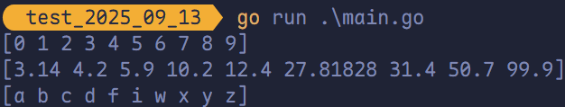

# 切片排序算法

## `sort` 包文档

https://golang.org/src/sort

## `sort` 升序排序

对应 `int`、`float64` 和 `string` 数组或者切片的排序，Go 分别提供了 `sort.Ints()`、`sort.Float64s()` 和 `sort.Strings()` 函数，默认均为从小到大排序。

```go
package main

import (
	"fmt"
	"sort"
)

func main() {
	intSlice := []int{2, 4, 3, 5, 7, 6, 9, 8, 1, 0}
	floatSlice := []float64{4.2, 5.9, 12.4, 10.2, 50.7, 99.9, 31.4, 27.81828, 3.14}
	stringSlice := []string{"a", "c", "b", "z", "x", "w", "y", "d", "f", "i"}
	sort.Ints(intSlice)
	sort.Float64s(floatSlice)
	sort.Strings(stringSlice)
	fmt.Println(intSlice)
	fmt.Println(floatSlice)
	fmt.Println(stringSlice)
}
```



## `sort` 降序排序

Golang 的 `sort` 包可以使用 `sort.Reverse(slice)` 来调换 `slice.Interface.Less`，也就是比较函数。因此，`int`、`float64` 和 `string` 的逆序排序为：

```go
package main

import (
	"fmt"
	"sort"
)

func main() {
	intSlice := []int{2, 4, 3, 5, 7, 6, 9, 8, 1, 0}
	floatSlice := []float64{4.2, 5.9, 12.4, 10.2, 50.7, 99.9, 31.4, 27.81828, 3.14}
	stringSlice := []string{"a", "c", "b", "z", "x", "w", "y", "d", "f", "i"}
	sort.Sort(sort.Reverse(sort.IntSlice(intSlice)))
	sort.Sort(sort.Reverse(sort.Float64Slice(floatSlice)))
	sort.Sort(sort.Reverse(sort.StringSlice(stringSlice)))
	fmt.Println(intSlice)
	fmt.Println(floatSlice)
	fmt.Println(stringSlice)
}
```

## `slices.Sort` 升序排序

`slice.Sort` 来自标准库 `slices` 包（Go 1.21 及以上版本支持），是基于泛型实现的通用排序函数。他通过类型约束 `cmp.Ordered` 支持所有“可比较大小”的类型（如 `int`、`float64`、`string` 等），无需为不同类型调用单独的排序函数，实现了排序逻辑的统一。

```go
package main

import (
	"fmt"
	"slices"
)

func main() {
	intSlice := []int{2, 4, 3, 5, 7, 6, 9, 8, 1, 0}
	floatSlice := []float64{4.2, 5.9, 12.4, 10.2, 50.7, 99.9, 31.4, 27.81828, 3.14}
	stringSlice := []string{"a", "c", "b", "z", "x", "w", "y", "d", "f", "i"}

	slices.Sort(intSlice)
	slices.Sort(floatSlice)
	slices.Sort(stringSlice)

	fmt.Println(intSlice)
	fmt.Println(floatSlice)
	fmt.Println(stringSlice)
}
```


## `slices.SortFunc` 降序排序

`slices` 包通过 `slices.SortFunc` 支持自定义排序逻辑（包括降序），它接受一个切片和一个比较函数（`func(a, b T) bool`），通过自定义比较规则实现降序排序。相比 `sort` 包的 `Reverse` 转换，`slices.SortFunc` 更直接，无需额外的类型转换。

```go
package main

import (
	"cmp"
	"fmt"
	"slices"
)

func main() {
	intSlice := []int{2, 4, 3, 5, 7, 6, 9, 8, 1, 0}
	floatSlice := []float64{4.2, 5.9, 12.4, 10.2, 50.7, 99.9, 31.4, 27.81828, 3.14}
	stringSlice := []string{"a", "c", "b", "z", "x", "w", "y", "d", "f", "i"}

	slices.SortFunc(intSlice, func(a, b int) int { return cmp.Compare(b, a) })
	slices.SortFunc(floatSlice, func(a, b float64) int { return cmp.Compare(b, a) })
	slices.SortFunc(stringSlice, func(a, b string) int { return cmp.Compare(b, a) })

	fmt.Println(intSlice)
	fmt.Println(floatSlice)
	fmt.Println(stringSlice)
}
```


> [!tip]
>
> `cmp.Compare` 中 `<` 返回 1、`>` 返回 -1、其余 0；`sort.SortFunc` 要求的比较函数正适配这种逻辑定义。
