# 函数

## 函数定义

函数是组织好的、可重复使用的、用于执行指定任务的代码块。

Go 语言中支持：函数、匿名函数和闭包。

Go 语言中定义函数时，使用 `func` 关键字，具体格式如下：

```go
func 函数名(参数) (返回值) {
  函数体
}
```

- **函数名**：由字母、数字、下划线组成。但函数名的第一个字母不能是数字。在同一个包内，函数名称也不能<span style="color:#5C7285; font-weight:bold">重名</span>。
- **参数**：参数由参数变量和参数变量的类型组成，多个参数之间使用 `,` 分隔。
- **返回值**：返回值由返回值变量和其变量类型组成，也可以只写返回值的类型，多个返回值必须用 `()`  包裹，并用 `,` 分隔。
- **函数体**：实现指定功能的代码块。

```go
func add(x int, y int) int {
  return x + y
}
```

函数的参数和返回值均为可选，例如可实现不需要参数和返回值的函数：

```go
func sayHello() {
  fmt.Println("Hello World!")
}
```

## 函数的调用

定义了函数之后，可以通过 `函数名()` 的方式调用函数。例如：

```go
func main() {
	sayHello()
	fmt.Println(add(10, 20))
}
```

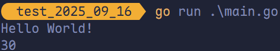

> [!tip]
>
> 调用有返回值的函数时，可以不接受其返回值。

## 函数参数

### 类型简写

函数的参数中如果相邻变量的类型相同，则可以<span style="color:#CB9DF0; font-weight:bold">省略类型</span>，例如：

```go
func add(x, y int) int {
	return x + y
}
```

上述代码中，`add` 函数中有两个参数，这两个参数的类型均为 `int`，因此可以省略 `x` 的类型，因为 `y` 后面有类型说明，`x` 参数也是该类型。

### 可变参数

<span style="color:#789DBC; font-weight:bold">可变参数</span>是指函数的参数数量不固定。Go 语言的可变参数通过在参数名后加 `...` 来标识。

> [!tip]
>
> 可变参数通常要作为函数的<span style="color:#C96868; font-weight:bold">最后一个参数</span>。

```go
package main

import "fmt"

func add(nums ...int) int {
	sum := 0
	for _, num := range nums {
		sum += num
	}
	return sum
}

func main() {
	fmt.Println(add())
	fmt.Println(add(10))
	fmt.Println(add(10, 20))
	fmt.Println(add(10, 20, 30))
	fmt.Println(add(10, 20, 30, 40))
}
```

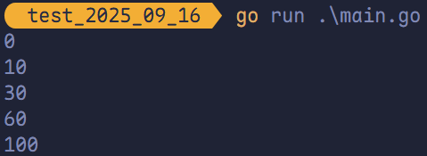

固定参数搭配可变参数时，可变参数要放在固定参数后面：

```go
package main

import "fmt"

func add(x int, y ...int) int {
	sum := x
	for _, v := range y {
		sum += v
	}
	return sum
}

func main() {
	fmt.Println(add(10))
	fmt.Println(add(10, 20))
	fmt.Println(add(10, 20, 30))
	fmt.Println(add(10, 20, 30, 40))
}
```

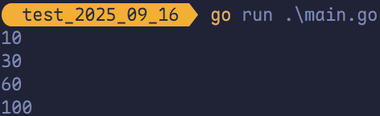

本质上，函数的可变参数是通过<span style="color:#FF8A8A; font-weight:bold">切片</span>来实现的。

## 函数返回值

Go 语言中通过 `return` 关键字向外输出返回值。

### 函数多返回值

Go 语言中函数支持多返回值，函数如果有多个返回值时，必须使用 `()` 将所有返回值包裹起来。

```go
func calc(x, y int) (int, int) {
  sum := x + y
  diff := x - y
  return sum, diff
}
```

### 返回值命名

函数定义时可以给返回值命名，并在函数体中直接使用这些变量，最后通过 `return` 关键字返回。

```go
func calc(x, y int) (sum, diff int) {
  sum = x + y
  diff = x - y
  return
}
```

## 函数变量作用域

### 全局变量

全局变量是定义在函数外部的变量，它在程序整个运行周期内均有效。在函数中可以访问到全局变量。

```go
package main

import "fmt"

// 定义全局变量 num。
var num = 10

func testGlobal() {
	// 在函数中访问全局变量 num。
	fmt.Printf("num = %v\n", num)
}

func main() {
	// num = 10
	testGlobal()
}
```

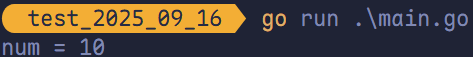

### 局部变量

局部变量是函数内部定义的变量，函数内定义的变量无法在该函数外使用。

#### 函数内定义的变量无法在该函数外使用

例如下面的示例代码 `main` 函数中无法使用 `testLocal` 函数中定义的变量 `x`。

```go
func testLocal() {
  // 定义一个函数局部变量 x，仅在该函数内生效
  var x int64 = 100
  fmt.Printf("x = %d\n", x)
}

func main() {
  testLocal()
  // 此时无法使用变量 x
  fmt.Println(x)
}
```

#### 如果局部变量和全局变量重名，优先访问局部变量

```go
package main

import "fmt"

// 定义全局变量 num。
var num = 10

func testNum() {
	num := 100
	// 函数中优先使用局部变量 num。
	fmt.Printf("num = %d\n", num)
}

func main() {
	testNum()                     // num = 100
	fmt.Printf("num = %d\n", num) // num = 10
}
```

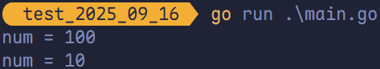

语句块定义的变量通常在 `if` 条件判断、`for` 循环、`switch` 语句上使用这种定义变量的方式。

```go
func testLocal(x, y int) {
  // 函数的参数仅在本函数内生效。
  fmt.Println(x, y)
  if x > 0 {
    // 变量 z 只在 if 语句块中生效。
    z := 100
    fmt.Println(z)
  }
  // 此处无法使用变量 z。
  // fmt.Println(z)
}
```

`for` 循环语句中定义的变量，仅在 `for` 语句块中生效：

```go
func testLocal() {
  for i := range 10 {
    // 变量 i 只在当前 for 语句块中生效
    fmt.Println(i)
  }
  // 此处无法使用变量 i
  // fmt.Println(i)
}
```

## 函数类型与变量

### 定义函数类型

可以使用 `type` 关键字来定义一个函数类型，具体格式如下：

```go
type calculation func(int, int) int
```

上述语句定义了一个 `calculation` 类型，它为一种函数类型，这种函数接受两个 `int` 类型的参数并且返回一个 `int` 类型的返回值。

简而言之，凡是满足这个条件的函数均为 `calculation` 类型的函数，例如下文代码中的 `add` 和 `sub` 均为 `calculation` 类型。

```go
func add(x, y int) int {
  return x + y
}

func sub(x, y int) int {
  return x - y
}
```

`add` 和 `sub` 均可赋值给 `calculation` 类型的变量。

```go
var c calculation
c = add
```

### 函数类型变量

可以声明函数类型的变量并且为该变量赋值：

```go
package main

import "fmt"

func add(x, y int) int {
	return x + y
}

type calc func(int, int) int

func main() {
	// 声明一个 calc 类型的变量 c，
	// 并将 add 变量赋值给它。
	var c calc = add
	fmt.Printf("Type of c: %T\n", c)
	// 像调用 add 一样调用 c。
	fmt.Println(c(1, 2))

	f := add // 将函数 add 赋值给变量 f。
	fmt.Printf("Type of f: %T\n", f)
	// 像调用 add 一样调用 f。
	fmt.Println(f(10, 20))
}
```

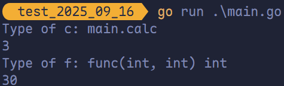

> [!tip]
>
> `c` 是显式声明为 `calc` 类型（显示为 `main.calc`），`f` 是类型推导出的 `func(int, int) int`（显示函数字面量类型），两者<span style="color:#FF4F0F; font-weight:bold">底层相同但显示不同</span>。

## 高阶函数

高阶函数分为函数作为参数和函数作为返回值两部分。

### 函数作为参数

函数可以作为参数：

```go
package main

import "fmt"

func add(x, y int) int {
	return x + y
}

func calc(x, y int, fn func(x, y int) int) int {
	return fn(x, y)
}

func main() {
	fmt.Println(calc(10, 20, add))
}
```

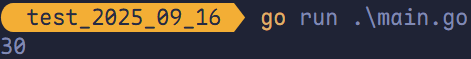

### 函数作为返回值

函数也可以作为返回值：

```go
package main

import "fmt"

func add(x, y int) int {
	return x + y
}

func sub(x, y int) int {
	return x - y
}

func calc(option string) func(int, int) int {
	switch option {
	case "+":
		return add
	case "-":
		return sub
	case "*":
		return func(x, y int) int {
			return x * y
		}
	default:
		return nil
	}
}

func main() {
	fmt.Println(calc("+")(10, 20))
	fmt.Println(calc("-")(10, 20))
	fmt.Println(calc("*")(10, 20))
}
```

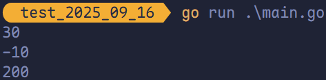

## 匿名函数和闭包

### 匿名函数

函数当然还可以作为返回值，但是在 Go 语言中函数内部无法像之前那样定义函数，只能定义匿名函数。匿名函数就是没有函数名的函数，匿名函数定义格式如下：

```go
func(参数)(返回值) {
  函数体
}
```

匿名函数因为没有函数名，因此无法像普通函数一样调用，所以匿名函数需要保存在<span style="color:#C5705D">某个变量</span>或者作为<span style="color:#EF9C66">立即执行函数</span>：

```go
package main

import "fmt"

func main() {
	add := func(x, y int) {
		fmt.Println(x + y)
	}
	add(10, 20) // 通过变量调用匿名函数。

	// 自执行函数指匿名函数定义完加 () 直接执行。
	func(x, y int) {
		fmt.Println(x + y)
	}(10, 20)
}
```

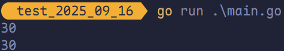

匿名函数多用于实现回调函数和闭包。

### 闭包

<span style="color:#0046FF; font-weight:bold">闭包（closure）</span>是<span style="color:#FB4141">有权访问另一个函数作用域中变量的函数</span>，通俗理解也可看作“<span style="color:#FF6F3C">定义在一个函数内部的函数</span>”，本质上是连接函数内部与外部的桥梁，也是“函数 + 其引用环境”的组合体。

<span style="color:#03A791; font-weight:bold">闭包的创建方式与写法</span>：常见方式是在一个函数内部创建另一个函数，通过<span style="color:#FF9D23">内部函数访问外部函数的变量</span>；写法上需在外部函数中嵌套内部函数，并最终<span style="color:#5CB338">返回内部函数</span>。

不同变量特点对比如下：

| 变量类型 | 常驻内存 | 污染全局 |
| -------- | -------- | -------- |
| 全局变量 | ✅        | ✅        |
| 局部变量 | ❌        | ❌        |

闭包的核心优势在于兼顾上述两类变量的优点，能让一个变量<span style="color:#0D92F4">既常驻内存，又不污染全局</span>。

> [!tip]
> 需注意的是，闭包会保留其作用域内返回的局部变量资源，这些资源不会被立刻销毁回收，可能导致<span style="color:#F95454">内存占用增加</span>；过度使用闭包会造成<span style="color:#F95454">性能下降</span>，因此建议仅在非常有必要时使用。

```go
package main

import "fmt"

func adder() func(int) int {
	var x int
	return func(y int) int {
		x += y
		return x
	}
}

func main() {
	var fn = adder()
	fmt.Println(fn(10)) // 10
	fmt.Println(fn(20)) // 30
	fmt.Println(fn(30)) // 60

	fn2 := adder()
	fmt.Println(fn2(40)) // 40
	fmt.Println(fn2(50)) // 90
}
```

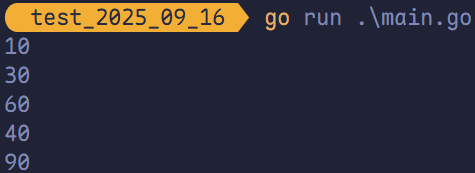

变量 `fn` 是一个函数并且它引用了其外部作用域中的 `x` 变量，此时 `fn` 就是一个闭包。在 `fn` 生命周期内，变量 `x` 也一直有效。

```go
package main

import "fmt"

func adder(x int) func(int) int {
	return func(y int) int {
		x += y
		return x
	}
}

func main() {
	fn := adder(10)
	fmt.Println(fn(10)) // 20
	fmt.Println(fn(20)) // 40
	fmt.Println(fn(30)) // 70

	fn2 := adder(20)
	fmt.Println(fn2(40)) // 60
	fmt.Println(fn2(50)) // 110
}
```

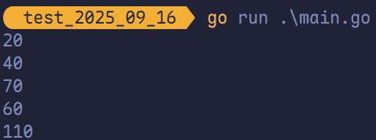

变量 `fn` 是 `adder(10)` 返回的函数，它引用了外部作用域中的 `x`（初始值为 10），此时 `fn` 就是一个闭包，每次调用时累加 `x` 的值（如 `fn(10)` 输出 20，`fn(20)` 输出 40）；类似地，`fn2` 是独立的闭包，从 20 开始累加。

```go
package main

import (
	"fmt"
	"strings"
)

func makeSuffix(suffix string) func(string) string {
	return func(name string) string {
		if !strings.HasSuffix(name, suffix) {
			return name + suffix
		}
		return name
	}
}

func main() {
	jpgFn := makeSuffix(".jpg")
	txtFn := makeSuffix(".txt")
	fmt.Println(jpgFn("test")) // test.jpg
	fmt.Println(txtFn("test")) // test.txt
}
```

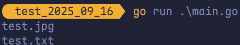

变量 `jpgFn` 是 `makeSuffix(".jpg")` 返回的函数，它引用了外部作用域中的 `suffix`（值为 `.jpg`），此时 `jpgFn` 就是一个闭包，每次调用时检查并添加后缀（如 `jpgFn("test")` 输出 `test.jpg`）；类似地，`txtFn` 是独立的闭包，从 `.txt` 开始处理。

```go
package main

import "fmt"

func calc(base int) (func(int) int, func(int) int) {
	add := func(i int) int {
		base += i
		return base
	}

	sub := func(i int) int {
		base -= i
		return base
	}

	return add, sub
}

func main() {
	fn, fn2 := calc(10)
	fmt.Println(fn(1), fn2(2))
	fmt.Println(fn(3), fn2(4))
	fmt.Println(fn(5), fn2(6))
}
```

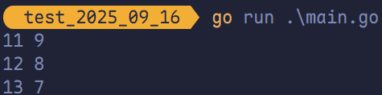

变量 `fn` 是 `calc(10)` 返回的第一个函数，它引用了外部作用域中的 `base`（初始值为 10），此时 `fn` 就是一个闭包，每次调用时累加 `base` 的值（如 `fn(1)` 输出 11，`fn(3)` 输出 14）；类似地，`fn2` 是第二个闭包，从 10 开始减法处理。

---

总而言之，闭包就是“函数 + 引用环境”。

## `defer` 语句

Go 语言中的 `defer` 语句会将其跟随的语句进行<span style="color:#E45A92; font-weight:bold">延迟处理</span>。在 `defer` 归属的函数即将返回时，将延迟处理的语句<span style="color:#476EAE; font-weight:bold">按 `defer` 定义的逆序进行执行</span>，也就是说，先被 `defer` 的语句，<span style="color:#EF7722; font-weight:bold">最后被执行</span>；最后被 `defer` 的语句，<span style="color:#556B2F; font-weight:bold">最先被执行</span>。

```go
package main

import "fmt"

func main() {
	fmt.Println("Start!")
	defer fmt.Println(1)
	defer fmt.Println(2)
	defer fmt.Println(3)
	fmt.Println("结束！")
}
```

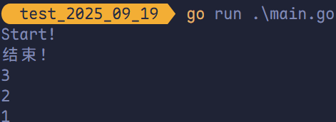

由于 `defer` 语句<span style="color:#5D688A; font-weight:bold">延迟调用</span>的特性，所以 `defer` 语句能异常方便地处理资源释放问题。例如资源清理、文件关闭、解锁及记录时间等。

### `defer` 执行时机

在 Go 语言的函数中，`return` 语句在底层<span style="color:#3338A0; font-weight:bold">并非原子操作</span>，它分为<span style="color:#E43636; font-weight:bold">给返回值赋值</span>和 <span style="color:#E43636; font-weight:bold">`RET`  指令</span>两步。而 `defer` 语句执行的时机就在<span style="color:#064232; font-weight:bold">返回值赋值操作</span>后，<span style="color:#064232; font-weight:bold">`RET` 指令</span>执行前。


### `defer` 经典案例 1

```go
package main

import "fmt"

func f1() int {
	// 局部变量 x = 5。
	x := 5

	// defer 执行时 x 变为 6，但不影响返回值。
	defer func() {
		x++
	}()

	// 返回 x 的值为 5。
	return x
}

// x 是命名返回值，初始为 0。
func f2() (x int) {
	// defer 执行时，x 变为 6。
	defer func() {
		x++
	}()

	// 设置 x = 5，然后 defer 修改为 6。
	return 5
}

// y 是命名返回值，初始为 0。
func f3() (y int) {
	// 局部变量 x = 5。
	x := 5

	// defer 修改局部变量 x 为 6，不影响 y。
	defer func() {
		x++
	}()

	// 设置 y = x，此时 x 为 5。
	return x
}

// x 是命名返回值，初始为 0。
func f4() (x int) {
	// defer 接受 x 的副本（0）。
	defer func(x int) {
		// 修改副本为 1，不影响原 x。
		x++
	}(x)

	// 设置 x = 5。
	return 5
}

func main() {
	fmt.Println(f1())
	fmt.Println(f2())
	fmt.Println(f3())
	fmt.Println(f4())
}
```

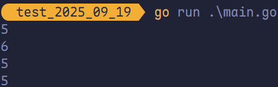

> [!tip]
>
> <span style="color:#0046FF; font-weight:bold">命名返回值</span>在 Go 中直接绑定到函数的<span style="color:#FF8040; font-weight:bold">返回值内存位置</span>，当 `defer` 修改它时，会直接改变<span style="color:#239BA7; font-weight:bold">最终返回值</span>；而<span style="color:#B9375D; font-weight:bold">局部变量</span>在 `return` 时会被复制到一个<span style="color:#D3AF37; font-weight:bold">独立的返回值位置</span>，`defer` 的修改只能影响<span style="color:#9929EA; font-weight:bold">局部变量本身</span>，无法改变<span style="color:#BA487F; font-weight:bold">返回值</span>。

### `defer` 经典案例 2

```go
package main

import "fmt"

func calc(index string, a, b int) int {
	ret := a + b
	fmt.Println(index, a, b, ret)
	return ret
}

func main() {
	x := 1
	y := 1
	defer calc("AA", x, calc("A", x, y))
	x = 10
	defer calc("BB", x, calc("B", x, y))
	y = 20
}
```

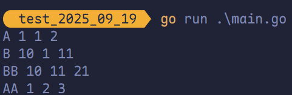

在 Go 中，`defer` 参数<span style="color:#E67514; font-weight:bold">在注册时立即计算</span>（包括嵌套调用），`defer` 函数在函数返回前执行（后进先出）。

1. `x, y = 1, 1`。
2. 注册 `defer calc("AA", 1, calc("A",1,1))` → 立即执行 `calc("A",1,1)` → 输出 `A 1 1 2`。
3. `x = 10`。
4. 注册 `defer calc("BB", 10, calc("B",10,1))` → 立即执行 `calc("B",10,1)` → 输出 `B 10 1 11`。
5. `y = 20`。
6. 函数返回，按 LIFO（后进后出）执行 `defer`：
   - `calc("BB", 10, 11)` → 输出 `BB 10 11 21`。
   - `calc("AA", 1, 2)` → 输出 `AA 1 2 3`。

## 内置函数 `panic`/`recover`

| 内置函数             | 介绍                                                         |
| -------------------- | ------------------------------------------------------------ |
| `close`              | 主要用来关闭 `channel`                                       |
| `len`                | 用来求长度，例如 `string`、`array`、`slice`、`map`、`channel` |
| `new`                | 用来分配内存，主要用来分配值类型，例如 `int`、`struct`；返回的是指针 |
| `make`               | 用来分配内存，主要用来分配引用类型，例如 `chan`、`map`、`slice` |
| `append`             | 用来追加元素到数组、`slice` 中                               |
| `panic` 和 `recover` | 用来进行错误处理                                             |

Go 语言目前无异常机制，但是使用 `panic`/`recover` 模式来处理错误。`panic` 可以在任何地方引发，但是 `recover` 只有在 `defer` 调用的函数中有效。

> [!tip]
>
> - **`panic`**：意思是“恐慌”或“惊慌”，表示程序遇到严重错误（如除零或无效操作）时突然停止执行，类似于“抛出异常”但更直接，会导致程序崩溃。
> - **`recover`**：意思是“恢复”或“挽回”，用于在 `defer` 函数中捕获 `panic`，防止程序完全崩溃，并允许继续执行后续代码。

### `panic`/`recover` 的基本使用

```go
package main

import "fmt"

func fnA() {
	fmt.Println("fn A")
}

func fnB() {
	panic("panic in B")
}

func fnC() {
	fmt.Println("fn C")
}

func main() {
	fnA()
	fnB()
	fnC()
}
```

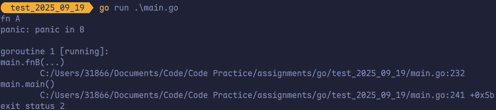

程序运行期间 `fnB` 引发了 `panic` 导致程序崩溃，异常退出了。

此时可以通过 `recover` 将程序恢复过来，继续往后执行。

```go
package main

import "fmt"

func fnA() {
	fmt.Println("fn A")
}

func fnB() {
	defer func() {
		if err := recover(); err != nil {
			fmt.Println("recover in B")
		}
	}()
	panic("panic in B")
}

func fnC() {
	fmt.Println("fn C")
}

func main() {
	fnA()
	fnB()
	fnC()
}
```

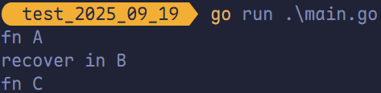

> [!tip]
>
> 1.  **`recover` 仅在 `defer` 中生效**：必须在 `defer` 注册的函数内调用 `recover()`，才能捕获当前 `goroutine` 的 `panic`；普通函数中调用无效。
> 2. **`defer` 必须早于 `panic` 注册**：`panic` 会立即中断后续代码，只执行**此前已注册**的 `defer`；`panic` 之后的 `defer` 不会被注册，自然无法执行。

### `defer`、`recover` 实现异常处理

```go
package main

import "fmt"

func fn() {
	defer func() {
		err := recover()
		if err != nil {
			fmt.Println("抛出异常给管理员发送邮件。")
			fmt.Println(err)
		}
	}()

	a := 10
	b := 0
	res := a / b
	fmt.Println("res =", res)
}

func main() {
	fn()
}
```

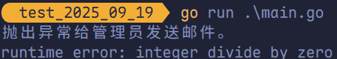

### `defer`、`panic`、`recover` 

```go
package main

import (
	"errors"
	"fmt"
)

func readFile(filename string) error {
	if filename == "main.go" {
		return nil
	}

	return errors.New("读取文件错误。")
}

func fn() {
	defer func() {
		if err := recover(); err != nil {
			fmt.Println("抛出异常给管理员发送邮件。")
		}
	}()

	err := readFile("xxx.go")

	if err != nil {
		panic(err)
	}

	fmt.Println("继续执行！")
}

func main() {
	fn()
}
```

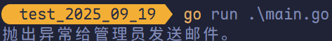
