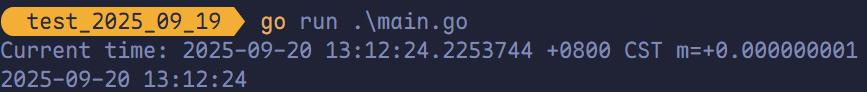
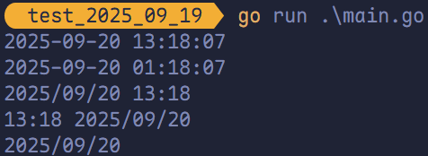
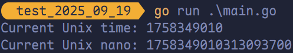
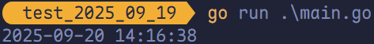
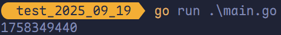
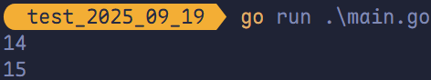
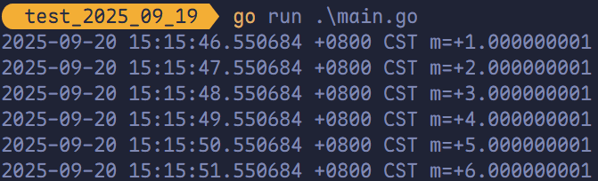
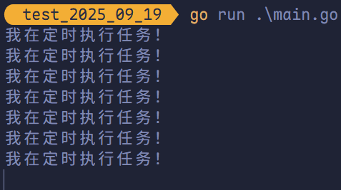

# `time` 包以及日期函数

## `time` 包

时间和日期是日常编程中经常会使用的，在 Golang 中的 `time` 包提供了时间的显示和测量的函数。

## `time.Now()` 获取当前时间

可以通过 `time.Now()` 函数获取<span style="color:#9B177E; font-weight:bold">当前的时间对象</span>，然后获取时间对象的年、月、日、时、分、秒等信息。

```go
package main

import (
	"fmt"
	"time"
)

func main() {
	// 获取当前时间。
	now := time.Now()
	fmt.Printf("Current time: %v\n", now)

	year := now.Year()     // 年
	month := now.Month()   // 月
	day := now.Day()       // 天
	hour := now.Hour()     // 时
	minute := now.Minute() // 分
	second := now.Second() // 秒

	fmt.Printf("%d-%02d-%02d %02d:%02d:%02d\n",
		year, month, day,
		hour, minute, second)
}
```



## `Format` 方法格式化输出日期字符串

Go 时间格式化的模板基于其诞生日期为 2006 年 1 月 2 日 15 时 4 分 5 秒。

- **24 小时制**：使用 `15` 表示小时（0~23）。
- **12 小时制**：使用 `03` 表示小时（1~12），可搭配 `PM` 显示上午/下午。

```go
package main

import (
	"fmt"
	"time"
)

func main() {
	now := time.Now()

	// 24 小时制
	fmt.Println(now.Format("2006-01-02 15:04:05"))

	// 12 小时制
	fmt.Println(now.Format("2006-01-02 03:04:05"))

	fmt.Println(now.Format("2006/01/02 15:04"))
	fmt.Println(now.Format("15:04 2006/01/02"))
	fmt.Println(now.Format("2006/01/02"))
}
```



## 获取当前的时间戳

<span style="color:#06923E; font-weight:bold">时间戳</span>是自 1970 年 1 月 1 日 00:00:00 UTC 起至当前时刻的毫秒数，通常称为 <span style="color:#03A6A1; font-weight:bold">Unix 时间戳</span>（Unix Timestamp）。

```go
package main

import (
	"fmt"
	"time"
)

func main() {
	// 获取当前时间。
	now := time.Now()
	unixTime := now.Unix()     // 时间戳
	unixNano := now.UnixNano() // 纳米时间戳

	fmt.Printf("Current Unix time: %v\n", unixTime)
	fmt.Printf("Current Unix nano: %v\n", unixNano)
}
```



## 时间戳转换为日期字符串

使用 `time.Unix()` 函数可以将时间戳转换为时间格式。

```go
package main

import (
	"fmt"
	"time"
)

func unixToTime(timestamp int64) {
	// 将时间戳转换为时间格式。
	timeObj := time.Unix(timestamp, 0)
	// 对时间进行格式化处理。
	str := timeObj.Format("2006-01-02 15:04:05")
	fmt.Println(str)
}

func main() {
	unixToTime(1758348998)
}
```



> [!tip]
>
> 1. **只用秒时间戳**：`time.Unix(sec, 0)`
> 2. **只用纳秒时间戳**：`time.Unix(0, nsec)`
> 3. **秒和纳秒结合**：`time.Unix(sec, nesc)`

## 日期字符串转换为时间戳

```go
package main

import (
	"fmt"
	"time"
)

func main() {
	str := "2025-09-20 14:24:00"
	timeTemple := "2006-01-02 15:04:05"
	timestamp, _ := time.ParseInLocation(timeTemple, str, time.Local)
	fmt.Println(timestamp.Unix())
}
```



### 时间间隔

`time.Duration` 是 `time` 包定义的类型，表示以**纳秒**为单位的时间间隔，最大可表示约 290 年。

`time` 包中定义的时间间隔类型常量如下：

```go
const (
	Nanosecond  Duration = 1
	Microsecond          = 1000 * Nanosecond
	Millisecond          = 1000 * Microsecond
	Second               = 1000 * Millisecond
	Minute               = 60 * Second
	Hour                 = 60 * Minute
)
```

例如：`time.Duration` 表示 1 纳秒，`time.Second` 表示 1 秒。

## 时间操作函数

### `Add`

在日常开发中，常需对时间进行偏移计算。Go 的 `time.Time` 类型提供了 `Add` 方法，用于在当前时间上增加指定的时间间隔。

```go
func (t Time) Add(d Duration) Time
```

例如求一个小时后的时间：

```go
package main

import (
	"fmt"
	"time"
)

func main() {
	now := time.Now()
	later := now.Add(time.Hour)
	fmt.Println(later.Hour())
}
```



### `Sub`

求两个时间的之间的差值：

```go
func (t Time) Sub(u Time) Duration
```

返回一个时间段 `t - u`。如果结果超出了 `Duration` 可以表示的最大值/最小值，将返回最大值/最小值。要获取时间点 `t - d`（`d` 为 `Duration`），可以使用 `t.Add(-d)`。

### `Equal`

```go
func (t Time) Equal(u Time) bool
```

判断两个时间是否相同，会考虑时区的影响，因此不同时区标准的时间也可以正确比较。该方法与使用 `t == u` 不同，这个方法还会比较低点和时区信息。

### `Before`

```go
func (t Time) Before(u Time) bool
```

如果 `t` 代表的时间点在 `u` 之前，返回真，否则返回假。

### `After`

```go
func (t Time) After(u Time) bool
```

如果 `t` 代表的时间点在 `u` 之后，返回真，否则返回假。

## 定时器

**使用 `time.NewTicker(时间间隔)` 来设置定时器。**

```go
package main

import (
	"fmt"
	"time"
)

func main() {
	ticker := time.NewTicker(time.Second)
	n := 0

	for v := range ticker.C {
		fmt.Println(v)
		n++
		if n > 5 {
			ticker.Stop()
			return
		}
	}
}
```



**`time.Sleep(time.Second)` 来实现定时器。**

```go
package main

import (
	"fmt"
	"time"
)

func main() {
	for {
		time.Sleep(time.Second)
		fmt.Println("我在定时执行任务！")
	}
}
```


