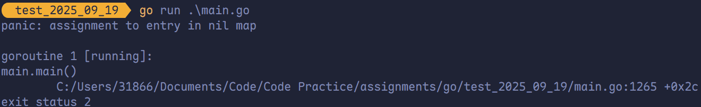
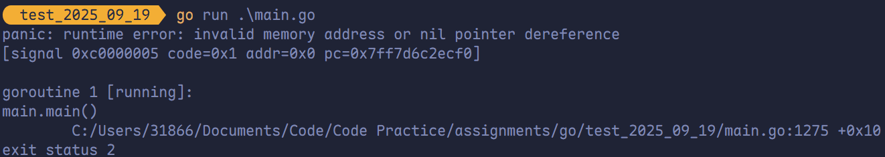
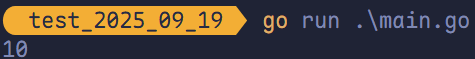
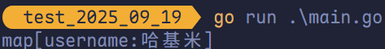

# 指针

## 关于指针

<span style="color:#C83F12; font-weight:bold">变量</span>是<span style="color:#03A6A1; font-weight:bold">用来存储数据</span>的，变量的本质是给存储数据的内存地址<span style="color:#3674B5; font-weight:bold">起了一个别名</span>。例如定义了一个变量 `a := 10`，此时可以直接通过 `a` 这个变量来读取内存中保存的 10 这个值。在计算机底层 `a` 这个变量其实<span style="color:#FF7D29; font-weight:bold">对应了一个内存地址</span>。

<span style="color:#725CAD; font-weight:bold">指针</span>也是一个变量，但是其为一种特殊变量，它存储的数据不是一个普通的值，而是另一个变量的<span style="color:#EA2F14; font-weight:bold">内存地址</span>。


Go 语言中指针的重要概念有**指针地址**、**指针类型**和**指针取值**，而指针操作为 `&`（取地址）和 `*`（根据地址取值）。

## 指针地址和指针类型

每个变量在运行时都拥有一个地址，这个地址代表变量在内存中的位置。Go 语言中使用 `&` 字符放在变量前面对变量进行**取地址**操作。Go 语言中的值类型（`int`、`float`、`bool`、`string`、`array`、`struct`）都有对应的指针类型，例如 `*int`、`*int64`、`*string` 等。

```go
ptr := &v
```

- **`v`**：代表被地址的变量，类型为 `T`。
- **`ptr`**：用于接收地址的变量，`ptr` 的类型为 `*T`，称作 `T` 的指针类型，`*` 代表指针。

```go
package main

import "fmt"

func main() {
	a := 10
	b := &a

	fmt.Printf("a: %v, ptr(a): %p\n",
		a, &a)
	fmt.Printf("b: %v, type: %T, ptr(b): %p\n",
		b, b, &b)
}
```


## 指针取值

在对普通变量使用 `&` 操作符取地址后会获得这个变量的指针，然后可以对指针使用 `*` 操作，也就是指针取值。

```go
package main

import "fmt"

func main() {
	a := 10
	// 去变量 a 的地址，将地址保存到指针 b 中。
	b := &a
	fmt.Printf("Type of b: %T\n", b)
	c := *b // 指针取值
	fmt.Printf("Type of c: %T\n", c)
	fmt.Printf("Value of c: %v\n", c)
}
```


取地址操作符 `&` 和取值操作符 `*` 是一对互补操作符，`&` 取出地址，`*` 根据地址取出地址指向的值。

- 对变量进行**取地址（`&`）操作**，可以获得该变量的**指针变量**。
- 指针变量的值是**指针地址**。
- 对指针变量进行**取值（`*`）操作**，可以获得指针变量指向的**原变量的值**。

## 指针传值示例

```go
package main

import "fmt"

func modify1(x int) {
	x = 100
}

func modify2(x *int) {
	*x = 100
}

func main() {
	a := 10
	modify1(a)
	fmt.Println(a)
	modify2(&a)
	fmt.Println(a)
}
```


## `new` 和 `make`

```go
package main

import "fmt"

func main() {
	var userinfo map[string]string
	userinfo["username"] = "张三"
	fmt.Println(userinfo)
}
```



```go
package main

import "fmt"

func main() {
	var a *int
	*a = 100
	fmt.Println(*a)
}
```



执行上述代码会引发 `panic`，因为 Go 语言中对于<span style="color:#B95E82; font-weight:bold">引用类型</span>的变量，在使用时不仅要声明它，还要为它<span style="color:#E45A92; font-weight:bold">分配内存空间</span>，否则<span style="color:#EF7722; font-weight:bold">指定值无法存储</span>。

而对于值类型的声明<span style="color:#0BA6DF; font-weight:bold">不需要分配内存空间</span>，因为在声明时<span style="color:#F08787; font-weight:bold">默认分配了内存空间</span>。

Go 语言中 `new` 和 `make` 是内建的两个函数，主要用于分配内存。

> [!tip]
>
> **指针**也是<span style="color:#9A3F3F">引用类型</span>。

### `new` 函数分配内存

`new` 是一个内置的函数，函数签名如下：

```go
func new(Type) *Type
```

- `Type` 表示类型，`new` 函数只接受一个参数，这个参数是一个类型。
- `*Type` 表示类型指针，`new` 函数返回一个指向该类型的内存地址的指针。

一般在实际开发中 `new` **并不常用**，使用 `new` 函数得到的是一个类型的指针，并且该指针对应的值为该类型的<span style="color:#8FA31E; font-weight:bold">零值</span>。

```go
package main

import "fmt"

func main() {
	a := new(int)
	b := new(bool)

	fmt.Printf("%T\n", a)
	fmt.Printf("%T\n", b)

	fmt.Println(*a)
	fmt.Println(*b)
}
```


之前的代码中，`var a *int` 只是声明了一个指针变量 `a` 但**没有进行初始化**，指针作为引用类型<span style="color:#B87C4C; font-weight:bold">需要初始化后才会拥有内存空间</span>，才可以给它赋值。

```go
package main

import "fmt"

func main() {
	var a *int = new(int)
	*a = 10
	fmt.Println(*a)
}
```



### `make` 函数分配内存

`make` 区别于 `new`，仅用于 `slice`、`map` 以及 `channel` 的内存创建，而它返回的类型就是这三个类型本身，而非其指针类型，因为这三种类型就是引用类型，因此没必要返回它们的指针。

`make` 函数签名如下：

```go
func make(t Type, size ...IntegerType) Type
```

`make` 函数无法替代，在使用 `slice`、`map` 以及 `channel` 时，都需要使用 `make` 进行初始化，然后才可以进行操作。

之前的代码中，`var userinfo map[string]string` 只是声明变量 `userinfo` 是一个 `map` 类型的变量，需要使用 `make` 函数进行初始化后，才能对其进行键值对赋值：

```go
package main

import "fmt"

func main() {
	var userinfo map[string]string
	userinfo = make(map[string]string)
	userinfo["username"] = "哈基米"
	fmt.Println(userinfo)
}
```



### `new` 和 `make` 的区别

`make` 和 `new` 都分配内存，但用途截然不同：

- **`make`**：仅用于初始化 `slice`、`map`、`channel`，返回**类型本身**，并完成内部结构分配（如容量、哈希表等）。
- **`new`**：用于任意类型，分配**零值内存**，返回**指向该类型的指针**，常用于结构体或基本类型。
