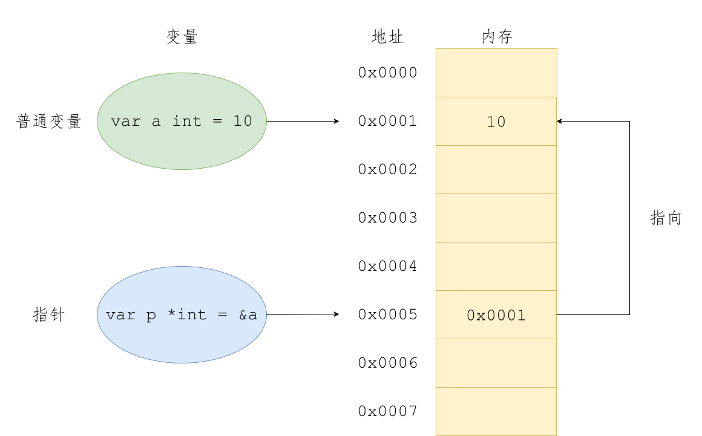
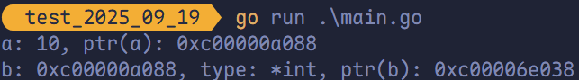
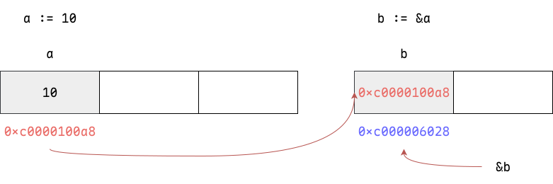
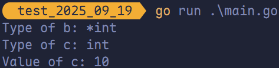
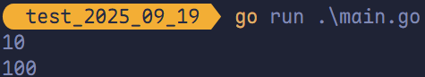
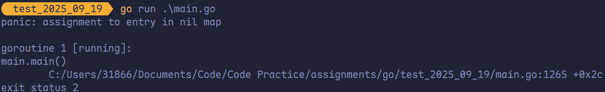
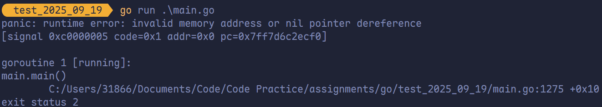
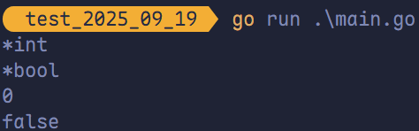
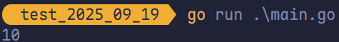
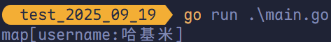

# 指针

## 关于指针

<span style="color:#B35656; font-weight:bold">变量</span>是程序中用来存储数据的基本单元。从底层来看，变量名其实就是给某段物理内存地址起了一个易读的别名。例如，定义变量 `a := 10` 后，我们可以直接通过 `a` 读写数值 10；而在计算机底层，变量 `a` 实际上对应着一个具体的内存地址。

<span style="color:#B35656; font-weight:bold">指针</span>同样是一种变量，但它比较特殊：它存储的不是普通的数值，而是**另一个变量的内存地址**。



Go 语言中指针的核心概念包括**指针地址**、**指针类型**和**指针取值**。其核心操作符有两个：`&`（取地址）和 `*`（根据地址取值）。

## 指针地址和指针类型

每个变量在运行时都拥有一个独立的内存地址，代表该变量在内存中的实际位置。在 Go 语言中，将 `&` 操作符放在变量前面，即可获取该变量的内存地址（即**取地址**操作）。

Go 语言中的基本值类型（如 `int`、`float`、`bool`、`string`、`array`、`struct` 等）都有其对应的指针类型，例如 `*int`、`*int64`、`*string` 等。

```go
ptr := &v
```

- **`v`**：代表被取地址的普通变量，假设其类型为 `T`。
- **`ptr`**：用于接收地址的指针变量。它的类型为 `*T`（称作 `T` 的指针类型），其中 `*` 代表指针。

```go
package main

import "fmt"

func main() {
	a := 10
	b := &a

	fmt.Printf("a: %v, ptr(a): %p\n",
		a, &a)
	fmt.Printf("b: %v, type: %T, ptr(b): %p\n",
		b, b, &b)
}
```





## 指针取值

获取到变量的指针（内存地址）后，可以在指针变量前使用 `*` 操作符，获取该地址中存储的具体数值，这就是**指针取值**（也叫解引用）操作。

```go
package main

import "fmt"

func main() {
	a := 10
	// 取变量 a 的地址，将地址保存到指针 b 中。
	b := &a
	fmt.Printf("Type of b: %T\n", b)
	c := *b // 指针取值
	fmt.Printf("Type of c: %T\n", c)
	fmt.Printf("Value of c: %v\n", c)
}
```



取地址操作符 `&` 和取值操作符 `*` 是一对互补操作符：`&` 用于取出地址，`*` 用于根据地址取出对应的值。

- 对普通变量进行 **取地址（`&`）** 操作，可以获得该变量的**指针变量**。
- 指针变量中存储的值就是**内存地址**。
- 对指针变量进行 **取值（`*`）** 操作，可以获得该指针指向的**原变量的值**。

## 指针传值示例

在 Go 语言中，函数的参数传递默认是**值传递**（拷贝传递）。如果想在函数内部修改外部变量的值，就需要将该变量的**指针**传递给函数。

```go
package main

import "fmt"

func modify1(x int) {
	x = 100
}

func modify2(x *int) {
	*x = 100
}

func main() {
	a := 10
	modify1(a)
	fmt.Println(a)
	modify2(&a)
	fmt.Println(a)
}
```



## `new` 和 `make`

在 Go 语言中，如果不进行初始化分配内存，直接对声明后的引用类型或指针变量进行操作，会引发程序崩溃。例如以下两段代码：

**示例 1：未初始化的 Map**
```go
package main

import "fmt"

func main() {
	var userinfo map[string]string
	userinfo["username"] = "张三"
	fmt.Println(userinfo)
}
```



**示例 2：未初始化的指针**
```go
package main

import "fmt"

func main() {
	var a *int
	*a = 100
	fmt.Println(*a)
}
```



执行上述代码会触发 `panic`，报错原因为**空指针解引用（nil pointer dereference）** 或分配错误。

原因在于：在 Go 语言中，**引用类型**和**指针类型**的变量在仅完成声明时，系统不会自动为其分配内存空间。此时它们的值为 `nil`，必须手动分配内存后，才能正常执行赋值操作，否则写入的值没有对应的内存空间可供存储。

与之相对，**值类型**（如 `int`、`struct`）的变量在声明时，Go 会自动为其分配内存并赋予对应类型的“零值”，无需开发者手动处理。

为了完成内存分配工作，Go 语言提供了 `new` 和 `make` 两个内置函数。

> [!note]
>
> **指针**同样是 Go 语言中的**引用类型**。

### `new` 函数分配内存

`new` 是一个用于分配内存的内置函数，其签名如下：

```go
func new(Type) *Type
```

- `Type`：表示数据类型。`new` 函数只接受类型作为参数，不接受具体的值。
- `*Type`：表示类型指针。`new` 函数返回一个指向新分配内存地址的指针。

在实际开发中，`new` 函数**并不常用**。使用 `new` 函数分配内存后，返回的是该类型的指针，并且这块内存会被初始化为该类型的<span style="color:#8FA31E; font-weight:bold">零值</span>。

```go
package main

import "fmt"

func main() {
	a := new(int)
	b := new(bool)

	fmt.Printf("%T\n", a)
	fmt.Printf("%T\n", b)

	fmt.Println(*a)
	fmt.Println(*b)
}
```



回顾之前报错的指针代码，`var a *int` 仅声明了指针变量 `a` 但未分配内存。通过 `new` 函数完成初始化分配后，即可正常执行赋值操作：

```go
package main

import "fmt"

func main() {
	var a *int = new(int)
	*a = 10
	fmt.Println(*a)
}
```



### `make` 函数分配内存

与 `new` 不同，`make` **仅用于** `slice`、`map` 和 `channel` 这三种复合类型的内存分配与初始化。并且，它返回的是**这三种类型本身**，而不是它们的指针类型（因为这三种类型在底层本质上已经是引用数据的结构）。

`make` 函数签名如下：

```go
func make(t Type, size ...IntegerType) Type
```

`make` 函数是不可替代的。在使用 `slice`、`map` 和 `channel` 之前，必须先使用 `make` 进行初始化，然后才能进行后续的操作。

回顾之前报错的 Map 代码，`var userinfo map[string]string` 只是声明了变量。需使用 `make` 函数初始化后，才能安全地进行键值对赋值：

```go
package main

import "fmt"

func main() {
	var userinfo map[string]string
	userinfo = make(map[string]string)
	userinfo["username"] = "哈基米"
	fmt.Println(userinfo)
}
```



### `new` 和 `make` 的区别

`make` 和 `new` 都用于分配内存，但用途截然不同：

- **`make`**：仅用于初始化 `slice`、`map`、`channel`，返回的是**类型本身**，并完成内部数据结构的内存分配（如容量、底层数组、哈希表等）。
- **`new`**：可用于任意类型，分配**零值内存**，返回的是**指向该类型的指针**，常用于结构体或基本类型的指针初始化。
