# 结构体

## 关于 Golang 结构体

Golang 中没有“<span style="color:#6C95EC; font-weight:bold">类</span>”的概念，Golang 中的<span style="color:#C85C8E; font-weight:bold">结构体</span>和其他语言中的<span style="color:#A86523; font-weight:bold">类</span>有点相似。和其他面向对象语言中的类相比，Golang 中的结构体具有更高的<span style="color:#AD62AA">扩展性</span>和<span style="color:#AD62AA">灵活性</span>。

Golang 中的<span style="color:#FF9090; font-weight:bold">基础数据类型</span>可以表示一些事物的基本属性，但是当我们想表达一个事物的全部或部分属性时，这时候再用单一的基本数据类型就无法满足需求了。Golang 提供了一种<span style="color:#9E7EFF">自定义数据类型</span>，可以<span style="color:#E55604; font-weight:bold">封装多个基本数据类型</span>，这种数据类型叫<span style="color:#F66095">结构体</span>，英文名称 struct。也就是我们可以通过 `struct` 来定义自已的类型了。

## `type` 关键字自定义类型和类型别名

Golang 中通过 `type` 关键词定义一个<span style="color:#FF7A5A">结构体</span>，可以通过 `type` <span style="color:#F32424">自定义类型</span>以及定义<span style="color:#F32424">类型别名</span>。

### 自定义类型

在 Go 语言中有一些基本的数据类型，如 `string`、整型、浮点型、布尔等数据类型，Go 语言中可使用 `type` 关键字来定义自定义类型。

```go
type myInt int
```

> [!tip]
>
> 将 `myInt` 定义为 `int` 类型，通过 `type` 关键字的定义，`myInt` 就是一种<span style="color:#E23E57">新的类型</span>。

### 类型别名

`TypeAlias` 只是 `Type` 的<span style="color:#3D5AF1">别名</span>，本质上 `TypeAlias` 与 `Type` 是<span style="color:#A44A4A">同一个类型</span>。

```go
type TypeAlias = Type
```

之前的 `rune` 和 `byte` 类型就是<span style="color:#D45D79">类型别名</span>，底层定义如下：

```go
type byte = uint8 
type rune = int32
```

### 自定义类型 vs. 类型别名

类型别名与自定义类型并非仅有一个等号的差异。

```go
package main

import "fmt"

type newInt int  // 类型定义
type myInt = int // 类型别名

func main() {
	var a newInt
	var b myInt
	fmt.Printf("Type of a: %T\n", a)
	fmt.Printf("Type of b: %T\n", b)
}
```

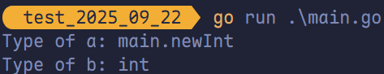

可以看到，`a` 的类型为 `main.newInt`，表示 `main` 包下定义的 `newInt` 类型。`b` 的类型是 `int` 类型。

## 结构体定义初始化

### 结构体的定义

使用 `type` 和 `struct` 关键字来定义结构体，具体格式如下：

```go
type 类型名 struct {
  字段名 字段类型
  字段名 字段类型
  ...
}
```

- **类型名**：表示自定义结构体的<u>名称</u>，在同一个包内<span style="color:#A460ED">不能重复</span>。
- **字段名**：表示结构体字段名，结构体中的字段名<span style="color:#1230AE">必须唯一</span>。
- **字段类型**：表示结构体字段的具体类型。

```go
type person struct {
	name string
	city string
	age  int8
}
```

同样类型的字段也可以写在同一行：

```go
type person struct {
	name, city string
	age        int8
}
```

> [!tip]
>
> 结构体首字母可以<span style="color:#FD9B63; font-weight:bold">大写</span>也可以<span style="color:#FD9B63; font-weight:bold">小写</span>。
>
> 大写表示这个结构体是<span style="color:#6D70C6; font-weight:bold">公有的</span>，在**其他包**里面可以使用。小写表示结构体是<span style="color:#6D70C6; font-weight:bold">私有的</span>，**只有这个包**里才可以使用。

### 结构体实例化（方法一）

只有当结构体**实例化**时，才会<span style="color:#3A59D1">真正地分配内存</span>。也就是必须**实例化**才能使用<span style="color:#D06224">结构体的字段</span>。结构体本身也是一种类型，因此可以像<span style="color:#EC7263">声明内置类型</span>一样使用 `var` 关键字<span style="color:#00649F">声明结构体类型</span>。

```go
var 结构体实例 结构体类型
```

```go
package main

import "fmt"

type person struct {
	name string
	city string
	age  int
}

func main() {
	var p1 person
	p1.name = "哈基米"
	p1.city = "北京"
	p1.age = 18
	fmt.Printf("p1 = %v\n", p1)
	fmt.Printf("p1 = %#v\n", p1)
}
```

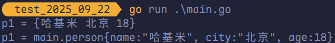

### 结构体实例化（方法二）

还可以通过使用 `new` 关键字对结构体进行实例化，得到的是<span style="color:#F45050; font-weight:bold">结构体的地址</span>。格式如下：

```go
package main

import "fmt"

type person struct {
	name string
	city string
	age  int
}

func main() {
	var p2 = new(person)
	p2.name = "曼波"
	p2.age = 18
	p2.city = "上海"
 
	fmt.Printf("%T\n", p2)
	fmt.Printf("p2 = %#v\n", p2)
}
```

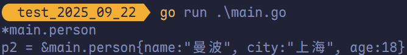

从打印结果可以看出 `p2` 是一个结构体指针。

> [!tip]
>
> 在 Golang 中支持<span style="color:#179BAE; font-weight:bold">结构体指针</span>直接使用 `.` 来访问结构体的成员，`p2.name = "曼波"`，其实这是一种语法糖，其底层为 `(*p2).name = "曼波"`。 

### 结构体实例化（方法三）

使用 `&` 对结构体进行<span style="color:#D80E70">取地址操作</span>相当于对该结构体类型进行了一次<span style="color:#D24545"> `new` 实例化操作</span>。

```go
package main

import "fmt"

type person struct {
	name string
	city string
	age  int
}

func main() {
	p3 := &person{}
	fmt.Printf("%T\n", p3)
	fmt.Printf("p3 = %#v\n", p3)

	p3.name = "哈基米"
	p3.age = 30
	p3.city = "杭州"
	(*p3).age = 40
	fmt.Printf("p3 = %#v\n", p3)
}
```

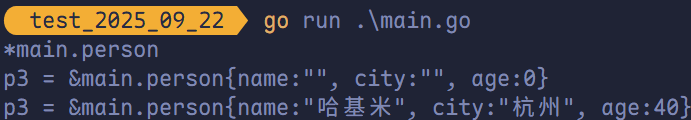

### 结构体实例化（方法四）

```go
package main

import "fmt"

type person struct {
	name, city string
	age        int
}

func main() {
	p4 := person{
		name: "Mamba",
		city: "伊犁",
		age:  18,
	}

	fmt.Printf("p4 = %#v\n", p4)
}
```

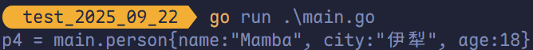

### 结构体实例化（方法五）

结构体指针对键值进行初始化操作。

```go
package main

import "fmt"

type person struct {
	name, city string
	age        int
}

func main() {
	p5 := &person{
		name: "Kobe",
		city: "乌鲁木齐",
		age:  20,
	}
	fmt.Printf("p5 = %#v\n", p5)
}
```

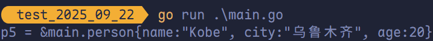

若结构体的某些字段未在初始化时赋值，Go 会自动将其初始化为对应类型的零值（如 `0`、`""`、`false`、`nil` 等）。

```go
package main

import "fmt"

type person struct {
	name, city string
	age        int
}

func main() {
	p6 := &person{
		city: "北京",
	}
	fmt.Printf("p6 = %#v\n", p6)
}
```

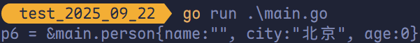

### 结构体实例化（方法六）

使用值的列表初始化，初始化结构体的时候可以简写（即初始化的时候不写键，直接写值。）。

```go
package main

import "fmt"

type person struct {
	name string
	city string
	age  int
}

func main() {
	p7 := &person{
		"LBJ",
		"New York",
		28,
	}
	fmt.Printf("p7 = %#v\n", p7)
}
```

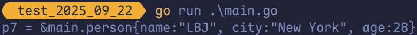

> [!tip]
>
> 使用这种格式**初始化**时，需要：
>
> 1. 必须初始化结构体的<span style="color:#D53939; font-weight:bold">全部字段</span>。
> 2. 初始值的填充顺序必须与字段在结构体中的<span style="color:#CA4E79; font-weight:bold">声明顺序一致</span>。
> 3. 该方式<span style="color:#158A8C; font-weight:bold">不能和键值初始化混用</span>。

## 结构体方法和接收者

在 Go 语言中，没有<span style="color:#9A4C68">类</span>的概念但是可以<span style="color:#FF304F">给类型（结构体、自定义类型）定义方法</span>。所谓方法就是定义了<span style="color:#775ADA">接收者的函数</span>。接收者的概念就类似于其他语言中的 `this` 或者 `self`。

```go
func (接收者变量 接收者类型) 方法名(参数列表) (返回参数) {
  函数体
}
```

- <span style="color:#4BA54D; font-weight:bold">接收者变量</span>：接收者中的参数变量名在命名时，官方建议使用接收者类型名的<span style="color:#47B5FF">第一个<span style="font-weight:bold">小写</span>字母</span>，而并非 `self`、`this` 之类的命名。例如，`Person` 类型的接收者变量应该命名为 `p`，`Connector` 类型的接收者应该命名为 `c` 等。
- <span style="color:#4BA54D; font-weight:bold">接收者类型</span>：接收者类型和参数类似，可以是指针类型和非指针类型。
- <span style="color:#4BA54D; font-weight:bold">方法名、参数列表、返回参数</span>：具体格式与函数定义相同。

```go
package main

import "fmt"

type Person struct {
	name string
	age  int
}

func (p Person) PrintInfo() {
	fmt.Printf("Name: %v, Age: %v\n", p.name, p.age)
}

func main() {
	p1 := Person{
		"曼波",
		25,
	}
	p1.PrintInfo()
}
```

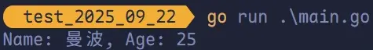

### 值类型的接收者

当方法作用于<span style="color:#FF005C">值类型接收者</span>时，Go 语言会在代码运行时将接收者的值<span style="color:#E73879">复制一份</span>。在值类型接收者的方法中可以获取接收者的成员值，但修改操作只是<span style="color:#609966">针对副本</span>，无法修改<span style="color:#323EDD">接收者变量本身</span>。

### 指针类型的接收者

指针类型的接收者<span style="color:#9F5F80">由一个结构体的指针</span>组成，由于指针的特性，调用方法时修改接收者指针的任意成员变量。在方法结束后，<span style="color:#3A7563">修改均有效</span>。此方式十分类似于其他语言中面向对象的 `this` 或者 `self`。

```go
package main

import "fmt"

type Person struct {
	name string
	age  int
}

// 值类型接收者
func (p Person) printInfo() {
	fmt.Printf("Name: %v\tAge: %v\n", p.name, p.age)
}

// 指针类型接收者
func (p *Person) setInfo(name string, age int) {
	p.name = name
	p.age = age
}

func main() {
	p1 := &Person{
		name: "哈牛魔",
		age:  29,
	}

	p1.printInfo()
	p1.setInfo("ccb", 39)
	p1.printInfo()
}
```

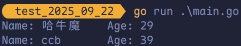

## 给任意类型添加方法

在 Go 语言中，**方法接收者可以是任何自定义类型**，包括基于内置类型定义的新类型。需要注意的是，**不能直接为内置类型（如 `int`、`string`）添加方法**，但可以通过 `type` 关键字基于内置类型创建自定义类型，然后为这些自定义类型添加方法。

```go
package main

import "fmt"

type myInt int

func (m myInt) SayHello() {
	fmt.Println("Hello Int!")
}

func main() {
	var m1 myInt
	m1.SayHello()
	m1 = 100
	fmt.Printf("%#v\t%T\n", m1, m1)
}
```

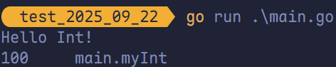
