# 结构体

## 关于 Golang 结构体

Go 语言没有传统面向对象语言中“类”概念，而是通过**结构体（struct）**实现类似的抽象能力。与其他语言的类相比，Go 的结构体在设计上更强调扩展性和灵活性。

Go 的基础数据类型仅能描述事物的单一属性，当需表达事物的完整或复合属性时，单一类型便无法满足需求。因此 Go 提供了**自定义数据类型——结构体（struct）**，它可以将多个基本数据类型封装在一起，能定义符合自身需求的复合类型。

## `type` 关键字自定义类型和类型别名

在 Go 语言中，`type` 关键字主要有三类核心用途：一是定义结构体（struct）；二是基于已有类型自定义新的数据类型；三是为已有类型设置类型别名。

### 自定义类型

Go 语言内置了 `string`、整型、浮点型、布尔型等基本数据类型，同时可通过 `type` 关键字自定义类型。

```go
type myInt int
```

> [!tip]
>
> 通过 `type` 关键字，可将 `myInt` 定义为基于 `int` 的自定义新类型。

### 类型别名

类型别名（Type Alias）仅是目标类型 `Type` 的一个别名标识，`TypeAlias` 与 `Type` 在本质上属于完全相同的类型。

```go
type TypeAlias = Type
```

之前的 `rune` 和 `byte` 类型就是<span style="color:#D45D79">类型别名</span>，底层定义如下：

```go
type byte = uint8
type rune = int32
```

### 自定义类型 vs. 类型别名

类型别名与自定义类型的区别，并非仅局限于语法层面是否包含等号，二者在类型本质上存在核心差异。

```go
package main

import "fmt"

type newInt int  // 类型定义
type myInt = int // 类型别名

func main() {
	var a newInt
	var b myInt
	fmt.Printf("Type of a: %T\n", a)
	fmt.Printf("Type of b: %T\n", b)
}
```

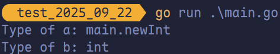

从运行结果可以明确看出：变量 `a` 的类型为 `main.newInt`，属于当前 `main` 包下定义的独立自定义类型；变量 `b` 的类型则为原生 `int` 类型。

## 结构体定义初始化

### 结构体的定义

使用 `type` 和 `struct` 关键字来定义结构体，具体格式如下：

```go
type 类型名 struct {
  字段名 字段类型
  字段名 字段类型
  ...
}
```

- **类型名**：结构体的类型标识，同一包内唯一不可重复。
- **字段名**：结构体的成员名，当前结构体内部唯一。
- **字段类型**：结构体成员对应的数据类型。

```go
type person struct {
	name string
	city string
	age  int8
}
```

同样类型的字段也可以写在同一行：

```go
type person struct {
	name, city string
	age        int8
}
```

> [!tip]
>
> 在 Go 语言中，结构体的首字母大小写直接决定了其访问权限：
>
> - 首字母**大写**：表示该结构体是**导出（公有）的，可在其他包**中直接使用。
> - 首字母**小写**：表示该结构体是**未导出（私有）的，仅能在当前包**内部使用。

### 结构体实例化（方法一）

Go 语言中，结构体仅在**实例化**时才会<span style="color:#FF5F00">真正分配内存空间</span>——这意味着只有完成实例化，才能访问和使用<span style="color:#FF5F00">结构体的字段</span>。此外，结构体本身属于自定义类型，因此可以像<span style="color:#FF5F00">声明 `int`、`string` 等内置类型</span>一样，通过 `var` 关键字<span style="color:#FF5F00">声明结构体类型的变量</span>。

```go
var 结构体实例 结构体类型
```

```go
package main

import "fmt"

type person struct {
	name string
	city string
	age  int
}

func main() {
	var p1 person
	p1.name = "哈基米"
	p1.city = "北京"
	p1.age = 18
	fmt.Printf("p1 = %v\n", p1)
	fmt.Printf("p1 = %#v\n", p1)
}
```

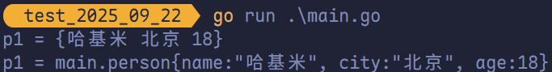

### 结构体实例化（方法二）

使用 `new` 关键字实例化结构体时，将得到**结构体的地址（指针）**。格式如下：

```go
package main

import "fmt"

type person struct {
	name string
	city string
	age  int
}

func main() {
	var p2 = new(person)
	p2.name = "曼波"
	p2.age = 18
	p2.city = "上海"

	fmt.Printf("%T\n", p2)
	fmt.Printf("p2 = %#v\n", p2)
}
```

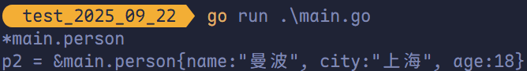

从打印结果可知，`p2` 是一个**指向结构体的指针**（即结构体指针）。

> [!tip]
>
> - **`.` 语法糖**：结构体指针可直接用 `.` 访问成员，如 `p2.name`，底层等价于 `(*p2).name`。
> - **`&` 语法糖**：值类型实例调用指针接收者方法，Go 会自动取地址，等价于 `(&val).method`。

### 结构体实例化（方法三）

使用 `&` 对结构体字面量<span style="color:#A23131">取地址</span>，等价于通过 `new` 函数<span style="color:#A23131">实例化</span>结构体，二者均返回指向零值结构体的指针。

```go
package main

import "fmt"

type person struct {
	name string
	city string
	age  int
}

func main() {
	p3 := &person{}
	fmt.Printf("%T\n", p3)
	fmt.Printf("p3 = %#v\n", p3)

	p3.name = "哈基米"
	p3.age = 30
	p3.city = "杭州"
	(*p3).age = 40
	fmt.Printf("p3 = %#v\n", p3)
}
```

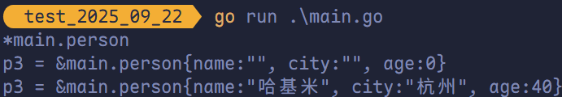

### 结构体实例化（方法四）

```go
package main

import "fmt"

type person struct {
	name, city string
	age        int
}

func main() {
	p4 := person{
		name: "Mamba",
		city: "伊犁",
		age:  18,
	}

	fmt.Printf("p4 = %#v\n", p4)
}
```

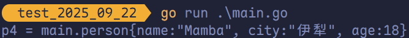

### 结构体实例化（方法五）

结构体指针支持通过**键值对方式**进行初始化。

```go
package main

import "fmt"

type person struct {
	name, city string
	age        int
}

func main() {
	p5 := &person{
		name: "Kobe",
		city: "乌鲁木齐",
		age:  20,
	}
	fmt.Printf("p5 = %#v\n", p5)
}
```

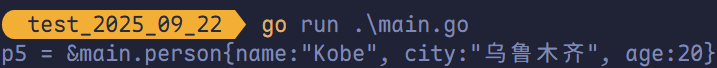

结构体初始化时，未显式赋值的字段会被 Go 自动初始化为对应类型的零值（如 `0`、`""`、`false`、`nil`）。

```go
package main

import "fmt"

type person struct {
	name, city string
	age        int
}

func main() {
	p6 := &person{
		city: "北京",
	}
	fmt.Printf("p6 = %#v\n", p6)
}
```

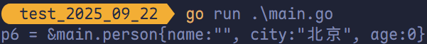

### 结构体实例化（方法六）

结构体可以通过**值列表方式**简写初始化：不写字段名，按定义顺序直接传值。

```go
package main

import "fmt"

type person struct {
	name string
	city string
	age  int
}

func main() {
	p7 := &person{
		"LBJ",
		"New York",
		28,
	}
	fmt.Printf("p7 = %#v\n", p7)
}
```

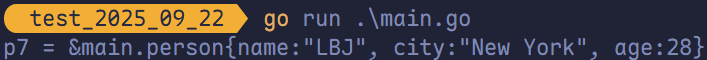

> [!tip]
>
> 使用值列表初始化时，需满足：
>
> 1. 必须初始化**全部字段**。
> 2. 初始化顺序与字段**声明顺序一致**。
> 3. 不可与键值对初始化方式**混用**。

## 结构体方法和接收者

Go 语言无类的概念，但可为<span style="color:#FF5B00">结构体、自定义类型</span>定义方法；方法是<span style="color:#FF5B00">带接收者的函数</span>，接受者类似其他语言的 `this`/`self`。

```go
func (接收者变量 接收者类型) 方法名(参数列表) (返回参数) {
  函数体
}
```

- <span style="color:#355872; font-weight:bold">接收者变量</span>：官方推荐以类型名首字母（小写）命名，如 `Person` → `p`，避免 `self`/`this`。
- <span style="color:#355872; font-weight:bold">接受者类型</span>：支持指针 / 值类型，规则同函数参数。
- <span style="color:#355872; font-weight:bold">方法名、参数列表、返回参数</span>：格式与普通函数定义一致。

```go
package main

import "fmt"

type Person struct {
	name string
	age  int
}

func (p Person) PrintInfo() {
	fmt.Printf("Name: %v, Age: %v\n", p.name, p.age)
}

func main() {
	p1 := Person{
		"曼波",
		25,
	}
	p1.PrintInfo()
}
```

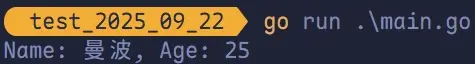

### 值类型的接收者

方法绑定<span style="color:#A82323">值类型接收者</span>时，调用会自动<span style="color:#A82323">复制接收者值</span>；方法内可读取成员，但修改仅<span style="color:#A82323">针对副本</span>，无法改变<span style="color:#A82323">原接收者变量</span>。

### 指针类型的接收者

<span style="color:#3D45AA">指针类型接收者是结构体指针</span>，调用时修改的是原实例，<span style="color:#3D45AA">修改永久生效</span>，作用类似其他语言的 `this` / `self`。

```go
package main

import "fmt"

type Person struct {
	name string
	age  int
}

// 值类型接收者
func (p Person) printInfo() {
	fmt.Printf("Name: %v\tAge: %v\n", p.name, p.age)
}

// 指针类型接收者
func (p *Person) setInfo(name string, age int) {
	p.name = name
	p.age = age
}

func main() {
	p1 := &Person{
		name: "哈牛魔",
		age:  29,
	}

	p1.printInfo()
	p1.setInfo("ccb", 39)
	p1.printInfo()
}
```

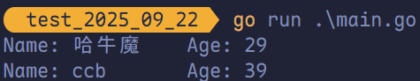

## 给任意类型添加方法

Go 语言中，方法接收者支持<span style="color:#BA135D">任意自定义类型</span>，包括基于内置类型派生的新类型。但需注意：<span style="color:#BA135D">无法直接为内置类型（如 `int`、`string`）添加方法</span>，可通过 `type` 关键字基于内置类型创建自定义类型，再为其添加方法。

```go
package main

import "fmt"

type myInt int

func (m myInt) SayHello() {
	fmt.Println("Hello Int!")
}

func main() {
	var m1 myInt
	m1.SayHello()
	m1 = 100
	fmt.Printf("%#v\t%T\n", m1, m1)
}
```

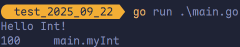
