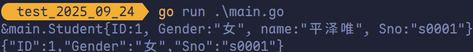
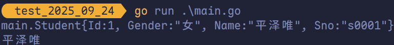
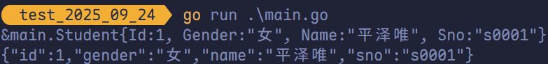
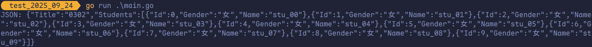
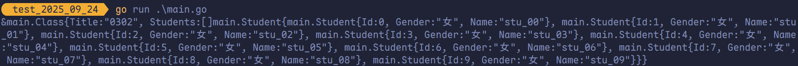

# 序列化和反序列化

## 关于 JSON 数据

JSON（JavaScript Object Notation）是一种轻量级的数据交换格式，既易于人类阅读和编写，也便于机器解析与生成。在 RESTful API 中，接口返回的数据通常采用 JSON 格式。

**JSON 的基本格式如下**：

```json
{
  "a": "Hello",
  "b": "World"
}
```

稍微复杂些的 JSON：

```json
{
  "result": [
    {
      "_id": "59f6ef443ce1fb0fb02c7a43",
      "title": "笔记本电脑"
    },
    {
      "_id": "5a012efb93ec4d199c18d1b4",
      "title": "第二个轮播图",
      "status": "1",
      "pic": "public\\upload\\f3OtH11ZaPX5AA4Ov95Q7DEM.png"
    },
    {
      "_id": "5a012f2433574208841e0820",
      "title": "第三个轮播图",
      "status": "1",
      "pic": "public\\upload\\s5ujmYBQVRcLuvBHvWFMJHz5.jpg"
    },
    {
      "_id": "5a688a0ca6dcba0ff4861a3d",
      "title": "教程",
      "status": "1",
      "pic": "public\\upload\\Zh8EP9HOasV28ynDSp8TaGwd.png"
    }
  ],
  "status": "1",
  "pic": "public\\upload\\UObZahqPYzFvx_C9CQjU8KiX.png",
  "url": "12"
}
```

## 结构体与 JSON 序列化

为 App 或小程序提供 API 接口时，通常需要在 Go 结构体与 JSON 数据之间进行相互转换。

在 Go 中，**JSON 序列化**是指将结构体数据转换为 JSON 格式的字符串，而 **JSON 反序列化**则是将 JSON 数据解析为对应的结构体对象。

这一过程主要通过标准库 `encoding/json` 包中的 `json.Marshal()` 和 `json.Unmarshal()` 函数实现。若追求更高性能，也可使用兼容标准库接口的第三方库 `github.com/json-iterator/go`，其 API 完全一致，但执行效率更优。

### 结构体对象转换为 JSON 字符串

```go
package main

import (
	"fmt"

	json "github.com/json-iterator/go"
)

type Student struct {
	Id     int
	Gender string
	name   string
	Sno    string
}

func main() {
	s := &Student{
		Id:     1,
		Gender: "女",
		name:   "平泽唯",
		Sno:    "s0001",
	}
	fmt.Printf("%#v\n", s)

	jsonByte, _ := json.Marshal(s)
	jsonStr := string(jsonByte)
	fmt.Println(jsonStr)
}
```



> [!tip]
>
> 私有字段无法被 JSON 序列化或反序列化，因为 `json` 包属于外部包，无法访问结构体中的未导出（私有）字段。

### JSON 字符串转换为结构体对象

```go
package main

import (
	"fmt"

	json "github.com/json-iterator/go"
)

type Student struct {
	Id     int
	Gender string
	Name   string
	Sno    string
}

func main() {
	jsonStr := `{"Id":1, "Gender":"女", "Name":"平泽唯", "Sno":"s0001"}`
	s := Student{}
	err := json.Unmarshal([]byte(jsonStr), &s)

	if err != nil {
		fmt.Println(err)
	}

	fmt.Printf("%#v\n%v\n", s, s.Name)
}
```



## 结构体标签 Tag

结构体 Tag 是<span style="color:#FF9B2F">附加在字段上的元信息</span>，可在运行时<span style="color:#FB4141">通过反射机制读取</span>。

Tag 定义在结构体字段的类型之后，由一对反引号包裹，其标准格式如下：

```go
key1:"value1" key2:"value2"
```

每个 Tag 由<span style="color:#FF6F3C">一个或多个键值对</span>组成：

- 键与值之间用冒号（`:`）分隔。
- 值必须用双引号（`"`）括起。
- 多个键值对之间以空格分隔。

Tag 的解析对格式要求<span style="color:#B87C4C">极为严格</span>。如果书写不符合规范（例如在键与值之间添加空格、遗漏双引号，或使用单引号代替双引号），编译器不会报错，运行时也不会抛出异常，但<span style="color:#A4B465">通过反射将无法正确解析该 Tag</span>。

错误示例：

```go
`json: "name"`   // 键与值之间存在多余空格，导致解析失败
```

正确写法：

```go
`json:"name"`
```

由于标准库（如 `encoding/json`）及主流第三方库（如 `GORM`、`validator`）均依赖结构体 Tag 来控制序列化、数据库映射或字段校验等行为，因此务必确保 Tag 格式准确无误。

```go
package main

import (
	"encoding/json"
	"fmt"
)

type Student struct {
	Id     int    `json:"id"`
	Gender string `json:"gender"`
	Name   string `json:"name"`
	Sno    string `json:"sno"`
}

func main() {
	s := &Student{
		Id:     1,
		Gender: "女",
		Name:   "平泽唯",
		Sno:    "s0001",
	}
	fmt.Printf("%#v\n", s)

	jsonByte, _ := json.Marshal(s)
	jsonStr := string(jsonByte)
	fmt.Println(jsonStr)
}
```



## 嵌套结构体和 JSON 序列化及反序列化

```go
package main

import (
	"fmt"

	json "github.com/json-iterator/go"
)

// 学生
type Student struct {
	Id     int
	Gender string
	Name   string
}

// 班级
type Class struct {
	Title    string
	Students []Student
}

func main() {
	c := &Class{
		Title:    "0302",
		Students: make([]Student, 0, 200),
	}

	for i := range 10 {
		s := Student{
			Name:   fmt.Sprintf("stu_%02d", i),
			Gender: "女",
			Id:     i,
		}
		c.Students = append(c.Students, s)
	}

	data, err := json.Marshal(c)

	if err != nil {
		fmt.Println("JSON marshal failed.")
		return
	}

	fmt.Printf("JSON: %s\n", data)
}
```



```go
package main

import (
	"encoding/json"
	"fmt"
)

// 学生
type Student struct {
	Id     int
	Gender string
	Name   string
}

// 班级
type Class struct {
	Title    string
	Students []Student
}

func main() {
	str := `
{
    "Title": "0302",
    "Students": [
        {
            "Id": 0,
            "Gender": "女",
            "Name": "stu_00"
        },
        {
            "Id": 1,
            "Gender": "女",
            "Name": "stu_01"
        },
        {
            "Id": 2,
            "Gender": "女",
            "Name": "stu_02"
        },
        {
            "Id": 3,
            "Gender": "女",
            "Name": "stu_03"
        },
        {
            "Id": 4,
            "Gender": "女",
            "Name": "stu_04"
        },
        {
            "Id": 5,
            "Gender": "女",
            "Name": "stu_05"
        },
        {
            "Id": 6,
            "Gender": "女",
            "Name": "stu_06"
        },
        {
            "Id": 7,
            "Gender": "女",
            "Name": "stu_07"
        },
        {
            "Id": 8,
            "Gender": "女",
            "Name": "stu_08"
        },
        {
            "Id": 9,
            "Gender": "女",
            "Name": "stu_09"
        }
    ]
}
`

	c := &Class{}

	err := json.Unmarshal([]byte(str), c)

	if err != nil {
		fmt.Println("JSON unmarshal failed!")
		return
	}

	fmt.Printf("%#v\n", c)
}
```


