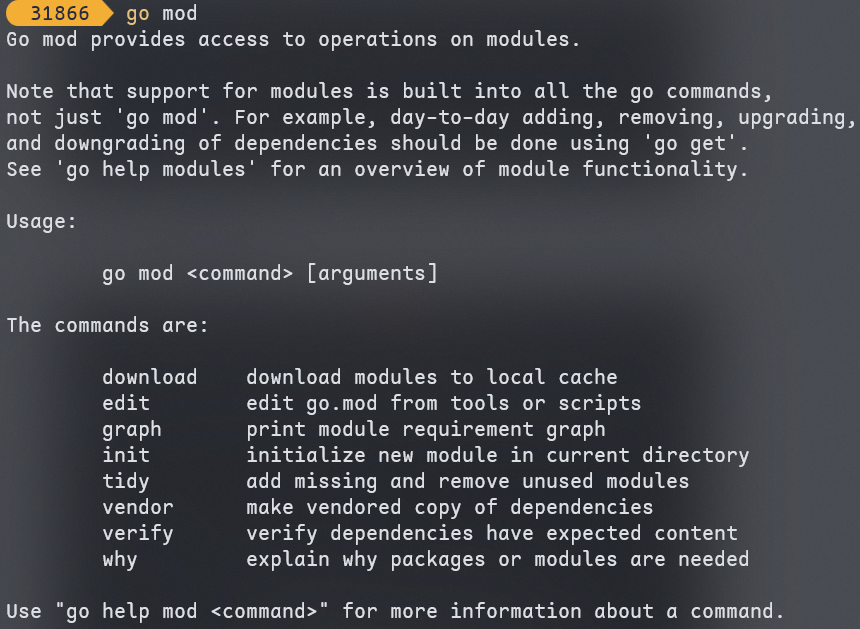
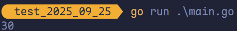

# 包及包管理工具

## 包的介绍和定义

包（package）是多个 Go 源码的集合，是一种高级的代码复用方案，Go 语言提供了大量内置包，例如 `fmt`、`strconv`、`strings`、`sort`、`errors`、`time`、`encoding/json`、`os`、`io` 等。

Golang 中的包可分为三种：

1. <span style="color:#DA8359; font-weight:bold">系统内置包</span>：Golang 语言提供的内置包，引入后可以直接使用。
2. <span style="color:#DA8359; font-weight:bold">自定义包</span>：开发者自己写的包。
3. <span style="color:#DA8359; font-weight:bold">第三方包</span>：属于自定义包的一种，需要下载安装到本地后才可以使用，例如 `github.com/shopspring/decimal`、`github.com/json-iterator/go` 等。

## Go Modules

在 Golang 1.11 版本之前若需要自定义包必须将项目放于 GOPATH 目录。之后无需手动配置环境变量，使用 Go Modules（简称 Go Mod）管理项目，也无需将项目放到 GOPATH 指定目录下，可以在磁盘的任意位置新建项目，Go 1.13 之后可以彻底不要 GOPATH。

### `go mod init` 初始化项目

实际项目开发中，需要先在项目目录中使用 `go mod` 命令生成一个 `go.mod` 文件管理项目依赖。


### `go mod` 其他命令



- **`download`**：下载依赖的 `module` 到本地 `cache`。
- **`edit`**：编辑 `go.mod` 文件。
- **`graph`**：打印模块依赖图。
- **`init`**：在当前文件夹下初始化一个新的 `module`，创建 `go.mod` 文件。
- **`tidy`**：增加丢失的 `module`，去掉未用的 `module`。
- **`vender`**：将依赖复制到 `vender` 下。
- **`vertify`**：校验依赖；检查下载的第三方库有没有本地修改，若有修改，则会返回 0，否则校验成功。
- **`why`**：解释需要依赖的原因。

## 自定义包

包（package）是多个 Go 源码的集合，一个包可以简单理解为一个存放 `.go` 文件的<span style="color:#D37676; font-weight:bold">文件夹</span>。该文件夹下面的所有 Go 文件都要在代码的第一行添加如下代码，<span style="color:#124076; font-weight:bold">声明该文件归属的包</span>。

```go
package 包名
```

- 一个文件夹下面<span style="color:#116A7B; font-weight:bold">直接包含的文件</span>只能归属一个 `package`，同样一个 `package` 的文件不能在多个文件夹下。
- 包名可以不和文件夹的名字一样，包名<span style="color:#B08BBB; font-weight:bold">不能包含 `-` 符号</span>。
- 包名为 `main` 的包为<span style="color:#AC4425; font-weight:bold">应用程序的入口程序</span>，这种包编译后会得到一个<span style="color:#A25B5B; font-weight:bold">可执行文件</span>，而编译<span style="color:#8FBDD3; font-weight:bold">不包含 `main` 包</span>的源代码则不会得到<span style="color:#B85C38; font-weight:bold">可执行文件</span>。

### 定义一个包

如果想在<span style="color:#DD0303">一个包中引用另外一个包的标识符</span>（如变量、常量、类型、函数等）时，该标识符必须是对外可见的（public）。在 Go 语言中只需要将标识符的<span style="color:#FF7D29">首字母大写</span>就可以让标识符对外可见了。

定义一个包名为 `calc` 的包：

```go
package calc

var a = 100  // 私有变量
var Age = 20 // 公有变量

func Add[T int | float32 | float64](x, y T) T {
	return x + y
}

func Sub[T int | float32 | float64](x, y T) T {
	return x - y
}
```

访问一个包中的公有属性时，使用 `包名称.` 去访问。在 `main.go` 中引入这个包。

```go
package main

import (
	"fmt"
	"test_2025_09_25/calc"
)

func main() {
	fmt.Println(calc.Add(10, 20))
}
```



### 导入一个包

#### 单行导入

```go
import "包 1"
import "包 2"
```

#### 多行导入

```go
import (
	"包 1"
	"包 2"
)
```

#### 匿名导入包

如果真希望导入包，而<span style="color:#FF4545">不使用包内部的数据</span>时，可以使用匿名导入包。

```go
import _ "包的路径"
```

匿名导入的包与其他方式导入的包一样都<span style="color:#A8026F">会编译到可执行文件</span>中。

#### 自定义包名

在导入包名时，可以为导入的包名设置别名。通常用于导入的包名过长或者导入的包名冲突的情况。

```go
import 别名 "包的路径"
```

单行引入定义别名：

```go
import c "test_2025_09_25/calc"
```

多行引入定义别名：

```go
import (
	"fmt"
  c "test_2025_09_25/calc"
)
```

## `init` 初始化函数

### `init` 函数介绍

在 Go 语言中，当程序导入一个包时，该包中的 `init` 函数会自动执行。`init` 函数<span style="color:#D61355">没有<span style="font-weight:bold">参数</span>和<span style="font-weight:bold">返回值</span></span>，且不能在代码中被<span style="color:#2E94B9">显式调用</span>——它由运行时系统在<span style="color:#086972">包初始化阶段自动调用</span>。


### `init` 函数执行顺序

Go 程序从 `main` 包开始，编译器会<span style="color:#EA5656"><span style="font-weight:bold">递归分析</span>其导入的所有依赖包</span>，而这些包又可能<span style="color:#BA69DE">进一步导入其他包</span>。由此，编译器构建出一个<span style="color:#95389E">有向无环的依赖图</span>，并按照<span style="color:#ED9153">依赖顺序</span>（即<span style="color:#D55B3E">被依赖</span>的包<span style="color:#9818D6">先于</span>依赖它的包）依次编译各包的代码。



Go 会先执行“依赖图中**最底层**（即最先被依赖、没有其他依赖）的包”的 `init` 函数，然后**逐层向上**，最后执行 `main` 包的 `init`。

> [!tip]
>
> `init` 用于在包级别执行**初始化代码**，确保变量、资源、状态在包**被使用前**已正确就绪。

```go
package main

import "fmt"

var x int8 = 10

const pi = 3.14

func init() {
	fmt.Println(x)
}

func main() {
	fmt.Println("Hello World!")
}

```


## 使用第三方包

可以在 https://pkg.go.dev/ 上查找常见的 Golang 第三方包。

### 找到地址

例如之前的优化 `json` 性能的包：

https://github.com/json-iterator/go

### 下载安装

**第一种方法**：`go get 包名称`。（全局）

```sh
go get github.com/json-iterator/go
```

**第二种方法**：`go mod download`。（全局）

```bash
go mod download
```

`go mod` 会自动将依赖包（如赖包）下载至 `$GOPATH/pkg/mod` 目录，多个项目可直接共享缓存的依赖，无需重复下载。

> [!tip]
>
> 执行 `go mod download` 前，需先在当前项目代码中引入对应的第三方包。

**第三种方法**：`go mod vendor`，将依赖复制到当前项目的 `vendor` 文件夹中。

```bash
go mod vendor
```

### 使用依赖

根据相关文档进行使用。
