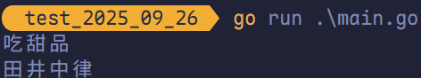
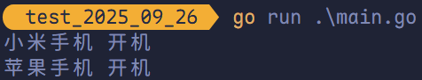
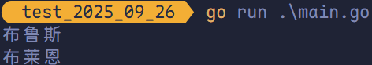

# 接口

## 接口介绍

### 现实生活中的接口

现实生活中，手机、相机、U 盘均可和电脑的 USB 接口建立连接。我们无需关注 USB 接口大小是否一致，因为所有的 USB 接口都是按照统一的标准来设计的。


### Golang 中的接口

Golang 中的接口是一种<span style="color:#E97171">抽象数据类型</span>，Golang 中接口定义了<span style="color:#970690">对象的行为规范</span>，只定义规范不实现。接口中定义的规范<span style="color:#FC8A15">由具体的对象实现</span>。

简而言之，<span style="color:#EF2F2A">接口是一个标准</span>，它是对一个对象的行为和规范<span style="color:#EC5228">进行约束</span>，约定实现接口的对象必须<span style="color:#5847AD">遵守接口的规范</span>。

## 接口定义

在 Golang 中接口（interface）是一种类型，<span style="color:#B12C00; font-weight:bold">一种抽象的类型</span>。接口（interface）是一组<span style="color:#1F7D53; font-weight:bold">函数方法的集合</span>，Golang 中的接口<span style="color:#500073; font-weight:bold">不可包含任何变量</span>。

在 Golang 中接口的所有方法都<span style="color:#EB3678; font-weight:bold">没有方法体</span>，接口定义了一个对象的行为规范，<span style="color:#4C3BCF; font-weight:bold">只定义规范不实现</span>。

Golang 中的接口也是一种数据类型，<span style="color:#FF204E; font-weight:bold">不需要显式实现</span>。只需要一个变量含有接口类型的<span style="color:#F05941; font-weight:bold">所有方法</span>，那么该变量就实现了此接口。

```go
type 接口名 interface{
  方法名1(参数列表1) 返回值列表1
  方法名2(参数列表2) 返回值列表2
  ...
}
```

- **接口名**：在 Go 语言中，可通过 `type` 关键字将接口定义为<span style="color:#DC2525">自定义类型</span>。接口命名通常采用“动词 + er”的形式，例如具备写入功能的接口命名为 `Writer`，支持字符串表示的接口命名为 `Stringer`。建议接口名称应清晰体现其<span style="color:#910A67; font-weight:bold">核心行为或语义</span>，以增强代码的可读性和表达力。
- **方法名**：当<u>方法名首字母是大写</u>且这个<u>接口类型名首字母也是大写</u>时，这个方法可以被接口<span style="color:#E3651D">所在包（package）之外的代码访问</span>。
- **参数列表、返回值列表**：参数列表和返回值列表中的<span style="color:#008170">参数变量名可以省略</span>。

```go
package main

import "fmt"

type Usber interface {
	Start()
	Stop()
}

type Phone struct {
	Name string
}

func (p Phone) Start() {
	fmt.Println(p.Name, "开机")
}

func (p Phone) Stop() {
	fmt.Println(p.Name, "关机")
}

type Camera struct {
}

func (c Camera) Start() {
	fmt.Println("相机 开机")
}

func (c Camera) Stop() {
	fmt.Println("相机 关机")
}

func main() {
	var phone Usber = Phone{
		Name: "一加手机",
	}
	phone.Start()
	phone.Stop()

	camera := Camera{}
	var c Usber = camera
	c.Start()
	c.Stop()
}
```


`Computer` 结构体中的 `Work` 方法必须传入一个 `Usber` 接口。

```go
package main

import "fmt"

type Usber interface {
	Start()
	Stop()
}

type Phone struct {
	Name string
}

func (p Phone) Start() {
	fmt.Println(p.Name, "开机")
}

func (p Phone) Stop() {
	fmt.Println(p.Name, "关机")
}

type Computer struct {
	Name string
}

func (c Computer) Work(usb Usber) {
	usb.Start()
	usb.Stop()
}

func main() {
	phone := Phone{
		Name: "小米手机",
	}
	computer := Computer{}
	computer.Work(phone)
}
```


## 空接口

Golang 中的接口可以<u>不定义任何方法</u>，没有定义任何方法的接口就是空接口。<span style="color:#576CBC">空接口表示没有任何约束，因此任何类型变量均可实现空接口。</span>

空接口在实际项目中使用频繁，使用空接口可以表示任意数据类型。

> [!tip]
>
> 从 Go 1.18 起，`any` 成为 `interface{}` 的类型别名，推荐优先使用 `any`，以提升代码的简洁性和可读性。

```go
package main

import "fmt"

func main() {
	var x any
	s := "Hello World!"
	x = s
	fmt.Printf("Type: %T, Value: %v\n", x, x)

	i := 100
	x = i
	fmt.Printf("Type: %T, Value: %v\n", x, x)

	b := true
	x = b
	fmt.Printf("Type: %T, Value: %v\n", x, x)
}
```


### 空接口作为函数的参数

使用空接口实现可以<span style="color:#C147E9">接收任意类型的函数参数</span>。

```go
func show(a any) {
  fmt.Printf("Type: %T, Value: %v\n", a, a)
}
```

### `map` 的值实现空接口

使用空接口实现可以<span style="color:#FB2576">保存任意值的字典</span>。

```go
var studnetInfo = make(map[string]any)
studentInfo["name"] = "平泽唯"
studentInfo["age"] = 18
studentInfo["married"] = false
fmt.Println(studentInfo)
```

### 切口实现空接口

```go
var slice = []any{"平泽唯", 20, true, 32.2}
fmt.Println(slice)
```

## 类型断言

一个接口的值（简称接口值）是由一个<span style="color:#C74B50">具体类型</span>和<span style="color:#C74B50">具体类型的值</span>两部分组成。这两部分分别称为接口的<span style="color:#C74B50">动态类型</span>和<span style="color:#C74B50">动态值</span>。

若想要判断空接口中值的类型，此时可以使用类型断言，其语法格式为：

```go
x.(T)
```

- **`x`**：表示类型为 `interface{}` 的变量。
- **`T`**：表示断言 `x` 可能的类型。

该语法返回两个参数，第一个参数是 `x` 转化为 `T` 类型后的变量，第二个参数是一个布尔值，若为 `true` 则表示断言成功，为 `false` 则表示断言失败。

```go
package main

import "fmt"

func main() {
	var x any = "Hello Golang!"
	v, ok := x.(string)
	if ok {
		fmt.Println(v)
	} else {
		fmt.Println("类型断言失败！")
	}
}
```


如需要断言多次则需要写多个 `if` 判断，此时可以使用 `switch` 语言来实现：

```go
package main

import (
	"fmt"
)

func justifyType(x any) {
	switch x.(type) {
	case string:
		fmt.Println("string 类型")
	case int:
		fmt.Println("int 类型")
	case bool:
		fmt.Println("bool 类型")
	case float32:
		fmt.Println("float32 类型")
	case float64:
		fmt.Println("float64 类型")
	default:
		fmt.Println("Unsupport type!")
	}
}

func main() {
	justifyType(10)
	justifyType("Hello World")
}
```


因为空接口可以<span  style="color:#F05454">存储任意类型值</span>的特点，因此空接口在 Golang 中的使用十分广泛。

> [!tip]
>
> 仅当存在<u>两个或更多具体类型</u>需要以统一方式处理时，才应定义接口。避免为了使用接口而强行抽象——这不仅会引入不必要的复杂性，还可能带来<span style="color:#B5076B">额外的运行时开销</span>。

空接口 `interface{}` 是一种通用类型，但因其不携带具体类型信息，无法直接进行<u>索引操作</u>（如 `v[1]`）或<u>字段访问</u>（如 `v.Name`）。必须<u>先通过类型断言</u>将其转换为<u>具体的底层类型</u>，才能执行相应操作。 

```go
package main

import "fmt"

type Address struct {
	Name  string
	Phone int
}

func main() {
	userinfo := make(map[string]any)
	userinfo["username"] = "平泽唯"
	userinfo["age"] = 18
	userinfo["hobby"] = []string{"偷闲", "吃甜品"}

	fmt.Println(userinfo["hobby"].([]string)[1])

	address := Address{
		Name:  "田井中律",
		Phone: 1234567890,
	}
	userinfo["address"] = address
	a, ok := userinfo["address"].(Address)
	if ok {
		fmt.Println(a.Name)
	}
}
```



## 结构体值接收者和指针接收者实现接口的区别

### 值接收者

如果结构体的方法使用值接收者（例如 `(p Phone)`），那么无论是该结构体的值类型还是指针类型实例，都可以赋值给接口变量。

```go
package main

import "fmt"

type Usber interface {
	Start()
	Stop()
}

type Phone struct {
	Name string
}

func (p Phone) Start() {
	fmt.Println(p.Name, "开机")
}

func (p Phone) Stop() {
	fmt.Println(p.Name, "关机")
}

func main() {
	phone1 := Phone{
		Name: "小米手机",
	}
	var p1 Usber = phone1
	p1.Start()

	var p2 Usber = &Phone{
		Name: "苹果手机",
	}
	p2.Start() // 本质上是 (*p2).Start()。
}
```



> [!tip]
>
> 当方法是值接受者时，结构体指针类型会<span style="color:#C5172E">自动解引用</span>来调用原本的<span style="color:#3A59D1">值接收者方法</span>。例如上述代码中的 `p2` 指针，当调用 `p2.Start()` 时，实际上为 `(*p2).Start()`。

### 指针接收者

如果结构体中的方法是指针接收者，那么实例化后**结构体指针类型**都<u>可以赋值</u>给接口变量，**结构体值类型**<u>没法赋值</u>给接口变量。

```go
package main

import "fmt"

type Usber interface {
	Start()
	Stop()
}

type Phone struct {
	Name string
}

func (p *Phone) Start() {
	fmt.Println(p.Name, "开机")
}

func (p *Phone) Stop() {
	fmt.Println(p.Name, "关机")
}

func main() {
	// 错误写法
	// phone1 := Phone{
	// 	Name: "小米手机",
	// }
	// var p1 Usber = phone1
	// p1.Start()

	// 正确写法
	var p2 Usber = &Phone{
		Name: "苹果手机",
	}
	p2.Start() // 本质上是 (*p2).Start()。
}
```

> [!tip]
>
> 由于 `Start` 方法是指针接收者方法，Go 编译器要求调用者必须是指针类型，而不会像值接收者方法那样自动对指针进行解引用。

## 一个结构体实现多个接口

Golang 中的一个结构体可实现多个接口。

```go
package main

import "fmt"

type Animaler interface {
	SetName(string)
}

type Peter interface {
	GetName() string
}

type Dog struct {
	Name string
}

func (d *Dog) SetName(name string) {
	d.Name = name
}

func (d Dog) GetName() string {
	return d.Name
}

func main() {
	dog := &Dog{Name: "布鲁斯"}

	var d1 Animaler = dog
	var d2 Peter = dog

	fmt.Println(d2.GetName())
	d1.SetName("布莱恩")
	fmt.Println(d2.GetName())
}
```



## 接口嵌套

接口与接口间可以通过嵌套创造出新接口。

```go
package main

import "fmt"

type Runner interface {
	Run()
}

type Swimer interface {
	Swim()
}

type Animal interface {
	Runner
	Swimer
}

type Cat struct {
	Name string
}

func (c Cat) Run() {
	fmt.Println("基米跑步")
}

func (c Cat) Swim() {
	fmt.Println("基米游泳")
}

func main() {
	var cat Animal = &Cat{Name: "哈基米"}
	cat.Run()
	cat.Swim()
}
```

