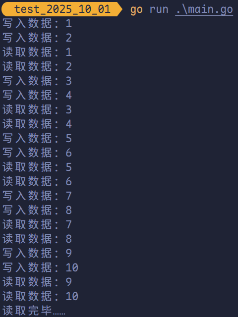

# Goroutine、channel 实现并行与并发

## 使用 goroutine 的原因

**需求**：要统计 1~10000000 的数字中那些是素数，并打印这些素数？

**素数**：就是除了 1 和它本身不能被其他数整除的数。

**实现方法**：

1. 传统方法，通过一个 `for` 循环判断各个数是否为素数。
2. 使用并发或并行的方式，将统计素数的任务分配给多个 goroutine 去完成，此时使用了 goroutine。
3. Goroutine 结合 channel。

## 进程、线程以及并发、并行

### 关于进程和线程

**进程（Process）**是程序在操作系统中的一次执行过程，是系统进行资源分配和调度的基本单位，进程是一个动态概念，是程序在执行过程中分配和管理资源的基本单位，每一个进程都有一个自己的地址空间。一个进程至少有 5 种基本状态，分别为：创建态、运行态、阻塞态、就绪态、终止态。

简而言之，进程就是一个正在执行的程序。

**线程**是进程的一个执行实例，是程序执行的最小单元，它是比进程更小的能独立运行的基本单位。

一个进程可以创建多个线程，同一个进程中的多个线程可以并发执行，一个程序要运行的话至少有一个进程。


### 关于并行和并发

**并发**：多个进程同时竞争一个位置，竞争到的才可以执行，每一个时间段只有一个线程在执行。

**并行**：多个线程可以同时执行，每一个时间段，可以有多个线程同时执行。

简而言之，多线程程序在单核 CPU 上运行就是**并发**，多线程程序在多个 CPU 上运行就是**并行**，若线程数大于 CPU 核数，则多线程程序在多个 CPU 上运行既有并行又有并发。


**并发的特点**：

1. 多个任务作用在一个 CPU 上面。
2. 同一时间点只能有一个任务执行。
3. 同一时间段内执行多个任务。


**并行的特点**：

1. 多个任务作用在多个 CPU 上面。
2. 同一时刻执行多个任务。

## Golang 中的协程（goroutine）以及主线程

在 Go 语言中，程序启动时会创建一个**主 goroutine**（通常被通俗地称为“主线程”，但更准确地说，它是运行在某个操作系统线程上的初始协程）。

在这个主 goroutine 中，可以通过在函数或方法调用前添加 `go` 关键字，轻松启动多个 **goroutine**。 

Goroutine 是 Go 对**轻量级并发执行单元**的实现，常被类比为“用户态线程”：   

- 它由 Go 运行时（runtime）管理，对操作系统内核透明。 
- 其调度完全由 Go 自己的调度器完成，无需内核介入。
- 初始栈空间极小（约 2KB），可高效支持成千上万个并发任务。

得益于 goroutine，Go 程序既能实现**并发**（concurrency，逻辑上同时处理多个任务），也能在多核 CPU 上实现**并行**（parallelism，物理上同时执行多个任务）。 

可以说，**goroutine 是 Go 语言原生支持并发的核心机制**，也是其高并发能力的重要基石。 


Go 语言中的 **goroutine**（常被类比为“协程”）在功能上类似于其他语言中的线程，但其设计更为轻量高效。

与 Java 或 C/C++ 中的操作系统线程相比，goroutine 的资源开销显著更低： 

- **内存占用**：一个 OS 线程通常分配固定的栈空间（约 1~2 MB），而一个 goroutine 的初始栈仅约 **2 KB**，并可根据需要动态伸缩。
- **调度开销**：goroutine 的创建、切换和销毁均由 Go 运行时在用户态完成，无需陷入内核，因此上下文切换成本远低于 OS 线程。

得益于这种轻量级并发模型，单个 Go 程序可轻松管理数十万甚至上百万个并发任务，而不会带来显著的内存或性能压力。这也是为何众多大型科技公司（如 Google、Cloudflare、Uber 等）选择 Go 构建高并发后端服务的重要原因之一。 

## Goroutine 的使用以及 `sync.WaitGroup`

**并发执行需求**：

在主 goroutine 中，开启一个新 goroutine，该协程每隔 50 毫秒输出 “小 Go，你好！”，在主线程中也每隔 50 毫秒输出“小 Go，你好！”，输出 10 次后，退出程序，要求主 goroutine 和新 goroutine 同时执行。

```go
package main

import (
	"fmt"
	"time"
)

func fn() {
	ticker := time.NewTicker(50 * time.Millisecond)
	defer ticker.Stop()

	count := 0
	for range ticker.C {
		if count >= 10 {
			break
		}
		fmt.Printf("fn: 小 Go，你好！\t%v\n", count)
		count++
	}
}

func main() {
	go fn()
	for i := range 10 {
		fmt.Printf("main: 小 Go，你好！\t%v\n", i)
		time.Sleep(50 * time.Millisecond)
	}
}
```


上述代码暂无问题，但是值得注意的是，若主 goroutine 执行完毕，其他 goroutine 还未执行完毕，程序会退出，因此需要对上述代码进行改造。


> [!tip]
>
> 1. 主 goroutine 一旦执行完毕，程序会立即退出，即使其他 goroutine 尚未完成。  
> 2. goroutine 可在主 goroutine 结束前自行退出，其执行状态（完成与否）不会影响主 goroutine 的正常执行流程。

为了确保程序能完整执行，我们希望**主 goroutine 等待所有并发的 goroutine 执行完毕后再退出**。此时，可以使用 `sync.WaitGroup` 来协调 goroutine 的生命周期，实现同步等待。

```go
package main

import (
	"fmt"
	"sync"
	"time"
)

func fn(wg *sync.WaitGroup) {
	defer wg.Done() // goroutine 结束就登记 1。
	ticker := time.NewTicker(10 * time.Millisecond)
	defer ticker.Stop()

	count := 0
	for range ticker.C {
		if count >= 10 {
			break
		}
		fmt.Printf("fn: 小 Go，你好！\t%v\n", count)
		count++
	}
}

func main() {
	var wg sync.WaitGroup // 定义一个 WaitGroup。
	wg.Add(1)             // 启动一个 goroutine 就加 1。
	go fn(&wg)
	for i := range 10 {
		fmt.Printf("main: 小 Go，你好！\t%v\n", i)
		time.Sleep(50 * time.Millisecond)
	}
	wg.Wait() // 等待所有的 goroutine 都结束。
}
```


## 启动多个 Goroutine

在 Go 语言中还可以启动多个 goroutine。

```go
package main

import (
	"fmt"
	"sync"
)

func fn(num int, wg *sync.WaitGroup) {
	defer wg.Done()
	fmt.Println("Hello Goroutine!", num)
}

	func main() {
		var wg sync.WaitGroup
		for i := range 10 {
			wg.Add(1)
			go fn(i, &wg)
		}
		wg.Wait()
	}
```


多次执行上述代码，发现每次打印数字的顺序均不同。这是由于 10 个 goroutine 是并发执行的，而 goroutine 的调度是随机的。

## 设置 Golang 并行运行时占用的 CPU 数量

Go 运行时的调度器通过 `GOMAXPROCS` 参数控制**可用于并行执行 Go 代码的操作系统线程数量**。

该参数的默认值为当前机器的 **CPU 逻辑核心数**。例如，在一台 8 核 CPU 的机器上，Go 调度器默认会使用 8 个 OS 线程来并行运行 goroutine。 

开发者可通过 `runtime.GOMAXPROCS(n)` 函数在程序运行时动态调整这一值，以限制或扩展程序可使用的 CPU 核心数。 

值得注意的是：   

- **Go 1.5 之前**，`GOMAXPROCS` 默认值为 `1`，即仅使用单个 OS 线程，无法实现真正的并行。
- **从 Go 1.5 起**，默认值被改为 **CPU 逻辑核心数**，从而默认启用多核并行能力。

```go
package main

import (
	"fmt"
	"runtime"
)

func main() {
	// 获取当前计算机上的 CPU 个数。
	cpuNum := runtime.NumCPU()
	fmt.Println("cpuNum =", cpuNum)

	// 可以自行设置使用 CPU 的数量。
	runtime.GOMAXPROCS(cpuNum - 1)
	fmt.Println("OK!")
}
```


## Goroutine 统计素数

**需求**：统计 1~120000 中的素数。

### 使用传统的 `for` 循环来统计

```go
package main

import (
	"fmt"
	"time"
)

func main() {
	start := time.Now()
	primeCount := 0

	for num := 2; num < 1.2e5; num++ {
		isPrime := true
		for i := 2; i*i <= num; i++ {
			if num%i == 0 {
				isPrime = false
				break
			}
		}
		if isPrime {
			primeCount++
		}
	}
	elapsed := time.Since(start)

	fmt.Printf("在 120000 内共找到 %d 个素数。\n", primeCount)
	fmt.Println("耗时:", elapsed)
}
```


### Goroutine 开启多个协程统计

```go
package main

import (
	"fmt"
	"sync"
	"time"
)

func countPrimes(start, end int, wg *sync.WaitGroup, result *int) {
	defer wg.Done()
	count := 0
	for num := start; num < end; num++ {
		isPrime := true
		for i := 2; i*i <= num; i++ {
			if num%i == 0 {
				isPrime = false
				break
			}
		}
		if isPrime {
			count++
		}
	}
	*result = count
}

func main() {
	start := time.Now()
	var wg sync.WaitGroup
	parts := 10
	interval := 1.2e5 / parts
	result := make([]int, parts)

	for i := range parts {
		wg.Add(1)
		s := i * interval
		e := (i + 1) * interval
		if s < 2 {
			s = 2
		}
		go countPrimes(s, e, &wg, &result[i])
	}

	wg.Wait()
	total := 0
	for _, v := range result {
		total += v
	}

	fmt.Printf("共找到 %d 个素数。\n", total)
	fmt.Println("耗时:", time.Since(start))
}
```


在上述代码中，已经使用 goroutine 大大提升性能了，但若想统计数据和打印数据同时进行，就需要使用**管道**。

## Channel 管道

管道是 Golang 在语言级别上提供的 goroutine 间的通讯方式，可以使用 `channel` 在多个 goroutine 间传递消息。若说 goroutine 是 Go 程序并发的执行体，则 `channel` 是它们之间的连接。`channel` 可以让一个 goroutine 发送特定值到另一个 goroutine 的通信机制。

Golang 的并发模型是 CSP（Communicating Sequential Processes，通信顺序进程），提倡**通过通信共享内存**而不是**通过共享内存而实现通信**。

Go 语言中的管道（`channel`）是一种特殊的类型。管道像一个队列，遵循**先进先出（First In First Out）**的规则，保证收发数据的顺序。每一个管道都是一个具体类型的导管，也就是声明 `channel` 的时候需要为其指定元素类型。

### `channel` 类型

`channel` 是一种类型，一种引用类型。声明管道类型的格式如下：

```go
var 变量 chan 元素类型
var ch1 chan int		// 声明一个传递整型的管道
var ch2 chan bool 	// 声明一个传递布尔型的管道
var ch3 chan []int	// 声明一个传递整型切片的管道
```

### 创建 `channel`

声明的管道后需要使用 `make` 函数初始化后才可使用。

```go
make(chan 元素类型, 容量)
```

```go
package main

func main() {
	ch1 := make(chan int, 10)
	ch2 := make(chan bool, 4)
	ch3 := make(chan []int, 3)
}
```

### `channel` 操作

管道有发送（seed）、接收（receive）和关闭（close）三种操作。

发送和接收均使用 `<-` 符号。

定义一个整型管道有：

```go
ch := make(chan int, 3)
```

#### 发送（将数据放在管道内）

将一个值发送到管道中。

```go
ch <- 10 // 将 10 发送至 ch 中。
```

#### 接收（从管道内取值）

从一个管道内接收值。

```go
x := <-ch // 从 ch 中接收值并赋值给变量 x。
<- ch			// 从 ch 中接收值，忽略结果。
```

#### 关闭管道

通过内置的 `close` 函数来关闭管道。

```go
close(ch)
```

> [!tip]
>
> 关闭 `channel` 的主要目的是向接收方 goroutine 表明“所有数据已发送完毕”。
>
> 仅当需要显式通知接收方“不再有数据”时，才应关闭 `channel`。
>
> 与文件不同，`channel` 在不再被引用时会由垃圾回收器自动回收，因此**关闭 `channel` 并非强制要求**——它是一种**通信行为**，而不是资源清理操作。 

**关闭后的 `channel` 具有以下行为**： 

1. 向已关闭的 `channel` **发送数据**会引发 `panic`。  
2. 从已关闭的 `channel` **接收数据**时，会**继续返回**剩余的元素，**直到 `channel` 为空**。  
3. 当 `channel` 已关闭且缓冲区为空时，再次接收将立即返回**对应类型的零值**。  
4. **重复关闭**同一个 `channel` 也会导致 `panic`。

### 管道阻塞

#### 无缓冲的管道

若常见管道时没有指定容量，则称这个管道为无缓存的管道。无缓冲的管道又被称为阻塞的管道。

```go
package main

import "fmt"

func main() {
	ch := make(chan int)
	ch <- 10
	fmt.Println("发送成功")
}
```


在上述代码中，无缓存 `channel` 发送数据时，必须有另一个 goroutine 正在接收，否则发送操作会一直阻塞，导致主线程卡住，最终 Go 运行时检测到所有 goroutine 都阻塞，报错。

解决方法就是使用缓冲 `channel` 或者用 goroutine 来接收数据。

#### 有缓冲的管道

```go
package main

import "fmt"

func main() {
	ch := make(chan int, 1)
	ch <- 10
	fmt.Println("发送成功")
}
```


只要 `channel` 的容量大于 0，它就是一个**带缓冲的 `channel`**。缓冲容量表示 `channel` 内部最多能暂存多少个元素。 

可以把它想象成小区的快递柜：   

- 柜子有固定数量的格子（即缓冲容量）。
- 当格子满了，快递员（发送方）必须等待，直到有人取走一个包裹（接收方消费数据），才能放入新的包裹。
- 反之，如果柜子还有空位，快递员可以立即投递，无需等待。

**管道阻塞的代码**：

```go
package main

import "fmt"

func main() {
	ch := make(chan int, 1)
	ch <- 10
	ch <- 12
	fmt.Println("发送成功")
}
```


**解决方法**：

```go
package main

import "fmt"

func main() {
	ch := make(chan int, 1)
	ch <- 10 // 放入
	<-ch     // 取走
	ch <- 12 // 放入
	<-ch     // 取走
	ch <- 17 // 放入
	fmt.Println("发送成功")
}
```


### `for range` 从管道循环取值

当向管道中发送完数据时，可以通过 `close` 函数关闭管道。

当管道被关闭时，再往该管道发送值会引发 `panic`，从该管道取值的操作会先取完管道中的值，再然后取到的值一直都是对应类型的零值。

如何判断一个管道是否关闭呢？

```go
package main

import "fmt"

func main() {
	ch := make(chan int, 5)

	for i := range 5 {
		ch <- i + 1
	}
	close(ch)

	for v := range ch {
		fmt.Print(v, " ")
	}
	fmt.Println()
}
```


通常使用 `for range` 来判断管道是否关闭，遍历管道，当管道关闭时就会退出 `for range`。

## Goroutine 结合 Channel 管道

**需求 1**：定义两个方法，一个方法给管道里面写数据，一个给管道里面读取数据。要求同步进行。

1. 开启一个 `write` 的 goroutine 给向管道 `ch` 中写入 100 条数据。
2. 开启一个 `read` 的 goroutine 读取 `ch` 中写入的数据。
3. `write` 和 `read` 同时操作一个管道。
4. 主 goroutine 必须等待操作完成后才可以退出。



> [!tip]
>
> 在上述代码中，使用的是**无缓冲 `channel`**（`make(chan int)`）。因此，`write` 协程每次向 `channel` 写入数据时，必须等待 `read` 协程从 `channel` 读取数据后才能继续写入。这样可以保证数据的同步传递，避免数据丢失或乱序。无缓冲 `channel` 的特点是**发送和接收必须同时进行**，否则发送方或接收方都会阻塞，直到另一方准备好。

**需求 2**：Goroutine 结合 `channel` 实现统计 1~120000 的数字中哪些是素数？

```go
package main

import (
	"fmt"
	"sync"
	"time"
)

func generateNumbers(numChan chan int, wg *sync.WaitGroup) {
	defer wg.Done()
	for num := 2; num < 120; num++ {
		numChan <- num
	}
	close(numChan)
}

func filterPrimes(numChan, primeChan chan int, exitChan chan bool, wg *sync.WaitGroup) {
	defer wg.Done()
	for num := range numChan {
		isPrime := true
		for i := 2; i*i <= num; i++ {
			if num%i == 0 {
				isPrime = false
				break
			}
		}
		if isPrime {
			primeChan <- num
		}
	}
	exitChan <- true
}

func printPrimes(primeChan chan int, wg *sync.WaitGroup) {
	defer wg.Done()
	for prime := range primeChan {
		fmt.Print(prime, " ")
	}
}

func main() {
	start := time.Now()
	var wg sync.WaitGroup
	workerCount := 5
	numChan := make(chan int, 10)
	primeChan := make(chan int, 10)
	exitChan := make(chan bool, workerCount)

	wg.Add(1)
	go generateNumbers(numChan, &wg)

	for range workerCount {
		wg.Add(1)
		go filterPrimes(numChan, primeChan, exitChan, &wg)
	}

	wg.Add(1)
	go printPrimes(primeChan, &wg)

	wg.Go(func() {
		for range workerCount {
			<-exitChan
		}
		close(primeChan)
	})

	wg.Wait()

	fmt.Println()
	fmt.Println(time.Since(start))
}
```


## 单向管道

在多个任务函数之间传递管道作为参数时，常常需要对其使用加以限制，例如限定管道在某个函数中仅用于发送或仅用于接收。

```go
package main

import "fmt"

func main() {
	// 双向管道
	ch1 := make(chan int, 2)
	ch1 <- 10
	ch1 <- 12
	m1 := <-ch1
	m2 := <-ch1
	fmt.Println(m1, m2)

	// 只写管道
	ch2 := make(chan<- int, 2)
	ch2 <- 10
	ch2 <- 12
	// cannot receive from send-only channel
	// <-ch2

	ch3 := make(<-chan int, 2)
	// cannot send to receive-only channel
	// ch3 <- 23
}
```

重写之前的例子，有：

```go
package main

import (
	"fmt"
	"sync"
	"time"
)

func generateNumbers(numChan chan<- int, wg *sync.WaitGroup) {
	defer wg.Done()
	for num := 2; num < 1.2e5; num++ {
		numChan <- num
	}
	close(numChan)
}

func filterPrimes(numChan <-chan int, primeChan chan<- int,
	exitChan chan<- bool, wg *sync.WaitGroup) {
	defer wg.Done()
	for num := range numChan {
		isPrime := true
		for i := 2; i*i <= num; i++ {
			if num%i == 0 {
				isPrime = false
				break
			}
		}
		if isPrime {
			primeChan <- num
		}
	}
	exitChan <- true
}

func printPrimes(primeChan <-chan int, wg *sync.WaitGroup) {
	defer wg.Done()
	for prime := range primeChan {
		fmt.Println(prime)
	}
}

func main() {
	start := time.Now()
	var wg sync.WaitGroup
	workerCount := 5
	numChan := make(chan int, 10)
	primeChan := make(chan int, 10)
	exitChan := make(chan bool, workerCount)

	wg.Add(1)
	go generateNumbers(numChan, &wg)

	for range workerCount {
		wg.Add(1)
		go filterPrimes(numChan, primeChan, exitChan, &wg)
	}

	wg.Add(1)
	go printPrimes(primeChan, &wg)

	wg.Go(func() {
		for range workerCount {
			<-exitChan
		}
		close(primeChan)
	})

	wg.Wait()

	fmt.Println()
	fmt.Println(time.Since(start))
}
```

可以发现，双向管道可作为参数传递给那些接受单向管道的函数。

## `select` 多路复用

 在某些场景下需要同时从多个通道接收数据，此时可以使用 Golang 中提供的 `select` 多路复用。

通常情况下，通道在接收数据时，若无数据可接收则会发送阻塞。

```go
for {
  // 尝试从 ch1 接收值。
  data, ok := <-ch1
 	// 尝试从 ch2 接收值。
  data, ok = <- ch2
}
```

该方式虽然可以满足从多个管道接收值的需求，但运行性能不佳。为了应对该场景，Go 内置了 `select` 关键字，可以同时响应多个管道的操作。

`select` 的使用类似于 `switch` 语句，有一系列 `case` 分支和一个默认的分支。每个 `case` 会对应一个管道的通信（接收或发送）过程。`select` 会一直等待，直到某个 `case` 的通信操作完成时，就会执行 `case` 分支对应的语句。

```go
select {
  case <-ch1:
  	...
	case data := <-ch2:
  	...
  case ch3<-data 
  	...
	default:
  	默认操作
}
```

```go
package main

import "fmt"

func main() {
	// 定义一个 channel 存储 10 个 int 数据。
	intChan := make(chan int, 10)
	for i := range 10 {
		intChan <- i
	}

	// 定义一个 channel 存储 5 个 string 数据。
	stringChan := make(chan string, 5)
	for i := range 5 {
		stringChan <- "Hello, " + fmt.Sprintf("%d", i)
	}

	for {
		select {
		case v := <-intChan:
			fmt.Printf("从 intChan 读取的数据：%d\n", v)
		case v := <-stringChan:
			fmt.Printf("从 stringChan 读取的数据：%s\n", v)
		default:
			fmt.Printf("取完所有数据")
			return
		}
	}
}
```


## `recover` 解决 goroutine 中出现的 `panic`

```go
package main

import (
	"fmt"
	"time"
)

// 函数
func sayHello() {
	for range 10 {
		time.Sleep(time.Millisecond * 100)
		fmt.Println("Hello World!")
	}
}

func test() {
	// 使用 recover()
	defer func() {
		// 捕获 test() 抛出的 panic。
		if err := recover(); err != nil {
			fmt.Printf("发生错误：%v\n", err)
		}
	}()
	// 定义一个 map 类型的变量。
	var myMap map[int]string
	myMap[0] = "Golang" // 错误
}

func main() {
	go sayHello()
	go test()

	for i := range 10 {
		fmt.Println("main() ok =", i)
		time.Sleep(time.Millisecond * 100)
	}
}
```


## 并发安全和锁

**需求**：现在要计算 1~60 的各个数的阶乘，并且把各个数的阶乘放入 `map` 中，最后显示出来，要求使用 goroutine。

**思路**：

1. 编写一个函数，计算各个数的阶乘，并放入 `map` 中。
2. 启动多个 goroutine，将统计的结果放入到 `map` 中。

若仅使用 Goroutine 实现，运行时可能会因并发写入共享 `map` 而引发 `concurrent map writes` 错误。

```go
package main

import (
	"fmt"
	"sync"
)

func factorial(num int, numMap map[int]int, wg *sync.WaitGroup) {
	defer wg.Done()
	res := 1
	for i := 1; i <= num; i++ {
		res *= i
	}
	numMap[num] = res
}

func main() {
	numMap := make(map[int]int)
	var wg sync.WaitGroup

	for i := 1; i <= 60; i++ {
		wg.Add(1)
		go factorial(i, numMap, &wg)
	}

	wg.Wait()

	for i, v := range numMap {
		fmt.Printf("map[%d] = %d\n", i, v)
	}
}
```


### 互斥锁

**互斥锁**是一种常见的控制共享资源访问的方法，可以保证同时只有一个 goroutine 可以访问共享资源。Go 语言中使用 `sync` 包中的 `Mutex` 类型来实现互斥锁。使用互斥锁来修复上面代码的问题：

```go
package main

import (
	"fmt"
	"sync"
)

func factorial(num int, numMap map[int]int, wg *sync.WaitGroup, mutex *sync.Mutex) {
	defer wg.Done()
	res := 1
	for i := 1; i <= num; i++ {
		res *= i
	}
	mutex.Lock()
	numMap[num] = res
	mutex.Unlock()
}

func main() {
	numMap := make(map[int]int)
	var wg sync.WaitGroup
	var mutex sync.Mutex

	for i := 1; i <= 10; i++ {
		wg.Add(1)
		go factorial(i, numMap, &wg, &mutex)
	}

	wg.Wait()

	for i, v := range numMap {
		fmt.Printf("map[%d] = %d\n", i, v)
	}
}
```


互斥锁（`sync.Mutex`）可确保同一时刻仅有一个 goroutine 进入临界区，其余 goroutine 将阻塞等待。当锁被释放后，等待的 goroutine 会以**随机顺序**被唤醒并竞争获取锁。   

虽然互斥锁能有效避免资源竞争，但通过全局变量配合锁进行同步，会使多个 goroutine 的读写耦合紧密，不利于代码的可维护性和并发效率。此时，更推荐使用 **Channel（通道）** 以“通过通信共享内存”的方式实现协程间的协作，而非“通过共享内存进行通信”。 

### 读写互斥锁

互斥锁是完全互斥的，但在很多实际场景下是**读多写少**，当并发地去**读取**一个资源不涉及资源修改时是**没必要加锁**的，该情景下使用**读写锁**是一种更好的选择。读写锁在 Go 语言中使用 `sync` 包中的 `RWMutex` 类型。

读写锁分为两种：**读锁**和**写锁**。当一个 goroutine **获取读锁**后，其他的 goroutine 如果是**读锁**会继续**获得锁**，如果是获取**写锁**就**等待**；当一个 goroutine **获取写锁**之后，其他的 goroutine 无论是获取读锁还是写锁**都会等待**。

```go
package main

import (
	"fmt"
	"sync"
	"time"
)

func write(wg *sync.WaitGroup, mutex *sync.RWMutex) {
	defer wg.Done()
	mutex.Lock()
	fmt.Println("---执行写操作")
	time.Sleep(time.Millisecond * 100)
	mutex.Unlock()
}

func read(wg *sync.WaitGroup, mutex *sync.RWMutex) {
	defer wg.Done()
	mutex.RLock()
	fmt.Println("***执行读操作")
	time.Sleep(time.Millisecond * 100)
	mutex.RUnlock()
}

func main() {
	start := time.Now()
	var wg sync.WaitGroup
	var mutex sync.RWMutex

	for range 10 {
		wg.Add(1)
		go write(&wg, &mutex)
	}

	for range 10 {
		wg.Add(1)
		go read(&wg, &mutex)
	}

	wg.Wait()

	fmt.Println(time.Since(start))
}
```


> [!tip]
>
> 读写锁非常适合读多写少的场景，若读和写的操作差别不大，读写锁的优势就发挥不出来。