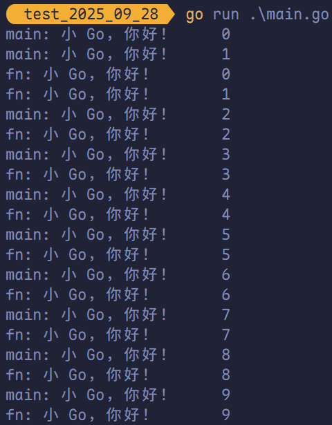

# Goroutine、channel 实现并行与并发

## 使用 goroutine 的原因

**需求**：要统计 1~10000000 的数字中那些是素数，并打印这些素数？

**素数**：就是除了 1 和它本身不能被其他数整除的数。

**实现方法**：

1. 传统方法，通过一个 `for` 循环判断各个数是否为素数。
2. 使用并发或并行的方式，将统计素数的任务分配给多个 goroutine 去完成，此时使用了 goroutine。
3. Goroutine 结合 channel。

## 进程、线程以及并发、并行

### 关于进程和线程

**进程（Process）**是程序在操作系统中的一次执行过程，是系统进行资源分配和调度的基本单位，进程是一个动态概念，是程序在执行过程中分配和管理资源的基本单位，每一个进程都有一个自己的地址空间。一个进程至少有 5 种基本状态，分别为：创建态、运行态、阻塞态、就绪态、终止态。

简而言之，进程就是一个正在执行的程序。

**线程**是进程的一个执行实例，是程序执行的最小单元，它是比进程更小的能独立运行的基本单位。

一个进程可以创建多个线程，同一个进程中的多个线程可以并发执行，一个程序要运行的话至少有一个进程。


### 关于并行和并发

**并发**：多个进程同时竞争一个位置，竞争到的才可以执行，每一个时间段只有一个线程在执行。

**并行**：多个线程可以同时执行，每一个时间段，可以有多个线程同时执行。

简而言之，多线程程序在单核 CPU 上运行就是**并发**，多线程程序在多个 CPU 上运行就是**并行**，若线程数大于 CPU 核数，则多线程程序在多个 CPU 上运行既有并行又有并发。


**并发的特点**：

1. 多个任务作用在一个 CPU 上面。
2. 同一时间点只能有一个任务执行。
3. 同一时间段内执行多个任务。


**并行的特点**：

1. 多个任务作用在多个 CPU 上面。
2. 同一时刻执行多个任务。

## Golang 中的协程（goroutine）以及主线程

在 Go 语言中，程序启动时会创建一个**主 goroutine**（通常被通俗地称为“主线程”，但更准确地说，它是运行在某个操作系统线程上的初始协程）。

在这个主 goroutine 中，可以通过在函数或方法调用前添加 `go` 关键字，轻松启动多个 **goroutine**。 

Goroutine 是 Go 对**轻量级并发执行单元**的实现，常被类比为“用户态线程”：   

- 它由 Go 运行时（runtime）管理，对操作系统内核透明。 
- 其调度完全由 Go 自己的调度器完成，无需内核介入。
- 初始栈空间极小（约 2KB），可高效支持成千上万个并发任务。

得益于 goroutine，Go 程序既能实现**并发**（concurrency，逻辑上同时处理多个任务），也能在多核 CPU 上实现**并行**（parallelism，物理上同时执行多个任务）。 

可以说，**goroutine 是 Go 语言原生支持并发的核心机制**，也是其高并发能力的重要基石。 


Go 语言中的 **goroutine**（常被类比为“协程”）在功能上类似于其他语言中的线程，但其设计更为轻量高效。

与 Java 或 C/C++ 中的操作系统线程相比，goroutine 的资源开销显著更低： 

- **内存占用**：一个 OS 线程通常分配固定的栈空间（约 1~2 MB），而一个 goroutine 的初始栈仅约 **2 KB**，并可根据需要动态伸缩。
- **调度开销**：goroutine 的创建、切换和销毁均由 Go 运行时在用户态完成，无需陷入内核，因此上下文切换成本远低于 OS 线程。

得益于这种轻量级并发模型，单个 Go 程序可轻松管理数十万甚至上百万个并发任务，而不会带来显著的内存或性能压力。这也是为何众多大型科技公司（如 Google、Cloudflare、Uber 等）选择 Go 构建高并发后端服务的重要原因之一。 

## Goroutine 的使用以及 `sync.WaitGroup`

**并发执行需求**：

在主 goroutine 中，开启一个新 goroutine，该协程每隔 50 毫秒输出 “小 Go，你好！”，在主线程中也每隔 50 毫秒输出“小 Go，你好！”，输出 10 次后，退出程序，要求主 goroutine 和新 goroutine 同时执行。

```go
package main

import (
	"fmt"
	"time"
)

func fn() {
	ticker := time.NewTicker(50 * time.Millisecond)
	defer ticker.Stop()

	count := 0
	for range ticker.C {
		if count >= 10 {
			break
		}
		fmt.Printf("fn: 小 Go，你好！\t%v\n", count)
		count++
	}
}

func main() {
	go fn()
	for i := range 10 {
		fmt.Printf("main: 小 Go，你好！\t%v\n", i)
		time.Sleep(50 * time.Millisecond)
	}
}
```



上述代码暂无问题，但是值得注意的是，若主 goroutine 执行完毕，其他 goroutine 还未执行完毕，程序会退出，因此需要对上述代码进行改造。


> [!tip]
>
> 1. 主 goroutine 一旦执行完毕，程序会立即退出，即使其他 goroutine 尚未完成。  
> 2. goroutine 可在主 goroutine 结束前自行退出，其执行状态（完成与否）不会影响主 goroutine 的正常执行流程。

为了确保程序能完整执行，我们希望**主 goroutine 等待所有并发的 goroutine 执行完毕后再退出**。此时，可以使用 `sync.WaitGroup` 来协调 goroutine 的生命周期，实现同步等待。

```go
package main

import (
	"fmt"
	"sync"
	"time"
)

func fn(wg *sync.WaitGroup) {
	defer wg.Done() // goroutine 结束就登记 1。
	ticker := time.NewTicker(10 * time.Millisecond)
	defer ticker.Stop()

	count := 0
	for range ticker.C {
		if count >= 10 {
			break
		}
		fmt.Printf("fn: 小 Go，你好！\t%v\n", count)
		count++
	}
}

func main() {
	var wg sync.WaitGroup // 定义一个 WaitGroup。
	wg.Add(1)             // 启动一个 goroutine 就加 1。
	go fn(&wg)
	for i := range 10 {
		fmt.Printf("main: 小 Go，你好！\t%v\n", i)
		time.Sleep(50 * time.Millisecond)
	}
	wg.Wait() // 等待所有的 goroutine 都结束。
}
```


## 启动多个 Goroutine

在 Go 语言中还可以启动多个 goroutine。

```go
package main

import (
	"fmt"
	"sync"
)

func fn(num int, wg *sync.WaitGroup) {
	defer wg.Done()
	fmt.Println("Hello Goroutine!", num)
}

	func main() {
		var wg sync.WaitGroup
		for i := range 10 {
			wg.Add(1)
			go fn(i, &wg)
		}
		wg.Wait()
	}
```


多次执行上述代码，发现每次打印数字的顺序均不同。这是由于 10 个 goroutine 是并发执行的，而 goroutine 的调度是随机的。

## 设置 Golang 并行运行时占用的 CPU 数量

Go 运行时的调度器通过 `GOMAXPROCS` 参数控制**可用于并行执行 Go 代码的操作系统线程数量**。

该参数的默认值为当前机器的 **CPU 逻辑核心数**。例如，在一台 8 核 CPU 的机器上，Go 调度器默认会使用 8 个 OS 线程来并行运行 goroutine。 

开发者可通过 `runtime.GOMAXPROCS(n)` 函数在程序运行时动态调整这一值，以限制或扩展程序可使用的 CPU 核心数。 

值得注意的是：   

- **Go 1.5 之前**，`GOMAXPROCS` 默认值为 `1`，即仅使用单个 OS 线程，无法实现真正的并行。
- **从 Go 1.5 起**，默认值被改为 **CPU 逻辑核心数**，从而默认启用多核并行能力。

```go
package main

import (
	"fmt"
	"runtime"
)

func main() {
	// 获取当前计算机上的 CPU 个数。
	cpuNum := runtime.NumCPU()
	fmt.Println("cpuNum =", cpuNum)

	// 可以自行设置使用 CPU 的数量。
	runtime.GOMAXPROCS(cpuNum - 1)
	fmt.Println("OK!")
}
```


## Goroutine 统计素数

**需求**：统计 1~120000 中的素数。

### 使用传统的 `for` 循环来统计

```go
package main

import (
	"fmt"
	"time"
)

func main() {
	start := time.Now()
	primeCount := 0

	for num := 2; num < 1.2e5; num++ {
		isPrime := true
		for i := 2; i*i <= num; i++ {
			if num%i == 0 {
				isPrime = false
				break
			}
		}
		if isPrime {
			primeCount++
		}
	}
	elapsed := time.Since(start)

	fmt.Printf("在 120000 内共找到 %d 个素数。\n", primeCount)
	fmt.Println("耗时:", elapsed)
}
```


### Goroutine 开启多个协程统计

```go
package main

import (
	"fmt"
	"sync"
	"time"
)

func countPrimes(start, end int, wg *sync.WaitGroup, result *int) {
	defer wg.Done()
	count := 0
	for num := start; num < end; num++ {
		isPrime := true
		for i := 2; i*i <= num; i++ {
			if num%i == 0 {
				isPrime = false
				break
			}
		}
		if isPrime {
			count++
		}
	}
	*result = count
}

func main() {
	start := time.Now()
	var wg sync.WaitGroup
	parts := 10
	interval := 1.2e5 / parts
	result := make([]int, parts)

	for i := range parts {
		wg.Add(1)
		s := i * interval
		e := (i + 1) * interval
		if s < 2 {
			s = 2
		}
		go countPrimes(s, e, &wg, &result[i])
	}

	wg.Wait()
	total := 0
	for _, v := range result {
		total += v
	}

	fmt.Printf("共找到 %d 个素数。\n", total)
	fmt.Println("耗时:", time.Since(start))
}
```

