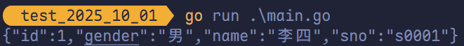
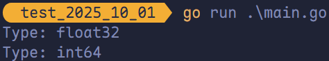
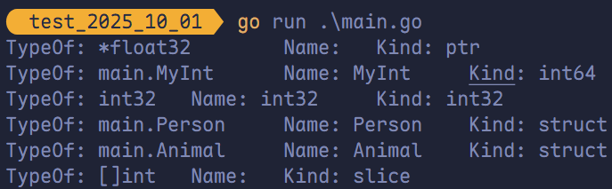
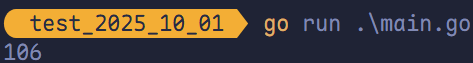
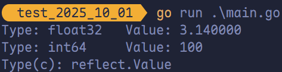
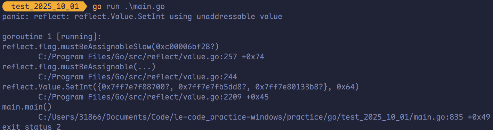
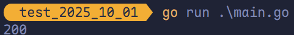
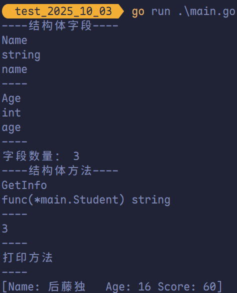
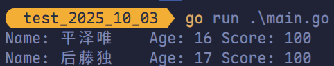

# 反射

## Intro

有时我们需要编写一个能够统一处理各种值类型的函数。这些类型可能无法实现同一个接口，其内部结构可能未知，甚至在我们设计该函数时尚未定义。此时，Go 的**反射（reflection）**机制就派上了用场。 

**空接口 `interface{}` 可以容纳任意类型的值**，但在运行时获知其中存储的具体类型和实际值主要有两种方式： 

1. **类型断言**：适用于已知可能类型的有限集合。
2. **反射**：在程序运行时动态获取变量的类型信息（`reflect.Type`）和值信息（`reflect.Value`），适用于完全未知或泛化的场景。

一个典型的反射应用是**将结构体序列化为 JSON 字符串**。例如，`json` 包在处理结构体字段时，会通过反射读取字段的 `json` 标签（如 `json:"name"`），从而决定序列化后的键名。这种能力正是建立在反射对类型和结构的动态解析之上。 

```go
package main

import (
	"fmt"

	json "github.com/json-iterator/go"
)

type Student struct {
	ID     int    `json:"id"`
	Gender string `json:"gender"`
	Name   string `json:"name"`
	Sno    string `json:"sno"`
}

func main() {
	s1 := Student{
		ID:     1,
		Gender: "男",
		Name:   "李四",
		Sno:    "s0001",
	}
	data, _ := json.Marshal(s1)
	jsonStr := string(data)
	fmt.Println(jsonStr)
}
```



ORM 框架中也使用了反射技术。

**ORM（对象关系映射，Object Relational Mapping）**：通过使用描述对象和数据库之间映射的元数据，将面向对象语言程序中的对象自动持久化到关系数据库中。

## 反射的基本介绍

**反射（Reflection）**是指程序在运行时动态访问和修改自身结构与行为的能力。

通常情况下，程序在编译后，变量名等源代码中的符号信息会被丢弃，仅保留内存地址和机器指令，因此运行中的程序无法获知自身的类型、字段名或结构等元信息。

而支持反射的语言（如 Go）会在编译器将必要的类型元数据（如字段名称、类型、结构体定义等）嵌入到可执行文件中，并提供运行时接口，使程序能够在执行期间查询这些信息，甚至在一定条件下修改其值或行为。

**Go 语言中的反射（reflection）支持在运行时动态操作程序结构，主要功能包括**： 

1. **获取变量的类型与种类（Kind）**：在运行时动态探知变量的类型信息（如 `int`、`*User`）及其底层种类（如 `int`、`struct`、`ptr` 等）。
2. **解析结构体元数据**：若变量是结构体，可进一步获取其字段名、字段类型、方法集以及结构体标签（struct tags）。
3. **动态修改值与调用方法**：在满足可寻址和可导出等条件的前提下，可通过反射修改变量的值，或调用其关联的方法。

**在 Go 语言中，每个变量在运行时都包含两个核心组成部分**：

- **类型信息（Type）**：描述变量的静态类型，属于编译器确定的元数据。
- **值信息（Value）**：变量在运行时所持有的具体数据，可随程序执行动态变化。

Go 的反射机制正是基于这一模型构建的。

任何接口值（`interface{}`）在运行时都由一个具体类型和该类型的一个具体值组成。

`reflect` 包作为 Go 内置的反射支持库，提供了对这两部分的访问能力：

- `reflect.Type` 表示类型的元信息
- `reflect.Value` 表示值的可操作封装

通过 `reflect.TypeOf` 和 `reflect.ValueOf` 两个核心函数，可以从任意 Go 对象（通常通过接口传入）中分别提取其类型和值的反射表示：

```go
v := reflect.ValueOf(x) // 获取值的反射对象
t := reflect.TypeOf(x)  // 获取类型的反射对象
```

> [!tip]
>
> 由于 `reflect.ValueOf` 和 `reflect.TypeOf` 的参数类型均为 `interface{}`，当传入具体类型的值（如 `int`、结构体等）时，Go 会自动将其**装箱（boxing）**——即将值与其类型信息一并封装进 `interface{}`。
>
> 这一机制使得反射能够在运行时同时获取值的内容和其类型，从而统一处理所有 Go 类型，构成了反射系统的基础。

## `reflect.TypeOf` 获取任意值的类型对象

在 Go 语言中，使用 `reflect.TypeOf` 函数可以接受任意 `interface{}` 参数，可以获得任意值的**类型对象（`reflect.Type`）**，程序通过类型对象可以访问**任意值的类型信息**。

```go
package main

import (
	"fmt"
	"reflect"
)

func reflectType(x any) {
	t := reflect.TypeOf(x)
	fmt.Printf("Type: %v\n", t)
}

func main() {
	var f float32 = 12.5
	reflectType(f)
	var i int64 = 100
	reflectType(i)
}
```



### `Name` 和 `Kind`

在 Go 的反射系统中，类型（Type）与种类（Kind）是两个关键但不同的概念：

- `Type` 表示**具体的类型**，包括用户通过 `type` 关键字定义的**自定义类型**（如 `type UserID int` 或 `type Person struct{...}`）。
- `Kind` 则表示该类型**底层的基本类别**（如 `int`、`struct`、`ptr`、`slice`、`map` 等），用于描述类型的“本质”。

由于 Go 允许基于已有类型创建新的命名类型，`Type` 能**区分这些自定义类型**，而 `Kind` 则忽略名称差异，**只关注底层结构**。

例如：

```go
type MyInt int
type MyStruct struct{ Name string }

var a MyInt
var b *MyStruct
```

- `reflect.TypeOf(a).Name()` 返回 `"MyInt"`，而 `reflect.TypeOf(a).Kind()` 返回 `reflect.Int`。
- `reflect.TypeOf(b).Name()` 返回 `""`（因为指针类型是匿名的），但 `Kind()` 返回 `reflect.Ptr`。

> [!tip]
>
> 打印的是该类型的字符串表示，例如 `int`、`ptr` 等底层种类（Kind）。

特别地，对于复合类型（如指针、切片、数组、`map`、`chan` 等），其 `Type.Name()` 通常返回空字符串，因为它们没有显式的类型名称——此时必须依赖 `Kind()` 来判断其基本类型。

因此，在反射中需要区分具体类型（`Type`）和底层类型（`Kind`）：

- 用 `Type` 判断“这是哪个类型”。
- 用 `Kind` 判断“这本质上是什么结构”。

```go
package main

import (
	"fmt"
	"reflect"
)

func reflectType(x any) {
	t := reflect.TypeOf(x)
	fmt.Printf("TypeOf: %v\tName: %v\tKind: %v\n",
		t, t.Name(), t.Kind())
}

type MyInt int64

type Person struct {
	Name string
	Age  int
}

type Animal struct {
	Name string
}

func main() {
	var ptr *float32
	var mi MyInt
	var c rune
	var p = Person{
		Name: "平泽唯",
		Age:  17,
	}
	var a = Animal{"后藤一里"}
	var slice = []int{1, 2, 3, 4, 5}

	reflectType(ptr)
	reflectType(mi)
	reflectType(c)
	reflectType(p)
	reflectType(a)
	reflectType(slice)
}
```



> [!tip]
>
> 只有通过 `type` 关键字显式定义的类型才是“命名类型”（named type）。
>
> 所有直接使用基础类型组合（如 `*int`、`[]int`、`map[string]int` 等）而没有命名的类型，都属于“匿名类型”（unnamed type / unnamed type literal），它们的 `reflect.Type.Name()` 返回空字符串 `""`。

### 在 `reflect` 包中定义的 `Kind` 类型

```go
const (
	Invalid       Kind = iota // 非法类型（未初始化或无效）
	Bool                      // 布尔型（bool）
	Int                       // 有符号整型（平台相关，默认 int32/int64）
	Int8                      // 8位有符号整型（int8）
	Int16                     // 16位有符号整型（int16）
	Int32                     // 32位有符号整型（int32）
	Int64                     // 64位有符号整型（int64）
	Uint                      // 无符号整型（平台相关，默认 uint32:uint64）
	Uint8                     // 8位无符号整型（uint8 / byte）
	Uint16                    // 16位无符号整型（uint16）
	Uint32                    // 32位无符号整型（uint32）
	Uint64                    // 64位无符号整型（uint64）
	Uintptr                   // 指针大小的无符号整型（uintptr）
	Float32                   // 32位浮点型（float32）
	Float64                   // 64位浮点型（float64，Go 默认浮点）
	Complex64                 // 64位复数（两个 float32）
	Complex128                // 128位复数（两个 float64，Go 默认复数）
	Array                     // 数组类型（如 [5]int）
	Chan                      // 通道类型（如 chan int）
	Func                      // 函数类型（如 func(int) string）
	Interface                 // 接口类型（如 interface{}、error）
	Map                       // 映射类型（如 map[string]int）
	Pointer                   // 指针类型（如 *int、*struct）
	Slice                     // 切片类型（如 []string）
	String                    // 字符串类型（string）
	Struct                    // 结构体类型（如 struct{...} 或命名结构体）
	UnsafePointer             // 不安全指针（unsafe.Pointer）
)
```

## `reflect.ValueOf`

`reflect.ValueOf` 返回的是 `reflect.Value` 类型，其中包含了原始值的值信息。`reflect.Value` 与原始值之间可以互相转换。

`reflect.Value` 类型提供的获取原始值的方法如下：

|           方法            |                             说明                             |
| :-----------------------: | :----------------------------------------------------------: |
| `Interface() interface{}` | 将值以 `interface{}` 类型返回，可以通过类型断言转换为指定类型 |
|       `Int() int64`       |    将值以 `int` 类型返回，所有有符号整型均可以此方式返回     |
|      `Uint() uint64`      |    将值以 `uint` 类型返回，所有无符号整型均可以此方式返回    |
|     `Float() float64`     | 将值以双精度（`float64`）类型返回，所有浮点数（`float32`、`float64`）均可以此方式返回 |
|       `Bool() bool`       |                    将值以 `bool` 类型返回                    |
|     `Bytes() []bytes`     |              将值以字节数组 `[]bytes` 类型返回               |
|     `String() string`     |                     将值以字符串类型返回                     |

```go
package main

import (
	"fmt"
	"reflect"
)

func reflectValue(x any) {
	v := reflect.ValueOf(x)
	c := v.Int() + 6
	fmt.Println(c)
}

func main() {
	var num int32 = 100
	reflectValue(num)
}
```



> [!tip]
>
> `.Int()` 方法支持所有有符号整数类型（`int`、`int8`、`int16`、`int32`、`int64`），它会自动将底层值转换为 `int64` 返回，而不会 `panic`。

```go
package main

import (
	"fmt"
	"reflect"
)

func reflectValue(x any) {
	v := reflect.ValueOf(x)
	k := v.Kind()
	switch k {
	case reflect.Int64:
		fmt.Printf("Type: int64\tValue: %d\n", v.Int())
	case reflect.Float32:
		fmt.Printf("Type: float32\tValue: %f\n", v.Float())
	case reflect.Float64:
		fmt.Printf("Type: float64\tValue: %f\n", v.Float())
	default:
		fmt.Println("Type: unknown")
	}
}

func main() {
	var a float32 = 3.14
	var b int64 = 100
	reflectValue(a)
	reflectValue(b)

	// 将 int 类型的原始值转换为 reflect.Value 类型
	c := reflect.ValueOf(10)
	fmt.Printf("Type(c): %T\n", c)
}
```



### 通过反射设置变量的值

`reflect.Value` 提供了一系列 `SetXXX` 方法，用于在运行时动态设置变量的值：

```go
func (v Value) SetBool(x bool)
func (v Value) SetInt(x int64)
func (v Value) SetUint(x uint64)
func (v Value) SetFloat(x float64)
func (v Value) SetComplex(x complex128)
func (v Value) SetBytes(x []byte)
func (v Value) SetString(x string)
func (v Value) SetPointer(x unsafe.Pointer)
func (v Value) SetCap(n int)
func (v Value) SetLen(n int)
func (v Value) SetMapIndex(key, val Value)
func (v Value) Set(x Value)
```

> [!tip]
>
> 要成功调用 `SetXXX` 方法，必须满足两个条件：
>
> - 变量必须是“可寻址的”（addressable）——即该值可以通过 `&` 取地址（例如传入的是指针或切片元素）。
> - 字段或方法必须是“可导出的”（exported）——即首字母大写（仅对结构体字段/方法生效）。

**错误示例（不可寻址）**：

```go
x := 42
v := reflect.ValueOf(x)
// panic: reflect: reflect.Value.SetInt using unaddressable value
v.SetInt(100)
```

**正确示例（传入指针）**：

```go
x := 42 
// .Elem() 获取指针指向的可寻址值
v := reflect.ValueOf(&x).Elem()
// 成功修改 x 的值
v.SetInt(100)
```

> [!tip]
>
> **`Elem()` 的作用**：
>
> - 当反射对象是一个指针类型（如 `*int`）时，需调用 `.Elem()` 解引用，获取其指向的可修改值。
> - 对于结构体字段、切片元素等，也常需通过 `.Elem()` 或 `.Field(i)` 等方法获取可寻址子值。

```go
package main

import (
	"fmt"
	"reflect"
)

// 错误示例
func reflectSetValue(x any) {
	v := reflect.ValueOf(x)
	if v.Kind() == reflect.Int64 {
		// 修改的是副本，reflect 包会触发 panic。
		v.SetInt(200)
	}
}

// 正确示例
func reflectSetVal(x any) {
	v := reflect.ValueOf(x)
	// 反射中使用 Elem() 方法获取指针对于的值。
	if v.Elem().Kind() == reflect.Int64 {
		v.Elem().SetInt(200)
	}
}

func main() {
	var a int64 = 100
	// reflectSetValue(a)
	reflectSetVal(&a)
	fmt.Println(a)
}
```



## 结构体反射

### 与结构体相关的方法

任意值通过 `reflect.TypeOf()` 获取反射对象的类型信息后，若其类型为结构体，可以通过反射值对象（`reflect.Type`）的 `NumField` 和 `Field` 等方法获取结构体成员的详细信息。

**`reflect.Type` 中获取结构体成员相关的方法有**：

|                             方法                             |                             说明                             |
| :----------------------------------------------------------: | :----------------------------------------------------------: |
|                  `Field(i int) StructField`                  |           根据索引，返回索引对应的结构体字段的信息           |
|                       `NumField() int`                       |                    返回结构体成员字段数量                    |
|        `FieldByName(name string) (StructField, bool)`        |        根据给定字符串返回字符串对应的结构体字段的信息        |
|           `FieldByIndex(index []int) StructField`            | 多层成员访问时，根据 `[]int` 提供的每个结构体的字段索引，返回字段的信息 |
| `FieldByNameFunc(match func(string) bool) (StructField, bool)` |               根据传入的匹配函数匹配需要的字段               |
|                      `NumMethod() int`                       |                 返回该类型方法集中方法的数目                 |
|                     `Method(int) Method`                     |               返回该类型方法集中的第 i 个方法                |
|            `MethodByName(string) (Method, bool)`             |              根据方法名返回该类型方法集中的方法              |

### `StructField` 类型

`StructField` 类型用来描述结构体中的一个字段的信息。`StructField` 的定义如下：

```go
// A StructField describes a single field in a struct.
type StructField struct {
	// Name is the field name.
	Name string

	// PkgPath is the package path that qualifies a lower case (unexported)
	// field name. It is empty for upper case (exported) field names.
	// See https://golang.org/ref/spec#Uniqueness_of_identifiers
	PkgPath string

	Type      Type      // field type
	Tag       StructTag // field tag string
	Offset    uintptr   // offset within struct, in bytes
	Index     []int     // index sequence for Type.FieldByIndex
	Anonymous bool      // is an embedded field
}
```

### 结构体反射示例

当使用反射得到一个结构体数据之后，可以通过索引依次获取其字段信息，也可以通过字段名去获取指定的字段信息。

#### 获取结构体属性以及获取执行结构体方法

```go
package main

import (
	"fmt"
	"reflect"
)

// Student 结构体
type Student struct {
	Name  string `json:"name"`
	Age   int    `json:"age"`
	Score int    `json:"score"`
}

// 获取 Student 结构体信息
func (s Student) GetInfo() string {
	return fmt.Sprintf(
		"Name: %v\tAge: %v\tScore: %v",
		s.Name, s.Age, s.Score,
	)
}

// 设置 Student 结构体信息
func (s *Student) SetInfo(name string, age, score int) {
	s.Name = name
	s.Age = age
	s.Score = score
}

func (s *Student) Print() {
	fmt.Println("打印方法")
}

// 字段
func PrintStructField(s any) {
	fmt.Println("----结构体字段----")
	t := reflect.TypeOf(s)

	if (t.Kind() != reflect.Struct) &&
		(t.Elem().Kind() != reflect.Struct) {
		fmt.Println("传入的不是结构体")
		return
	}

	field0 := t.Field(0)
	fmt.Println(field0.Name)
	fmt.Println(field0.Type)
	fmt.Println(field0.Tag.Get("json"))
	fmt.Println("----")

	field1, ok := t.FieldByName("Age")
	if ok {
		fmt.Println(field1.Name)
		fmt.Println(field1.Type)
		fmt.Println(field1.Tag.Get("json"))
		fmt.Println("----")
	}

	fmt.Println("字段数量：", t.NumField())
}

// 方法
func PrintStructFunc(s any) {
	fmt.Println("----结构体方法----")
	t := reflect.TypeOf(s)
	v := reflect.ValueOf(s)

	if (t.Kind() != reflect.Struct) &&
		(t.Elem().Kind() != reflect.Struct) {
		fmt.Println("传入的不是结构体")
		return
	}

	method0 := t.Method(0)
	fmt.Println(method0.Name)
	fmt.Println(method0.Type)
	fmt.Println("----")

	fmt.Println(t.NumMethod())
	fmt.Println("----")

	v.MethodByName("Print").Call(nil)
	fmt.Println("----")

	v.MethodByName("SetInfo").Call([]reflect.Value{
		reflect.ValueOf("后藤独"),
		reflect.ValueOf(16),
		reflect.ValueOf(60),
	})
	fmt.Println(v.MethodByName("GetInfo").Call(nil))
}

func main() {
	stu := Student{
		Name:  "平泽唯",
		Age:   16,
		Score: 100,
	}
	PrintStructField(stu)
	PrintStructFunc(&stu)
}
```



> [!tip]
>
> `PrintStructFunc` 能接收 `&stu`（指针），而 `PrintStructField` 不能用指针直接访问字段，是因为反射中 `Type.Field()` 要求类型本身是 `struct`，而指针类型（`*Student`）不是 `struct`，必须先通过 `.Elem()` 解引用。   
>
> 在方法集方面，指针类型（`*Student`）的方法集包含接收者为值类型和指针类型的所有方法，而值类型（`Student`）的方法集仅包含接收者为值类型的方法。因此，指针类型的方法集更大，这也是为什么 `PrintStructFunc` 接收指针后仍能调用 `GetInfo`（值接收者）和 `SetInfo`（指针接收者）等所有方法。 

#### 修改结构体方法

```go
package main

import (
	"fmt"
	"reflect"
)

// Student 结构体
type Student struct {
	Name  string `json:"name"`
	Age   int    `json:"age"`
	Score int    `json:"score"`
}

// 获取 Student 结构体信息
func (s Student) GetInfo() string {
	return fmt.Sprintf(
		"Name: %v\tAge: %v\tScore: %v",
		s.Name, s.Age, s.Score,
	)
}

// 反射修改结构体属性
func reflectChangeStruct(s any) {
	t := reflect.TypeOf(s)
	v := reflect.ValueOf(s)

	if t.Elem().Kind() != reflect.Struct {
		fmt.Println("传入的不是结构体指针类型")
		return
	}

	name := v.Elem().FieldByName("Name")
	name.SetString("后藤独")

	age := v.Elem().FieldByName("Age")
	age.SetInt(17)
}

func main() {
	stu := Student{
		Name:  "平泽唯",
		Age:   16,
		Score: 100,
	}
	fmt.Println(stu.GetInfo())
	reflectChangeStruct(&stu)
	fmt.Println(stu.GetInfo())
}
```



> [!tip]
>
> 在 Go 反射中，`name := v.Elem().FieldByName("Name")` 得到的 `name` 虽然是一个 `reflect.Value` 值，但它内部持有原始结构体字段的**内存地址**（因为 `v` 是从指针 `&stu` 解引用而来），因此它是**可设置的（settable）**；只要字段是导出的（首字母大写），就可以通过 `SetString` 等方法直接修改原始变量的值——这本质上是反射对**真实内存的“引用式”封装**，而**非值的拷贝**。

## 慎用反射

反射是一个强大且富有表现力的工具，可以让我们写出更加灵活的代码。但是反射不应该被滥用，原因如下：

1. 基于反射的代码是极其脆弱的，反射中的类型错误只会在真正运行时才会引发 `panic`，很可能是在代码完成的极长时间之后。
2. 大量使用反射的代码可读性差。
