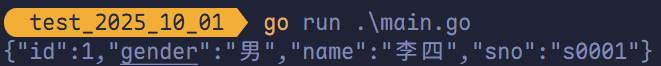
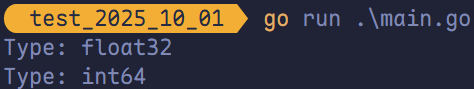
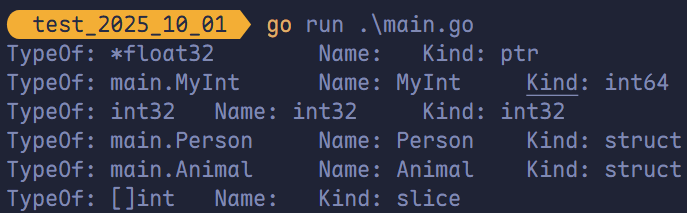
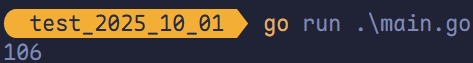
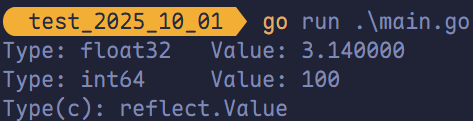
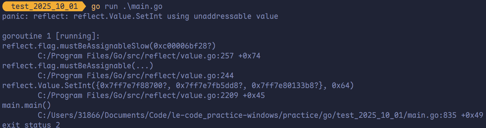
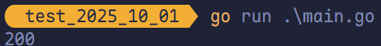
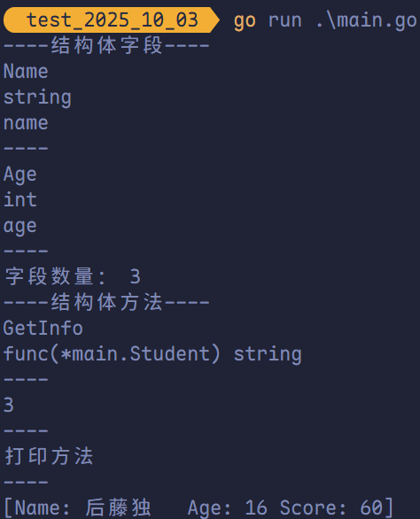
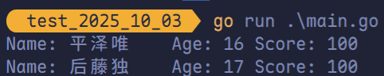

# 反射

## Intro

若需编写能统一处理各类值类型的函数，而这些类型既无法实现统一接口、内部结构未知，甚至在函数设计时还未定义，Go 的**反射（reflection）**机制就能解决这一问题。

空接口 `interface{}` 可存储任意类型的值，运行时要获取其具体类型和实际值，主要有两种方式：

1. **类型断言**：适用于已知可能类型为有限集合的场景。
2. **反射**：运行时动态获取变量的类型（`reflect.Type`）和值（`reflect.Value`）信息，适用于类型完全未知或泛化的场景。

反射的典型应用是**将结构体序列化为 JSON 字符串**。比如 `json` 包处理结构体字段时，会通过反射读取字段的 `json` 标签（如 `json:"name"`）来确定序列化后的键名，这一能力正是基于反射对类型和结构的动态解析实现的。

```go
package main

import (
	"fmt"

	json "github.com/json-iterator/go"
)

type Student struct {
	ID     int    `json:"id"`
	Gender string `json:"gender"`
	Name   string `json:"name"`
	Sno    string `json:"sno"`
}

func main() {
	s1 := Student{
		ID:     1,
		Gender: "男",
		Name:   "李四",
		Sno:    "s0001",
	}
	data, _ := json.Marshal(s1)
	jsonStr := string(data)
	fmt.Println(jsonStr)
}
```



ORM 框架中也使用了反射技术。

**ORM（对象关系映射，Object Relational Mapping）**：通过使用描述对象和数据库之间映射的元数据，将面向对象语言程序中的对象自动持久化到关系数据库中。

## 反射的基本介绍

反射是程序在**运行时**动态访问、修改自身结构与行为的能力。

常规程序编译后会丢弃源码符号信息，仅保留机器指令与内存地址，无法在运行时获取类型、字段等元数据；支持反射的语言（如 Go）会在编译器嵌入字段名、结构体定义等类型元数据，并提供运行时接口，支持程序查询信息、修改值或行为。

**核心功能**：

1. 获取变量的类型与底层种类（Kind）；
2. 解析结构体元数据，包括字段名、类型、方法集与结构体标签；
3. 满足可寻址、可导出条件时，动态修改变量值、调用关联方法。

**反射基础模型**：

Go 中所有变量在运行时包含两个核心部分：

- **类型信息（Type）**：编译期确定的静态元数据；
- **值信息（Value）**：运行时存储的动态数据。

Go 反射机制基于该模型实现。

空接口 `interface{}` 底层由**具体类型 + 具体值**组成。Go 内置 `reflect` 包提供标准反射能力：

- `reflect.Type`：表示类型元信息；
- `reflect.Value`：表示值的操作封装。

调用 `reflect.TypeOf` 和 `reflect.ValueOf` 两个核心函数，即可获取任意对象的类型与值的反射对象。

```go
v := reflect.ValueOf(x) // 获取值的反射对象
t := reflect.TypeOf(x)  // 获取类型的反射对象
```

> [!tip]
>
> `reflect.ValueOf` 与 `reflect.TypeOf` 的参数均为 `interface{}`。传入 `int`、结构体等具体类型值时，Go 会自动执行**装箱**操作，将值与对应的类型信息封装至空接口中。
>
> 该机制是反射能在运行时同时获取值与类型信息，实现对所有 Go 类型的统一处理，是 Go 反射系统的核心基础。

## `reflect.TypeOf` 获取任意值的类型对象

Go 中，`reflect.TypeOf` 接收任意 `interface{}` 参数，返回 `reflect.Type` 类型对象，用于访问值的类型信息。

```go
package main

import (
	"fmt"
	"reflect"
)

func reflectType(x any) {
	t := reflect.TypeOf(x)
	fmt.Printf("Type: %v\n", t)
}

func main() {
	var f float32 = 12.5
	reflectType(f)
	var i int64 = 100
	reflectType(i)
}
```



### `Name` 和 `Kind`

Go 反射系统中，`Type`（类型）与 `Kind`（种类）是两个核心不同的概念：

- `Type` 代表**具体类型**，包含 `type` 关键字定义的所有自定义类型；
- `Kind` 代表类型**底层基础类别**（如 `int`/`struct`/`ptr` 等），表征类型的本质。

Go 支持基于基础类型创建自定义类型，`Type` 可区分不同自定义类型，而 `Kind` 忽略名称差异，仅关注底层结构。

```go
type MyInt int
type MyStruct struct{ Name string }

var a MyInt
var b *MyStruct
```

- `reflect.TypeOf(a).Name()` 返回 `MyInt`，`Kind()` 返回 `reflect.Int`；
- `reflect.TypeOf(b).Name()` 返回空字符串（指针类型无命名），`Kind()` 返回 `reflect.Ptr`。

> [!tip]
>
> 输出为类型的字符串标识（如 `int`、`ptr`），对应类型的底层种类（Kind）。

复合类型（指针、切片、数组、`map`、`chan` 等）无显式类型名称，`Type.Name()` 通常返回空字符串，必须通过 `Kind()` 判断其基础类别。

反射中需明确二者的核心用途：

- `Type`：判断**具体类型**；
- `Kind`：判断**底层基础结构体**。

```go
package main

import (
	"fmt"
	"reflect"
)

func reflectType(x any) {
	t := reflect.TypeOf(x)
	fmt.Printf("TypeOf: %v\tName: %v\tKind: %v\n",
		t, t.Name(), t.Kind())
}

type MyInt int64

type Person struct {
	Name string
	Age  int
}

type Animal struct {
	Name string
}

func main() {
	var ptr *float32
	var mi MyInt
	var c rune
	var p = Person{
		Name: "平泽唯",
		Age:  17,
	}
	var a = Animal{"后藤一里"}
	var slice = []int{1, 2, 3, 4, 5}

	reflectType(ptr)
	reflectType(mi)
	reflectType(c)
	reflectType(p)
	reflectType(a)
	reflectType(slice)
}
```



> [!tip]
>
> 仅通过 `type` 关键字显式定义的类型为**命名类型（named type）**。
>
> 由基础类型直接组合构成（如 `*int`、`[]int`、`map[string]int`）且未显式命名的类型，属于**匿名类型（unnamed type）**，其 `reflect.Type.Name()` 会返回空字符串 `""`。

### 在 `reflect` 包中定义的 `Kind` 类型

```go
const (
	Invalid       Kind = iota // 非法类型（未初始化或无效）
	Bool                      // 布尔型（bool）
	Int                       // 有符号整型（平台相关，默认 int32/int64）
	Int8                      // 8位有符号整型（int8）
	Int16                     // 16位有符号整型（int16）
	Int32                     // 32位有符号整型（int32）
	Int64                     // 64位有符号整型（int64）
	Uint                      // 无符号整型（平台相关，默认 uint32:uint64）
	Uint8                     // 8位无符号整型（uint8 / byte）
	Uint16                    // 16位无符号整型（uint16）
	Uint32                    // 32位无符号整型（uint32）
	Uint64                    // 64位无符号整型（uint64）
	Uintptr                   // 指针大小的无符号整型（uintptr）
	Float32                   // 32位浮点型（float32）
	Float64                   // 64位浮点型（float64，Go 默认浮点）
	Complex64                 // 64位复数（两个 float32）
	Complex128                // 128位复数（两个 float64，Go 默认复数）
	Array                     // 数组类型（如 [5]int）
	Chan                      // 通道类型（如 chan int）
	Func                      // 函数类型（如 func(int) string）
	Interface                 // 接口类型（如 interface{}、error）
	Map                       // 映射类型（如 map[string]int）
	Pointer                   // 指针类型（如 *int、*struct）
	Slice                     // 切片类型（如 []string）
	String                    // 字符串类型（string）
	Struct                    // 结构体类型（如 struct{...} 或命名结构体）
	UnsafePointer             // 不安全指针（unsafe.Pointer）
)
```

## `reflect.ValueOf`

`reflect.ValueOf` 返回的是 `reflect.Value` 类型，其中包含了原始值的值信息。`reflect.Value` 与原始值之间可以互相转换。

`reflect.Value` 类型提供的获取原始值的方法如下：

|           方法            |                                         说明                                          |
| :-----------------------: | :-----------------------------------------------------------------------------------: |
| `Interface() interface{}` |             将值以 `interface{}` 类型返回，可以通过类型断言转换为指定类型             |
|       `Int() int64`       |                 将值以 `int` 类型返回，所有有符号整型均可以此方式返回                 |
|      `Uint() uint64`      |                将值以 `uint` 类型返回，所有无符号整型均可以此方式返回                 |
|     `Float() float64`     | 将值以双精度（`float64`）类型返回，所有浮点数（`float32`、`float64`）均可以此方式返回 |
|       `Bool() bool`       |                                将值以 `bool` 类型返回                                 |
|     `Bytes() []bytes`     |                           将值以字节数组 `[]bytes` 类型返回                           |
|     `String() string`     |                                 将值以字符串类型返回                                  |

```go
package main

import (
	"fmt"
	"reflect"
)

func reflectValue(x any) {
	v := reflect.ValueOf(x)
	c := v.Int() + 6
	fmt.Println(c)
}

func main() {
	var num int32 = 100
	reflectValue(num)
}
```



> [!tip]
>
> `.Int()` 方法支持所有有符号整数类型（`int`、`int8`、`int16`、`int32`、`int64`），它会自动将底层值转换为 `int64` 返回，而不会 `panic`。

```go
package main

import (
	"fmt"
	"reflect"
)

func reflectValue(x any) {
	v := reflect.ValueOf(x)
	k := v.Kind()
	switch k {
	case reflect.Int64:
		fmt.Printf("Type: int64\tValue: %d\n", v.Int())
	case reflect.Float32:
		fmt.Printf("Type: float32\tValue: %f\n", v.Float())
	case reflect.Float64:
		fmt.Printf("Type: float64\tValue: %f\n", v.Float())
	default:
		fmt.Println("Type: unknown")
	}
}

func main() {
	var a float32 = 3.14
	var b int64 = 100
	reflectValue(a)
	reflectValue(b)

	// 将 int 类型的原始值转换为 reflect.Value 类型
	c := reflect.ValueOf(10)
	fmt.Printf("Type(c): %T\n", c)
}
```



### 通过反射设置变量的值

`reflect.Value` 提供了一系列 `SetXXX` 方法，用于在运行时动态设置变量的值：

```go
func (v Value) SetBool(x bool)
func (v Value) SetInt(x int64)
func (v Value) SetUint(x uint64)
func (v Value) SetFloat(x float64)
func (v Value) SetComplex(x complex128)
func (v Value) SetBytes(x []byte)
func (v Value) SetString(x string)
func (v Value) SetPointer(x unsafe.Pointer)
func (v Value) SetCap(n int)
func (v Value) SetLen(n int)
func (v Value) SetMapIndex(key, val Value)
func (v Value) Set(x Value)
```

> [!tip]
>
> 调用 `SetXXX` 方法需满足两个核心条件：
>
> - 变量需**可寻址（addressable）**：即能通过 `&` 取地址（如传入指针、切片元素等）；
> - 若操作结构体字段 / 方法，需**可导出（exported）**：即标识符首字母大写。

**错误示例（不可寻址）**：

```go
x := 42
v := reflect.ValueOf(x)
// panic: reflect: reflect.Value.SetInt using unaddressable value
v.SetInt(100)
```

**正确示例（传入指针）**：

```go
x := 42
// .Elem() 获取指针指向的可寻址值
v := reflect.ValueOf(&x).Elem()
// 成功修改 x 的值
v.SetInt(100)
```

> [!tip]
>
> **`Elem()` 方法的作用**：
>
> - 当反射对象为**指针类型**时，通过 `Elem()` 完成解引用，获取指针指向的**可修改原始值**；
> - 操作结构体、切片等复合类型时，可结合 `Elem()`、`Field(i)`、`Index(i)` 等方法，获取**可寻址的子值**以进行修改。

```go
package main

import (
	"fmt"
	"reflect"
)

// 错误示例
func reflectSetValue(x any) {
	v := reflect.ValueOf(x)
	if v.Kind() == reflect.Int64 {
		// 修改的是副本，reflect 包会触发 panic。
		v.SetInt(200)
	}
}

// 正确示例
func reflectSetVal(x any) {
	v := reflect.ValueOf(x)
	// 反射中使用 Elem() 方法获取指针对于的值。
	if v.Elem().Kind() == reflect.Int64 {
		v.Elem().SetInt(200)
	}
}

func main() {
	var a int64 = 100
	// reflectSetValue(a)
	reflectSetVal(&a)
	fmt.Println(a)
}
```



## 结构体反射

### 与结构体相关的方法

通过 `reflect.TypeOf()` 获取任意值的反射类型对象后，若该对象的底层结构为结构体，可调用 `reflect.Type` 的 `NumField`、`Field` 等方法，获取结构体字段的详细信息。

| 方法                                                         | 说明                                           |
| ------------------------------------------------------------ | ---------------------------------------------- |
| `Field(i int) StructField`                                   | 根据索引，返回对应结构体字段的信息             |
| `NumField() int`                                             | 返回结构体的字段总数                           |
| `FieldByName(name string) (StructField, bool)`               | 根据字段名返回对应字段信息（返回值含是否找到） |
| `FieldByIndex(index []int) StructField`                      | 用于嵌套结构体，按层级索引获取字段信息         |
| `FieldByNameFunc(match func(string) bool) (StructField, bool)` | 根据自定义匹配函数查找符合条件的字段           |
| `NumMethod() int`                                            | 返回类型所拥有的方法数量                       |
| `Method(i int) Method`                                       | 返回第 i 个方法的信息                          |
| `MethodByName(name string) (Method, bool)`                   | 根据方法名查找对应方法（返回值含是否找到）     |

### `StructField` 类型

`StructField` 类型用来描述结构体中的一个字段的信息。`StructField` 的定义如下：

```go
// A StructField describes a single field in a struct.
type StructField struct {
	// Name is the field name.
	Name string

	// PkgPath is the package path that qualifies a lower case (unexported)
	// field name. It is empty for upper case (exported) field names.
	// See https://golang.org/ref/spec#Uniqueness_of_identifiers
	PkgPath string

	Type      Type      // field type
	Tag       StructTag // field tag string
	Offset    uintptr   // offset within struct, in bytes
	Index     []int     // index sequence for Type.FieldByIndex
	Anonymous bool      // is an embedded field
}
```

### 结构体反射示例

通过反射获取结构体类型对象后，可按字段索引遍历全部字段信息，也可通过字段名获取指定字段信息。

#### 获取结构体属性以及获取执行结构体方法

```go
package main

import (
	"fmt"
	"reflect"
)

// Student 结构体
type Student struct {
	Name  string `json:"name"`
	Age   int    `json:"age"`
	Score int    `json:"score"`
}

// 获取 Student 结构体信息
func (s Student) GetInfo() string {
	return fmt.Sprintf(
		"Name: %v\tAge: %v\tScore: %v",
		s.Name, s.Age, s.Score,
	)
}

// 设置 Student 结构体信息
func (s *Student) SetInfo(name string, age, score int) {
	s.Name = name
	s.Age = age
	s.Score = score
}

func (s *Student) Print() {
	fmt.Println("打印方法")
}

// 字段
func PrintStructField(s any) {
	fmt.Println("----结构体字段----")
	t := reflect.TypeOf(s)

	if (t.Kind() != reflect.Struct) &&
		(t.Elem().Kind() != reflect.Struct) {
		fmt.Println("传入的不是结构体")
		return
	}

	field0 := t.Field(0)
	fmt.Println(field0.Name)
	fmt.Println(field0.Type)
	fmt.Println(field0.Tag.Get("json"))
	fmt.Println("----")

	field1, ok := t.FieldByName("Age")
	if ok {
		fmt.Println(field1.Name)
		fmt.Println(field1.Type)
		fmt.Println(field1.Tag.Get("json"))
		fmt.Println("----")
	}

	fmt.Println("字段数量：", t.NumField())
}

// 方法
func PrintStructFunc(s any) {
	fmt.Println("----结构体方法----")
	t := reflect.TypeOf(s)
	v := reflect.ValueOf(s)

	if (t.Kind() != reflect.Struct) &&
		(t.Elem().Kind() != reflect.Struct) {
		fmt.Println("传入的不是结构体")
		return
	}

	method0 := t.Method(0)
	fmt.Println(method0.Name)
	fmt.Println(method0.Type)
	fmt.Println("----")

	fmt.Println(t.NumMethod())
	fmt.Println("----")

	v.MethodByName("Print").Call(nil)
	fmt.Println("----")

	v.MethodByName("SetInfo").Call([]reflect.Value{
		reflect.ValueOf("后藤独"),
		reflect.ValueOf(16),
		reflect.ValueOf(60),
	})
	fmt.Println(v.MethodByName("GetInfo").Call(nil))
}

func main() {
	stu := Student{
		Name:  "平泽唯",
		Age:   16,
		Score: 100,
	}
	PrintStructField(stu)
	PrintStructFunc(&stu)
}
```



> [!tip]
>
> `PrintStructFunc` 支持接收结构体指针 `&stu`；`PrintStructField` 无法直接用指针访问字段，原因是反射的 `Type.Field()` 仅支持 `struct` 类型，指针类型需通过 `.Elem()` 解引用后才能操作。
>
> 指针类型 `*Student` 的方法集包办**值接收者 + 指针接收者**的全部方法；值类型 `Student` 仅包含**值类型接收者**方法。因此指针可调用 `GetInfo`、`SetInfo` 等所有方法。

#### 修改结构体方法

```go
package main

import (
	"fmt"
	"reflect"
)

// Student 结构体
type Student struct {
	Name  string `json:"name"`
	Age   int    `json:"age"`
	Score int    `json:"score"`
}

// 获取 Student 结构体信息
func (s Student) GetInfo() string {
	return fmt.Sprintf(
		"Name: %v\tAge: %v\tScore: %v",
		s.Name, s.Age, s.Score,
	)
}

// 反射修改结构体属性
func reflectChangeStruct(s any) {
	t := reflect.TypeOf(s)
	v := reflect.ValueOf(s)

	if t.Elem().Kind() != reflect.Struct {
		fmt.Println("传入的不是结构体指针类型")
		return
	}

	name := v.Elem().FieldByName("Name")
	name.SetString("后藤独")

	age := v.Elem().FieldByName("Age")
	age.SetInt(17)
}

func main() {
	stu := Student{
		Name:  "平泽唯",
		Age:   16,
		Score: 100,
	}
	fmt.Println(stu.GetInfo())
	reflectChangeStruct(&stu)
	fmt.Println(stu.GetInfo())
}
```



> [!tip]
>
> Go 反射中，`v.Elem().FieldByName("Name")` 得到的 `name`（`reflect.Value` 类型）因源自指针 `&stu` 的解引用，内部持有原始结构体字段的内存地址，因此具备可设置性（settable）；导出字段可通过 `SetString` 等方法直接修改原始变量值，这是反射对真实内存的引用式封装，而非值拷贝。

## 慎用反射

反射是实现代码灵活性的强大工具，但需避免滥用，原因有二：

1. 反射代码的类型错误仅在运行时触发 `panic`，易导致线上故障，且问题暴露滞后。
2. 大量使用反射会显著降低代码的可读性与可维护性。