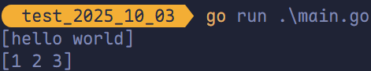
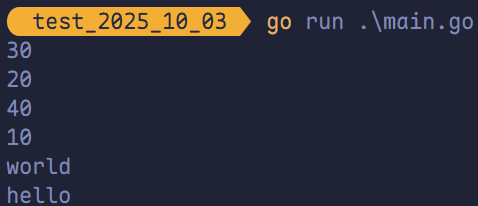
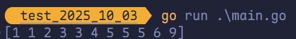
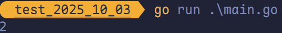
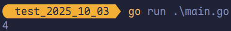

# 泛型

Go 在 Go 1.18 版本中，正式引入了泛型，成为 Go 语言中的一个重要特性。

## 概述

### 泛型的定义

**泛型（Generics）**是一种编程思想，它允许在编写代码时使用未知的类型。

泛型可以增加代码的灵活性以及可复用性，同时还可以提高代码的安全性和可读性。泛型在 C++、Java 和 Python 等语言中已经被广泛应用，但在 Go 中一直未被支持。

### Go 泛型的背景

在 Go 语言中，由于缺乏泛型，开发者需要为每种类型都便携一个相应版本，这就导致了代码冗余和维护成本的提高。同时，也使得一些常见的算法及数据结构无法实现。因此，Go 社区一直在呼吁加入泛型特性。

经过多年的等待及探索，Go 1.18 版本终于加入了泛型特性。

### Go 泛型的特点

- **基于类型约束的泛型**：Go 泛型通过类型约束来实现泛型，这意味着泛型函数或类型可以接受特定的类型。
- **编译时类型安全**：Go 泛型通过编译时类型检查来保证类型安全，有助于避免运行时错误。
- **支持多种类型**：Go 泛型支持多种类型，包括基本类型和自定义类型。

## 语法

在 Golang 中，泛型语法包括**类型参数**、**类型约束**、**泛型函数**和**泛型类型**等。

### 泛型函数

```go
func FuncName[T Type](params) returnType {
  // Function body
}
```

- `T`：泛型类型参数
- `Type`：具体的类型
- `params`：函数的参数
- `returnType`：函数的返回值类型

```go
package main

import "fmt"

func toSlice[T any](args ...T) []T {
	return args
}

func main() {
	strings := toSlice("hello", "world")
	nums := toSlice(1, 2, 3)
	fmt.Println(strings)
	fmt.Println(nums)
}
```



### 泛型类型

除了泛型函数外，Go 1.18 版本还引入了泛型类型。泛型类型的语法如下：

```go
type TypeName[T Type] struct {
  // Fields
}
```

- `TypeName`：泛型类型名称
- `T`：泛型类型参数
- `Type`：具体的类型

以一个可以存储任意类型数据的泛型栈类型示例：

```go
package main

import "fmt"

type Stack[T any] struct {
	data []T
}

func (s *Stack[T]) Push(x T) {
	s.data = append(s.data, x)
}

func (s *Stack[T]) Pop() T {
	n := len(s.data)
	x := s.data[n-1]
	s.data = s.data[:n-1]
	return x
}

func main() {
	var s Stack[int]
	s.Push(10)
	s.Push(20)
	s.Push(30)
	fmt.Println(s.Pop())
	fmt.Println(s.Pop())
	s.Push(40)
	fmt.Println(s.Pop())
	fmt.Println(s.Pop())

	var strStack Stack[string]
	strStack.Push("hello")
	strStack.Push("world")
	fmt.Println(strStack.Pop())
	fmt.Println(strStack.Pop())
}
```



### 泛型约束

使用泛型时，需要对泛型类型进行一定的约束。例如，我们希望某个泛型函数或类型只能接受特定类型的参数，或者特定类型的参数必须实现某个接口。

在 Go 中，可以使用泛型约束来实现这些需求。

#### 类型约束

类型约束可以让泛型函数或类型只接受特定类型的参数。在 Go 中，类型约束通过**接口**来定义。

例如，下面是一个泛型函数，其可接受实现了 `fmt.Stringer` 接口的类型：

```go
func Print[T fmt.Stringer](x T) {
  fmt.Println(x.String())
}
```

这里，`T` 被约束为“任何实现了 `fmt.Stringer` 接口的类型”。由于 `fmt.Stringer` 定义了 `String() string` 方法，因此在函数体内可以安全地调用 `x.String()`。只有满足该约束的类型（即拥有 `String() string` 方法的类型）才能作为 `T` 的实参传入，否则会在编译时报错。

> [!tip]
>
> Go 的接口是隐式实现的，只要类型定义了所需方法，就自动满足约束，无需显式声明。

#### 约束语法

类型约束通过在类型参数后指定一个接口类型来实现。

例如，下面的泛型函数使用 `fmt.Stringer` 和 `io.Reader` 作为类型约束：

```go
func Print[T, fmt.Stringer, U io.Reader](x T, y U) {
  fmt.Println(x.String())
  _, _ = io.Copy(os.Stdout, y)
}
```

在上述例子中，`T` 被约束为“任何实现了 `fmt.Stringer` 接口的类型”，`U` 被约束为“任何实现了 `io.Reader` 接口的类型”。

函数接收两个参数 `x` 和 `y`，并分别调用它们的 `String()` 方法和 `Read()` 方法（通过 `io.Copy`）来输出字符串表示和读取数据。只有满足对应接口约束的类型才能作为实参传入，否则会在编译时报错。

#### 接口约束

```go
type MyType[T fmt.Stringer] struct {
  data T
}

func (m *MyType[T]) String() string {
  return m.data.String()
}
```

在此例中，`T` 被约束为“任何实现了 `fmt.Stringer` 接口的类型”。由于 `fmt.Stringer` 要求类型提供 `String() string` 方法，因此在 `MyType[T]` 的方法中可以安全地调用 `m.data.String()`。只有满足该接口约束的类型才能作为 `T` 的实参，否则会在编译时报错。

### 泛型特化

泛型特化是指将泛型代码转换为具体类型的代码。在 Go 中，泛型特化是在编译期间完成的。特化可以提高代码的性能和运行效率，因此编译器可以针对具体类型进行优化，避免了运行时的类型检查和类型转换。

在 Go 中，泛型特化是通过代码生成器实现的。代码生成器会根据泛型类型或函数的定义，生成具体类型或函数的代码。例如，下面是一个泛型函数的定义：

```go
func Swap[T any](a, b *T) {
  *a, *b = *b, *a
}
```

该函数可以交换任意类型的两个变量的值。在编译期间，代码生成器会根据调用该函数时传递的参数类型生成具体的函数代码。例如，如果传递的是整数类型的指针，代码生成器会生成以下代码：

```go
func Swap_int(a, b *int) {
  *a, *b = *b, *a
}
```

同理，字符串类型的指针有：

```go
func Swap_string(a, b *string) {
  *a, *b = *b, *a
}
```

### 泛型接口

泛型接口是一种可处理多种类型数据的接口。在 Golang 中，可以使用类型参数来实现泛型接口。

例如：

```go
type Container[T any] interface {
  Len() int
  Add(T)
  Remove() T
}
```

上述代码中，`Container` 接口使用类型参数 `T` 来表示可存储的元素类型。该接口包含三个方法，分别用于返回元素个数、添加元素和移除元素。

#### 泛型接口约束

泛型接口约束用于限制实现泛型接口的类型的范围，确保泛型代码只能用于满足特定条件的类型。在 Golang 中，泛型接口约束使用接口来定义。

例如：

```go
type Stringer interface {
  String() string
}

type Container[T Stringer] interface {
  Len() int
  Add(T)
  Remove() T
}
```

上述代码中，`Container` 接口被限制为只能存储实现了 `Stringer` 接口的类型。

## 常用场景

Golang 泛型可用于各种数据结构算法，例如排序、搜索、映射等。

### 排序

在 Go 1.21 及更高版本中，标准库提供了对泛型排序的原生支持。可以借助 `slices.Sort` 和 `cmp.Ordered` 约束，编写类型安全的泛型排序函数。

```go
package main

import (
	"cmp"
	"fmt"
	"slices"
)

func Sort[T cmp.Ordered](s []T) {
	slices.Sort(s)
}

func main() {
	numbers := []int{3, 1, 4, 1, 5, 9, 2, 6, 5, 3, 5}
	Sort(numbers)
	fmt.Println(numbers)
}
```



`cmp.Ordered` 是 Go 1.21 引入的标准约束，它表示所有支持 `<`、`<=`、`>`、`>=` 等有序比较操作的类型，包括：

- 所有整数类型（如 `int`、`uint8` 等）
- 浮点类型（`float32`、`float64`）
- 字符串（`string`）

与 `comparable` 不同，`comparable` 仅保证支持 `==` 和 `!=`，不可用于排序；而 `cmp.Ordered` 明确要求类型可比较大小，因此适用于排序场景。

> [!tip]
>
> 可以直接使用标准库中的 `slices.Sort`，它已原生支持泛型，类型安全且性能更优；此处仅出于教学目的，演示如何封装泛型排序函数。

### 搜索

与排序类似，`slices` 包中也有 `BinarySearch` 函数（其为泛型函数）可以使用：

```go
package main

import (
	"fmt"
	"slices"
)

func main() {
	nums := []int{1, 2, 3, 3, 3, 4, 5, 6}
	x := 3
	index, ok := slices.BinarySearch(nums, x)
	if ok {
		fmt.Println(index)
	}
}
```



也可以使用 `BinarySearchFunc` 自定义比较函数，以降序排序的切片为例：

```go
package main

import (
	"cmp"
	"fmt"
	"slices"
)

func main() {
	nums := []int{6, 5, 4, 4, 3, 3, 3, 2, 1}
	x := 3
	index, ok := slices.BinarySearchFunc(nums, x, func(a, b int) int { return cmp.Compare(b, a) })
	if ok {
		fmt.Println(index)
	}
}
```



## 总结

Go 1.18 引入泛型后，代码在保持类型安全的同时具备更强的复用能力，合理使用泛型可提升程序的通用性与可维护性。

### 基本原则

- **使用明确的类型约束**：优先使用 `comparable`、`~T` 或接口约束，避免裸用 `any`，以确保类型安全和语义清晰。
- **接口约束应尽量小**：只包含必要方法，降低耦合，提高适用范围。
- **注意初始化与操作合法性**：泛型变量在使用前需正确初始化，避免因类型不匹配导致运行时错误。
- **遵循 Go 惯例**：包括命名规范、错误处理方式和代码组织结构，保持与社区风格一致。

### 注意事项

- **避免过多类型参数**：类型参数数量应尽量少，否则会显著降低函数签名的可读性。
- **禁止递归泛型定义**：类型不能直接或间接地包含自身作为泛型实例，否则会导致编译错误。
- **警惕过度抽象**：泛型适用于有明确复用场景的逻辑，不应为“通用”而牺牲可读性或引入不必要的复杂性。

泛型是工具，不是目标。其价值在于在保证安全和性能的前提下减少重复代码，而非追求形式上的“通用”。合理权衡，方能发挥其真正作用。
