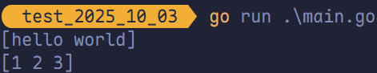
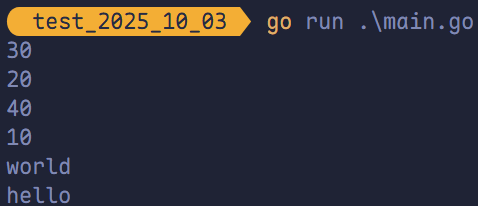
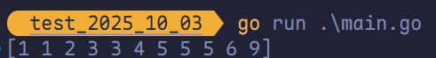
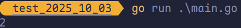
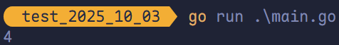

# 泛型

Go 在 Go 1.18 版本中，正式引入了泛型，成为 Go 语言中的一个重要特性。

## 概述

### 泛型的定义

**泛型（Generics）**是一种编程思想，它允许在编写代码时使用未知的类型。

泛型可以增加代码的灵活性以及可复用性，同时还可以提高代码的安全性和可读性。泛型在 C++、Java 和 Python 等语言中已经被广泛应用，但在 Go 中一直未被支持。

### 泛型的背景

在 Go 语言中，由于缺乏泛型，开发者需要为每种类型都编写一个相应版本，这就导致了代码冗余和维护成本的提高。同时，也使得一些常见的算法及数据结构无法实现。因此，Go 社区一直在呼吁加入泛型特性。

经过多年的等待及探索，Go 1.18 版本终于加入了泛型特性。

### 泛型的特点

- **基于类型约束的泛型**：Go 泛型通过类型约束来实现泛型，这意味着泛型函数或类型可以接受特定的类型。
- **编译时类型安全**：Go 泛型通过编译时类型检查来保证类型安全，有助于避免运行时错误。
- **支持多种类型**：Go 泛型支持多种类型，包括基本类型和自定义类型。

## 语法

在 Golang 中，泛型基础语法主要包括**泛型函数**、**泛型类型**和**泛型接口**等。

### 泛型函数

```go
func FuncName[T Type](params) returnType {
  // Function body
}
```

- `T`：泛型类型参数
- `Type`：具体的类型
- `params`：函数的参数
- `returnType`：函数的返回值类型

```go
package main

import "fmt"

func toSlice[T any](args ...T) []T {
	return args
}

func main() {
	strings := toSlice("hello", "world")
	nums := toSlice(1, 2, 3)
	fmt.Println(strings)
	fmt.Println(nums)
}
```



### 泛型类型

除了泛型函数外，Go 1.18 版本还引入了泛型类型。泛型类型的语法如下：

```go
type TypeName[T Type] struct {
  // Fields
}
```

- `TypeName`：泛型类型名称
- `T`：泛型类型参数
- `Type`：具体的类型

以一个可以存储任意类型数据的泛型栈类型示例：

```go
package main

import "fmt"

type Stack[T any] struct {
	data []T
}

func (s *Stack[T]) Push(x T) {
	s.data = append(s.data, x)
}

func (s *Stack[T]) Pop() T {
	n := len(s.data)
	x := s.data[n-1]
	s.data = s.data[:n-1]
	return x
}

func main() {
	var s Stack[int]
	s.Push(10)
	s.Push(20)
	s.Push(30)
	fmt.Println(s.Pop())
	fmt.Println(s.Pop())
	s.Push(40)
	fmt.Println(s.Pop())
	fmt.Println(s.Pop())

	var s2 Stack[string]
	s2.Push("hello")
	s2.Push("world")
	fmt.Println(s2.Pop())
	fmt.Println(s2.Pop())
}
```



> [!tip]
>
> 1. 泛型类型的方法为普通方法，其中的 `T` 仅复用泛型类型定义时的类型参数；若要为泛型类型定义泛型方法，改用 `U` 等其他字母作为新的类型参数即可。
> 2. 泛型类型不仅可基于结构体定义，也能基于 `slice`、`map`、`chan` 等类型定义。

### 泛型接口

**泛型接口**是支持处理多种类型数据的接口，Go 语言通过**类型参数**实现泛型接口。

示例如下：

```go
type Container[T any] interface {
  Len() int
  Add(T)
  Remove() T
}
```

代码中的 `Container` 为泛型接口，通过类型参数 `T` 定义可存储的**元素类型**，并包含三个核心方法：分别实现元素计数、添加元素、移除元素的功能。

## 泛型约束

**泛型**使用需对**类型施加约束**，例如限制泛型函数 / 类型仅接收特定参数类型，或要求参数实现**指定接口**。

Go 语言通过**泛型约束**实现该需求。

### 约束语法

**类型约束**通过在类型参数后指定**接口类型**实现。

如下泛型函数，以 `fmt.Stringer` 和 `io.Reader` 作为**类型约束**：

```go
func Print[T fmt.Stringer, U io.Reader](x T, y U) {
	fmt.Println(x.String())
	io.Copy(os.Stdout, y)
}
```

上例中，**`T`** 被约束为实现 `fmt.Stringer` 接口的类型，**`U`** 被约束为实现 `io.Reader` 接口的类型。

函数接收参数 `x`、`y`，可调用 `x.String()` 与 `y.Read()`（通过 `io.Copy`）完成字符串输出和数据读取。

仅满足对应**接口约束**的类型可作为实参传入，否则**编译报错**。

### 基于接口的类型约束

**类型约束**用于限定泛型函数 / 类型 / 接口仅接收**特定类型**参数。在 Go 中，**类型约束**主要是通过**接口**定义的。

如下泛型结构体示例，仅支持实现 `fmt.Stringer` 接口的类型：

```go
type MyType[T fmt.Stringer] struct {
  data T
}

func (m *MyType[T]) String() string {
  return m.data.String()
}
```

本例中，**`T`** 被约束为实现 `fmt.Stringer` 接口的类型。

`fmt.Stringer` 定义了 `String() string` 方法，因此 `MyType[T]` 的方法中或函数内可**安全调用 `m.data.String()`**。

仅满足该接口约束的类型能作为 **`T`** 的实参，否则**编译报错**。

> [!tip]
>
> 1. Go 的接口是隐式实现的，只要类型定义了所需方法，就自动满足约束，无需显式声明。
> 2. 在类型约束的类型前加 `~` 标识，代表该类型**及其底层类型**均需满足约束条件。

泛型接口约束也同样适用，用于限制实现泛型接口的类型的范围。例如：

```go
type Stringer interface {
  String() string
}

// Container 接口被限制为只能存储实现了 Stringer 接口的类型
type Container[T Stringer] interface {
  Len() int
  Add(T)
  Remove() T
}
```

## 泛型特化（编译期机制）

泛型特化是将**泛型代码**实例化为**具体类型代码**的过程，Go 的泛型特化在**编译器**完成。编译器会针对具体类型优化代码，消除**运行时的类型检查与转换**，进而提升代码**性能和运行效率**。

Go 的泛型特化由编译器的**代码生成器**实现，它会根据**泛型类型或函数**的定义，生成对应**具体类型**的代码。例如，以下是一个泛型函数的定义：

```go
func Swap[T any](a, b *T) {
  *a, *b = *b, *a
}
```

该**泛型交换函数**可交换任意类型的两个变量值。**编译期**内，代码生成器会根据传入的参数类型，生成对应**具体类型**的函数代码。例如传入整型指针时，将生成如下代码：

```go
func Swap_int(a, b *int) {
  *a, *b = *b, *a
}
```

同理，字符串类型的指针有：

```go
func Swap_string(a, b *string) {
  *a, *b = *b, *a
}
```

## 常用场景

Golang 泛型可用于各种数据结构算法，例如排序、搜索、映射等。

### 排序

在 Go 1.21 及更高版本中，标准库提供了对泛型排序的原生支持。可以借助 `slices.Sort` 和 `cmp.Ordered` 约束，编写类型安全的泛型排序函数。

```go
package main

import (
	"cmp"
	"fmt"
	"slices"
)

func Sort[T cmp.Ordered](s []T) {
	slices.Sort(s)
}

func main() {
	numbers := []int{3, 1, 4, 1, 5, 9, 2, 6, 5, 3, 5}
	Sort(numbers)
	fmt.Println(numbers)
}
```



`cmp.Ordered` 是 Go 1.21 引入的标准约束，它表示所有支持 `<`、`<=`、`>`、`>=` 等有序比较操作的类型，包括：

- 所有整数类型（如 `int`、`uint8` 等）
- 浮点类型（`float32`、`float64`）
- 字符串（`string`）

与 `comparable` 不同，`comparable` 仅保证支持 `==` 和 `!=`，不可用于排序；而 `cmp.Ordered` 明确要求类型可比较大小，因此适用于排序场景。

> [!tip]
>
> 可以直接使用标准库中的 `slices.Sort`，它已原生支持泛型，类型安全且性能更优；此处仅出于教学目的，演示如何封装泛型排序函数。

### 搜索

与排序类似，`slices` 包中也有 `BinarySearch` 函数（其为泛型函数）可以使用：

```go
package main

import (
	"fmt"
	"slices"
)

func main() {
	nums := []int{1, 2, 3, 3, 3, 4, 5, 6}
	x := 3
	index, ok := slices.BinarySearch(nums, x)
	if ok {
		fmt.Println(index)
	}
}
```



也可以使用 `BinarySearchFunc` 自定义比较函数，以降序排序的切片为例：

```go
package main

import (
	"cmp"
	"fmt"
	"slices"
)

func main() {
	nums := []int{6, 5, 4, 4, 3, 3, 3, 2, 1}
	x := 3
	index, ok := slices.BinarySearchFunc(nums, x, func(a, b int) int { return cmp.Compare(b, a) })
	if ok {
		fmt.Println(index)
	}
}
```



## 总结

Go 1.18 引入泛型后，代码在保持类型安全的同时具备更强的复用能力，合理使用泛型可提升程序的通用性与可维护性。

### 基本原则

- **使用明确的类型约束**：优先使用 `comparable`、`~T` 或接口约束，避免裸用 `any`，以确保类型安全和语义清晰。
- **接口约束应尽量小**：只包含必要方法，降低耦合，提高适用范围。
- **注意初始化与操作合法性**：泛型变量在使用前需正确初始化，避免因类型不匹配导致运行时错误。
- **遵循 Go 惯例**：包括命名规范、错误处理方式和代码组织结构，保持与社区风格一致。

### 注意事项

- **避免过多类型参数**：类型参数数量应尽量少，否则会显著降低函数签名的可读性。
- **禁止递归泛型定义**：类型不能直接或间接地包含自身作为泛型实例，否则会导致编译错误。
- **警惕过度抽象**：泛型适用于有明确复用场景的逻辑，不应为“通用”而牺牲可读性或引入不必要的复杂性。

泛型是工具，不是目标。其价值在于在保证安全和性能的前提下减少重复代码，而非追求形式上的“通用”。合理权衡，方能发挥其真正作用。

