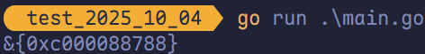
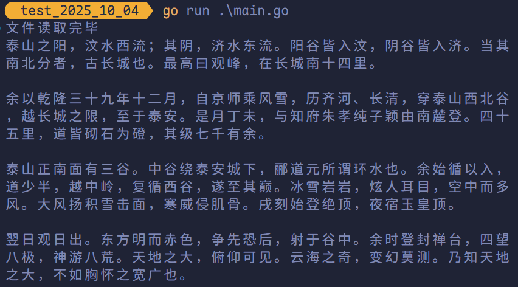
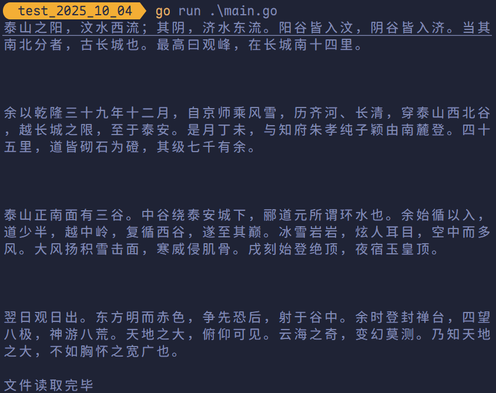
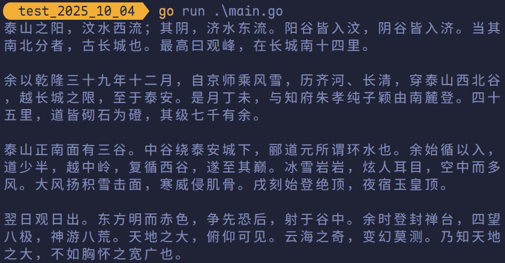
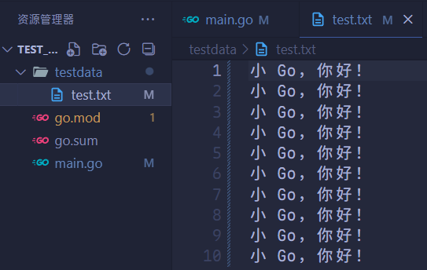
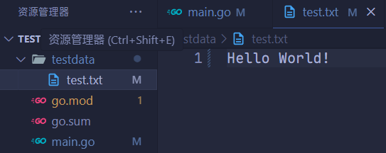
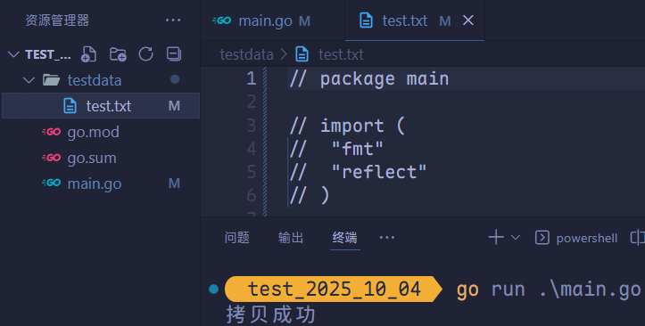
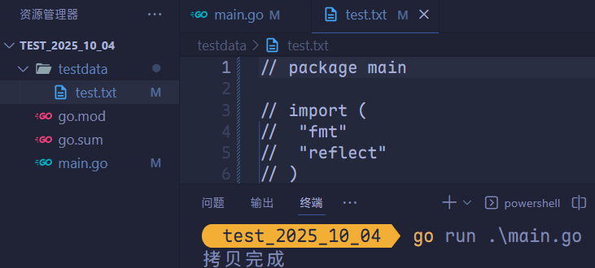
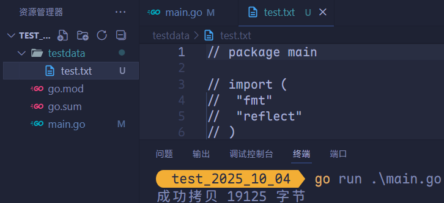
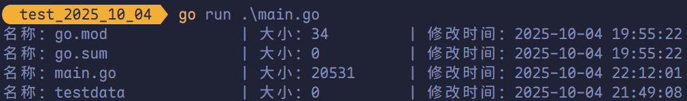

# 文件操作

## 打开与关闭文件

`os.Open` 函数可打开一个文件，返回一个 `*File` 和一个 `err`。操作文件对象完成后，一定要关闭文件。

```go
package main

import (
	"fmt"
	"os"
)

func main() {
	file, err := os.Open("./testdata/test.txt")
	if err != nil {
		fmt.Println(err)
		return
	}
	defer file.Close()
	fmt.Println(file)
}
```



为了防止忘记关闭文件，通常使用 `defer` 注册文件关闭语句。

## `file.Read` 读取文件

```go
func (f *File) Read(b []byte) (n int, err error)
```

接受一个字节切片，返回读取的字节数和可能的具体错误，读到文件末尾时会返回 0 和 `io.EOF`。

```go
package main

import (
	"fmt"
	"io"
	"os"
)

func main() {
	file, err := os.Open("./testdata/test.txt")
	if err != nil {
		fmt.Println(err)
		return
	}
	defer file.Close()
	byteSlice := make([]byte, 128)
	n, err := file.Read(byteSlice)
	if err == io.EOF {
		fmt.Println("文件读取完毕")
		return
	}
	if err != nil {
		fmt.Println(err)
		return
	}
	fmt.Printf("读取了 %d 字节数据\n", n)
	fmt.Println(string(byteSlice[:n]))
}
```


## 循环读取

使用 `for` 循环读取文件中的所有数据。

```go
package main

import (
	"fmt"
	"io"
	"os"
)

func main() {
	file, err := os.Open("./testdata/test.txt")
	if err != nil {
		fmt.Println(err)
		return
	}
	defer file.Close()
	var content []byte
	var byteSlice = make([]byte, 128)
	for {
		n, err := file.Read(byteSlice)
		if err == io.EOF {
			fmt.Println("文件读取完毕")
			break
		}
		if err != nil {
			fmt.Println(err)
			return
		}
		content = append(content, byteSlice[:n]...)
	}
	fmt.Println(string(content))
}
```



> [!tip]
>
> 在判断 `err == io.EOF` 之前将 `str` 追加到 `fileStr`，是为了确保文件末尾无换行符时，最后一行内容仍能被正确读取。

## `bufio` 读取文件

`bufio` 是在 `file` 的基础上封装了一层 API，支持更多的功能。

```go
package main

import (
	"bufio"
	"fmt"
	"io"
	"os"
)

func main() {
	file, err := os.Open("./testdata/test.txt")
	if err != nil {
		fmt.Println(err)
		return
	}
	defer file.Close()
	reader := bufio.NewReader(file)
	fileStr := ""
	for {
		line, err := reader.ReadString('\n')
		fileStr += line
		if err == io.EOF {
			fmt.Println("文件读取完毕")
			break
		}
		if err != nil {
			fmt.Println(err)
			return
		}
	}
	fmt.Println(fileStr)
}
```



## `ReadFile` 读取整个文件

`os` 包的 `ReadFile` 方法能够读取完整个文件，只需要将文件名作为参数传入。

```go
package main

import (
	"fmt"
	"os"
)

func main() {
	content, err := os.ReadFile("./testdata/test.txt")
	if err != nil {
		fmt.Println(err)
		return
	}
	fmt.Println(string(content))
}
```



## 文件写入操作

`os.OpenFile` 函数能够以指定模式打开文件，从而实现文件写入相关功能。

```go
func OpenFile(name string, flag int, perm FileMode) (*File, error)
```

**`name`**：要打开或创建的文件路径（字符串）。

**`flag`**：文件打开模式，由 `os` 包中定义的常量指定。常用标志如下：

| 标志（FLAG）  | 含义说明                                |
| ------------- | --------------------------------------- |
| `os.O_RDONLY` | 以**只读**方式打开文件                  |
| `os.O_WRONLY` | 以**只写**方式打开文件                  |
| `os.O_RDWR`   | 以**读写**方式打开文件                  |
| `os.O_CREATE` | 若文件不存在，则**创建**新文件          |
| `os.O_TRUNC`  | 打开时**清空**文件内容（截断为 0 字节） |
| `os.O_APPEND` | 写入时**追加**到文件末尾                |

> [!tip]
>
> 多个标志可通过按位或（`|`）组合使用，例如：`os.O_WRONLY | os.O_CREATE | os.O_TRUNC` 。

**`perm`**：文件权限（仅在创建新文件时生效），通常以**八进制字面量**表示，如 `0o644`。权限位含义遵循 Unix 风格：

- `r`（读） = 4
- `w`（写） = 2
- `x`（执行）= 1

例如：`0o644` 表示所有者可读写，组用户和其他用户只读。

> [!TIP]
>
> `os.Open` 是 `os.OpenFile` 的简单封装。

### `Write` 和 `WriteString`

```go
package main

import (
	"fmt"
	"os"
)

func main() {
	file, err := os.OpenFile("./testdata/test.txt", os.O_CREATE|os.O_RDWR, 0o644)
	if err != nil {
		fmt.Println(err)
		return
	}
	defer file.Close()
	str := "小 Go，你好！"
	file.Write([]byte(str))
	file.WriteString("写入数据")
}
```


### `bufio.NewWriter`

```go
package main

import (
	"bufio"
	"fmt"
	"os"
)

func main() {
	file, err := os.OpenFile("./testdata/test.txt", os.O_CREATE|os.O_TRUNC|os.O_WRONLY, 0o644)
	if err != nil {
		fmt.Println(err)
		return
	}
	defer file.Close()
	writer := bufio.NewWriter(file)
	for range 10 {
		writer.WriteString("小 Go，你好！\n")
	}
	writer.Flush()
}
```



> [!tip]
>
> `WriteString` 先将数据写入缓存，然后需要 `Flush` 进行缓存区刷新，将数据写入文件中。

### `os.WriteFile`

```go
package main

import (
	"fmt"
	"os"
)

func main() {
	str := "Hello World!"
	err := os.WriteFile("./testdata/test.txt", []byte(str), 0o644)
	if err != nil {
		fmt.Println(err)
		return
	}
}
```



## 复制文件

### `os.ReadFile` 与 `os.WriteFile`

```go
package main

import (
	"fmt"
	"os"
)

func CopyFile(dst, src string) error {
	file, err := os.ReadFile(src)
	if err != nil {
		return err
	}
	err = os.WriteFile(dst, file, 0o644)
	if err != nil {
		return err
	}
	return nil
}

func main() {
	err := CopyFile("./testdata/test.txt", "./main.go")
	if err != nil {
		fmt.Printf("拷贝失败：%v\n", err)
	} else {
		fmt.Printf("拷贝成功")
	}
}
```



### 以流的方式复制

```go
package main

import (
	"fmt"
	"io"
	"os"
)

func CopyFile(src, dst string) error {
	srcFile, err := os.Open(src)
	if err != nil {
		return err
	}
	defer srcFile.Close()
	dstFile, err := os.OpenFile(dst,
		os.O_CREATE|os.O_WRONLY|os.O_TRUNC, 0o644)
	if err != nil {
		return err
	}
	defer dstFile.Close()

	buf := make([]byte, 32*1024)
	for {
		n, err := srcFile.Read(buf)
		if n > 0 {
			if _, werr := dstFile.Write(buf[:n]); werr != nil {
				return werr
			}
		}
		if err == io.EOF {
			break
		}
		if err != nil {
			return err
		}
	}
	return nil
}

func main() {
	if err := CopyFile("./main.go", "./testdata/test.txt"); err != nil {
		fmt.Printf("拷贝错误：%v\n", err)
	} else {
		fmt.Printf("拷贝完成\n")
	}
}
```



### `io.Copy`

```go
func Copy(dst Writer, src Reader) (written int64, err error)
```

将 `src` 文件的内容复制到 `dst` 文件。

```go
package main

import (
	"fmt"
	"io"
	"os"
)

func main() {
	err := os.MkdirAll("./testdata", 0o755)
	if err != nil {
		fmt.Println(err)
		return
	}

	src, rerr := os.Open("./main.go")
	if rerr != nil {
		fmt.Println(rerr)
		return
	}
	defer src.Close()

	dst, werr := os.Create("./testdata/test.txt")
	if werr != nil {
		fmt.Println(werr)
		return
	}
	defer dst.Close()

	n, err := io.Copy(dst, src)
	if err != nil {
		fmt.Println(err)
		return
	}
	fmt.Printf("成功拷贝 %d 字节\n", n)
}
```



## 创建目录

### 一次创建一个目录

```go
package main

import (
	"fmt"
	"os"
)

func main() {
	err := os.Mkdir("./abc", 0o666)
	if err != nil {
		fmt.Println(err)
	}
}
```

### 一次创建多级目录

```go
package main

import (
	"fmt"
	"os"
)

func main() {
	err := os.MkdirAll("dir1/dir2/dir3", 0o666)
	if err != nil {
		fmt.Println(err)
	}
}
```

## 删除目录和文件

### 删除一个目录和文件

```go
package main

import (
	"fmt"
	"os"
)

func main() {
	err := os.Remove("./t.txt")
	if err != nil {
		fmt.Println(err)
	}
}
```

### 一次删除多级目录及文件

```go
package main

import (
	"fmt"
	"os"
)

func main() {
	err := os.RemoveAll("./testdata")
	if err != nil {
		fmt.Println(err)
	}
}
```

## 目录操作

```go
func ReadDir(name string) ([]fs.DirEntry, error)
```

- 返回 `fs.DirEntry` 接口，包含文件名和基本属性。
- 不会自动读取文件详细信息（如大小、权限等），需要时调用 `Info()` 方法。
- 性能更好，特别适合只需要文件名的场景。

```go
package main

import (
	"fmt"
	"os"
)

func main() {
	// 读取当前目录
	entries, err := os.ReadDir(".")
	if err != nil {
		fmt.Printf("读取目录失败：%v\n", err)
		return
	}

	fmt.Println("目录内容：")
	for _, entry := range entries {
		// entry.Name() 获取文件名
		// entry.IsDir() 判断是否为目录
		if entry.IsDir() {
			fmt.Printf("[DIR] %s\n", entry.Name())
		} else {
			fmt.Printf("[FILE] %s\n", entry.Name())
		}

		// 若需详细信息，可以调用 Info()
		info, _ := entry.Info()
		fmt.Printf("大小：%d 字节\n", info.Size())
	}
}
```

**获取文件信息的示例**：

```go
package main

import (
	"fmt"
	"os"
)

func main() {
	entries, err := os.ReadDir(".")
	if err != nil {
		panic(err)
	}

	for _, entry := range entries {
		info, err := entry.Info()
		if err != nil {
			continue
		}

		fmt.Printf("名称：%-20s | 大小：%-10d | 修改时间：%s\n",
			entry.Name(), info.Size(), info.ModTime().Format("2006-01-02 15:04:05"))
	}
}
```


