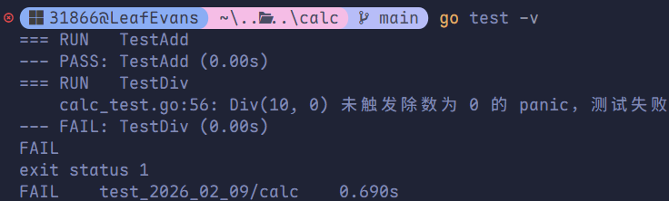
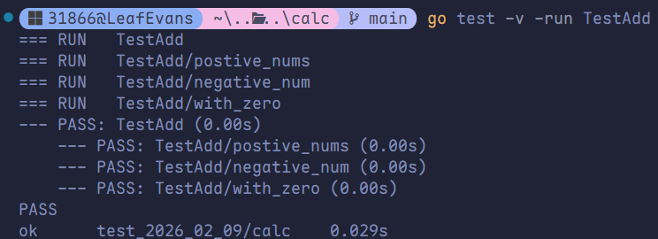
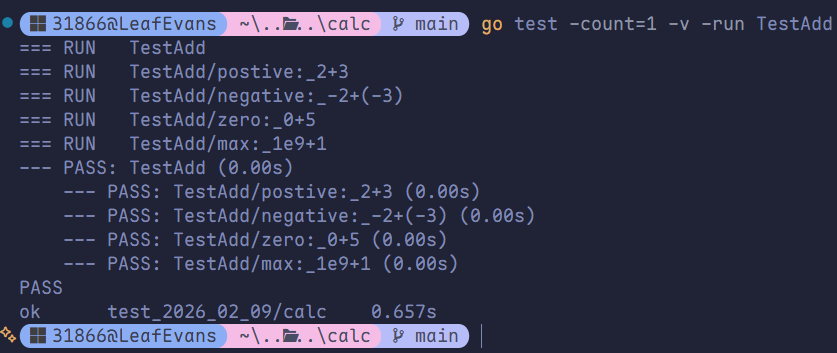
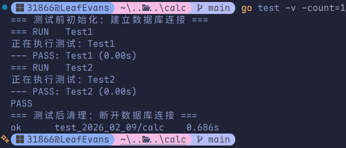

# 单元测试

## 单元测试基础

Go 语言通过内置的 `testing` 框架和 `go test` 命令来实现单元测试。编写单元测试的核心目标是：验证函数逻辑的正确性、保障代码的可维护性，并在修改代码时提前暴露设计或实现上的错误。

### 核心规范

在 Go 语言中，测试文件和函数必须遵循**严格的命名规范**，否则 `go test` 命令将无法识别并执行它们：

- **测试文件**：文件名必须以 `_test.go` 结尾（例如 `calc_test.go`）。推荐将测试文件与被测试的文件放在同一目录下，并归属同一个包。
- **测试函数**：
  1. 函数名必须以 `Test` 开头（例如测试 `Add` 函数，测试名应为 `TestAdd`）。
  2. 函数的参数必须且仅能是 `t *testing.T`（由测试框架自动传入，用于记录日志和标记测试状态）。
  3. 函数不能有任何返回值。

### 基础示例

我们以一个简单的数学计算器 `calc.go` 为例，演示编写单元测试的完整流程。

#### 被测试代码（`calc.go`）

```go
package calc

// Add 计算两个整数的和
func Add(a, b int) int {
	return a + b
}

// Mul 计算两个整数的积
func Mul(a, b int) int {
	return a * b
}

// Div 计算两个整数的商（简化版，未处理除数为 0 的情况）
func Div(a, b int) int {
	return a / b
}
```

#### 测试代码（`calc_test.go`）

```go
package calc

import "testing"

// TestAdd 测试 Add 函数：覆盖正常值、负数、边界值（如 0）
func TestAdd(t *testing.T) {
	// 用例 1：正常正数相加
	if ans := Add(1, 2); ans != 3 {
		t.Errorf("Add(1, 2) 预期结果为 3，实际得到 %d", ans)
	}

	// 用例 2：负数相加
	if ans := Add(-10, -20); ans != -30 {
		t.Errorf("Add(-10, -20) 预期结果为 -30，实际得到 %d", ans)
	}

	// 用例 3：边界值（含 0）
	if ans := Add(0, 5); ans != 5 {
		t.Errorf("Add(0, 5) 预期结果为 5，实际得到 %d", ans)
	}
}

// TestDiv 测试 Div 函数：覆盖正常情况和异常情况（除数为 0）
func TestDiv(t *testing.T) {
	// 正常用例：整除
	if ans := Div(10, 2); ans != 5 {
		t.Errorf("Div(10, 2) 预期结果为 5，实际得到 %d", ans)
	}

	// 异常用例：除数为 0（此处会触发 panic，需使用 defer + recover 捕获并验证）
	defer func() {
		if err := recover(); err != nil {
			t.Errorf("Div(10, 0) 未触发除数为 0 的 panic，测试失败")
		}
	}()
	Div(10, 0)
}
```



### 命令行工具（`go test`）

编写完代码后，可通过终端执行 `go test` 命令来运行测试。常用参数如下：

| 命令                  | 作用说明                                                     |
| :-------------------- | :----------------------------------------------------------- |
| `go test`             | 执行当前目录下的所有测试用例，仅输出最终的简要结果（PASS / FAIL）。 |
| `go test -v`          | **详细模式**：打印每个测试函数的运行过程和日志（推荐调试时使用）。 |
| `go test -run 匹配符` | 支持正则匹配，仅执行指定的测试函数或子测试。例如：<br />- `go test -run TestAdd`（仅执行 `TestAdd` 函数）<br />- `go test -run TestAdd/a1`（仅执行 `TestAdd` 下名为 `a1` 的子测试） |
| `go test -count=1`    | **禁用测试缓存**：Go 默认会缓存未修改代码的测试结果，使用此参数可强制重新执行所有测试。 |

## 测试框架日志方法

在测试函数中，我们可以通过 `t *testing.T` 对象调用多种内置方法，用于打印运行日志或控制测试的走向。

| 方法       | 功能说明                                                     |
| :--------- | :----------------------------------------------------------- |
| `t.Log`    | 打印普通日志（类似 `fmt.Print`），**仅在 `-v` 详细模式下才会显示**。 |
| `t.Logf`   | 格式化打印普通日志（类似 `fmt.Printf`），仅 `-v` 模式下显示。 |
| `t.Error`  | 打印错误日志，标记当前测试为失败，**但程序会继续往下执行后续代码**。 |
| `t.Errorf` | 格式化打印错误日志，标记失败，**继续执行**。                 |
| `t.Fatal`  | 打印致命错误日志，标记测试失败，**并立即终止当前测试函数**（后续代码不再执行）。 |
| `t.Fatalf` | 格式化打印致命错误，标记失败，**立即终止**。                 |

**核心区别对比：**
- `t.Error("计算错误")`：报出错误后，该函数内的后续用例还会接着跑。
- `t.Fatal("除数为 0")`：报出错误后，当前的 `TestDiv` 会瞬间停止运行，直接跳过后面的代码。

## 子测试：批量管理用例

当我们需要为一个函数编写多个测试用例（例如正常值、边界值、异常值）时，使用**子测试（Subtests）**可以更优雅地进行批量管理。它不仅能让代码结构更清晰，还支持单独运行某个特定的用例。

### 两种实现方式

#### 方式 1：显式调用 `t.Run()`（适合少量用例）

手动为每一个用例分配一个独立的名称和代码块。

```go
func TestAdd(t *testing.T) {
	// 子测试 1：正数相加
	t.Run("positive_nums", func(t *testing.T) {
		if ans := Add(2, 3); ans != 5 {
			t.Fatalf("2 + 3 预期 5，实际 %d", ans)
		}
	})

	// 子测试 2：负数相加
	t.Run("negative_nums", func(t *testing.T) {
		if ans := Add(-2, -3); ans != -5 {
			t.Fatalf("-2 + (-3) 预期 -5，实际 %d", ans)
		}
	})

	// 子测试 3：含 0 的相加
	t.Run("with_zero", func(t *testing.T) {
		if ans := Add(0, 3); ans != 3 {
			t.Fatalf("0 + 3 预期 3，实际 %d", ans)
		}
	})
}
```



#### 方式 2：表格驱动测试（适合大量用例）

通过定义一个结构体切片（表格）来集中管理所有的输入与预期输出，然后利用 `for` 循环配合 `t.Run()` 批量执行。这种方式拓展性极强，添加新用例只需在切片中增加一行数据即可。

```go
func TestAdd(t *testing.T) {
	// 1. 定义测试用例表格
	testCases := []struct {
		name     string // 用例名（要求唯一，便于排错时识别）
		a, b     int    // 输入参数
		expected int    // 预期结果
	}{
		{"positive: 2+3", 2, 3, 5},
		{"negative: -2+(-3)", -2, -3, -5},
		{"zero: 0+5", 0, 5, 5},
		{"max: 1e9+1", 1e9, 1, 1e9 + 1}, // 边界值：大数相加
	}

	// 2. 循环遍历并执行所有用例
	for _, tc := range testCases {
		// tc.name 将作为子测试的标识符
		t.Run(tc.name, func(t *testing.T) {
			actual := Add(tc.a, tc.b)
			if actual != tc.expected {
				t.Errorf("%d+%d 预期 %d，实际 %d", tc.a, tc.b, tc.expected, actual)
			}
		})
	}
}
```



### 子测试专属执行命令

表格驱动测试完美契合 `go test -run` 的正则匹配功能：
- **执行所有子测试**：`go test -v -run TestAdd`
- **精准执行某个特定子测试**：`go test -v -run TestAdd/zero`（引擎会自动匹配用例名中包含 `zero` 的测试用例）。

## `TestMain`：自定义测试生命周期

`TestMain` 是当前测试包的**全局唯一入口**。当我们需要在整个包的测试开始前进行资源初始化，或在测试结束后进行资源清理时，就需要用到它。

### 核心执行流

1. **测试前**：初始化全局环境（如连接测试数据库、加载配置文件、创建临时目录）。
2. **测试中**：调用 `m.Run()` 统一触发所有普通 `TestXxx` 函数的执行。
3. **测试后**：清理环境（如关闭数据库连接、删除临时文件），释放资源。

### 完整示例

```go
package calc

import (
    "fmt"
    "os"
    "testing"
)

// setup 测试前初始化：如连接数据库
func setup() {
    fmt.Println("=== 测试前初始化：建立数据库连接 ===")
}

// teardown 测试后清理：如关闭数据库
func teardown() {
    fmt.Println("=== 测试后清理：断开数据库连接 ===")
}

// 普通测试函数 1
func Test1(t *testing.T) {
    fmt.Println("正在执行测试：Test1")
}

// 普通测试函数 2
func Test2(t *testing.T) {
    fmt.Println("正在执行测试：Test2")
}

// TestMain 全局测试入口
// 注意：函数名必须是 TestMain，参数必须是 *testing.M
func TestMain(m *testing.M) {
    // 1. 测试前初始化
    setup()

    // 2. 触发并执行包内所有的测试函数，并获取测试结果的状态码（0=成功，非0=失败）
    exitCode := m.Run()

    // 3. 测试后统一清理
    teardown()

    // 4. 退出程序（必须将状态码传给 os.Exit，否则测试流程无法正确上报结果）
    os.Exit(exitCode)
}
```



> [!WARNING]
>
> 1. `TestMain` 中**必须手动调用 `m.Run()`**，否则所有的测试代码都不会被执行。
> 2. `TestMain` 本身并不是一个普通的测试用例，它不会被 `go test` 单独统计，只承担“入口调度”的职责。

## 单元测试最佳实践

在实际工程开发中，建议遵循以下原则编写单元测试：

1. **用例绝对独立**：每个测试用例不应依赖其他用例的执行结果。避免多用例共享并修改同一个全局变量，防止用例间产生交叉干扰。
2. **覆盖全面（边界思维）**：一个合格的测试至少应涵盖 3 类场景：
   - **常规场景**（如 `Add(2, 3)`）
   - **边界场景**（如处理 0、切片为空、达到整型最大/最小值）
   - **异常场景**（如除数为 0、传入 nil 指针、文件不存在）
3. **命名见名知义**：测试函数需严格对应被测函数（如测试 `Add` 就叫 `TestAdd`）；子测试的名称应清晰描述当前测试的具体场景（如 `negative_nums`）。
4. **拒绝冗余代码**：当面临大量输入输出相似的测试时，务必使用**表格驱动测试**，极大提升代码整洁度。
5. **解耦外部依赖**：单元测试应当是轻量且快速的。如果代码依赖真实的数据库、Redis 或第三方网络接口，应优先使用 Mock 工具（如 `gomock` 或打桩库）进行模拟，避免因网络波动导致测试失败。
