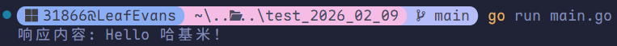
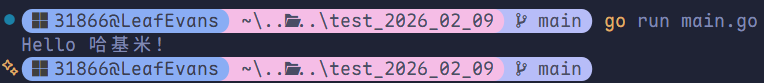
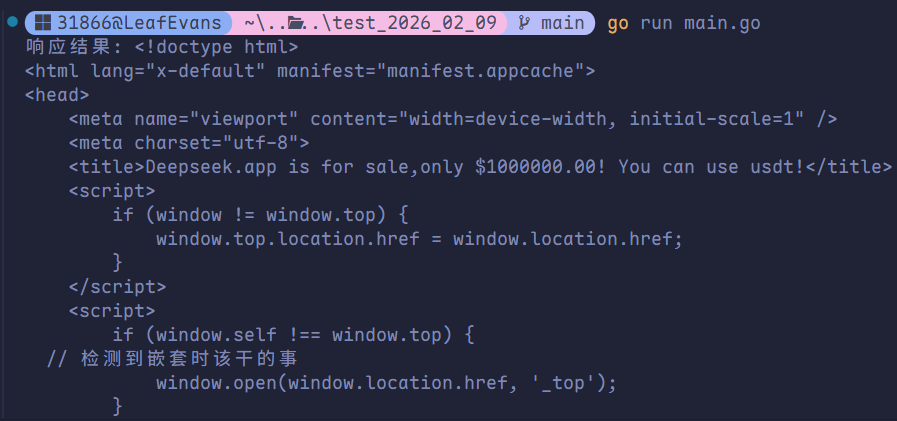

# HTTP 网络编程

Go 语言内置的 `net/http` 包设计极其优秀且强大。它原生提供了完善的 HTTP 客户端（Client）和服务器（Server）实现，开发者无需依赖第三方 Web 框架，即可快速搭建高性能的 Web 应用。

## 核心原则

在发起任何 HTTP 请求时，有一个绝对不可忽视的黄金原则：

> [!warning]
>
> 程序在使用完 Response 后，**必须显式关闭回复的主体**，否则会导致连接泄露和内存溢出！
>
> 标准写法：`defer resp.Body.Close()`

## HTTP 客户端（Client）

### 快速请求方法

`net/http` 提供了便捷函数，直接发起请求：

- `http.Get(url)`
- `http.Post(url, contentType, body)`
- `http.PostForm(url, data)`

### GET 请求（基础与带参）

带参数的 GET 请求需借助 `net/url` 标准库对参数进行 URL Encode。

```go
package main

import (
	"fmt"
	"io"
	"net/http"
	"net/url"
)

func main() {
	apiUrl := "http://127.0.0.1:9090/get"

	// 构建 URL 参数
	data := url.Values{}
	data.Set("name", "哈基米")
	data.Set("age", "18")

	// 解析并拼接 URL
	u, _ := url.ParseRequestURI(apiUrl)
	u.RawQuery = data.Encode()

	// 发送 GET 请求
	resp, err := http.Get(u.String())
	if err != nil {
		fmt.Println("请求失败:", err)
		return
	}
	defer resp.Body.Close()

	// 读取响应体
	body, _ := io.ReadAll(resp.Body)
	fmt.Println("响应内容:", string(body))
}
```



### POST 请求（表单/JSON）

Go 提供两种 POST 请求方式：

1. **通用 `http.Post`**：支持 JSON、表单、二进制等**所有格式**，需手动配置请求头。
2. **专用 `http.PostForm`**：专为**表单提交**设计，自动处理编码和请求头，代码更简洁。

#### 通用 `http.Post`

手动指定 `Content-Type`，适合发送 **JSON** 或自定义格式数据，是最常用的通用写法。

```go
package main

import (
	"fmt"
	"io"
	"net/http"
	"strings"
)

func main() {
	url := "http://127.0.0.1:9090/post"

	// 场景 A：发送 JSON 数据
	contentType := "application/json"
	data := `{"name": "哈基米", "age": 18}`

	// 场景 B：发送表单数据（按需替换）
	// contentType := "application/x-www-form-urlencoded"
	// data := "name=哈基米&age=18"

	resp, err := http.Post(url, contentType, strings.NewReader(data))
	if err != nil {
		return
	}
	defer resp.Body.Close()

	b, _ := io.ReadAll(resp.Body)
	fmt.Println(string(b))
}
```



#### 便捷 `http.PostForm`

**专门用于表单提交**，无需手动设置请求头、无需拼接字符串，内部自动处理参数编码，是提交表单的最优解。

```go
package main

import (
	"fmt"
	"io"
	"net/http"
	"net/url"
)

func main() {
	apiUrl := "http://127.0.0.1:9090/post"

	// 构建表单参数
	data := url.Values{}
	data.Set("name", "哈基米")
	data.Set("age", "18")

	// 直接发起表单 POST 请求
	resp, err := http.PostForm(apiUrl, data)
	if err != nil {
		fmt.Println("请求失败:", err)
		return
	}
	defer resp.Body.Close()

	// 读取响应
	body, _ := io.ReadAll(resp.Body)
	fmt.Println("响应结果:", string(body))
}
```

### 自定义 Client 与 Transport

当需要修改请求头（Header）、设置超时、代理或 TLS 时，不能使用默认方法，需自定义配置。

> [!tip]
>
> `Client` 与 `Transport` 是**并发安全**的，出于连接池复用效率考虑，应该**全局建立一次，尽量重用**，不要每次请求都实例化。

```go
package main

import (
	"crypto/tls"
	"crypto/x509"
	"fmt"
	"io"
	"net/http"
	"time"
)

func main() {
	// 初始化证书池
	pool, _ := x509.SystemCertPool()

	// 自定义 Transport（管理代理、TLS、连接池、压缩等）
	tr := &http.Transport{
		TLSClientConfig:    &tls.Config{RootCAs: pool},
		DisableCompression: true,
	}

	// 自定义 Client（管理重定向、超时、挂载 Transport）
	client := &http.Client{
		Transport: tr,
		Timeout:   5 * time.Second,
	}

	// 自定义 Request（添加 Header 等）
	req, _ := http.NewRequest("GET", "http://51mh.com", nil)
	req.Header.Add("If-None-Match", `W/"wyzzy"`)

	// 发送请求
	resp, err := client.Do(req)
	if err != nil {
		fmt.Println("请求失败:", err)
		return
	}
	defer resp.Body.Close()

	body, _ := io.ReadAll(resp.Body)
	fmt.Println("响应结果:", string(body))
}
```



## HTTP 服务器（Server）

### 默认 Server 与路由

处理器参数传 `nil` 时，默认使用包级别的 `DefaultServeMux` 作为路由分发器。

```go
package main

import (
	"fmt"
	"net/http"
)

// 处理器函数（HandlerFunc）
func sayHello(w http.ResponseWriter, r *http.Request) {
	fmt.Fprintln(w, "Hello 哈基米！")
}

func main() {
	// 注册路由
	http.HandleFunc("/", sayHello)

	// 启动服务，监听端口
	err := http.ListenAndServe(":9090", nil)
	if err != nil {
		fmt.Println("启动服务失败:", err)
	}
}
```

### 接收参数（解析 Request）

在服务端 `HandlerFunc` 中，常见的读取请求数据方式：

```go
func handler(w http.ResponseWriter, r *http.Request) {
	defer r.Body.Close()

	// 解析 GET URL 参数（?name=xxx）
	query := r.URL.Query()
	name := query.Get("name")

	// 解析 POST Form 表单（application/x-www-form-urlencoded）
	r.ParseForm()
	age := r.PostForm.Get("age")

	// 解析 POST JSON 数据（application/json）
	body, _ := io.ReadAll(r.Body)
	var jsonData map[string]any
	json.Unmarshal(body, &jsonData)

	// 响应数据端
	w.Header().Set("Content-Type", "application/json") // 设置响应体
	resp, _ := json.Marshal(map[string]any{
		"status": "ok",
		"name":   name,
		"age":    age,
		"json":   jsonData,
	})
	w.Write(resp)
}
```

### 自定义 Server

默认的 `http.ListentAndServe` 没有超时机制，容易被慢客户端打满连接导致宕机。生产环境建议自定义 `Server`：

```go
 
```

