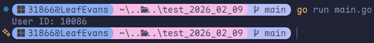
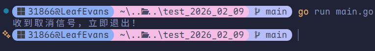
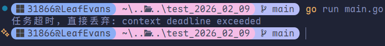
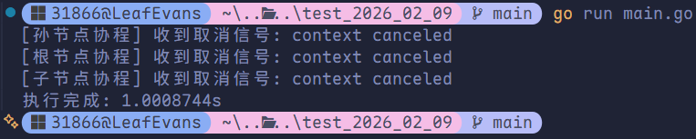

# Context 上下文

## 核心定位

在 Go 语言中，`Context`（上下文）是并发控制的基石。它专用于 goroutine 之间**传递请求域数据**、**控制生命周期**（如超时控制、主动取消），是防止<span style="color:#A23131"> goroutine 泄露</span>的核心利器。

## 接口定义

`Context` 本质上是一个接口，包含 4 个核心方法：

```go
type Context interface {
  Deadline() (deadline time.Time, ok bool) // 获取截止时间
  Done() <-chan struct{}									 // 返回一个只读 channel，用于监听取消信号
  Err() error															 // 返回 Context 被取消的原因
  Value(key any) any											 // 获取 Context 携带的键值对数据
}
```

## 四大派生用法

Go 提供了四种从父 Context 派生子 Context 的方法，分别对应不同的业务场景：

### `WithValue`：传递链路数据

用于在整个 goroutine 调用链路上隐式传递**元数据**（如 TraceID、用户信息、Token）。

```go
package main

import (
	"context"
	"fmt"
	"sync"
)

// 必须自定义 key 类型，防止冲突
type userKey string

var wg sync.WaitGroup

func main() {
	ctx := context.WithValue(context.Background(), userKey("userID"), "10086")

	wg.Add(1)
	go func(c context.Context) {
		// 并发安全地读取数据
		defer wg.Done()
		fmt.Println("User ID:", c.Value(userKey("userID")))
	}(ctx)
	wg.Wait()
}
```



### `WithCannel`：主动取消操作

用于需要**手动中断**底层所有 goroutine 运行的场景。

```go
package main

import (
	"context"
	"fmt"
	"sync"
	"time"
)

var wg sync.WaitGroup

func main() {
	ctx, cancel := context.WithCancel(context.Background())
	defer cancel() // 只要创建，必跟 defer cancel()

	wg.Add(1)
	go func(c context.Context) {
		defer wg.Done()
		select {
		case <-c.Done():
			// 监听到外部调用了 cancel()
			fmt.Println("收到取消信号，立即退出！")
		case <-time.After(5 * time.Second):
			fmt.Println("任务完成")
		}
	}(ctx)

	time.Sleep(time.Second)
	cancel()
	wg.Wait()
}
```



### `WithTimeout`：相对超时控制

用于限制某段业务逻辑（如 RPC 调用、DB 查询）的**最大执行时长**。

```go
package main

import (
	"context"
	"fmt"
	"sync"
	"time"
)

var wg = sync.WaitGroup{}

func main() {
	ctx, cancel := context.WithTimeout(context.Background(), 2*time.Second)
	defer cancel()

	wg.Add(1)
	go func(c context.Context) {
		defer wg.Done()
		select {
		case <-c.Done():
			fmt.Println("任务超时，直接丢弃:", c.Err())
			return
		case <-time.After(3 * time.Second):
			fmt.Println("任务处理完毕")
		}
	}(ctx)
	wg.Wait()
}
```



### `WithDeadline`：绝对截止时间

和 `WithTimeout` 类似，但传入的是一个**确切的未来时间点**。

```go
package main

import (
	"context"
	"fmt"
	"sync"
	"time"
)

var wg = sync.WaitGroup{}

func main() {
	deadline := time.Now().Add(2 * time.Second)
	ctx, cancel := context.WithDeadline(context.Background(), deadline)
	defer cancel()

	wg.Add(1)
	go func(c context.Context) {
		defer wg.Done()
		select {
		case <-c.Done():
			fmt.Println("任务超时，直接丢弃:", c.Err())
		case <-time.After(3 * time.Second):
			fmt.Println("任务处理完毕")
		}
	}(ctx)
	wg.Wait()
}
```


## 级联广播机制

`Context` 是一棵树。**父节点的取消信号，会自动且强制地广播给所有子孙节点。**

```go
package main

import (
	"context"
	"fmt"
	"sync"
	"time"
)

var wg = sync.WaitGroup{}

func listenCancel(ctx context.Context, name string) {
	defer wg.Done()
	select {
	case <-ctx.Done():
		fmt.Printf("[%s] 收到取消信号: %s\n", name, ctx.Err())
	case <-time.After(10 * time.Second):
		fmt.Printf("[%s] 任务执行完成\n", name)
	}
}

func main() {
	start := time.Now()

	rootCtx, rootCancel := context.WithCancel(context.Background())
	defer rootCancel()

	childCtx, childCancel := context.WithCancel(rootCtx)
	defer childCancel()

	grandsonCtx, grandsonCancel := context.WithCancel(childCtx)
	defer grandsonCancel()

	wg.Add(3)
	go listenCancel(rootCtx, "根节点协程")
	go listenCancel(childCtx, "子节点协程")
	go listenCancel(grandsonCtx, "孙节点协程")

	time.Sleep(time.Second)
	rootCancel()

	wg.Wait()
	fmt.Println("执行完成:", time.Since(start))
}
```



## 核心开发规约

1. **首参规范**：Context 必须作为函数的**第一个参数**，且统一命名为 `ctx`。
2. **严禁存入结构体**：Context 仅在函数调用栈中传递，**永远不要作为结构体字段**（极少数兼容旧代码场景除外）。
3. **取消必执行**：使用 `WithCancel` / `WithTimeout` 等派生 Context 后，**必须紧跟 `defer cancel()`**，防止底层定时器、goroutine 资源泄露。
4. **传值克制**：`WithValue` 仅用于传递链路元数据（TraceID、认证信息），**绝对禁止传递业务参数**；业务参数需显式定义在函数签名中。
5. **禁止传 `nil`**：若不确定使用何种 Context，需传入 `context.TODO()`，**严禁传递 `nil`**。