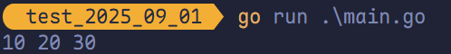

# 变量、常量、变量命名规则

## 变量的来历

程序运行过程中的数据都是保存在内存中，我们想要在代码中操作某个数据时就需要去内存上找到这个变量，但是如果我们直接在代码中通过内存地址去操作变量的话，代码的可读性会非常差而且还容易出错，所以我们就**利用变量将这个数据的内存地址保存**起来，以后直接通过这个变量就能找到内存上对应的数据了。

## 变量类型

变量（Variable）的功能是存储数据。不同的变量保存的数据类型可能会不一样。经过半个多世纪的发展，编程语言已经基本形成了一套固定的类型，常见变量的数据类型有：整型、浮点型、布尔型等。

Go 语言中的每一个变量都有自己的类型，并且<span style="color:#1E93AB; font-weight:bold">变量必须经过声明才能开始使用</span>。

## Go 语言中变量的声明

Go 语言变量名由字母、数字、下划线组成，其中<span style="color:#FF9A00; font-weight:bold">首个字符不能为数字</span>。Go 语言中**关键字**和**保留字**都不能用作变量名。

Go 语言中的变量需要声明后才能使用，<span style="color:#6A0066; font-weight:bold">同一作用域内不支持重复声明</span>，并且 Go 语言的变量声明后必须使用。

### `var` 变量声明

```go
var 变量名称 type
```

```go
var name string 
var agr int
var isOK bool
```

```go
import (
	"fmt"
)

func main() {
	var username = "张三"
	var age int = 20
	fmt.Println(username, age)
}
```


### 一次定义多个变量

```go
var identifier1, identifier2 type
```

```go
package main

import "fmt"

func main() {
	var username, sex string
	username = "张三"
	sex = "男"
	fmt.Println(username, sex)
}
```


声明变量时赋值：

```go
var a, b, c = 1, 2, 3, false
```

### 批量声明变量时指定类型

```go
package main

import "fmt"

func main() {
	var (
		a string
		b int
		c bool
	)
	a = "哈基米"
	b = 10
	c = true
	fmt.Println(a, b, c)
}
```


批量声明变量并赋值：

```go
package main

import "fmt"

func main() {
	var (
		a string = "张三"
		b int    = 10
		c bool   = true
	)
	fmt.Println(a, b, c)
}
```


### 变量的初始化

Go 语言在声明变量的时候，会自动对变量对应的内存区域进行初始化操作。每个变量会被初始化成其类型的默认值，例如： 整型和浮点型变量的默认值为 0；字符串变量的默认值为空字符串；布尔型变量默认为 `false`； 切片、函数、指针变量的默认为 `nil`。

当然我们也可在声明变量的时候<span style="color:#F78D60">为其指定初始值</span>。变量初始化的标准格式如下：

```go
var 变量名 类型 = 表达式
```

举例：

```go
var name string = "曼波"
var age int = 18
```

或者一次初始化多个变量并赋值：

```go
var name, age = "叮咚鸡", 20
```

### 类型推导

有时候我们会将变量的类型省略，这个时候编译器会根据等号右边的值来推导变量的类型完成初始化。

```go
var name = "耄耋"
var age = 18
```

### 短变量声明法

在函数内部，可以使用更简略的 `:=` 方式声明并初始化变量。

> **注意**：短变量只能用于声明局部变量，不能用于全局变量的声明。

```go
变量名 := 表达式
```

```go
package main

import (
	"fmt"
)

// 全局变量 m
var m = 100

func main() {
	n := 10
	// 此处声明局部变量 m
	m := 200
	fmt.Println(m, n)
}
```


> **注意**：在 `main` 函数内声明的局部变量 `m` 会屏蔽（覆盖）全局变量 `m`。

```go
m1, m2, m3 := 10, 20, 30
fmt.Println(m1, m2, m3)
```



### 匿名变量

在使用多重赋值时，若想要忽略某个值，可以使用**匿名变量**（anonymous variable）。匿名变量使用一个 `_` 表示，例如：

```go
package main

import "fmt"

func Info() (string, int) {
	return "胖宝宝", 100
}

func main() {
	username, _ := Info()
	fmt.Println(username)
}
```


匿名变量不占用<span style="color:#E62727; font-weight:bold">命名空间</span>，不会<span style="color:#E62727; font-weight:bold">分配内存</span>，所以匿名变量之间不存在<span style="color:#E62727; font-weight:bold">重复声明</span>。

> **注意**：
>
> 1. <span style="color:#8C1007; font-weight:bold">函数外</span>的每个语句都必须以<span style="color:#8C1007; font-weight:bold">关键字</span>开始（`var`、`const`、`func` 等）。
> 2. `:=` 不能使用在函数外。
> 3. `_` 多用于占位，表示忽略值。

## Go 语言中的常量

相对于变量，常量是恒定不变的值，多用于定义程序运行期间不会改变的那些值。常量的声明和变量声明非常类似，只是把 `var` 换成了 `const`，常量在定义的时候必须赋值。

### 使用 `const` 定义常量

```go
const Pi = 3.1415
const E = 2.7182
```

声明了 `Pi` 和 `E` 这两个常量后，在整个程序运行期间它们的值都不能再发生变化了。

多个变量也可以同时声明：

```go
const (
	Pi = 3.1415
	E  = 2.7182
)
```

`const` 同时声明多个常量时，如果省略了值则表示和上面一行的值相同。例如：

```go
package main

import "fmt"

const (
	A = 100
	B
	C
	D = 200
	E
)

func main() {
	fmt.Println(A, B, C, D, E)
}
```


上面示例中，常量 `A`、`B`、`C` 的值为 100，`D`、`E` 的值为 200。

打印 `Pi` 和 `E` 的值：

```go
package main

import (
	"fmt"
	"math"
)

func main() {
	const Pi = math.Pi
	const E = math.E
	fmt.Println(Pi)
	fmt.Println(E)
}
```

