# 基本数据类型

## 数据类型介绍

Go 语言中数据类型分为两种，<span style="color:#FE7743; font-weight:bold">基本数据类型</span>和<span style="color:#FE7743; font-weight:bold">复合数据类型</span>。

- **基本数据类型**：整型、浮点型、布尔型、字符串。
- **复合数据类型**：数组、切片、结构体、函数、`map`、通道（`channel`）、接口等。

## 整型

整型分为以下两个大类：

- <span style="color:#065084; font-weight:bold">有符号整型按长度分类</span>：`int8`、`int16`、`int32`、`int64`。
- <span style="color:#065084; font-weight:bold">对应的无符号整型</span>：`uint8`、`uint16`、`uint32`、`uint64`。

| 类型     | 范围                                                         | 占用空间 | 有无符号 |
| -------- | ------------------------------------------------------------ | -------- | -------- |
| `int8`   | $-128 \sim 127 \quad (-2^7 \sim 2^7 - 1)$                    | 1 个字节 | 有       |
| `int16`  | $-32768 \sim 32767 \quad (-2^{15} \sim 2^{15} - 1)$          | 2 个字节 | 有       |
| `int32`  | $-2147483648 \sim 2147483647 \quad (-2^{31} \sim 2^{31} - 1)$ | 3 个字节 | 有       |
| `int64`  | $-9223372036854775808 \sim 9223372036854775807 \quad (-2^{63} \sim 2^{63} - 1)$ | 8 个字节 | 无       |
| `uint8`  | $0 \sim 255 \quad (0 \sim 2^8 - 1)$                          | 1 个字节 | 无       |
| `uint16` | $0 \sim 65535 \quad (0 \sim 2^{16} - 1)$                     | 2 个字节 | 无       |
| `uint32` | $0 \sim 4294967295 \quad (0 \sim 2^{32} - 1)$                | 4 个字节 | 无       |
| `uint64` | $0 \sim 18446744073709551615 \quad (0 \sim 2^{64} - 1)$      | 8 个字节 | 无       |

> [!TIP]
>
> 字节（Byte）是计算机的<span style="color:#748873; font-weight:bold">基本存储单位</span>。
> $$
> 8 \text{bit} = 1 \text{Byte} \\
> 1024 \text{Byte} = 1 \text{KB} \\
> 1024 \text{KB} = 1 \text{MB} \\
> 1024 \text{MB} = 1 \text{GB} \\
> 1024 \text{GB} = 1 \text{TB}
> $$
> 在电脑中，一个中文字占两个字节。

### 特殊整型

| 类型      | 描述                                                       |
| --------- | ---------------------------------------------------------- |
| `uint`    | 32 位操作系统上就是 `uint32`，64 位操作系统上就是 `uint64` |
| `int`     | 32 位操作系统上就是 `int32`，64 位操作系统上就是 `int64`   |
| `uintptr` | 无符号整型，用于存放一个指针                               |

> [!TIP]
>
> 在使用 `int` 和 `uint` 类型时，不能假定它是 32 位或 64 位的整型，而是考虑 `int` 和 `uint` 可能在<span style="color:#5EABD6; font-weight:bold">不同平台上的差异</span>。
>
> 实际项目中整数类型、切片、`map` 的元素数量等都可以用 `int` 来表示。**在涉及到二级制传输、为了保持文件的结构不受到不同编译目标平台字节长度的影响，不要使用 `int` 和 `uint`。**

```go
package main

import "fmt"

func main() {
	var num int64
	num = 123
	fmt.Printf("值：%v，类型：%T", num, num)
}
```

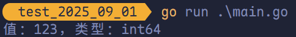

### `unsafe.Sizeof`

`unsafe.Sizeof(n1)` 是 `unsafe` 包的一个函数，可以返回 `n1` 变量占用的字节数。

```go
package main

import (
	"fmt"
	"unsafe"
)

func main() {
	var a int8 = 120
	fmt.Printf("%T\n", a)
	fmt.Println(unsafe.Sizeof(a))
}
```

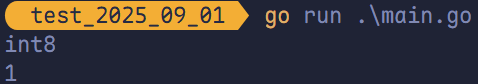

### `int` 不同长度直接的转换

```go
package main

import "fmt"

func main() {
	var num1 int8 = 127
	num2 := int32(num1)
	fmt.Printf("值：%v，类型：%T", num2, num2)
}
```

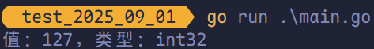

### 数字字面量语法（Number Literals Syntax）

数字字面量语法便于开发者以二进制、八进制或十六进制浮点数的格式定义数字，例如：

```go
v := 0b00101101
```

代表二进制的 101101，相当于十进制的 45。

```go
v := 0o377
```

代表八进制的 377，相当于十进制的 255。

```
v := 0x1p-2
```

代表十六进制的 1 除以 $2^2$，也就是 0.25。

而且还允许我们使用 `_` 来分隔数字，例如：

```go
v := 123_456
```

相当于 123456。

可以借助 `fmt` 的函数来将一个整数以不同进制形式表示：

```go
package main

import "fmt"

func main() {
	// 十进制
	var a int = 10
	fmt.Printf("%d\n", a)
	// 占位符 %b 表示二进制
	fmt.Printf("%b\n", a)

	// 八进制以 0 开头（或 0o）
	var b int = 077
	fmt.Printf("%o\n", b)

	// 十六进制以 0x 开头
	var c int = 0xff
	fmt.Printf("%x\n", c)
	fmt.Printf("%X\n", c)
	fmt.Printf("%d\n", c)
}
```

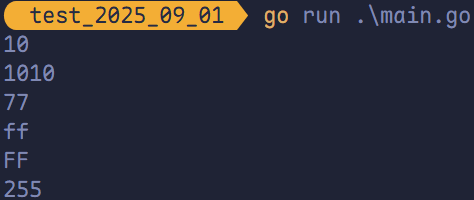

> [!TIP]
>
> `0` 是旧的八进制表示方式，不直观，不推荐；推荐使用 `0o`。

## 浮点型

Go 语言支持两种浮点型数：`float32` 和 `float64`。这两种浮点型数据格式遵循 IEEE 754 标准：

- `float32` 浮点数的最大范围约为 3.4e38，可以使用常量定义：`math.MaxFloat32`。
- `float64` 浮点数的最大范围约为 1.8e308，可以使用常量定义：`math.MaxFloat64`。

打印浮点数时，可以使用 `fmt` 包配合动词 `%f`，代码有：

```go
package main

import (
	"fmt"
	"math"
)

func main() {
	// 默认保留 6 位小数
	fmt.Printf("%f\n", math.Pi)
	// 保留 2 位小数
	fmt.Printf("%.2f\n", math.Pi)
}
```

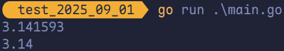

### 浮点数默认是 `float64`

```go
num := 1.1
fmt.Printf("值：%v，类型：%T\n", num, num)
```

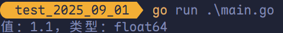

### `float` 精度丢失问题

几乎所有的编程语言都有精度丢失这个问题，这是典型的二进制浮点数精度损失问题，在定长条件下，二进制小数和十进制小数互转可能有精度丢失。

```go
d := 1129.6
fmt.Println(d * 100)
```

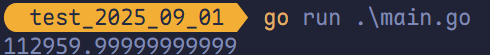

```go
m1 := 8.2
m2 := 3.8
// 期望是 4.4
fmt.Println(m1 - m2)
```

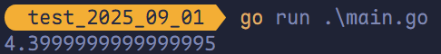

使用第三方包（https://github.com/shopspring/decimal）来解决精度丢失问题：

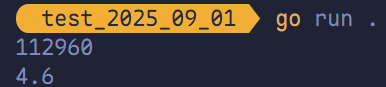

### 科学计数法表示浮点类型

```go
num := 5.1234e2
num2 := 5.1234E2
num3 := 5.1234E-2
fmt.Printf("num = %v, num2 = %v, num3 = %v", num, num2, num3)
```

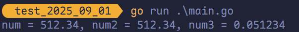

## 布尔值

Golang 中以 `bool` 类型进行声明布尔型数据，布尔型数据只有 `true`（真）和 `false`（假）两个值。

> [!TIP]
>
> 1. 布尔类型变S量的<span style="color:#06923E; font-weight:bold">默认值</span>为 `false`。
> 2. Go 语言中<span style="color:#BA487F; font-weight:bold">不允许</span>将整型强制转换为布尔型。
> 3. 布尔型无法参与<span style="color:#FF7D29; font-weight:bold">数值运算</span>，也无法与<span style="color:#2D4F2B; font-weight:bold">其他类型进行转换</span>。

```go
package main

import (
	"fmt"
	"unsafe"
)

func main() {
	var b = true
	fmt.Printf("%v 占用字节：%v", b, unsafe.Sizeof(b))
}
```

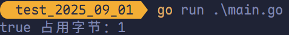

## 字符串

Go 语言中的字符串以<span style="color:#FEA405">原生数据类型</span>出现，使用字符串就像使用其他原生数据类型（`int`、`bool`、`float32`、`float64` 等）一样。 Go 语言里的字符串的内部实现<span style="color:#8AA624">使用 UTF-8 编码</span>。 字符串的值为双引号（`"`）中的内容，可以在 Go 语言的源码中直接添加非 ASCII 码字符，例如：

```go
s1 := "Hello "
s2 := "World!"
```

### 字符串转义符

Go 语言的字符串常见转义符包含回车、换行、单双引号、制表符等，如下表所示。

| 转义符 |                含义                |
| :----: | :--------------------------------: |
|  `\r`  |         回车符（返回行首）         |
|  `\n`  | 换行符（直接跳到下一行的行首位置） |
|  `\t`  |               制表符               |
|  `\'`  |               单引号               |
|  `\"`  |               双引号               |
|  `\\`  |               反斜杠               |

举例，打印 Windows 平台下的一个文件路径：

```go
package main

import "fmt"

func main() {
	fmt.Println("C:\\Code\\demo\\main.go")
}
```

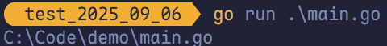

### 多行字符串

Go 语言中要定义一个多行字符串使，就必须使用反引号字符：

```go
package main

import "fmt"

func main() {
	str := `第一行
第二行
第三行`
	fmt.Println(str)
}
```

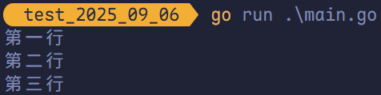

### 字符串的常用方法

| 方法                                         | 介绍           |
| -------------------------------------------- | -------------- |
| `len(str)`                                   | 求长度         |
| `+` 或 `fmt.Sprintf`                         | 拼接字符串     |
| `strings.Split`                              | 分割           |
| `string.Contains`                            | 判断是否包含   |
| `strings.HasPrefix` 以及 `strings.HasSuffix` | 前缀/后缀判断  |
| `strings.Index` 以及 `strings.LastIndex`     | 子串出现的位置 |
| `strings.Join(a[]string, sep string)`        | 连接操作       |

#### `len(str)` 求字符串的长度

```go
package main

import "fmt"

func main() {
	str := "this is str"
	fmt.Println(len(str))
}

```

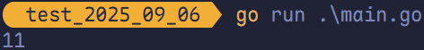

#### 拼接字符串

```go
package main

import "fmt"

func main() {
	str1 := "Hello "
	str2 := "Golang!"

	fmt.Println(str1 + str2)

	var str3 string = fmt.Sprintf("%v%v", str1, str2)
	fmt.Println(str3)
}
```

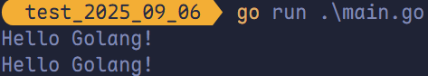

#### `strings.Split` 分割字符串

```go
package main

import (
	"fmt"
	"strings"
)

func main() {
	str := "123-456-789"
	arr := strings.Split(str, "-")
	fmt.Println(arr)
}
```

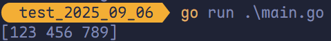

#### 判断是否包含

```go
package main

import (
	"fmt"
	"strings"
)

func main() {
	var str = "this is golang"
	var flag = strings.Contains(str, "golang")
	fmt.Println(flag)
}
```

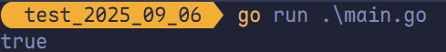

#### 判断首字符或尾字符是否包含指定字符

```go
package main

import (
	"fmt"
	"strings"
)

func main() {
	str := "this is golang"
	var flag bool = strings.HasPrefix(str, "this")
	fmt.Println(flag)

	flag = strings.HasSuffix(str, "go")
	fmt.Println(flag)
}
```

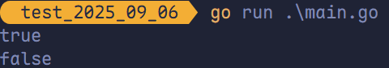

#### 判断字符串出现的位置

```go
package main

import (
	"fmt"
	"strings"
)

func main() {
	str := "this is golang"
	var index = strings.Index(str, "is")
	fmt.Println(index)

	index = strings.LastIndex(str, "is")
	fmt.Println(index)
}
```

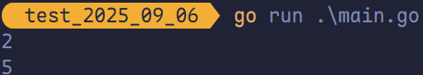

#### `strings.Join` 拼接字符串

```go
package main

import (
	"fmt"
	"strings"
)

func main() {
	var str = "123-456-789"
	var arr = strings.Split(str, "-")
	var str2 = strings.Join(arr, "*")
	fmt.Println(str2)
}
```

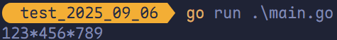

## `byte` 和 `rune` 类型

组成每个字符串的元素叫做<span style="color:#D92C54">字符</span>，可以通过遍历字符串元素获得字符。字符用单引号（`'`）包裹起来，如：

```go
package main

import "fmt"

func main() {
	a := 'a'
	b := 'b'
	// 直接输出 byte 的时候输出的是这个字符对应的码值
	fmt.Println(a)
	fmt.Println(b)

	// 如果要输出该字符，需要格式化输出
	// %c 相应 Unicode 码点所表示的字符
	fmt.Printf("%c %c\n", a, b)
}
```

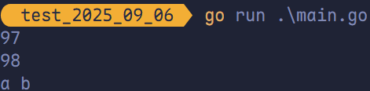

- <span style="color:#465C88; font-weight:bold">字节（byte）</span>：是计算机中数据处理的基本单位，通常用大写字母 B 表示，1B（字节，byte）= 8bit（位）。
- <span style="color:#465C88; font-weight:bold">字符</span>：是指计算机中使用的字母、数字、字和符号。

> [!TIP]
>
> 一个汉字占用 3 个字节，一个字母占用一个字节。

```go
package main

import (
	"fmt"
)

func main() {
	a := "m"
	fmt.Println(len(a))
	b := "张"
	fmt.Println(len(b))
}
```

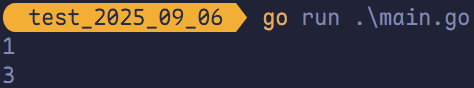

### Go 语言字符有两种

1. `uint8` 类型，或者称为 `byte` 型，代表了 ASCII 码的一个字符。
2. `rune` 类型，代表一个 UTF-8 字符。

当需要处理中文、日文或者其他复合字符时，需要使用到 `rune` 类型。

Go 使用了特殊的 `rune` 类型来处理 Unicode，让基于 Unicode 的文本处理更为方便，也可以使用 `byte` 类型进行默认字符串处理，性能和扩展性都有兼顾。

> [!TIP]
>
> `rune` 类型不对应编码后的字节序列，而是直接对应 Unicode 码点，其本质上是 `int32` 的别名，足以表示 Unicode 的所有码点（最大为 U+10FFFF）。

```go
package main

import "fmt"

func main() {
	str := "哈基米Mambo"
	for i := 0; i < len(str); i++ {
		fmt.Printf("%v(%c) ", str[i], str[i])
	}
	fmt.Println()

	for _, ch := range str {
		fmt.Printf("%v(%c) ", ch, ch)
	}
	fmt.Println()
}
```

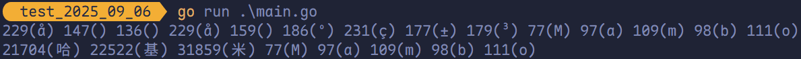

因为 UTF-8 编码下一个中文汉字由 3 个字节组成，所有不可简单地按照字节去遍历包含中文的字符串，否则就会出现上图输出中第一行的结果。

字符串底层是一个 `byte` 数组，所有可以和 `[]byte` 类型相互转换。字符串是不可修改的，字符串底层是由 `byte` 字节组成的，所以字符串的长度是 `byte` 字节的长度。`rune` 类型用来表示 UTF-8 字符，一个 `rune` 字符由一个或多个 `byte` 组成。

<span style="color:#78C841">`rune` 类型实际上是一个 `int32`。</span>

```go
package main

import "fmt"

func main() {
	ch1 := "营"
	ch2 := '营'
	fmt.Printf("ch1 的类型为 %T，ch2 的类型为 %T\n", ch1, ch2)
}
```

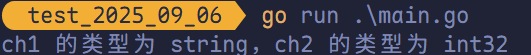

## 修改字符串

要修改字符串，需要先将字符串转换为 `[]rune` 或 `[]byte`，完成后再转换回 `string`。无论何种转换，都会重新分配内存，并复制字节数组。

```go
package main

import "fmt"

func main() {
	str1 := "big"
	byteStr1 := []byte(str1)
	byteStr1[0] = 'p'
	fmt.Println(string(byteStr1))

	str2 := "红萝卜"
	runeStr2 := []rune(str2)
	runeStr2[0] = '白'
	fmt.Println(string(runeStr2))
}
```

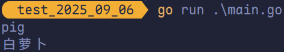
