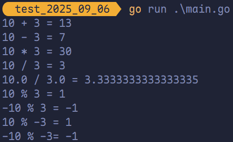
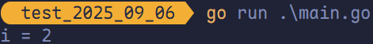
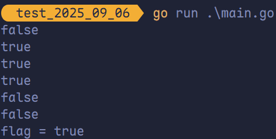
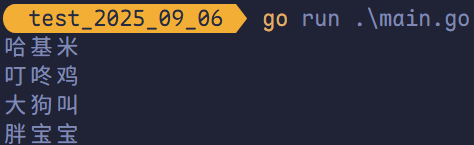
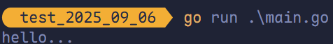
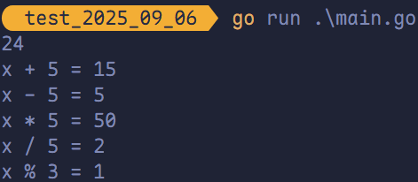
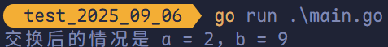
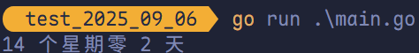
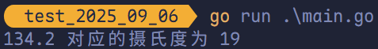
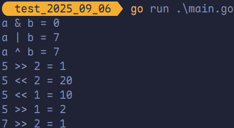

# 运算符

## 内置的运算符

1. <span style="color:#687FE5; font-weight:bold">算术运算符</span>
2. <span style="color:#687FE5; font-weight:bold">关系运算符</span>
3. <span style="color:#687FE5; font-weight:bold">逻辑运算符</span>
4. <span style="color:#687FE5; font-weight:bold">位运算符</span>
5. <span style="color:#687FE5; font-weight:bold">赋值运算符</span>

## 算术运算符

| 运算符 | 描述                                             |
| ------ | ------------------------------------------------ |
| `+`    | 相加                                             |
| `-`    | 相减                                             |
| `*`    | 相乘                                             |
| `/`    | 相除                                             |
| `%`    | $余数 = 被除数 - (被除数 \mid 除数) \times 除数$ |

> **注意**：
>
> - 对于除法，若运算数均为<span style="color:#8A0000">整数</span>，则进行<span style="color:#8A0000">整数除法</span>；若运算数均为<span style="color:#8A0000">浮点数</span>，则进行<span style="color:#8A0000">浮点数除法</span>。
> - `++`（自增）和 `--` 自减在 Golang 中是<span style="color:#8A0000">单独的语句</span>，而不是<span style="color:#8A0000">运算符</span>。

```go
package main

import "fmt"

func main() {
	fmt.Println("10 + 3 =", 10+3)
	fmt.Println("10 - 3 =", 10-3)
	fmt.Println("10 * 3 =", 10*3)

	fmt.Println("10 / 3 =", 10/3)
	fmt.Println("10.0 / 3.0 =", 10.0/3.0)

	fmt.Println("10 % 3 =", 10%3)
	fmt.Println("-10 % 3 =", -10%3)
	fmt.Println("10 % -3 =", 10%-3)
	fmt.Println("-10 % -3=", -10%-3)
}
```



在 Golang 中，`++` 和 `--` 只能独立使用，以下为错误写法：

```go
var i int = 8
var a int 
a = i++  // 错误，i++ 只能独立使用
b = i--  // 错误，i-- 只能独立使用
```

此外，在 Golang 中没有<span style="color:#687FE5">前置 `++`</span> 或<span style="color:#687FE5">前置 `--`</span>，错误写法如下：

```go
var i int = 1
++i  // 错误，在 Golang 中没有前置 ++
--i  // 错误，在 Golang 中没有前置 --
fmt.Println("i =", i)
```

以下为正确写法：

```go
package main

import "fmt"

func main() {
	var i int = 1
	i++
	fmt.Println("i =", i)
}
```



## 关系运算符

| 运算符 | 描述                                                         |
| ------ | ------------------------------------------------------------ |
| `==`   | 检查两个值是否<span style="color:#E67514">相等</span>，如果相等则返回 `true`，否则返回 `false` |
| `!=`   | 检查两个值是否<span style="color:#E67514">不相等</span>，如果不相等则返回 `true`，否则返回 `false` |
| `>`    | 检查左边值是否<span style="color:#E67514">大于</span>右边值，如果是则返回 `true`，否则返回 `false` |
| `>=`   | 检查左边值是否<span style="color:#E67514">大于等于</span>右边值，如果是则返回 `true`，否则返回 `false` |
| `<`    | 检查左边值是否<span style="color:#E67514">小于</span>右边值，如果是则返回 `true`，否则返回 `false` |
| `<=`   | 检查左边值是否<span style="color:#E67514">小于等于</span>右边值，如果是则返回 `true`，否则返回 `false` |

```go
package main

import "fmt"

func main() {
	a := 9
	b := 8
	fmt.Println(a == b) // false
	fmt.Println(a != b) // true
	fmt.Println(a > b)  // true
	fmt.Println(a >= b) // true
	fmt.Println(a < b)  // false
	fmt.Println(a <= b) // false
	flag := a > b
	fmt.Println("flag =", flag)
}
```



## 逻辑运算符

| 运算符 | 描述                                                         |
| ------ | ------------------------------------------------------------ |
| `&&`   | <span style="color:#03A6A1">逻辑 AND 运算符</span>；若两边值均为 `true`，则为 `true`，否则为 `false` |
| `||`   | <span style="color:#03A6A1">逻辑 OR 运算符</span>；如果两边值有一个 `true`，则为 `true`，否则为 `false` |
| `!`    | <span style="color:#03A6A1">逻辑 NOT 运算符</span>；如果条件为 `true`，则为 `false`，否则为 `true` |

```go
package main

import "fmt"

func main() {
	// 演示 &&
	var age int = 40
	if age > 30 && age < 50 {
		fmt.Println("哈基米")
	}
	if age > 30 && age < 40 {
		fmt.Println("曼波")
	}

	// 演示 ||
	if age > 30 || age < 50 {
		fmt.Println("叮咚鸡")
	}
	if age > 30 || age < 40 {
		fmt.Println("大狗叫")
	}

	// 演示 !
	if age > 30 {
		fmt.Println("胖宝宝")
	}
	if !(age > 30) {
		fmt.Println("小白手套")
	}
}
```



逻辑运算符的<span style="color:#8A0000; font-weight:bold">短路</span>特性指：对于 `&&`，若左侧条件为 `false`，则不再对右侧条件求值；对于 `||`，若左侧条件为 `true`，则不再对右侧条件求值。

```go
package main

import "fmt"

func test() bool {
	fmt.Println("test...")
	return true
}

func main() {
	var i int = 10
	if i < 9 && test() {
		fmt.Println("ok...")
	}

	if i > 9 || test() {
		fmt.Println("hello...")
	}
}
```



## 赋值运算符

| 运算符 | 描述                                           |
| ------ | ---------------------------------------------- |
| `=`    | 简单的赋值运算符，将一个表达式的值赋给一个左值 |
| `+=`   | 相加后再赋值                                   |
| `-=`   | 相减后再赋值                                   |
| `*=`   | 相乘后再赋值                                   |
| `/=`   | 相除后再赋值                                   |
| `%=`   | 求余后再赋值                                   |

```go
package main

import "fmt"

func main() {
	d := 8 + 2*8
	fmt.Println(d)

	x := 10
	x += 5
	fmt.Println("x + 5 =", x)

	x = 10
	x -= 5
	fmt.Println("x - 5 =", x)

	x = 10
	x *= 5
	fmt.Println("x * 5 =", x)

	x = 10
	x /= 5
	fmt.Println("x / 5 =", x)

	x = 10
	x %= 3
	fmt.Println("x % 3 =", x)
}
```



## 运算符练习

有两个变量，`a` 和 `b`，要求将其进行交换，最终打印结果。

```go
package main

import "fmt"

func main() {
	a := 9
	b := 2

	t := a
	a = b
	b = t
	fmt.Printf("交换后的情况是 a = %v，b = %v\n", a, b)
}
```



假如还有 100 天放假，问：XX 个星期零 XX 天。

```go
package main

import "fmt"

func main() {
	days := 100
	week := days / 7
	day := days % 7
	fmt.Printf("%d 个星期零 %d 天\n", week, day)
}
```



定义一个变量保存华氏温度，华氏温度转换摄氏温度的公式为：`5 / 9 * (华氏温度 - 100)`，请求出华氏温度对应的摄氏温度。

```go
package main

import "fmt"

func main() {
	var huashi float32 = 134.2
	var sheshi float32 = 5.0 / 9 * (huashi - 100)
	fmt.Printf("%v 对应的摄氏度为 %v\n", huashi, sheshi)
}
```



## 位运算符

位运算符对整数在内存中的二进制位进行操作。

| 运算符 | 描述                                                         |
| ------ | ------------------------------------------------------------ |
| `&`    | 参与运算的两数各对应的二进制位相与（两位均为 1 才为 1）      |
| `|`    | 参与运算的两数各对应的二进制位相或（两位有一个为 1 就为 1）  |
| `^`    | 参与运算的两数各对应的二进制位相异或，当两对应的二进制位相异时，结果为 1（两位不一样则为 1） |
| `<<`   | 左移 n 位就是乘以 2 的 n 次方；`a << b` 是把 a 的各二进制位全部左移 b 位，高位丢弃，低位补 0 |
| `>>`   | 右移 n 位就是除以 2 的 n 次方；`a >> b` 是把 a 的各二进制位全部右移 b 位 |

```go
package main

import "fmt"

func main() {
	a := 5 // 101
	b := 2 // 010

	fmt.Println("a & b =", a&b)   // 000
	fmt.Println("a | b =", a|b)   // 111
	fmt.Println("a ^ b =", a^b)   // 111
	fmt.Println("5 >> 2 =", a>>b) // 1
	fmt.Println("5 << 2 =", a<<b) // 10100
	fmt.Println("5 << 1 =", 5<<1) // 1010
	fmt.Println("5 >> 1 =", 5>>1) // 10
	fmt.Println("7 >> 2 =", 7>>2) // 1
}
```

