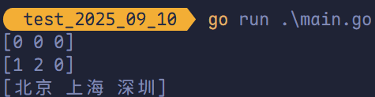
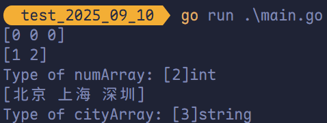
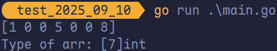
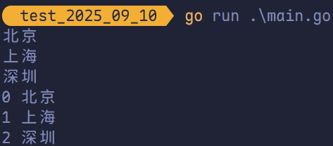

# 数组

## 数组的介绍

<span style="color:#EA5B6F; font-weight:bold">数组</span>是指一系列<span style="color:#34699A; font-weight:bold">同一类型数据</span>的集合。数组中包含的每个数据称为<span style="color:#FF2DD1; font-weight:bold">数组元素</span>（element），这种类型可以是任意的<span style="color:#FE7743; font-weight:bold">原始类型</span>，比如 `int`、`string` 等，也可以是用户<span style="color:#748873; font-weight:bold">自定义的类型</span>。一个数组包含的<span style="color:#DC143C; font-weight:bold">元素个数</span>被称为<span style="color:#B45253; font-weight:bold">数组的长度</span>。

在 Golang 中数组是一个<span style="color:#8AA624; font-weight:bold">长度固定</span>的数据类型，<span style="color:#78C841; font-weight:bold">数组的长度是类型的一部分</span>，也就是说 `[5]int` 和 `[10]int` 是两个不同的类型。 Golang 中数组的另一个特点是<span style="color:#3B38A0; font-weight:bold">占用内存的连续性</span>，也就是说数组中的元素是被分配到<span style="color:#D3AF37; font-weight:bold">连续的内存地址</span>中的，因而索引数组元素的速度非常快。

和数组对应的类型是 Slice（切片），Slice 是可以增长和收缩的<span style="color:#16610E; font-weight:bold">动态序列</span>，功能也更灵活，但是想要理解 Slice 工作原理的话需要先理解数组。



**数组基本语法**：

```go
package main

func main() {
	// 定义一个长度 3 元素类型为 int 的数组 arr 并赋值
	var arr [3]int
	arr[0] = 80
	arr[1] = 100
	arr[2] = 96
}
```

## 数组定义

```go
var 数组变量名 [元素数量]T
```

比如 `var a [5]int`， 数组的长度必须是<span style="color:#5459AC; font-weight:bold">常量</span>，并且长度是数组类型的一部分。一旦定义，长度不能变。

`[5]int` 和 `[4]int` 是不同的类型。

```go
var a [3]int
var b [4]int
a = b //不可以这样做，因为此时 a 和 b 是不同的类型
```

数组可以通过下标进行访问，下标是从 0 开始，最后一个元素下标是：`len - 1`，访问越界（下标在合法范围之外），则触发访问越界，会 `panic`。

## 数组的初始化

### 方法一

初始化数组时可以使用初始化列表来设置数组元素的值。

```go
package main

import "fmt"

func main() {
	var testArray [3]int
	var numArray = [3]int{1, 2}
	var cityArray = [3]string{"北京", "上海", "深圳"}
	fmt.Println(testArray)
	fmt.Println(numArray)
	fmt.Println(cityArray)
}
```



### 方法二

按照上面的方法每次都要确保提供的初始值和数组长度一致，一般情况下我们可以让编译器根据初始值的个数<span style="color:#D5451B; font-weight:bold">自行推断</span>数组的长度，例如：



```go
package main

import "fmt"

func main() {
	var testArray [3]int
	var numArray = [...]int{1, 2}
	var cityArray = [...]string{"北京", "上海", "深圳"}
	fmt.Println(testArray)
	fmt.Println(numArray)
	fmt.Printf("Type of numArray: %T\n", numArray)
	fmt.Println(cityArray)
	fmt.Printf("Type of cityArray: %T\n", cityArray)
}
```

### 方法三

还可以使用<span style="color:#129990; font-weight:bold">指定索引值</span>的方式来初始化数组，例如：

```go
package main

import "fmt"

func main() {
	arr := [...]int{0: 1, 3: 5, 6: 8}
	fmt.Println(arr)
	fmt.Printf("Type of arr: %T\n", arr)
}
```



## 数组的遍历

遍历数组 `arr` 有以下两种方法：

```go
package main

import "fmt"

func main() {
	arr := [...]string{"北京", "上海", "深圳"}

	// 方法一：for 循环遍历
	for i := 0; i < len(arr); i++ {
		fmt.Println(arr[i])
	}

	// 方法二：for range 遍历
	for index, value := range arr {
		fmt.Println(index, value)
	}
}
```



## 数组是值类型

数组是值类型，赋值和传参会复制整个数组。因此改变副本的值，不会改变本身的值。


