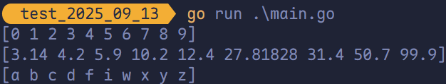

# 切片排序算法

## `sort` 包文档

https://golang.org/src/sort

## `sort` 升序排序

对应 `int`、`float64` 和 `string` 数组或者切片的排序，Go 分别提供了 `sort.Ints()`、`sort.Float64s()` 和 `sort.Strings()` 函数，默认均为从小到大排序。

```go
package main

import (
	"fmt"
	"sort"
)

func main() {
	intSlice := []int{2, 4, 3, 5, 7, 6, 9, 8, 1, 0}
	floatSlice := []float64{4.2, 5.9, 12.4, 10.2, 50.7, 99.9, 31.4, 27.81828, 3.14}
	stringSlice := []string{"a", "c", "b", "z", "x", "w", "y", "d", "f", "i"}
	sort.Ints(intSlice)
	sort.Float64s(floatSlice)
	sort.Strings(stringSlice)
	fmt.Println(intSlice)
	fmt.Println(floatSlice)
	fmt.Println(stringSlice)
}
```



## `sort` 降序排序

Golang 的 `sort` 包可以使用 `sort.Reverse(slice)` 来调换 `slice.Interface.Less`，也就是比较函数。因此，`int`、`float64` 和 `string` 的逆序排序为：

```go
package main

import (
	"fmt"
	"sort"
)

func main() {
	intSlice := []int{2, 4, 3, 5, 7, 6, 9, 8, 1, 0}
	floatSlice := []float64{4.2, 5.9, 12.4, 10.2, 50.7, 99.9, 31.4, 27.81828, 3.14}
	stringSlice := []string{"a", "c", "b", "z", "x", "w", "y", "d", "f", "i"}
	sort.Sort(sort.Reverse(sort.IntSlice(intSlice)))
	sort.Sort(sort.Reverse(sort.Float64Slice(floatSlice)))
	sort.Sort(sort.Reverse(sort.StringSlice(stringSlice)))
	fmt.Println(intSlice)
	fmt.Println(floatSlice)
	fmt.Println(stringSlice)
}
```

