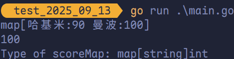
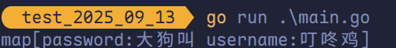
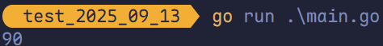
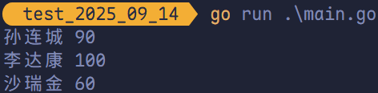
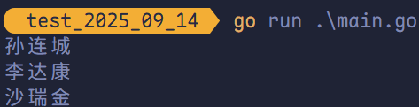
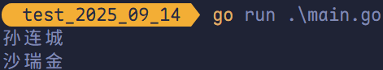
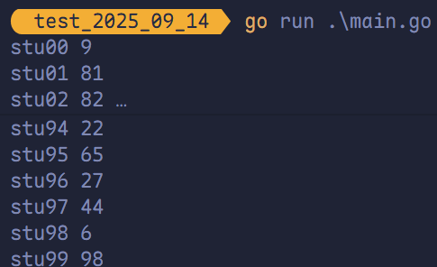
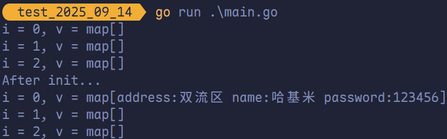
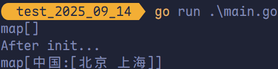
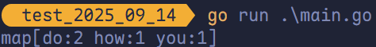

#  映射

## `map` 的定义

`map` 是一种无序的基于 key-value 的数据结构，Go 语言中的 `map` 是引用类型，必须初始化后方可使用。

`map` 语法定义如下：

```go
map[KeyType]ValueType
```

- **`KeyType`**：表示键的类型
- **`ValueType`**：表示键对应的值的类型

`map` 类型的变量默认初始值为 `nil`，需要使用 `make` 函数来分配内存。`make` 用于 `slice`、`map` 和 `channel` 的初始化。

```go
make(map[KeyType]ValueType, [cap])
```

其中 `cap` 表示 `map` 的容量，但该参数非必须。

> **注意**：获取 `map` 的容量不可使用 `cap`，`cap` 返回的是数组切片分配的空间大小，根本无法用于 `map`。要获取 `map` 的容量，可使用 `len` 函数。

## `map` 基本使用

`map` 中的数据都是成对出现的，基本使用示例如下：

```go
package main

import "fmt"

func main() {
	scoreMap := make(map[string]int, 8)
	scoreMap["哈基米"] = 90
	scoreMap["曼波"] = 100
	fmt.Println(scoreMap)
	fmt.Println(scoreMap["曼波"])
	fmt.Printf("Type of scoreMap: %T\n", scoreMap)
}
```



`map` 也支持声明时填充元素，如：

```go
package main

import "fmt"

func main() {
	userinfo := map[string]string{
		"username": "叮咚鸡",
		"password": "大狗叫",
	}
	fmt.Println(userinfo)
}
```



## 判断某个键是否存在

Go 语言中有判断 `map` 中键是否存在的特殊写法，格式如下：

```go
value, ok := map 对象[key]
```

例如：

```go
package main

import "fmt"

func main() {
	scoreMap := make(map[string]int, 8)
	scoreMap["哈基米"] = 90
	scoreMap["曼波"] = 100
	value, ok := scoreMap["哈基米"]
	if ok {
		fmt.Println(value)
	} else {
		fmt.Println("查无此人")
	}
}
```



如果 `key` 存在，则 `ok` 为 `true`，`value` 为对应的值；不存在则 `ok` 为 `false`，`value` 为值类型的零值。

## `map` 的遍历

Go 语言中使用 `for range` 遍历 `map`。

```go
package main

import "fmt"

func main() {
	scoreMap := make(map[string]int)
	scoreMap["孙连城"] = 90
	scoreMap["李达康"] = 100
	scoreMap["沙瑞金"] = 60
	for key, value := range scoreMap {
		fmt.Println(key, value)
	}
}
```



只想遍历 `key` 时，可以：

```go
package main

import "fmt"

func main() {
	scoreMap := make(map[string]int)
	scoreMap["孙连城"] = 90
	scoreMap["李达康"] = 100
	scoreMap["沙瑞金"] = 60
	for key := range scoreMap {
		fmt.Println(key)
	}
}
```



> **注意**：遍历 `map` 时，元素顺序和添加键值对的顺序无关。

## 使用 `delete` 函数删除键值对

使用 `delete` 内建函数从 `map` 中删除一组键值对，`delete` 函数的格式如下：

```go
delete(map 对象, key)
```

- **`map` 对象**：表示要删除键值对的 `map` 对象
- **`key`**：表示要删除的键值对的键

```go
package main

import "fmt"

func main() {
	scoreMap := make(map[string]int)
	scoreMap["孙连城"] = 90
	scoreMap["李达康"] = 100
	scoreMap["沙瑞金"] = 60
	delete(scoreMap, "李达康")
	for key := range scoreMap {
		fmt.Println(key)
	}
}
```



## 按照指定顺序遍历 `map`

```go
package main

import (
	"fmt"
	"math/rand"
	"sort"
)

func main() {
	scoreMap := make(map[string]int, 200)
	for i := range 100 {
		key := fmt.Sprintf("stu%02d", i)
		value := rand.Intn(100)
		scoreMap[key] = value
	}

	keys := make([]string, 0, 200)
	for key := range scoreMap {
		keys = append(keys, key)
	}
	sort.Strings(keys)

	for _, key := range keys {
		fmt.Println(key, scoreMap[key])
	}
}
```



## 元素为 `map` 类型的切片

```go
package main

import "fmt"

func main() {
	mapSlice := make([]map[string]string, 3)
	for i, v := range mapSlice {
		fmt.Printf("i = %v, v = %v\n", i, v)
	}
	fmt.Println("After init...")
	// 对切片中的 map 元素进行初始化
	mapSlice[0] = make(map[string]string, 10)
	mapSlice[0]["name"] = "哈基米"
	mapSlice[0]["password"] = "123456"
	mapSlice[0]["address"] = "双流区"
	for i, v := range mapSlice {
		fmt.Printf("i = %v, v = %v\n", i, v)
	}
}
```



> **注意**：
>
> - 上面不同的 `map` 的键可以不同。
> - 上述代码中 `mapSlice` 的初始值**不为 `nil`**，其中的元素例如 `mapSlice[1]` 的值**为 `nil`**。

## 值为切片类型的 `map` 

```go
package main

import "fmt"

func main() {
	sliceMap := make(map[string][]string, 3)
	fmt.Println(sliceMap)
	fmt.Println("After init...")
	// 查找是否存在“中国”的键
	key := "中国"
	value, ok := sliceMap[key]
	// 不存在说明 ok 为 false，value 为 nil
	// 对 value 进行切片初始化
	if !ok {
		value = make([]string, 0, 2)
	}
	// 添加切片元素
	value = append(value, "北京", "上海")
	// 添加键值对
	sliceMap[key] = value
	fmt.Println(sliceMap)
}
```



## 练习题

写一个程序，统计一个字符串中每个单词出现的次数。例如 `"how do you do"` 中 `how = 1`、`do = 2`、`you = 1`。

```go
package main

import (
	"fmt"
	"strings"
)

func main() {
	wordMap := make(map[string]int)
	str := "how  do you   do"
	for word := range strings.SplitSeq(str, " ") {
		if word == "" {
			continue
		}
		wordMap[word]++
	}
	fmt.Println(wordMap)
}
```



> **注意**：
>
> - 当字符串包含连续空格或首尾空格时，`SplitSeq` 会产出空字符串 `""`，做词频统计时应跳过，或改用 `strings.FieldsSeq`（自动忽略空串）。
> - `SplitSeq` 返回惰性迭代器 `iter.Seq[string]`（Go 1.24+），按需产出子串、不预先构造切片，省内存且可短路；相比 `Split` 返回的 `[]string`（急切、占用 O(n) 额外内存、可多次遍历），它是单次可迭代的。

使用 `FieldsSeq` 时：

```go
package main

import (
	"fmt"
	"strings"
)

func main() {
	wordMap := make(map[string]int)
	str := "how  do you   do"
	for word := range strings.FieldsSeq(str) {
		wordMap[word]++
	}
	fmt.Println(wordMap)
}

```

