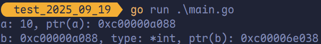
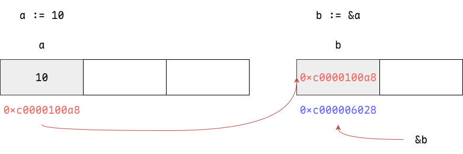
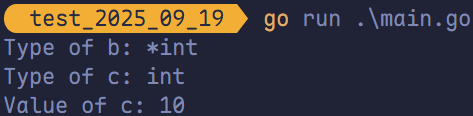

# 指针

## 关于指针

<span style="color:#C83F12; font-weight:bold">变量</span>是<span style="color:#03A6A1; font-weight:bold">用来存储数据</span>的，变量的本质是给存储数据的内存地址<span style="color:#3674B5; font-weight:bold">起了一个别名</span>。例如定义了一个变量 `a := 10`，此时可以直接通过 `a` 这个变量来读取内存中保存的 10 这个值。在计算机底层 `a` 这个变量其实<span style="color:#FF7D29; font-weight:bold">对应了一个内存地址</span>。

<span style="color:#725CAD; font-weight:bold">指针</span>也是一个变量，但是其为一种特殊变量，它存储的数据不是一个普通的值，而是另一个变量的<span style="color:#EA2F14; font-weight:bold">内存地址</span>。



Go 语言中指针的重要概念有**指针地址**、**指针类型**和**指针取值**，而指针操作为 `&`（取地址）和 `*`（根据地址取值）。

## 指针地址和指针类型

每个变量在运行时都拥有一个地址，这个地址代表变量在内存中的位置。Go 语言中使用 `&` 字符放在变量前面对变量进行**取地址**操作。Go 语言中的值类型（`int`、`float`、`bool`、`string`、`array`、`struct`）都有对应的指针类型，例如 `*int`、`*int64`、`*string` 等。

```go
ptr := &v 
```

- **`v`**：代表被地址的变量，类型为 `T`。
- **`ptr`**：用于接收地址的变量，`ptr` 的类型为 `*T`，称作 `T` 的指针类型，`*` 代表指针。

```go
package main

import "fmt"

func main() {
	a := 10
	b := &a

	fmt.Printf("a: %v, ptr(a): %p\n",
		a, &a)
	fmt.Printf("b: %v, type: %T, ptr(b): %p\n",
		b, b, &b)
}
```





## 指针取值

在对普通变量使用 `&` 操作符取地址后会获得这个变量的指针，然后可以对指针使用 `*` 操作，也就是指针取值。

```go
package main

import "fmt"

func main() {
	a := 10
	// 去变量 a 的地址，将地址保存到指针 b 中。
	b := &a
	fmt.Printf("Type of b: %T\n", b)
	c := *b // 指针取值
	fmt.Printf("Type of c: %T\n", c)
	fmt.Printf("Value of c: %v\n", c)
}
```



取地址操作符 `&` 和取值操作符 `*` 是一对互补操作符，`&` 取出地址，`*` 根据地址取出地址指向的值。

- 对变量进行**取地址（`&`）操作**，可以获得该变量的**指针变量**。
- 指针变量的值是**指针地址**。
- 对指针变量进行**取值（`*`）操作**，可以获得指针变量指向的**原变量的值**。