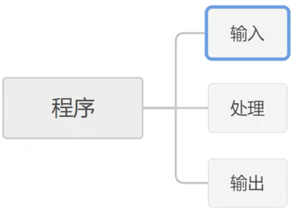
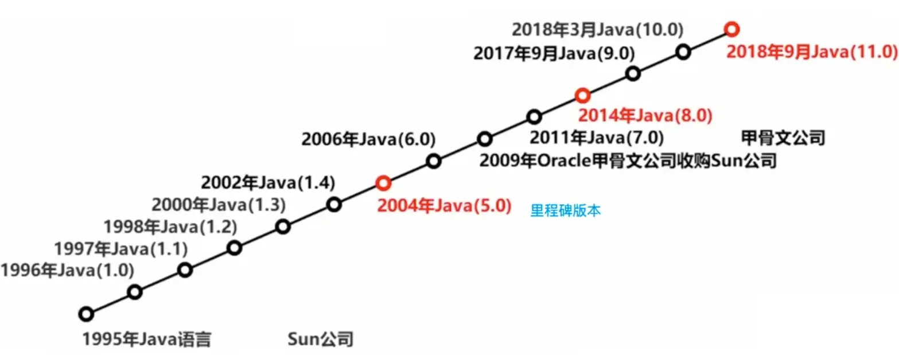
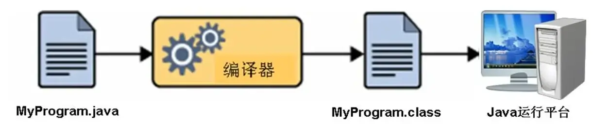
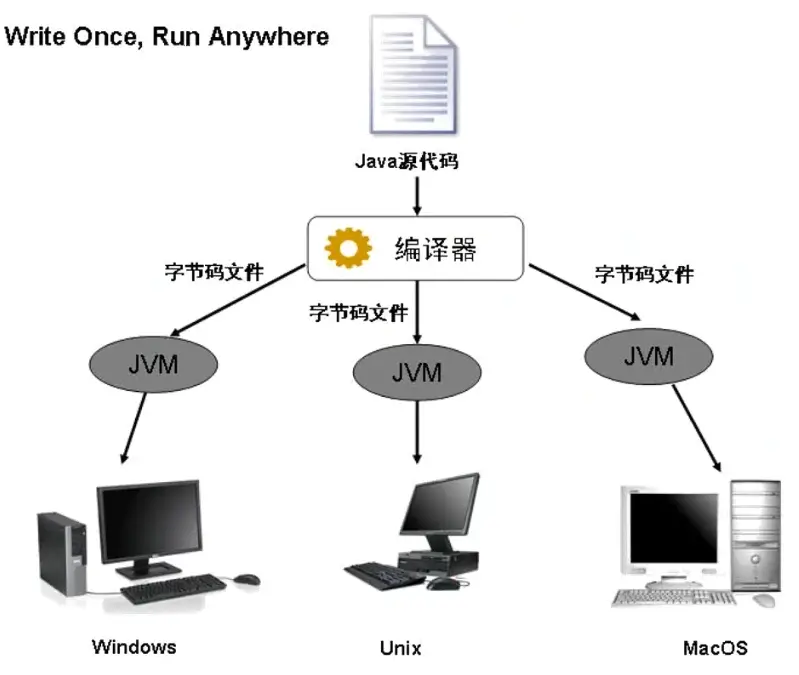
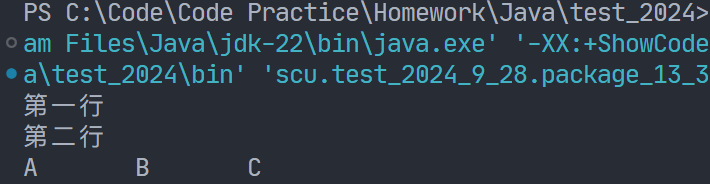
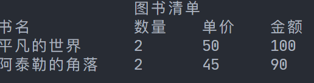
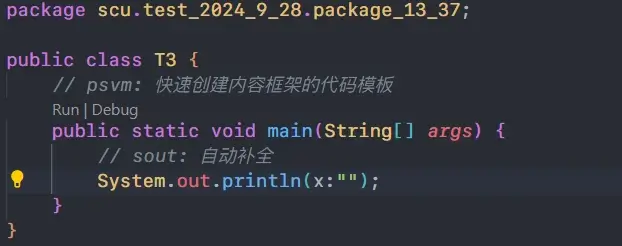

# Java 入门

## 程序概念

程序是指**一系列按特定顺序执行的动作**。



## Java 的起源与发展

Java 是 Sun Microsystems 于 1995 年推出的高级编程语言。



## Java 的应用领域

- **桌面应用开发**：如银行系统、商场结算软件
- **互联网应用开发**：如淘宝、京东等电商网站


## Java 技术简介

### Java 技术体系

- **Java SE（Standard Edition）**：
  - Java 的基础和核心部分
  - 主要用于开发桌面应用程序

- **Java EE（Enterprise Edition）**：
  - 提供企业级应用开发的完整解决方案
  - 大型网站和企业级系统广泛使用 Java EE 技术

### JDK 和 JRE 的区别

- **JDK（Java 开发工具包）**：包括开发和运行环境
- **JRE（Java 运行时环境）**：仅包含运行环境，安装 JDK 时，JRE 会一同安装

## Java 程序开发流程

1. **编写**：创建 `.java` 源文件
2. **编译**：使用 `javac` 命令编译源文件
3. **运行**：使用 `java` 命令运行编译后的程序



**Java 特点**：一次编译，到处运行。

## Java 虚拟机与跨平台实现



**Java 虚拟机（JVM）**：将 Java 字节码转换为机器码，从而实现跨平台运行。

## 使用记事本编写和运行 Java 程序

1. 编写 `.java` 文件
2. 使用 `javac` 命令编译：`javac Hello.java`
3. 使用 `java` 命令运行：`java Hello`（不加 `.class` 后缀）

## Java 程序结构示例

```java
public class Hello {
  public static void main(String[] args) {
    System.out.println("Hello Java!");
  }
}
```

## 输出中的换行

- 使用 `System.out.println()`：自动换行
- 使用 `System.out.print()`：不自动换行

## 转义字符

| 转义字符 | 说明               |
| -------- | ------------------ |
| `\n`     | 换行               |
| `\t`     | 水平制表符（缩进） |

示例代码：

```java
package scu.test_2024_9_28.package_13_37;

public class T2 {
    public static void main(String[] args) {
        System.out.print("第一行\n");
        System.out.print("第二行\n");
        System.out.println("A\tB\tC");
    }
}
```



## Java 编码规范

1. 类名使用 `public` 修饰
2. 每行只写一条语句
3. `{}` 应规范放置，提升代码可读性
4. 保持代码的缩进格式一致

## 示例练习：输出图书清单

```java
package scu.test_2024_9_28.package_13_37;

public class T3 {
    public static void main(String[] args) {
        System.out.println("\t\t图书清单");
        System.out.println("书名\t\t数量\t单价\t金额");
        System.out.println("平凡的世界\t2\t50\t100");
        System.out.println("阿泰勒的角落\t2\t45\t90");
        System.out.println();
    }
}
```



## IDE 使用技巧



